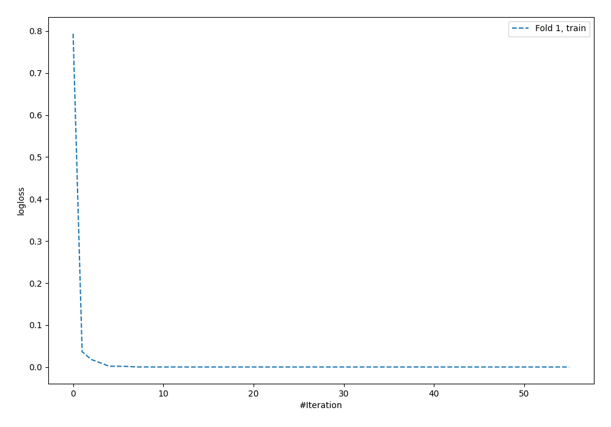
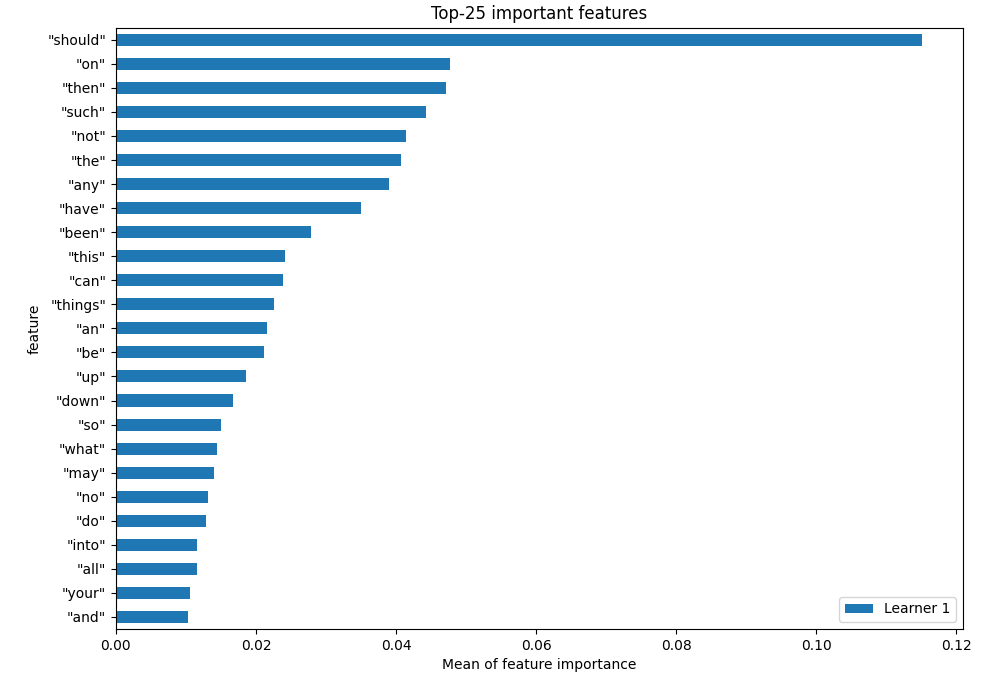
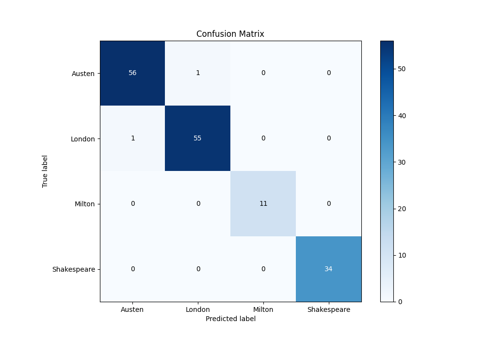
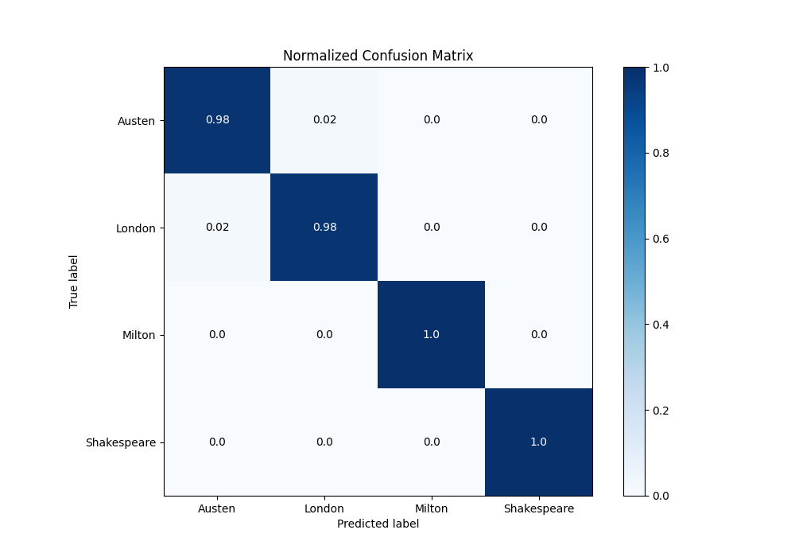
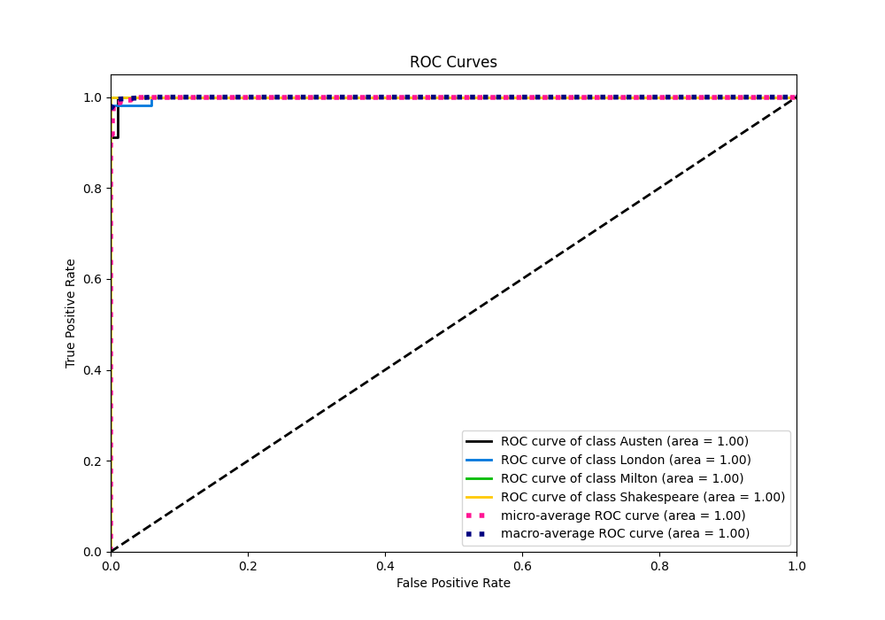
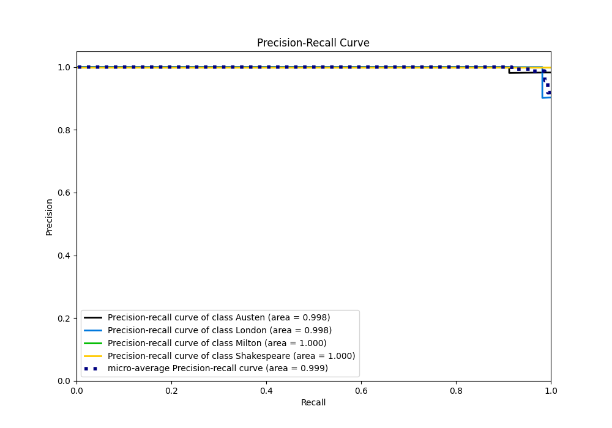

# Summary of 3_Default_NeuralNetwork

[<< Go back](../README.md)

## Neural Network
- **n_jobs**: -1
- **dense_1_size**: 32
- **dense_2_size**: 16
- **learning_rate**: 0.05
- **num_class**: 4
- **explain_level**: 1

## Validation
 - **validation_type**: split
 - **train_ratio**: 0.75
 - **shuffle**: True
 - **stratify**: True

## Optimized metric
f1

## Training time

0.9 seconds

### Metric details
|           |    Austen |    London |   Milton |   Shakespeare |   accuracy |   macro avg |   weighted avg |   logloss |
|:----------|----------:|----------:|---------:|--------------:|-----------:|------------:|---------------:|----------:|
| precision |  0.982456 |  0.982143 |        1 |             1 |   0.987342 |     0.99115 |       0.987342 |  0.108902 |
| recall    |  0.982456 |  0.982143 |        1 |             1 |   0.987342 |     0.99115 |       0.987342 |  0.108902 |
| f1-score  |  0.982456 |  0.982143 |        1 |             1 |   0.987342 |     0.99115 |       0.987342 |  0.108902 |
| support   | 57        | 56        |       11 |            34 |   0.987342 |   158       |     158        |  0.108902 |

## Confusion matrix
|                        |   Predicted as Austen |   Predicted as London |   Predicted as Milton |   Predicted as Shakespeare |
|:-----------------------|----------------------:|----------------------:|----------------------:|---------------------------:|
| Labeled as Austen      |                    56 |                     1 |                     0 |                          0 |
| Labeled as London      |                     1 |                    55 |                     0 |                          0 |
| Labeled as Milton      |                     0 |                     0 |                    11 |                          0 |
| Labeled as Shakespeare |                     0 |                     0 |                     0 |                         34 |

## Learning curves

## Permutation-based Importance

## Confusion Matrix

## Normalized Confusion Matrix

## ROC Curve

## Precision Recall Curve

[<< Go back](../README.md)
