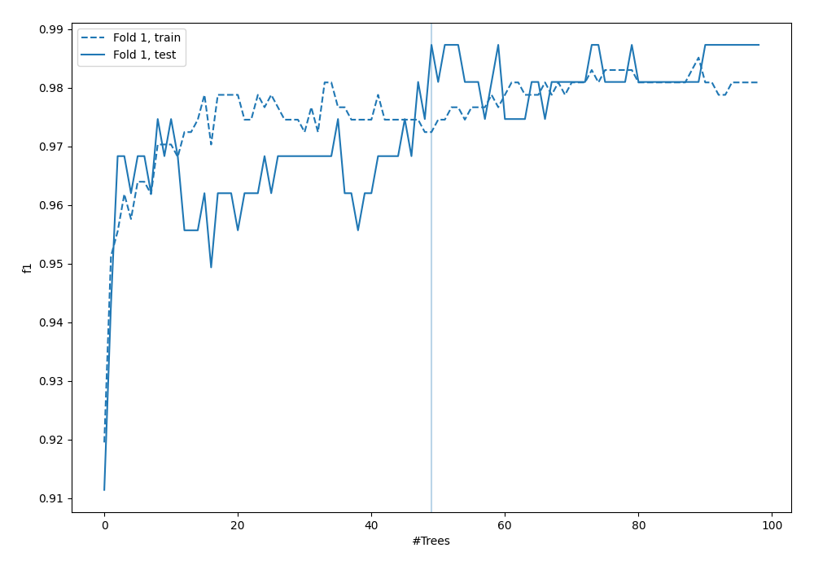
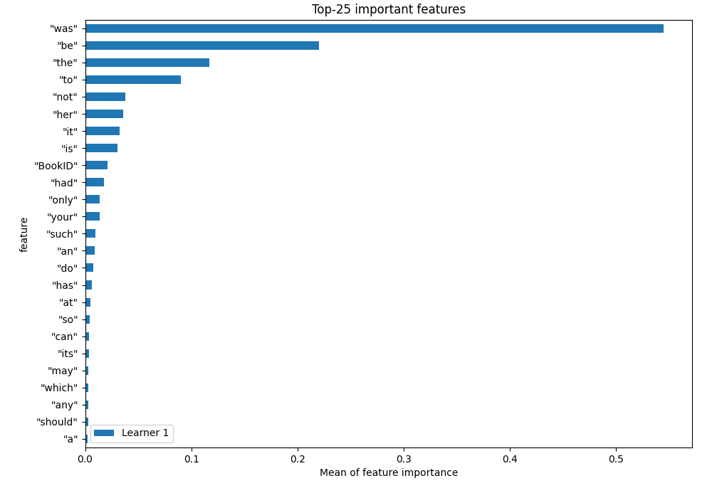
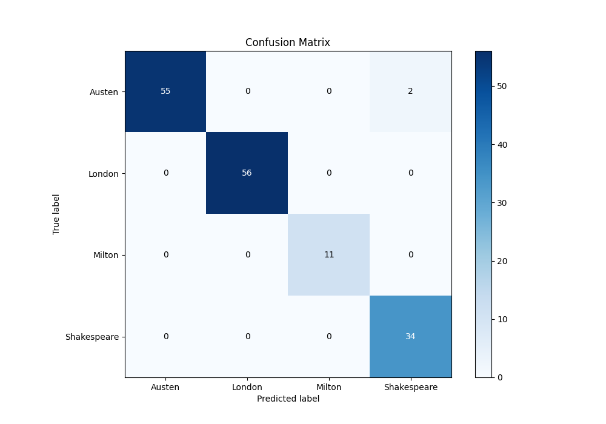
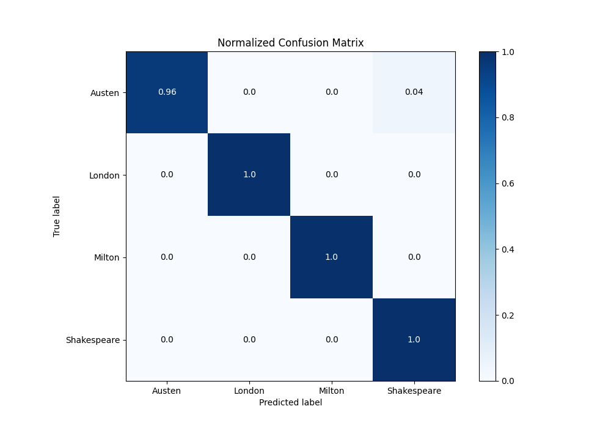
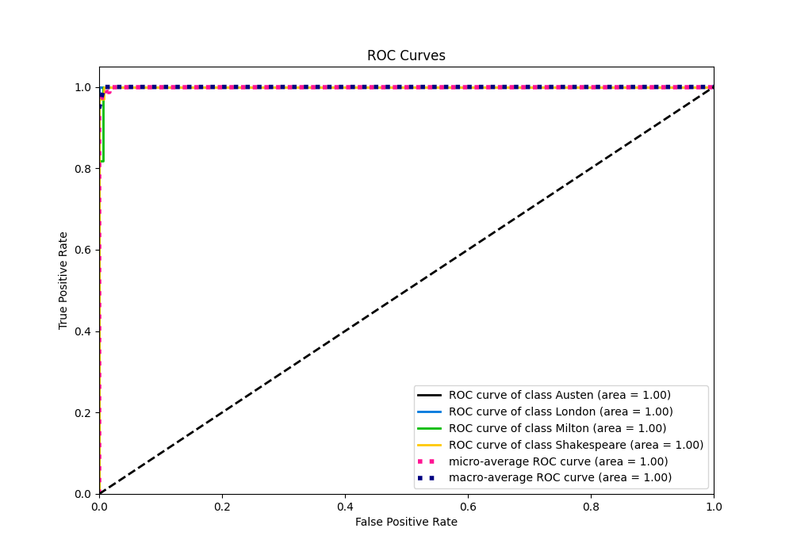
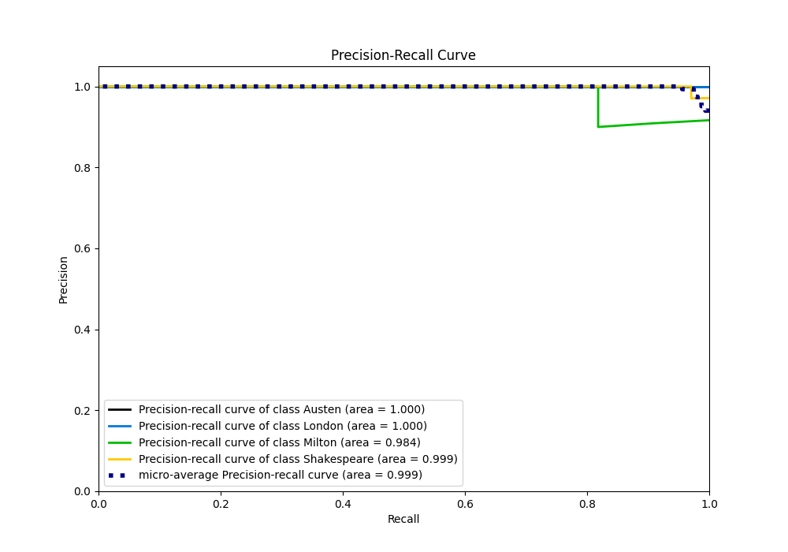

# Summary of 4_Default_RandomForest

[<< Go back](../README.md)

## Random Forest
- **n_jobs**: -1
- **criterion**: gini
- **max_features**: 0.9
- **min_samples_split**: 30
- **max_depth**: 4
- **eval_metric_name**: f1
- **num_class**: 4
- **explain_level**: 1

## Validation
 - **validation_type**: split
 - **train_ratio**: 0.75
 - **shuffle**: True
 - **stratify**: True

## Optimized metric
f1

## Training time

2.8 seconds

### Metric details
|           |    Austen |   London |   Milton |   Shakespeare |   accuracy |   macro avg |   weighted avg |   logloss |
|:----------|----------:|---------:|---------:|--------------:|-----------:|------------:|---------------:|----------:|
| precision |  1        |        1 |        1 |      0.944444 |   0.987342 |    0.986111 |       0.988045 |  0.131905 |
| recall    |  0.964912 |        1 |        1 |      1        |   0.987342 |    0.991228 |       0.987342 |  0.131905 |
| f1-score  |  0.982143 |        1 |        1 |      0.971429 |   0.987342 |    0.988393 |       0.98741  |  0.131905 |
| support   | 57        |       56 |       11 |     34        |   0.987342 |  158        |     158        |  0.131905 |

## Confusion matrix
|                        |   Predicted as Austen |   Predicted as London |   Predicted as Milton |   Predicted as Shakespeare |
|:-----------------------|----------------------:|----------------------:|----------------------:|---------------------------:|
| Labeled as Austen      |                    55 |                     0 |                     0 |                          2 |
| Labeled as London      |                     0 |                    56 |                     0 |                          0 |
| Labeled as Milton      |                     0 |                     0 |                    11 |                          0 |
| Labeled as Shakespeare |                     0 |                     0 |                     0 |                         34 |

## Learning curves

## Permutation-based Importance

## Confusion Matrix

## Normalized Confusion Matrix

## ROC Curve

## Precision Recall Curve

[<< Go back](../README.md)
