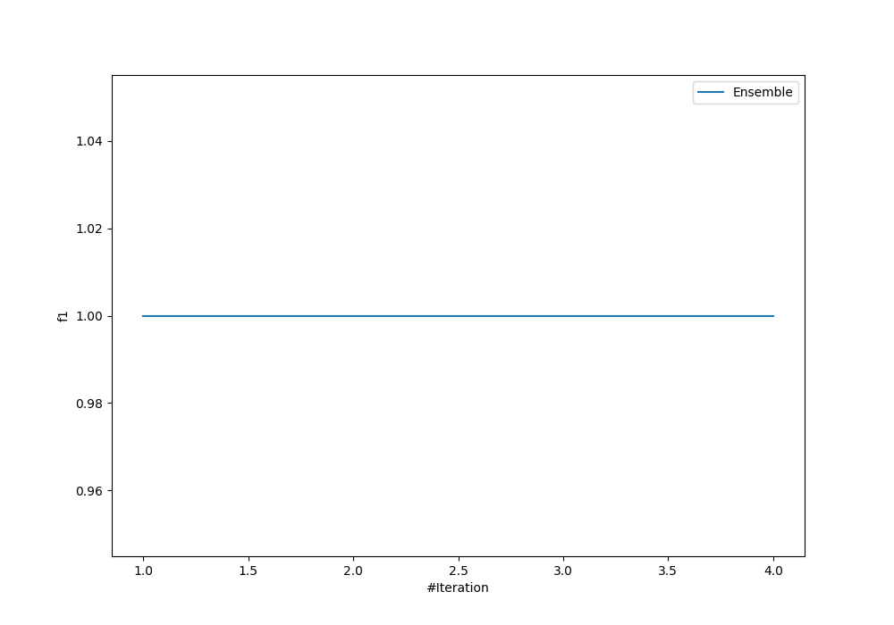
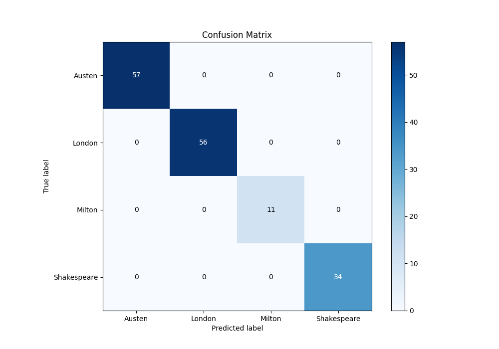
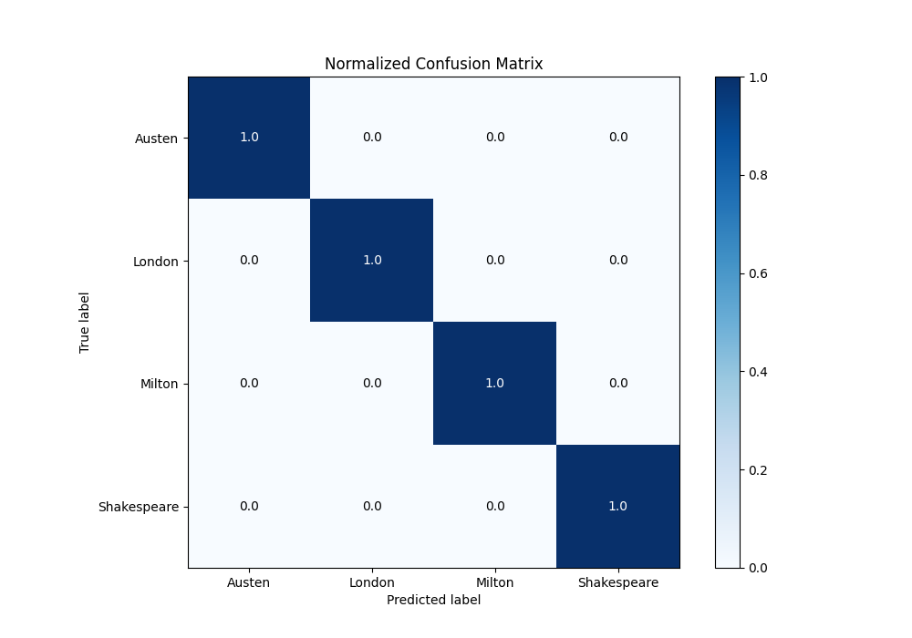
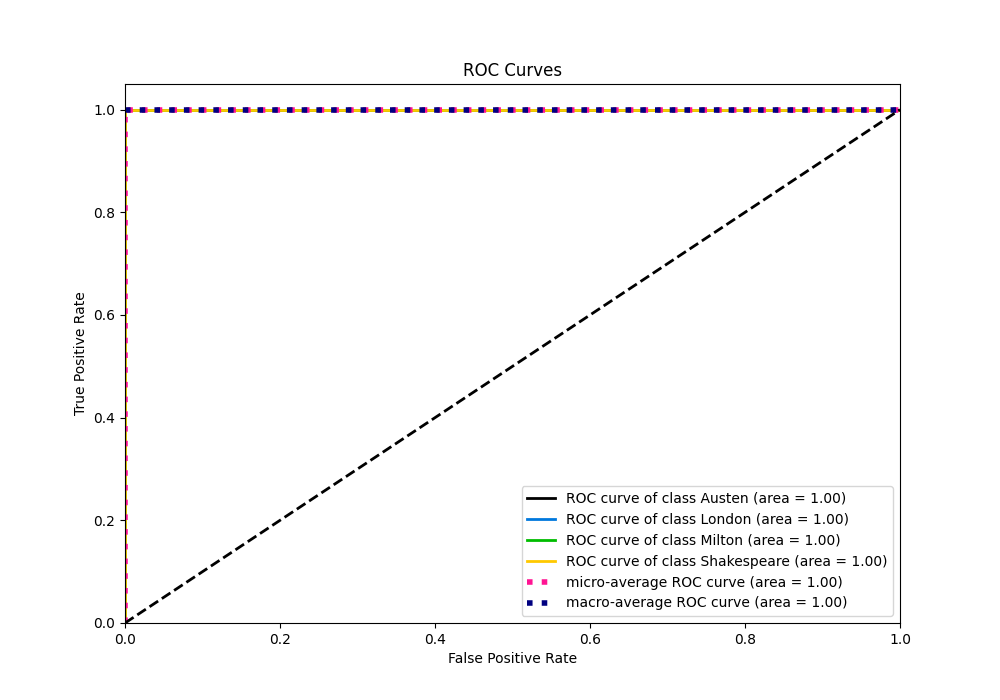
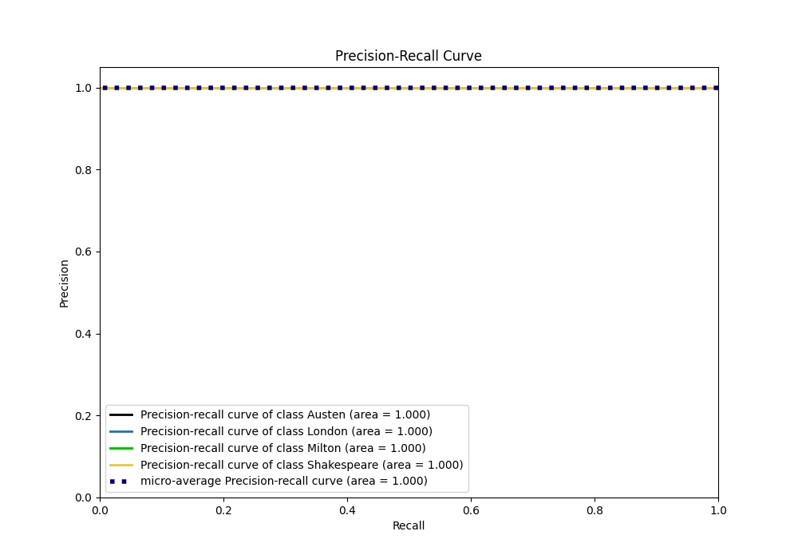

# Summary of Ensemble

[<< Go back](../README.md)

## Ensemble structure
| Model    |   Weight |
|:---------|---------:|
| 2_Linear |        1 |

### Metric details
|           |   Austen |   London |   Milton |   Shakespeare |   accuracy |   macro avg |   weighted avg |   logloss |
|:----------|---------:|---------:|---------:|--------------:|-----------:|------------:|---------------:|----------:|
| precision |        1 |        1 |        1 |             1 |          1 |           1 |              1 | 0.0126094 |
| recall    |        1 |        1 |        1 |             1 |          1 |           1 |              1 | 0.0126094 |
| f1-score  |        1 |        1 |        1 |             1 |          1 |           1 |              1 | 0.0126094 |
| support   |       57 |       56 |       11 |            34 |          1 |         158 |            158 | 0.0126094 |

## Confusion matrix
|                        |   Predicted as Austen |   Predicted as London |   Predicted as Milton |   Predicted as Shakespeare |
|:-----------------------|----------------------:|----------------------:|----------------------:|---------------------------:|
| Labeled as Austen      |                    57 |                     0 |                     0 |                          0 |
| Labeled as London      |                     0 |                    56 |                     0 |                          0 |
| Labeled as Milton      |                     0 |                     0 |                    11 |                          0 |
| Labeled as Shakespeare |                     0 |                     0 |                     0 |                         34 |

## Learning curves

## Confusion Matrix

## Normalized Confusion Matrix

## ROC Curve

## Precision Recall Curve

[<< Go back](../README.md)
