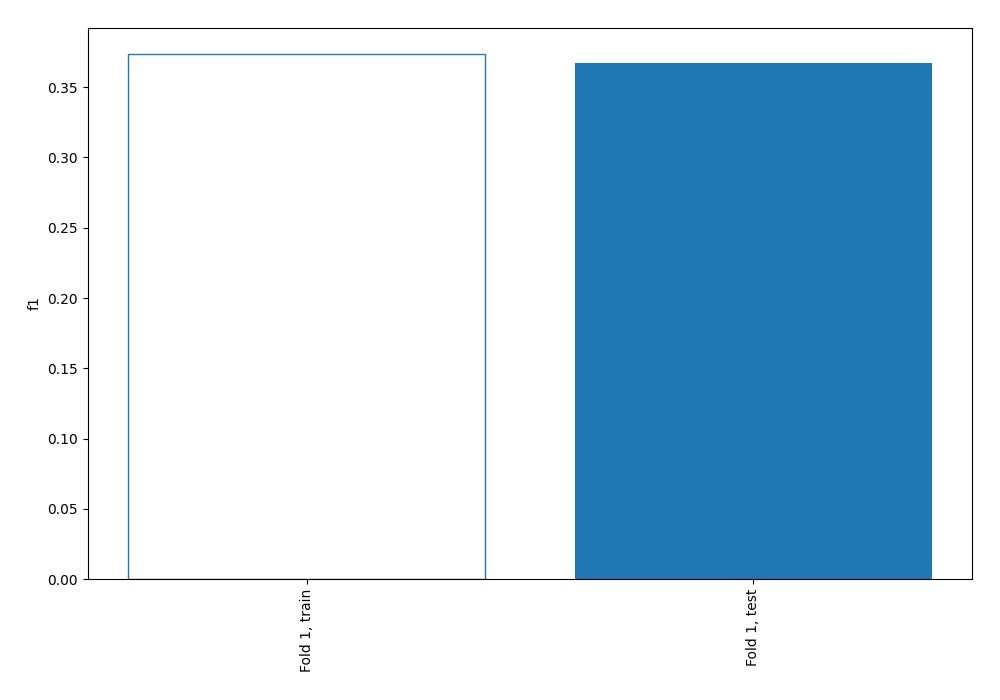
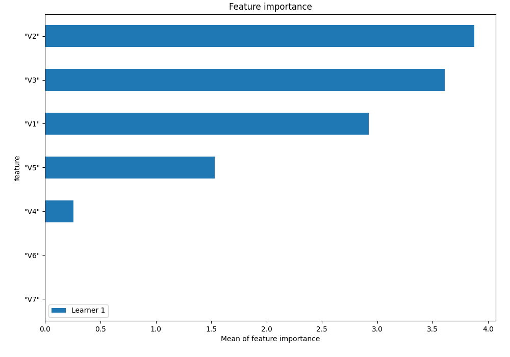
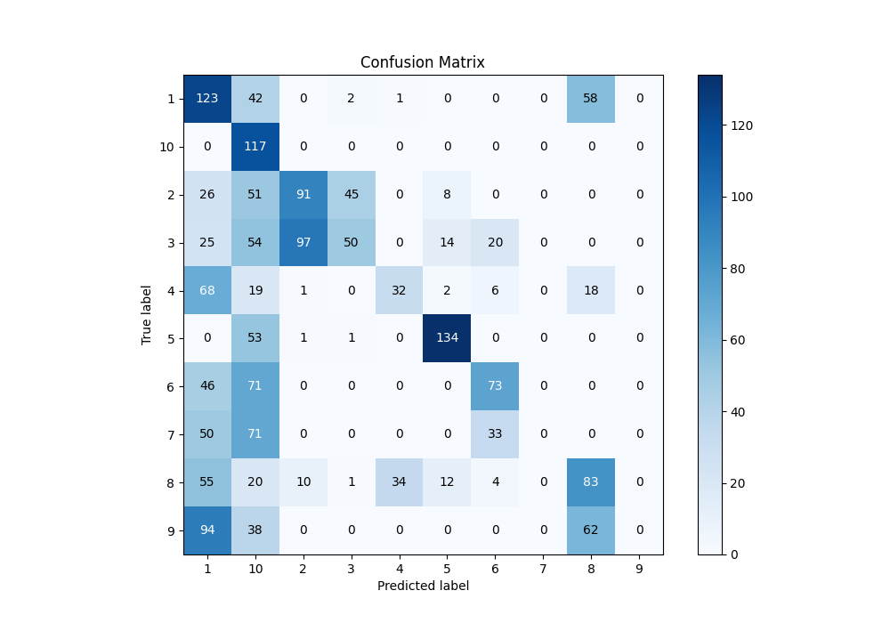
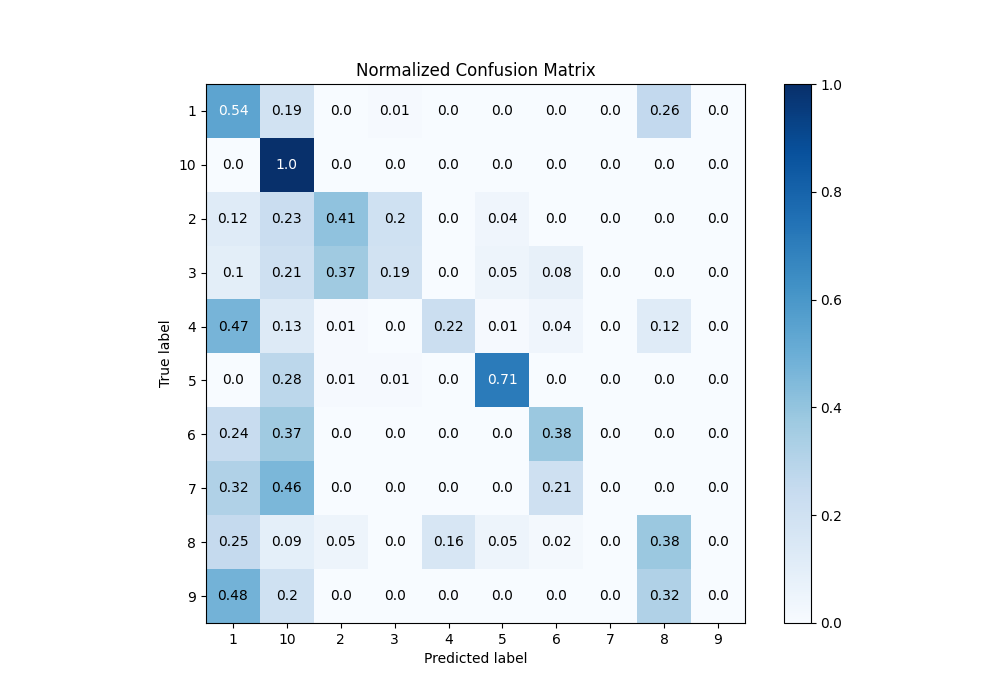
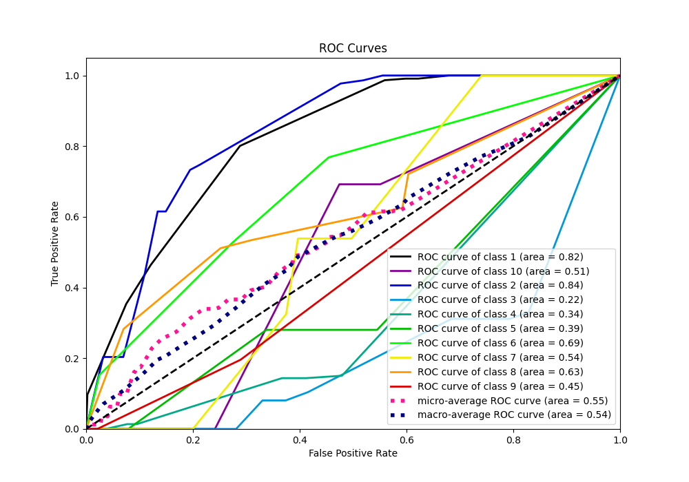
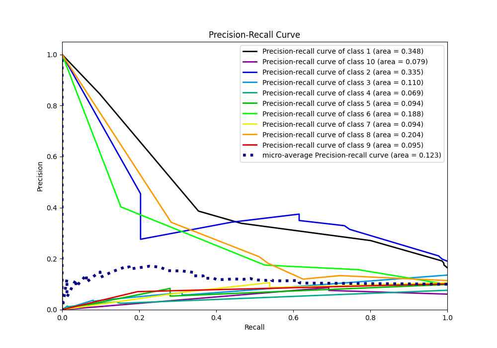

# Summary of 1_DecisionTree

[<< Go back](../README.md)

## Decision Tree
- **n_jobs**: -1
- **criterion**: entropy
- **max_depth**: 4
- **num_class**: 10
- **explain_level**: 1

## Validation
 - **validation_type**: split
 - **train_ratio**: 0.75
 - **shuffle**: True
 - **stratify**: True

## Optimized metric
f1

## Training time

6.2 seconds

### Metric details
|           |          1 |          2 |          3 |          4 |          5 |          6 |   7 |          8 |   9 |         10 |   accuracy |   macro avg |   weighted avg |   logloss |
|:----------|-----------:|-----------:|-----------:|-----------:|-----------:|-----------:|----:|-----------:|----:|-----------:|-----------:|------------:|---------------:|----------:|
| precision |   0.252567 |   0.455    |   0.505051 |   0.477612 |   0.788235 |   0.536765 |   0 |   0.375566 |   0 |   0.218284 |    0.36691 |    0.360908 |       0.374441 |   1.45364 |
| recall    |   0.544248 |   0.411765 |   0.192308 |   0.219178 |   0.708995 |   0.384211 |   0 |   0.378995 |   0 |   1        |    0.36691 |    0.38397  |       0.36691  |   1.45364 |
| f1-score  |   0.345021 |   0.432304 |   0.278552 |   0.300469 |   0.746518 |   0.447853 |   0 |   0.377273 |   0 |   0.358346 |    0.36691 |    0.328634 |       0.334311 |   1.45364 |
| support   | 226        | 221        | 260        | 146        | 189        | 190        | 154 | 219        | 194 | 117        |    0.36691 | 1916        |    1916        |   1.45364 |

## Confusion matrix
|               |   Predicted as 1 |   Predicted as 2 |   Predicted as 3 |   Predicted as 4 |   Predicted as 5 |   Predicted as 6 |   Predicted as 7 |   Predicted as 8 |   Predicted as 9 |   Predicted as 10 |
|:--------------|-----------------:|-----------------:|-----------------:|-----------------:|-----------------:|-----------------:|-----------------:|-----------------:|-----------------:|------------------:|
| Labeled as 1  |              123 |                0 |                2 |                1 |                0 |                0 |                0 |               58 |                0 |                42 |
| Labeled as 2  |               26 |               91 |               45 |                0 |                8 |                0 |                0 |                0 |                0 |                51 |
| Labeled as 3  |               25 |               97 |               50 |                0 |               14 |               20 |                0 |                0 |                0 |                54 |
| Labeled as 4  |               68 |                1 |                0 |               32 |                2 |                6 |                0 |               18 |                0 |                19 |
| Labeled as 5  |                0 |                1 |                1 |                0 |              134 |                0 |                0 |                0 |                0 |                53 |
| Labeled as 6  |               46 |                0 |                0 |                0 |                0 |               73 |                0 |                0 |                0 |                71 |
| Labeled as 7  |               50 |                0 |                0 |                0 |                0 |               33 |                0 |                0 |                0 |                71 |
| Labeled as 8  |               55 |               10 |                1 |               34 |               12 |                4 |                0 |               83 |                0 |                20 |
| Labeled as 9  |               94 |                0 |                0 |                0 |                0 |                0 |                0 |               62 |                0 |                38 |
| Labeled as 10 |                0 |                0 |                0 |                0 |                0 |                0 |                0 |                0 |                0 |               117 |

## Learning curves

## Permutation-based Importance

## Confusion Matrix

## Normalized Confusion Matrix

## ROC Curve

## Precision Recall Curve

[<< Go back](../README.md)
