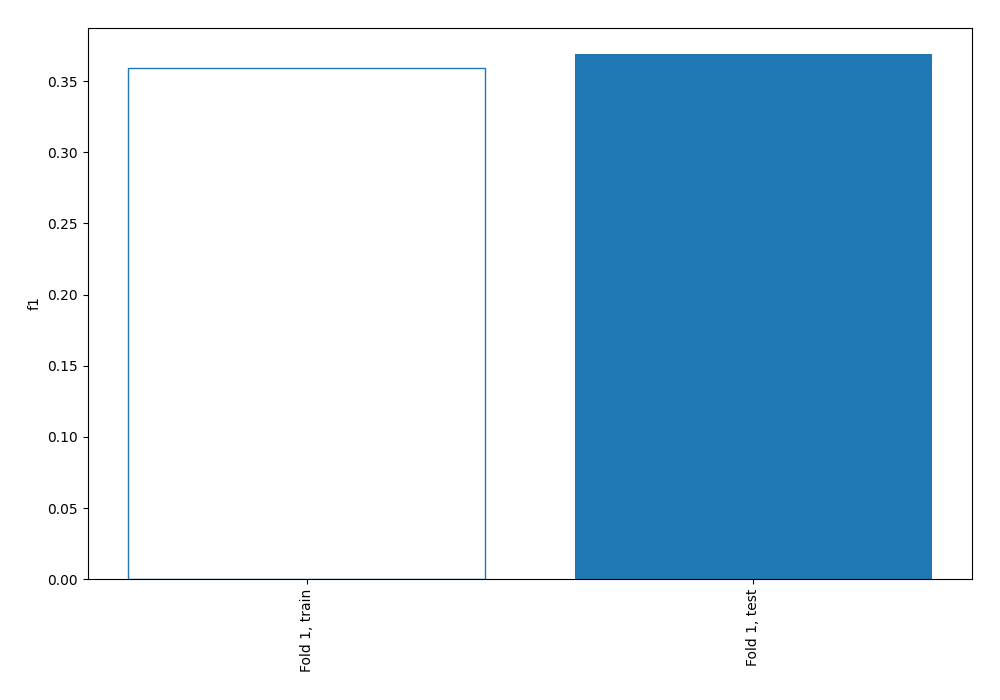
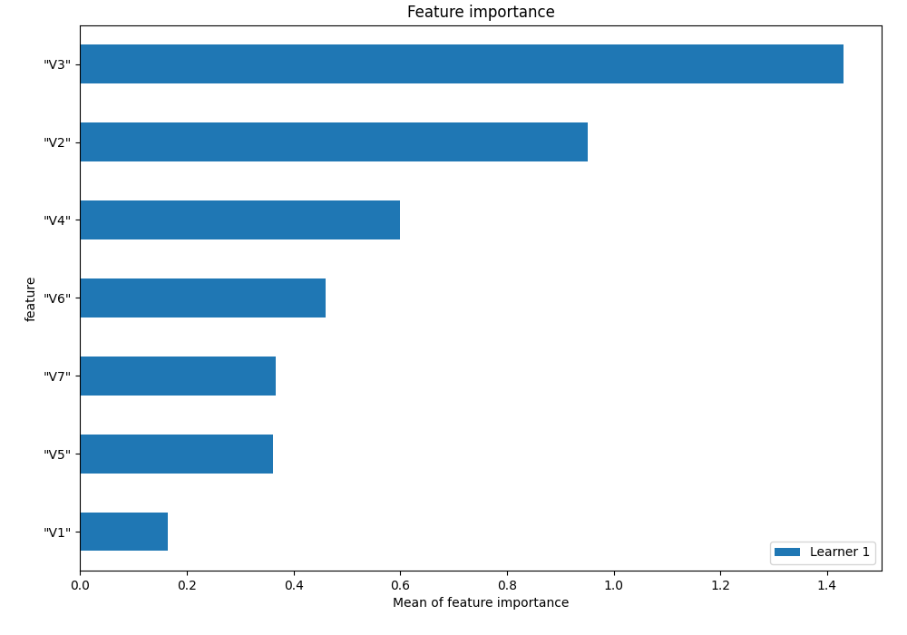
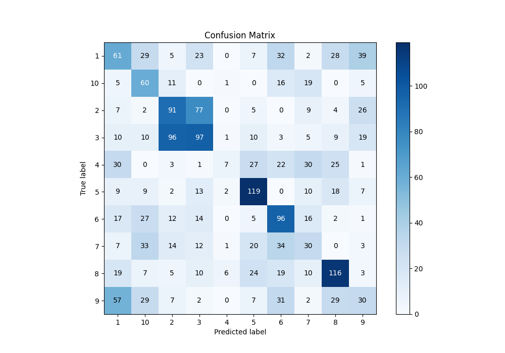
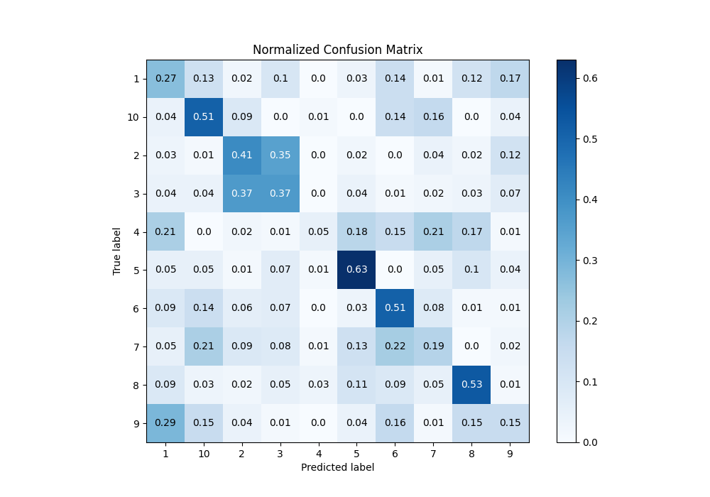
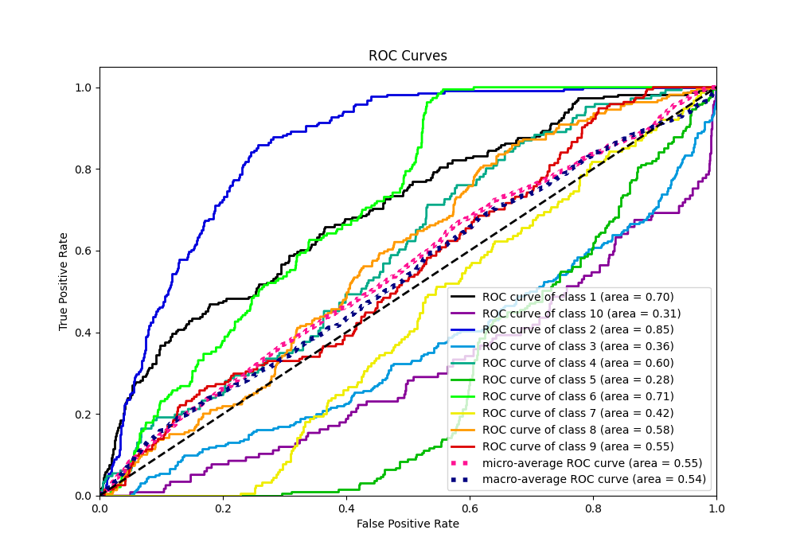
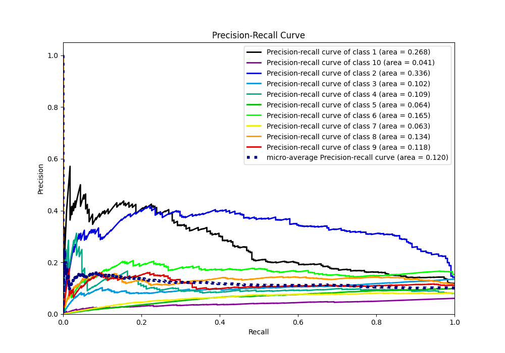

# Summary of 2_Linear

[<< Go back](../README.md)

## Logistic Regression (Linear)
- **n_jobs**: -1
- **num_class**: 10
- **explain_level**: 1

## Validation
 - **validation_type**: split
 - **train_ratio**: 0.75
 - **shuffle**: True
 - **stratify**: True

## Optimized metric
f1

## Training time

0.8 seconds

### Metric details
|           |          1 |          2 |          3 |           4 |          5 |          6 |          7 |          8 |          9 |         10 |   accuracy |   macro avg |   weighted avg |   logloss |
|:----------|-----------:|-----------:|-----------:|------------:|-----------:|-----------:|-----------:|-----------:|-----------:|-----------:|-----------:|------------:|---------------:|----------:|
| precision |   0.274775 |   0.369919 |   0.389558 |   0.388889  |   0.53125  |   0.379447 |   0.225564 |   0.502165 |   0.223881 |   0.291262 |   0.368998 |    0.357671 |       0.363589 |   1.67915 |
| recall    |   0.269912 |   0.411765 |   0.373077 |   0.0479452 |   0.62963  |   0.505263 |   0.194805 |   0.52968  |   0.154639 |   0.512821 |   0.368998 |    0.362954 |       0.368998 |   1.67915 |
| f1-score  |   0.272321 |   0.389722 |   0.381139 |   0.0853659 |   0.576271 |   0.433409 |   0.209059 |   0.515556 |   0.182927 |   0.371517 |   0.368998 |    0.341729 |       0.352063 |   1.67915 |
| support   | 226        | 221        | 260        | 146         | 189        | 190        | 154        | 219        | 194        | 117        |   0.368998 | 1916        |    1916        |   1.67915 |

## Confusion matrix
|               |   Predicted as 1 |   Predicted as 2 |   Predicted as 3 |   Predicted as 4 |   Predicted as 5 |   Predicted as 6 |   Predicted as 7 |   Predicted as 8 |   Predicted as 9 |   Predicted as 10 |
|:--------------|-----------------:|-----------------:|-----------------:|-----------------:|-----------------:|-----------------:|-----------------:|-----------------:|-----------------:|------------------:|
| Labeled as 1  |               61 |                5 |               23 |                0 |                7 |               32 |                2 |               28 |               39 |                29 |
| Labeled as 2  |                7 |               91 |               77 |                0 |                5 |                0 |                9 |                4 |               26 |                 2 |
| Labeled as 3  |               10 |               96 |               97 |                1 |               10 |                3 |                5 |                9 |               19 |                10 |
| Labeled as 4  |               30 |                3 |                1 |                7 |               27 |               22 |               30 |               25 |                1 |                 0 |
| Labeled as 5  |                9 |                2 |               13 |                2 |              119 |                0 |               10 |               18 |                7 |                 9 |
| Labeled as 6  |               17 |               12 |               14 |                0 |                5 |               96 |               16 |                2 |                1 |                27 |
| Labeled as 7  |                7 |               14 |               12 |                1 |               20 |               34 |               30 |                0 |                3 |                33 |
| Labeled as 8  |               19 |                5 |               10 |                6 |               24 |               19 |               10 |              116 |                3 |                 7 |
| Labeled as 9  |               57 |                7 |                2 |                0 |                7 |               31 |                2 |               29 |               30 |                29 |
| Labeled as 10 |                5 |               11 |                0 |                1 |                0 |               16 |               19 |                0 |                5 |                60 |

## Learning curves

## Coefficients

### Coefficients learner #1
|           |         1 |         2 |         3 |          4 |         5 |          6 |          7 |         8 |         9 |        10 |
|:----------|----------:|----------:|----------:|-----------:|----------:|-----------:|-----------:|----------:|----------:|----------:|
| intercept |  1.19902  |  0.490634 |  0.908172 |  0.763634  |  0.384767 | -0.754044  | -1.44273   |  0.661152 |  0.733528 | -2.94413  |
| "V1"      |  0.79372  |  0.114247 |  0.480029 | -0.27868   | -0.322875 |  0.0858895 | -0.796549  |  0.533857 |  0.378646 | -0.988285 |
| "V2"      |  0.769215 |  1.77866  |  1.21884  |  1.68724   |  2.14062  | -2.80375   | -3.08998   |  1.68108  |  0.495603 | -3.87753  |
| "V3"      | -0.907453 |  2.24531  |  1.9745   |  0.385965  |  2.32723  | -0.894449  | -0.301694  | -1.06627  | -1.80744  | -1.9557   |
| "V4"      |  0.244268 | -1.8402   | -1.43947  | -0.696272  | -0.791577 |  1.15987   |  1.15448   | -0.350969 |  0.837647 |  1.72223  |
| "V5"      |  0.662325 | -0.778821 | -1.22858  | -0.194649  | -1.61353  |  0.391202  |  0.473004  |  0.37195  |  1.11327  |  0.803825 |
| "V6"      | -0.11467  |  0.870701 |  0.882113 |  0.0391737 |  1.81354  | -0.737375  | -0.582332  | -0.66899  | -0.580356 | -0.921804 |
| "V7"      |  0.140772 |  0.658275 |  0.982916 | -0.198818  | -1.66987  |  0.461468  | -0.0780612 | -0.16097  |  0.152508 | -0.288222 |

## Permutation-based Importance

## Confusion Matrix

## Normalized Confusion Matrix

## ROC Curve

## Precision Recall Curve

[<< Go back](../README.md)
