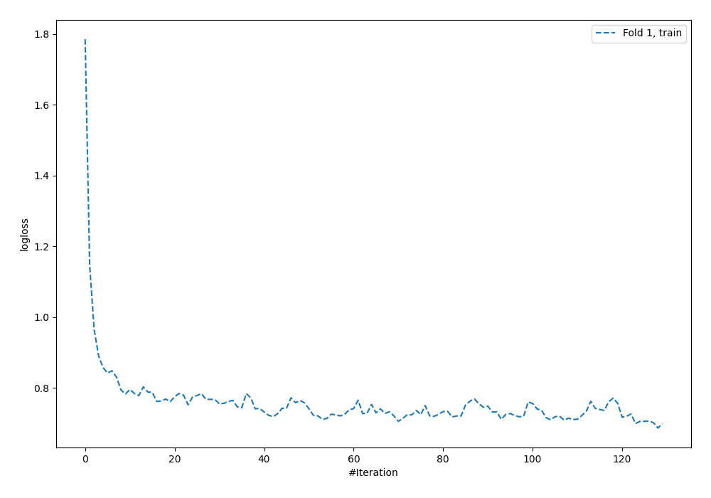
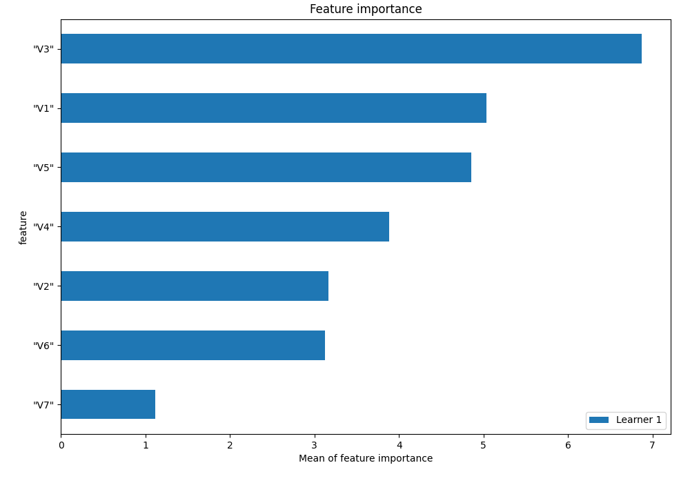
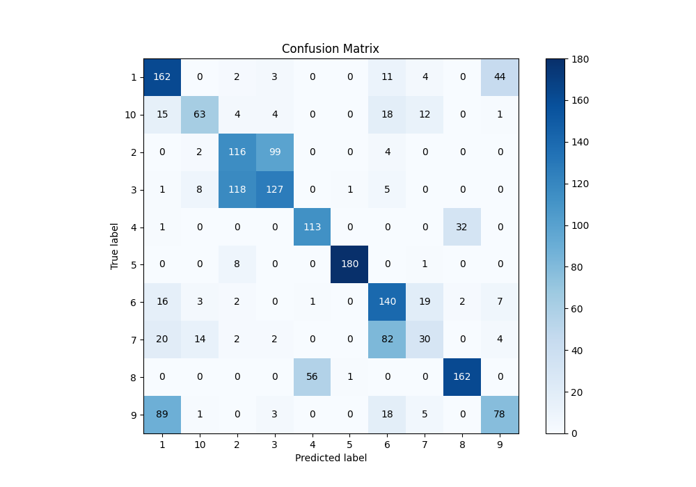
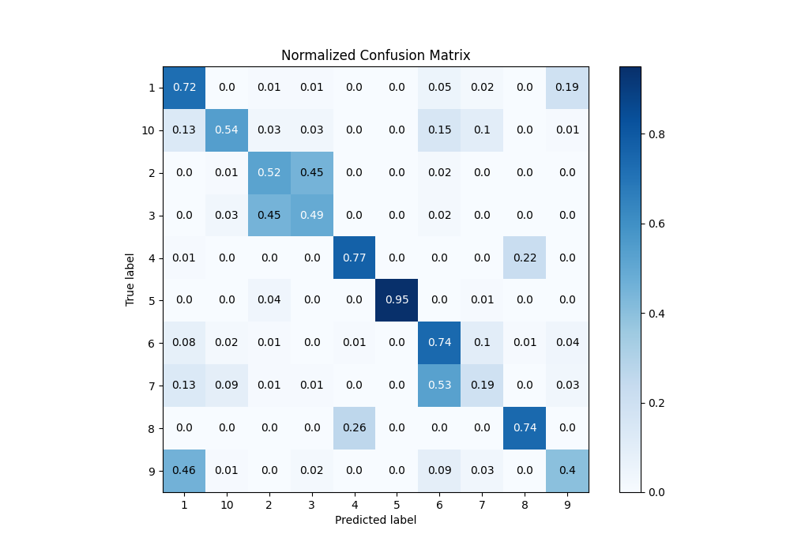
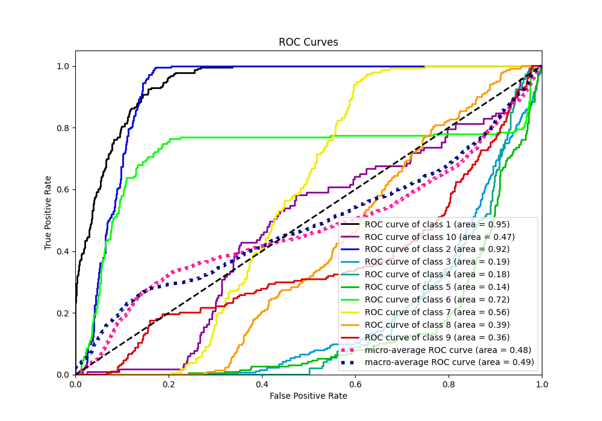
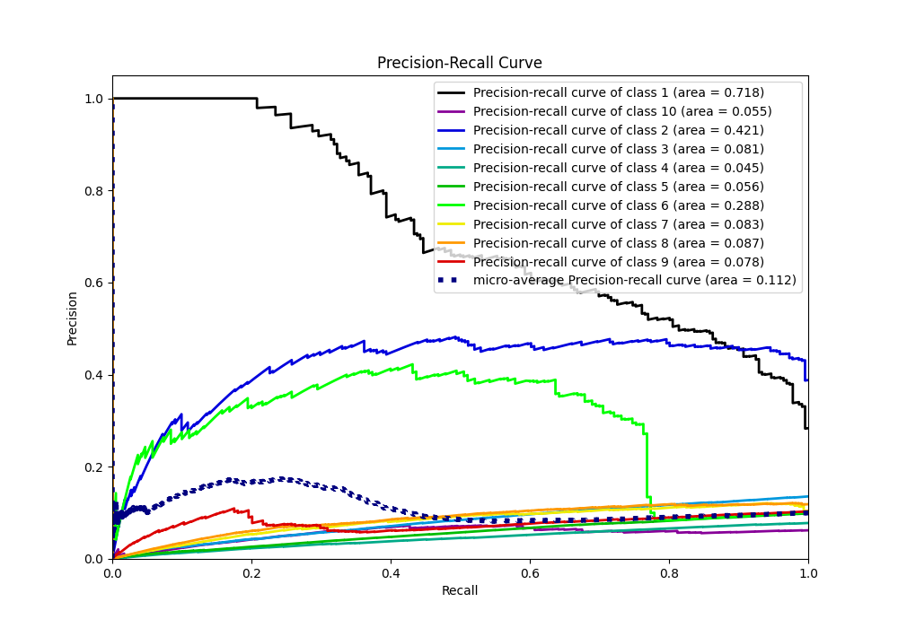

# Summary of 3_Default_NeuralNetwork

[<< Go back](../README.md)

## Neural Network
- **n_jobs**: -1
- **dense_1_size**: 32
- **dense_2_size**: 16
- **learning_rate**: 0.05
- **num_class**: 10
- **explain_level**: 1

## Validation
 - **validation_type**: split
 - **train_ratio**: 0.75
 - **shuffle**: True
 - **stratify**: True

## Optimized metric
f1

## Training time

3.1 seconds

### Metric details
|           |          1 |          2 |          3 |          4 |          5 |          6 |          7 |          8 |          9 |         10 |   accuracy |   macro avg |   weighted avg |   logloss |
|:----------|-----------:|-----------:|-----------:|-----------:|-----------:|-----------:|-----------:|-----------:|-----------:|-----------:|-----------:|------------:|---------------:|----------:|
| precision |   0.532895 |   0.460317 |   0.533613 |   0.664706 |   0.989011 |   0.503597 |   0.422535 |   0.826531 |   0.58209  |   0.692308 |   0.611169 |    0.62076  |       0.61616  |  0.755628 |
| recall    |   0.716814 |   0.524887 |   0.488462 |   0.773973 |   0.952381 |   0.736842 |   0.194805 |   0.739726 |   0.402062 |   0.538462 |   0.611169 |    0.606841 |       0.611169 |  0.755628 |
| f1-score  |   0.611321 |   0.490486 |   0.51004  |   0.71519  |   0.97035  |   0.598291 |   0.266667 |   0.780723 |   0.47561  |   0.605769 |   0.611169 |    0.602445 |       0.603259 |  0.755628 |
| support   | 226        | 221        | 260        | 146        | 189        | 190        | 154        | 219        | 194        | 117        |   0.611169 | 1916        |    1916        |  0.755628 |

## Confusion matrix
|               |   Predicted as 1 |   Predicted as 2 |   Predicted as 3 |   Predicted as 4 |   Predicted as 5 |   Predicted as 6 |   Predicted as 7 |   Predicted as 8 |   Predicted as 9 |   Predicted as 10 |
|:--------------|-----------------:|-----------------:|-----------------:|-----------------:|-----------------:|-----------------:|-----------------:|-----------------:|-----------------:|------------------:|
| Labeled as 1  |              162 |                2 |                3 |                0 |                0 |               11 |                4 |                0 |               44 |                 0 |
| Labeled as 2  |                0 |              116 |               99 |                0 |                0 |                4 |                0 |                0 |                0 |                 2 |
| Labeled as 3  |                1 |              118 |              127 |                0 |                1 |                5 |                0 |                0 |                0 |                 8 |
| Labeled as 4  |                1 |                0 |                0 |              113 |                0 |                0 |                0 |               32 |                0 |                 0 |
| Labeled as 5  |                0 |                8 |                0 |                0 |              180 |                0 |                1 |                0 |                0 |                 0 |
| Labeled as 6  |               16 |                2 |                0 |                1 |                0 |              140 |               19 |                2 |                7 |                 3 |
| Labeled as 7  |               20 |                2 |                2 |                0 |                0 |               82 |               30 |                0 |                4 |                14 |
| Labeled as 8  |                0 |                0 |                0 |               56 |                1 |                0 |                0 |              162 |                0 |                 0 |
| Labeled as 9  |               89 |                0 |                3 |                0 |                0 |               18 |                5 |                0 |               78 |                 1 |
| Labeled as 10 |               15 |                4 |                4 |                0 |                0 |               18 |               12 |                0 |                1 |                63 |

## Learning curves

## Permutation-based Importance

## Confusion Matrix

## Normalized Confusion Matrix

## ROC Curve

## Precision Recall Curve

[<< Go back](../README.md)
