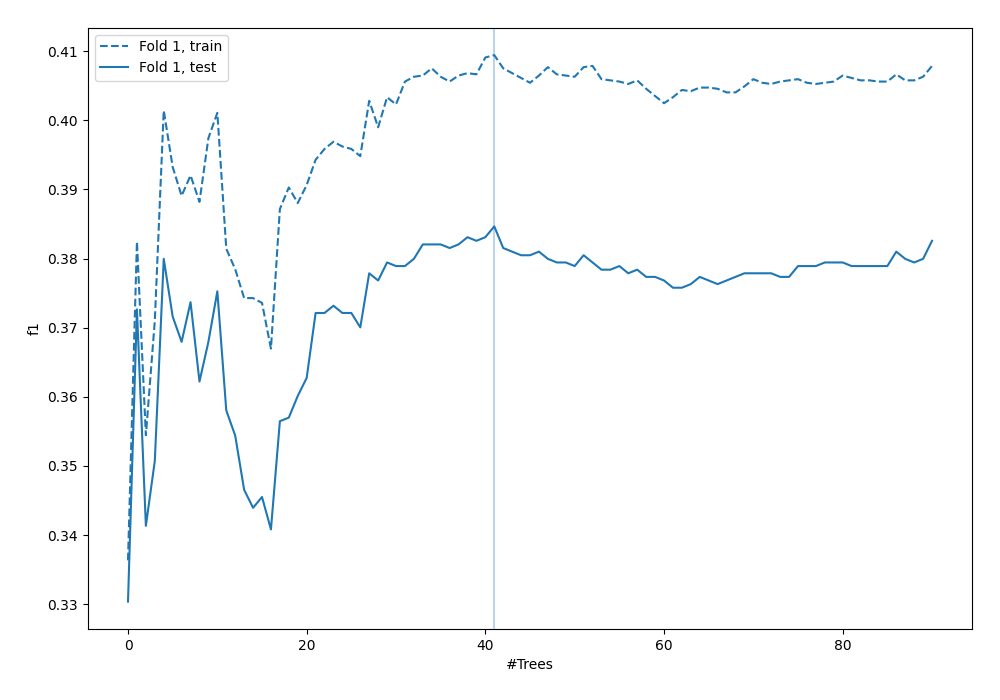
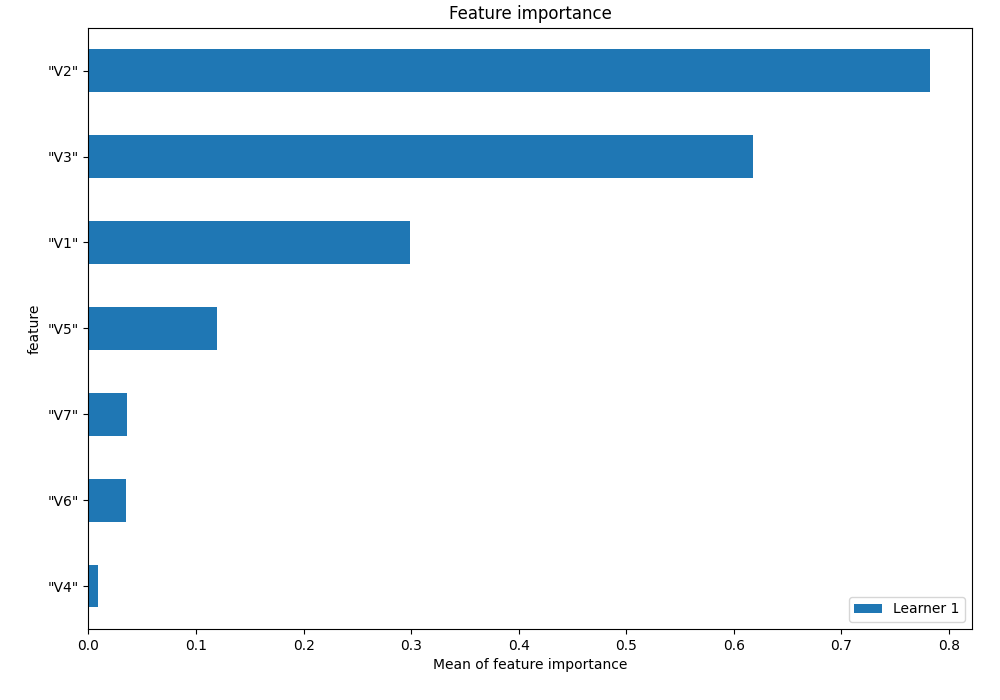
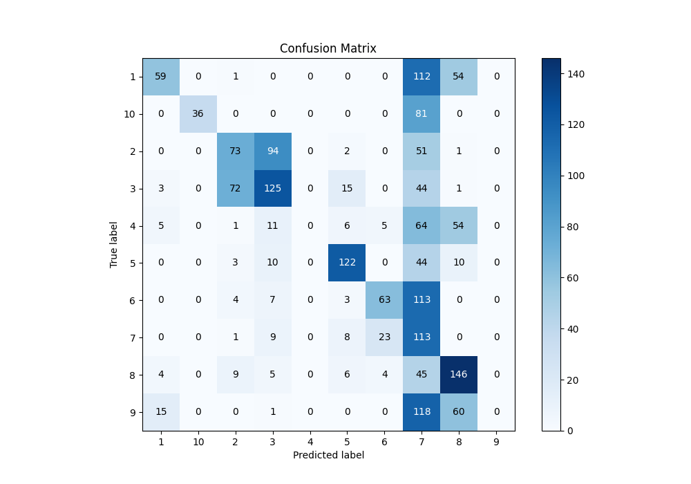
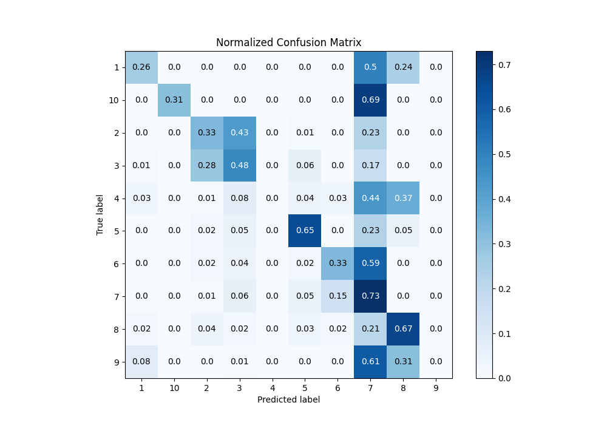
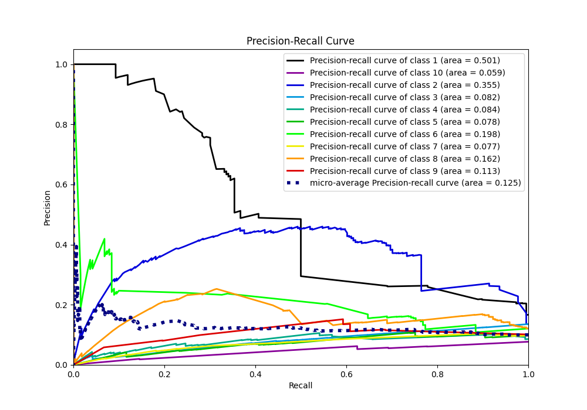

# Summary of 4_Default_RandomForest

[<< Go back](../README.md)

## Random Forest
- **n_jobs**: -1
- **criterion**: gini
- **max_features**: 0.9
- **min_samples_split**: 30
- **max_depth**: 4
- **eval_metric_name**: f1
- **num_class**: 10
- **explain_level**: 1

## Validation
 - **validation_type**: split
 - **train_ratio**: 0.75
 - **shuffle**: True
 - **stratify**: True

## Optimized metric
f1

## Training time

1.7 seconds

### Metric details
|           |          1 |          2 |          3 |   4 |          5 |          6 |          7 |          8 |   9 |         10 |   accuracy |   macro avg |   weighted avg |   logloss |
|:----------|-----------:|-----------:|-----------:|----:|-----------:|-----------:|-----------:|-----------:|----:|-----------:|-----------:|------------:|---------------:|----------:|
| precision |   0.686047 |   0.445122 |   0.477099 |   0 |   0.753086 |   0.663158 |   0.143949 |   0.447853 |   0 |   1        |   0.384656 |    0.461631 |       0.46088  |   1.60894 |
| recall    |   0.261062 |   0.330317 |   0.480769 |   0 |   0.645503 |   0.331579 |   0.733766 |   0.666667 |   0 |   0.307692 |   0.384656 |    0.375735 |       0.384656 |   1.60894 |
| f1-score  |   0.378205 |   0.379221 |   0.478927 |   0 |   0.695157 |   0.442105 |   0.240682 |   0.53578  |   0 |   0.470588 |   0.384656 |    0.362066 |       0.375077 |   1.60894 |
| support   | 226        | 221        | 260        | 146 | 189        | 190        | 154        | 219        | 194 | 117        |   0.384656 | 1916        |    1916        |   1.60894 |

## Confusion matrix
|               |   Predicted as 1 |   Predicted as 2 |   Predicted as 3 |   Predicted as 4 |   Predicted as 5 |   Predicted as 6 |   Predicted as 7 |   Predicted as 8 |   Predicted as 9 |   Predicted as 10 |
|:--------------|-----------------:|-----------------:|-----------------:|-----------------:|-----------------:|-----------------:|-----------------:|-----------------:|-----------------:|------------------:|
| Labeled as 1  |               59 |                1 |                0 |                0 |                0 |                0 |              112 |               54 |                0 |                 0 |
| Labeled as 2  |                0 |               73 |               94 |                0 |                2 |                0 |               51 |                1 |                0 |                 0 |
| Labeled as 3  |                3 |               72 |              125 |                0 |               15 |                0 |               44 |                1 |                0 |                 0 |
| Labeled as 4  |                5 |                1 |               11 |                0 |                6 |                5 |               64 |               54 |                0 |                 0 |
| Labeled as 5  |                0 |                3 |               10 |                0 |              122 |                0 |               44 |               10 |                0 |                 0 |
| Labeled as 6  |                0 |                4 |                7 |                0 |                3 |               63 |              113 |                0 |                0 |                 0 |
| Labeled as 7  |                0 |                1 |                9 |                0 |                8 |               23 |              113 |                0 |                0 |                 0 |
| Labeled as 8  |                4 |                9 |                5 |                0 |                6 |                4 |               45 |              146 |                0 |                 0 |
| Labeled as 9  |               15 |                0 |                1 |                0 |                0 |                0 |              118 |               60 |                0 |                 0 |
| Labeled as 10 |                0 |                0 |                0 |                0 |                0 |                0 |               81 |                0 |                0 |                36 |

## Learning curves

## Permutation-based Importance

## Confusion Matrix

## Normalized Confusion Matrix

## ROC Curve

## Precision Recall Curve

[<< Go back](../README.md)
