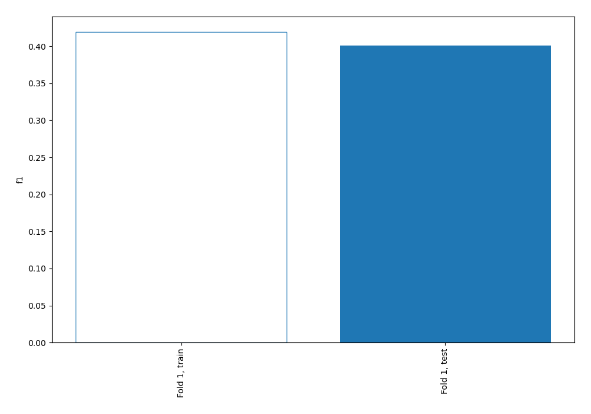
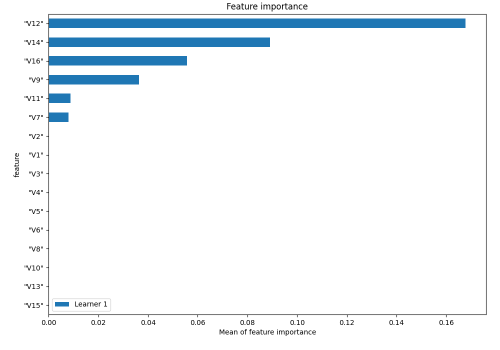
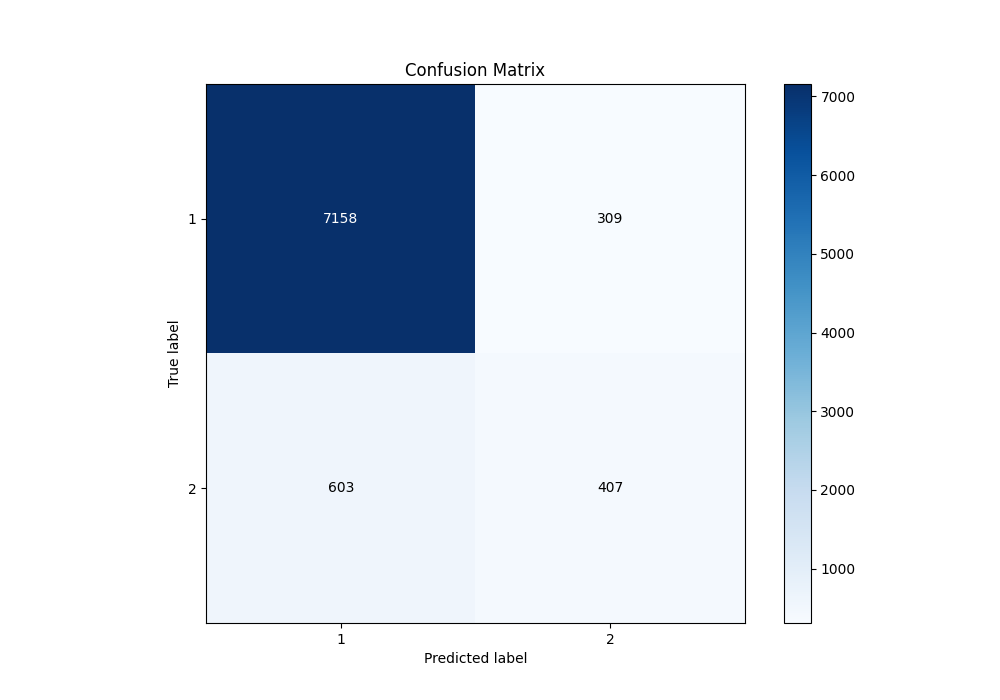
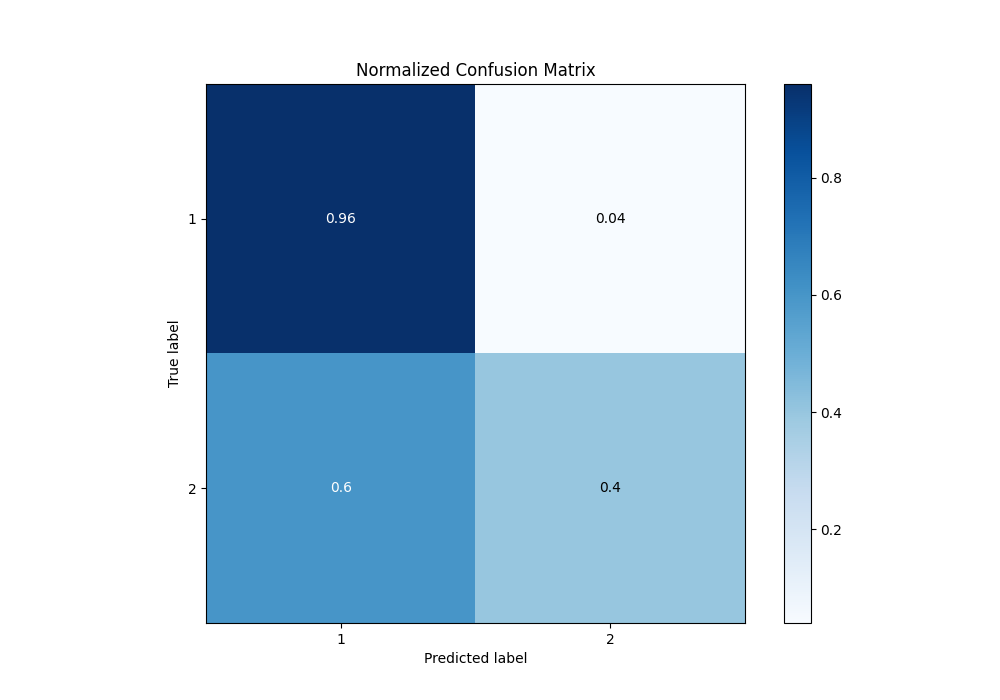
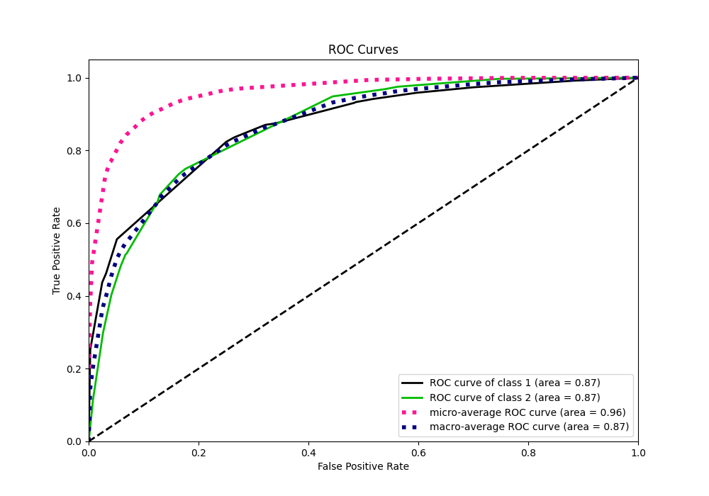
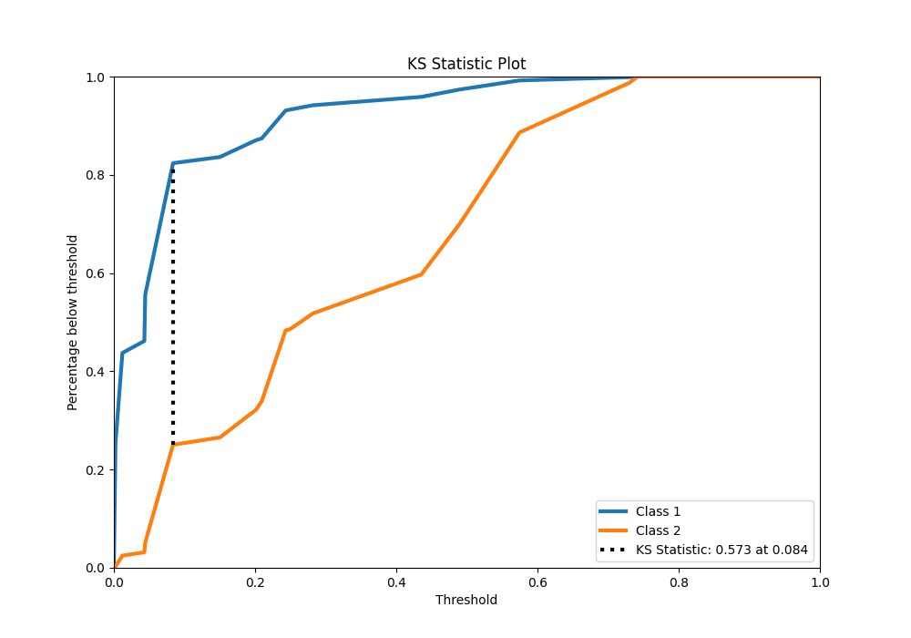
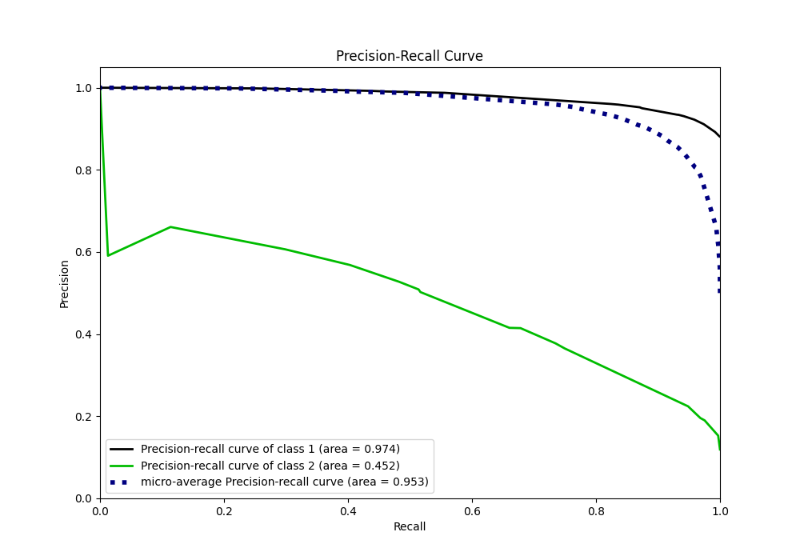
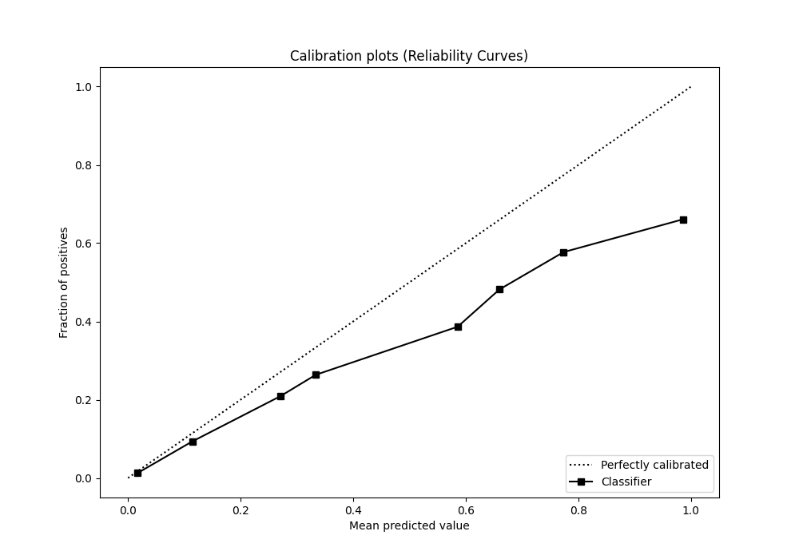
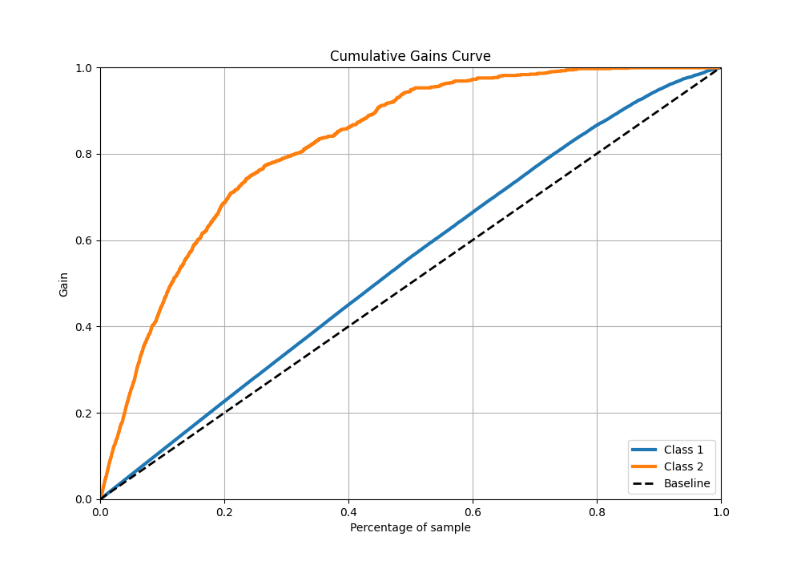
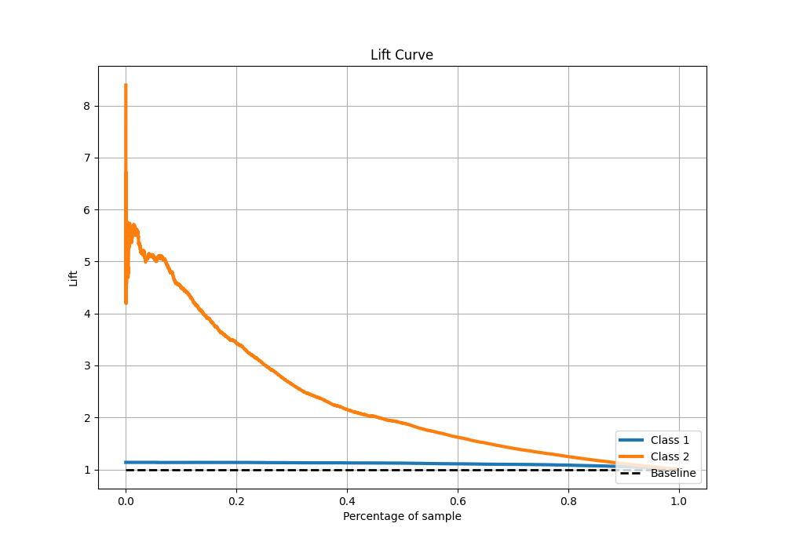

# Summary of 1_DecisionTree

[<< Go back](../README.md)

## Decision Tree
- **n_jobs**: -1
- **criterion**: entropy
- **max_depth**: 4
- **explain_level**: 1

## Validation
 - **validation_type**: split
 - **train_ratio**: 0.75
 - **shuffle**: True
 - **stratify**: True

## Optimized metric
f1

## Training time

8.3 seconds

## Metric details
|           |    score |   threshold |
|:----------|---------:|------------:|
| logloss   | 0.257058 | nan         |
| auc       | 0.867526 | nan         |
| f1        | 0.514651 |   0.201381  |
| accuracy  | 0.892415 |   0.469739  |
| precision | 0.568436 |   0.469739  |
| recall    | 1        |   0.0020024 |
| mcc       | 0.44877  |   0.201381  |

## Confusion matrix (at threshold=0.469739)
|              |   Predicted as 1 |   Predicted as 2 |
|:-------------|-----------------:|-----------------:|
| Labeled as 1 |             7158 |              309 |
| Labeled as 2 |              603 |              407 |

## Learning curves

## Permutation-based Importance

## Confusion Matrix

## Normalized Confusion Matrix

## ROC Curve

## Kolmogorov-Smirnov Statistic

## Precision-Recall Curve

## Calibration Curve

## Cumulative Gains Curve

## Lift Curve

[<< Go back](../README.md)
