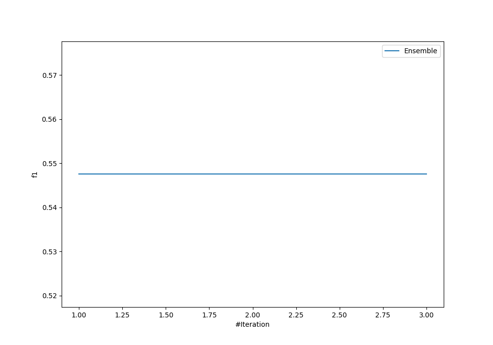
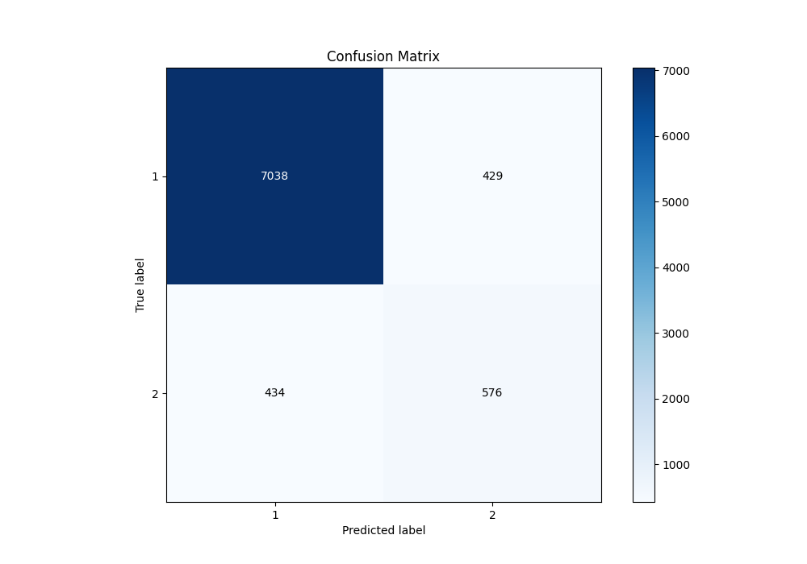
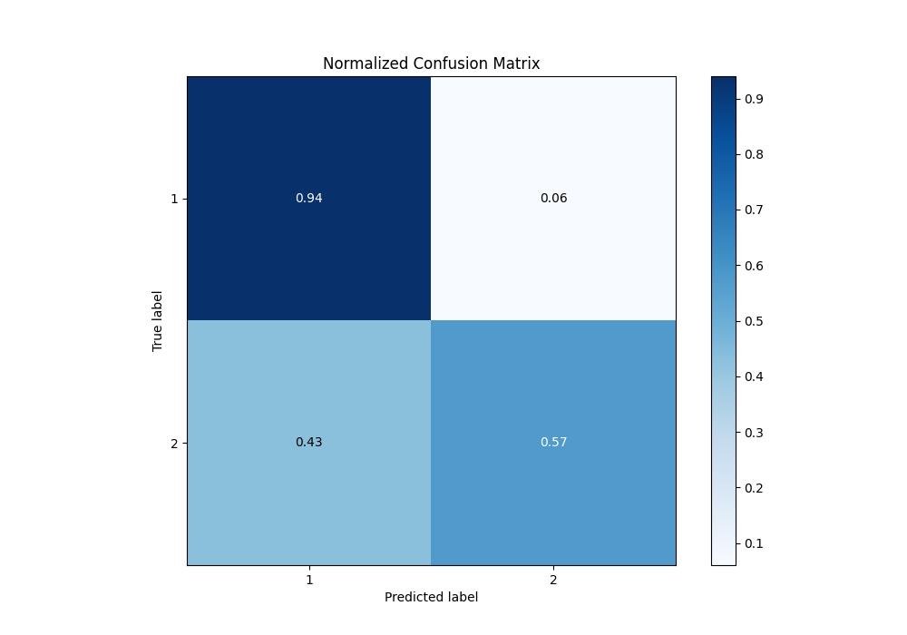
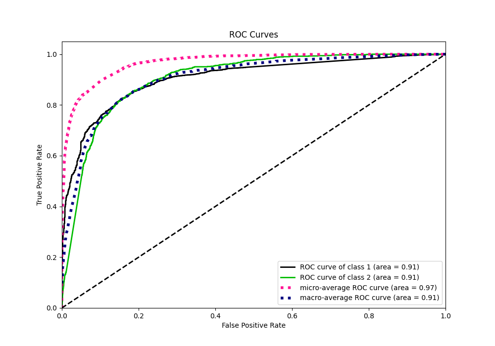
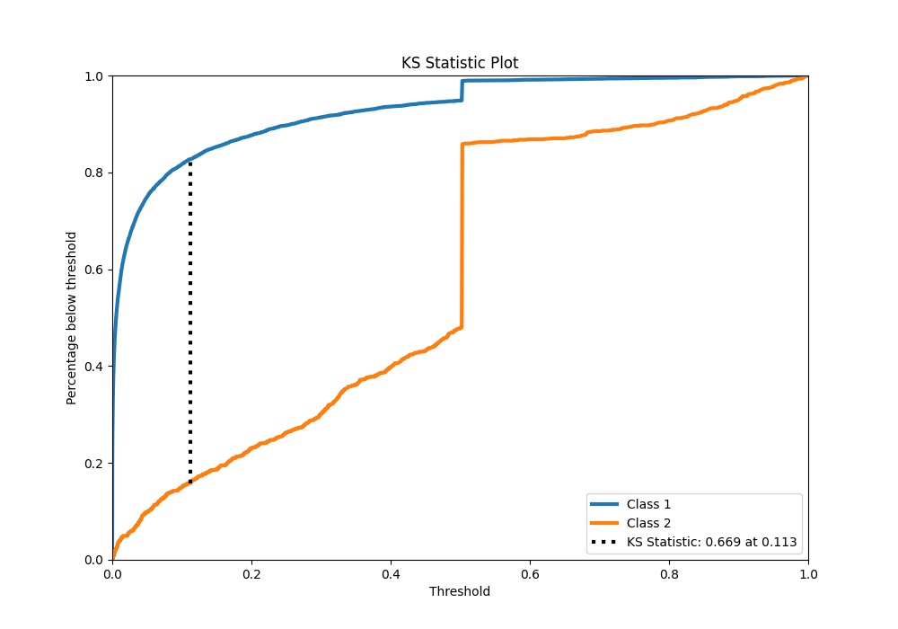
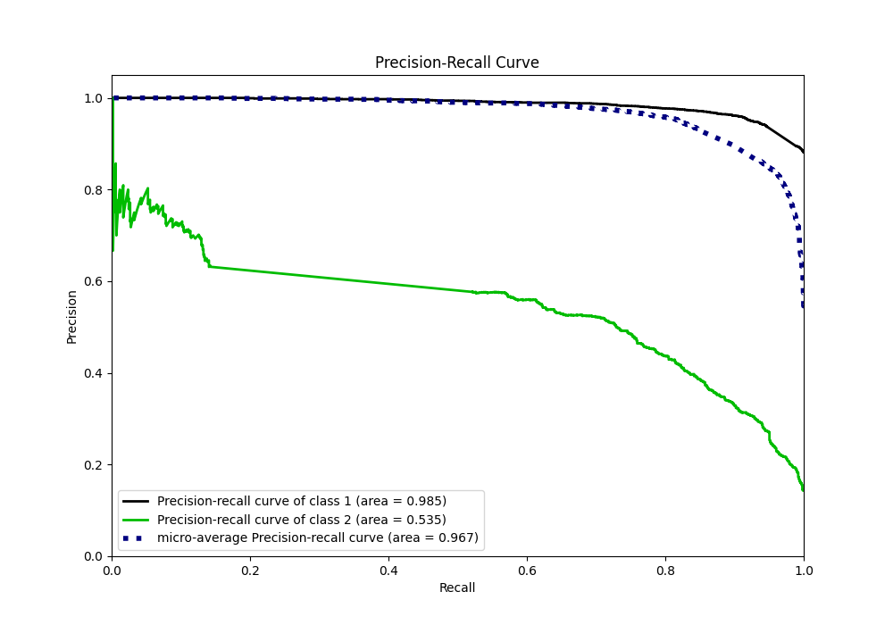
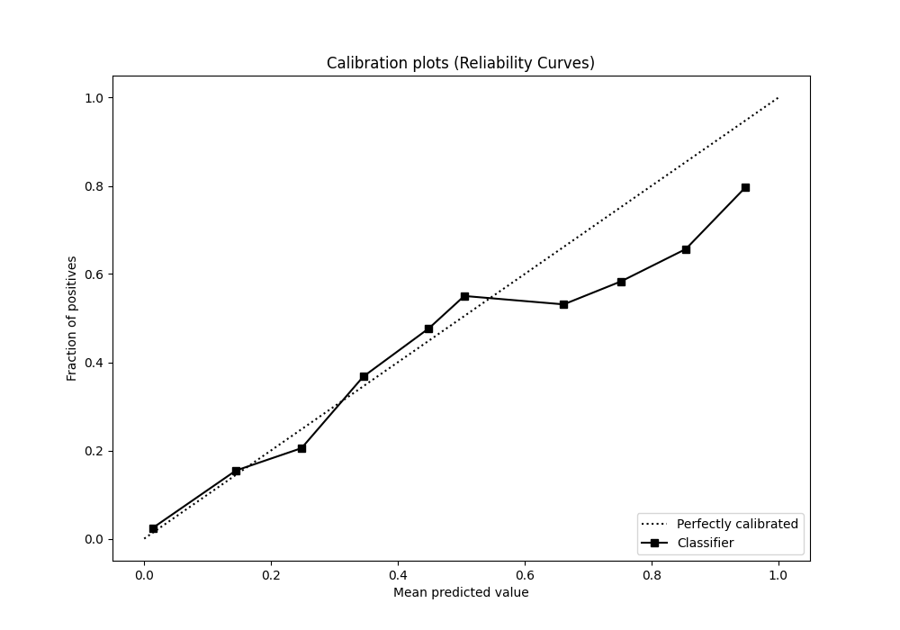
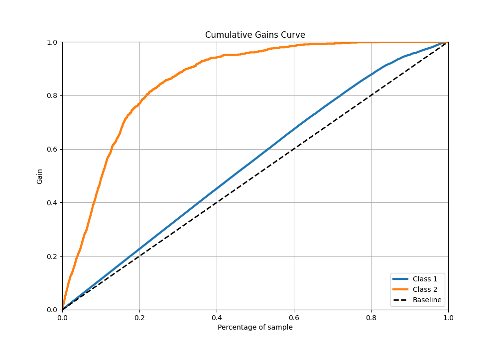
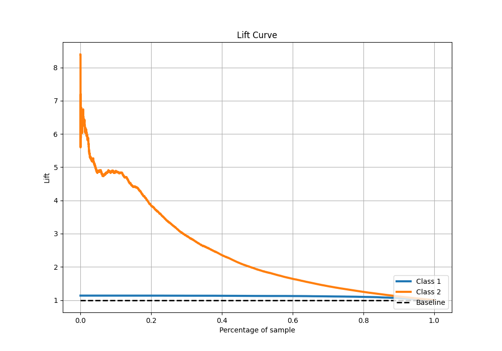

# Summary of Ensemble

[<< Go back](../README.md)

## Ensemble structure
| Model                   |   Weight |
|:------------------------|---------:|
| 2_Default_NeuralNetwork |        1 |

## Metric details
|           |    score |     threshold |
|:----------|---------:|--------------:|
| logloss   | 0.23561  | nan           |
| auc       | 0.905185 | nan           |
| f1        | 0.600167 |   0.288804    |
| accuracy  | 0.898195 |   0.447209    |
| precision | 0.646512 |   0.543281    |
| recall    | 1        |   1.02971e-15 |
| mcc       | 0.545351 |   0.288804    |

## Confusion matrix (at threshold=0.447209)
|              |   Predicted as 1 |   Predicted as 2 |
|:-------------|-----------------:|-----------------:|
| Labeled as 1 |             7038 |              429 |
| Labeled as 2 |              434 |              576 |

## Learning curves

## Confusion Matrix

## Normalized Confusion Matrix

## ROC Curve

## Kolmogorov-Smirnov Statistic

## Precision-Recall Curve

## Calibration Curve

## Cumulative Gains Curve

## Lift Curve

[<< Go back](../README.md)
