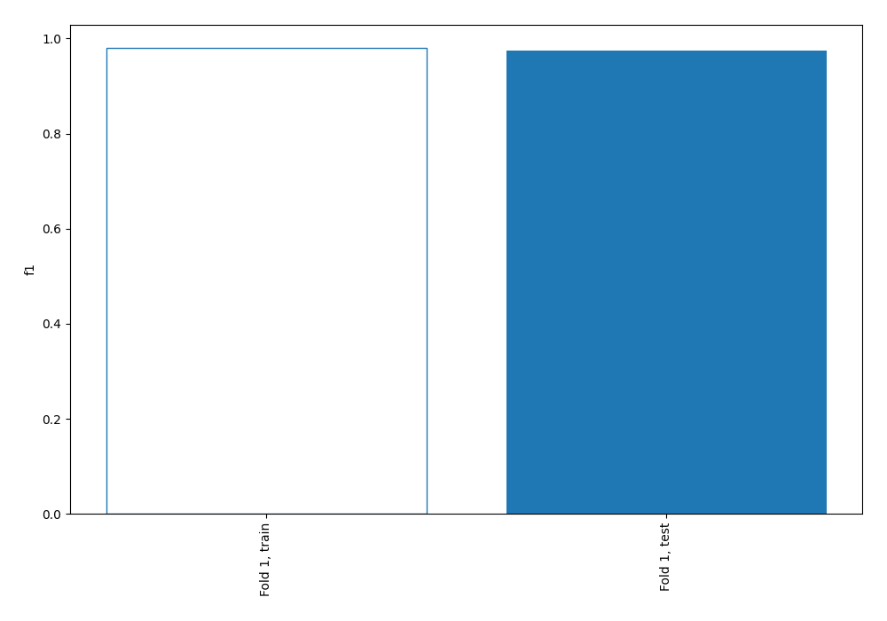
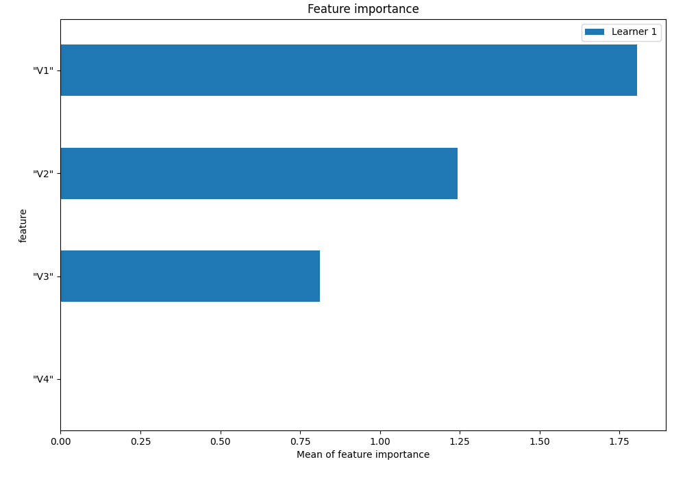
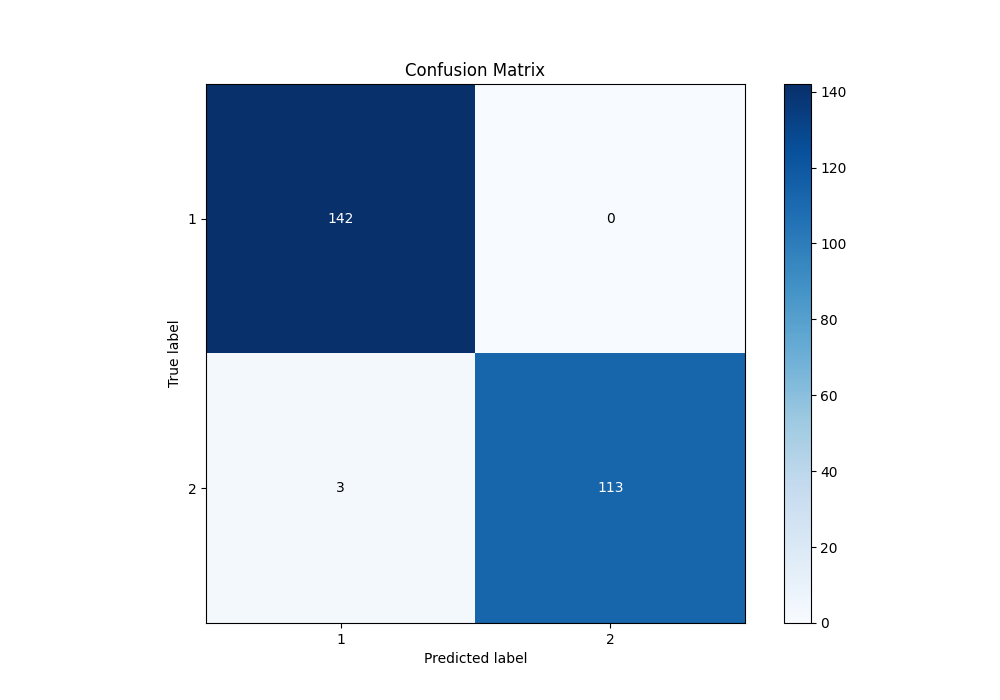
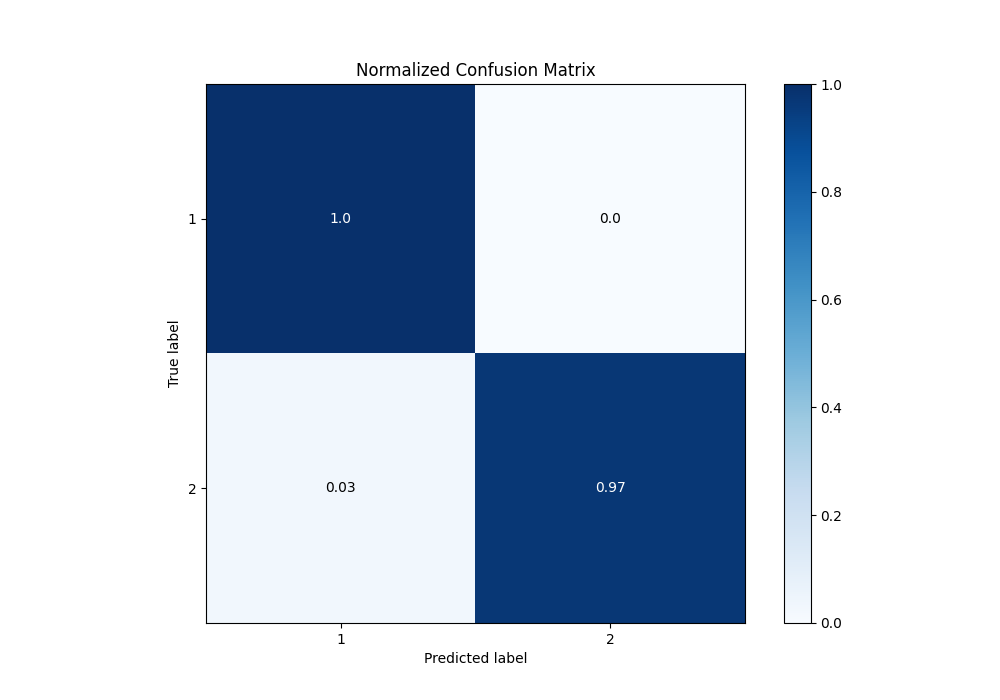
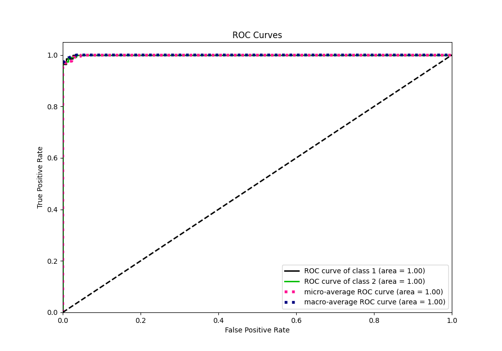
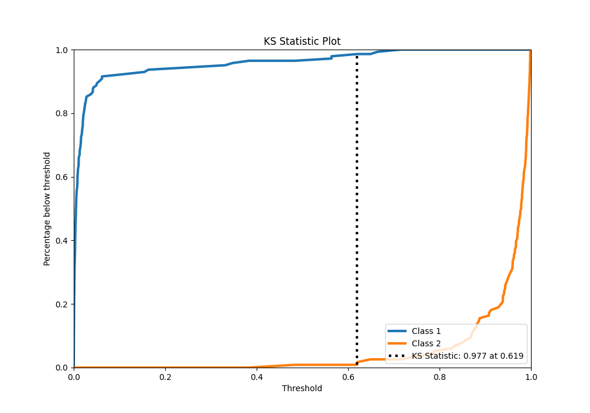
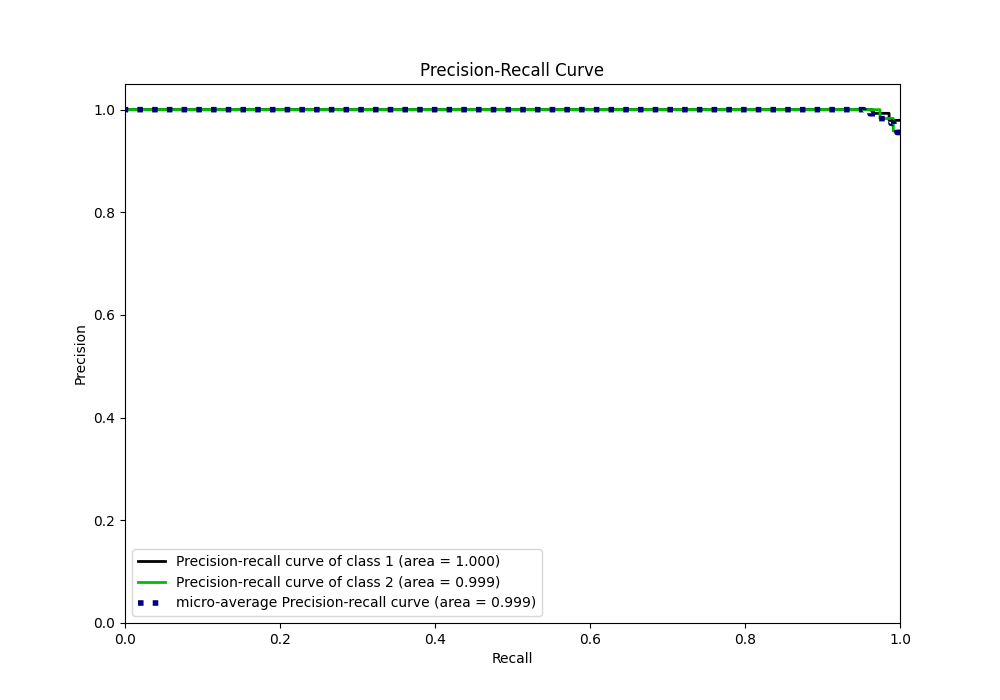
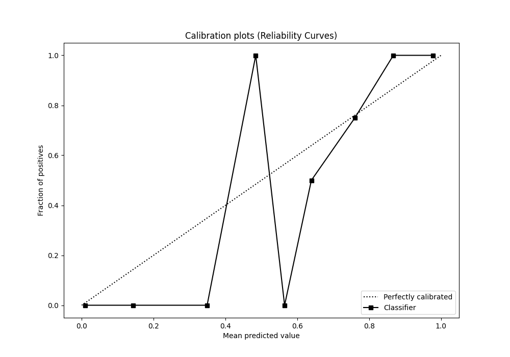
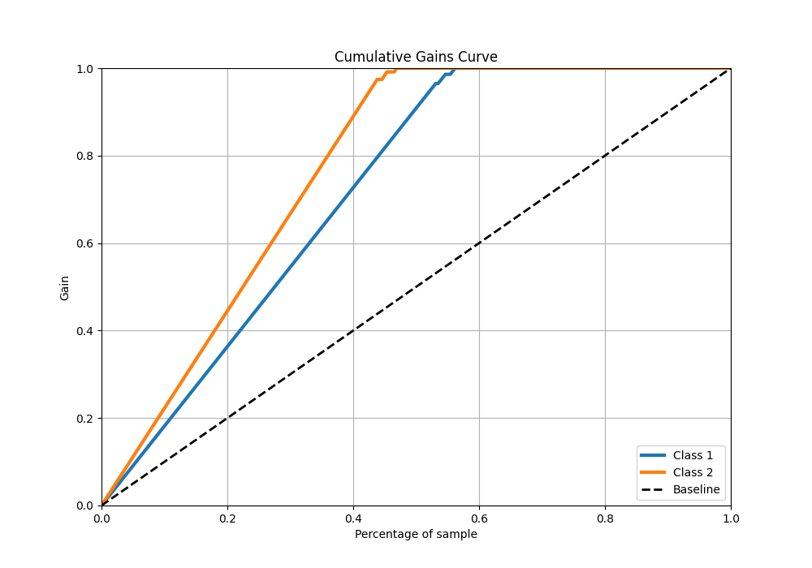
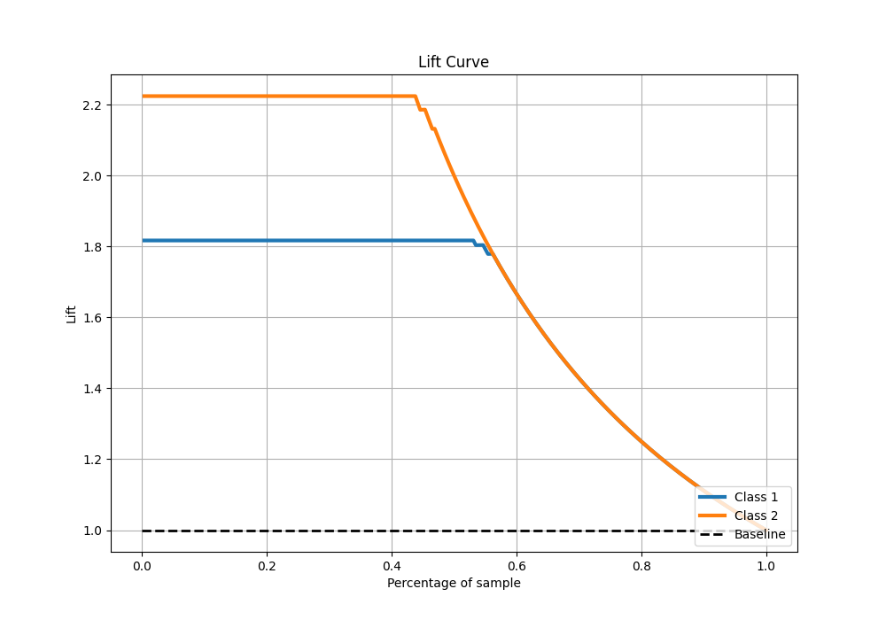

# Summary of 2_Linear

[<< Go back](../README.md)

## Logistic Regression (Linear)
- **n_jobs**: -1
- **explain_level**: 1

## Validation
 - **validation_type**: split
 - **train_ratio**: 0.75
 - **shuffle**: True
 - **stratify**: True

## Optimized metric
f1

## Training time

0.8 seconds

## Metric details
|           |     score |     threshold |
|:----------|----------:|--------------:|
| logloss   | 0.0579902 | nan           |
| auc       | 0.999454  | nan           |
| f1        | 0.9869    |   0.735431    |
| accuracy  | 0.988372  |   0.735431    |
| precision | 1         |   0.786693    |
| recall    | 1         |   1.30031e-05 |
| mcc       | 0.976721  |   0.735431    |

## Confusion matrix (at threshold=0.735431)
|              |   Predicted as 1 |   Predicted as 2 |
|:-------------|-----------------:|-----------------:|
| Labeled as 1 |              142 |                0 |
| Labeled as 2 |                3 |              113 |

## Learning curves

## Coefficients
| feature   |   Learner_1 |
|:----------|------------:|
| "V4"      |    0.228945 |
| intercept |   -1.08994  |
| "V3"      |   -3.88374  |
| "V2"      |   -4.10946  |
| "V1"      |   -4.32241  |

## Permutation-based Importance

## Confusion Matrix

## Normalized Confusion Matrix

## ROC Curve

## Kolmogorov-Smirnov Statistic

## Precision-Recall Curve

## Calibration Curve

## Cumulative Gains Curve

## Lift Curve

[<< Go back](../README.md)
