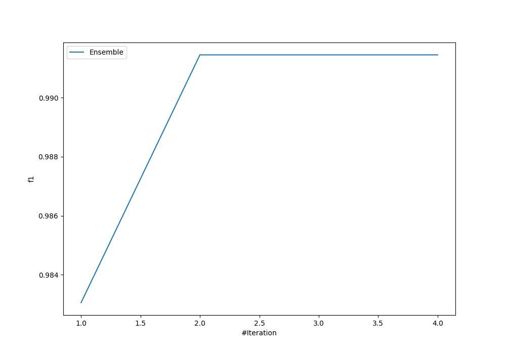
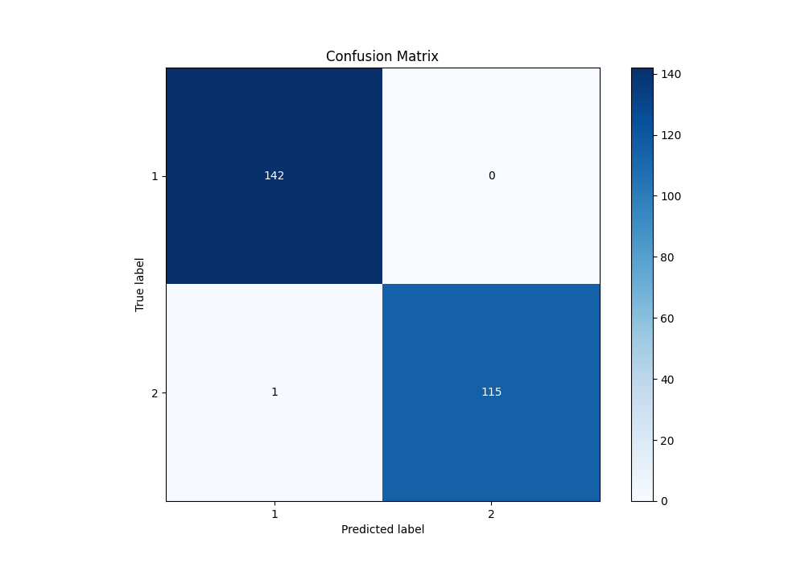
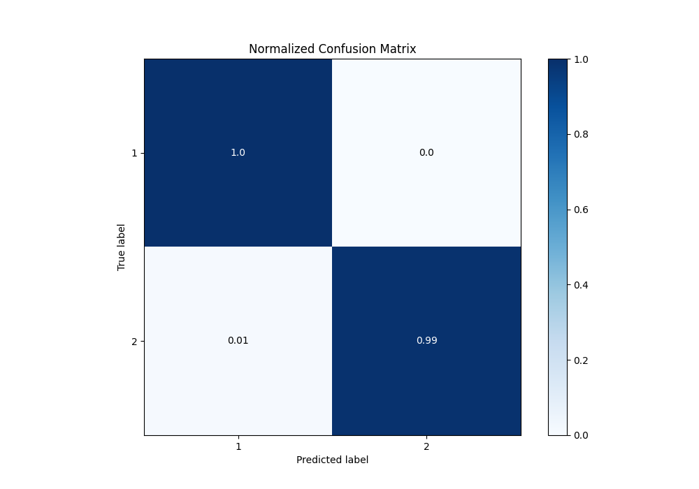
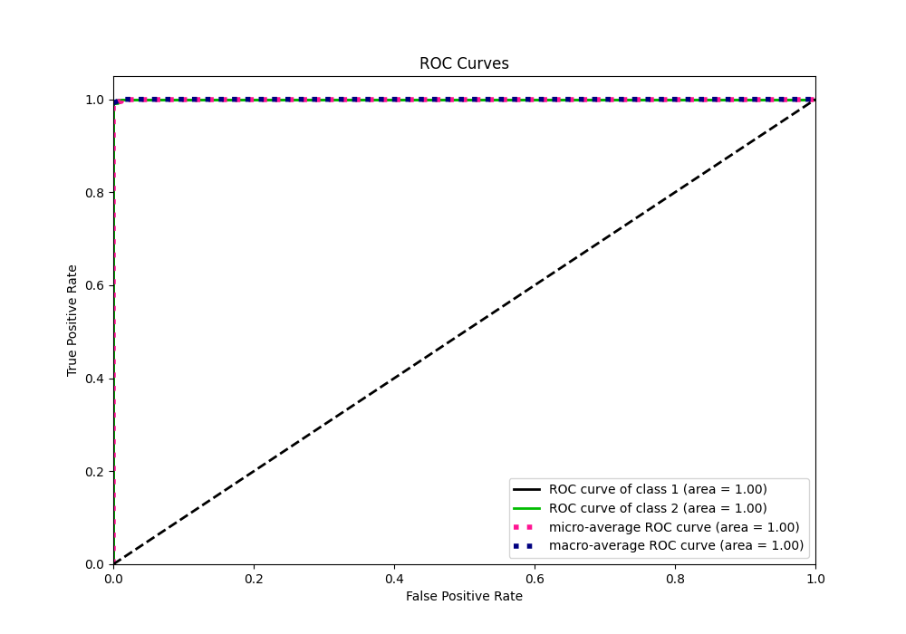
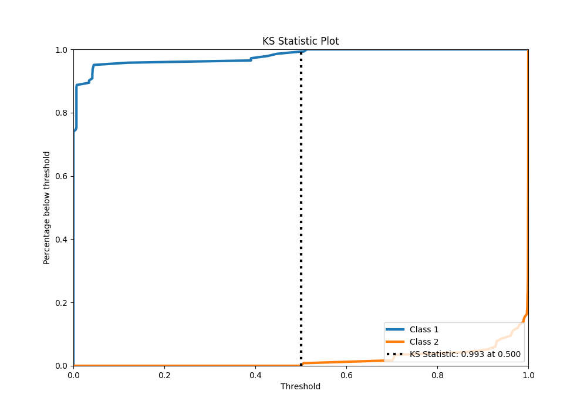
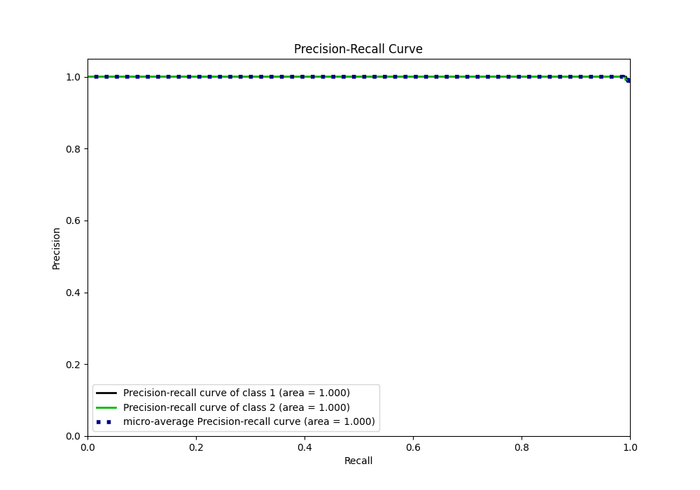
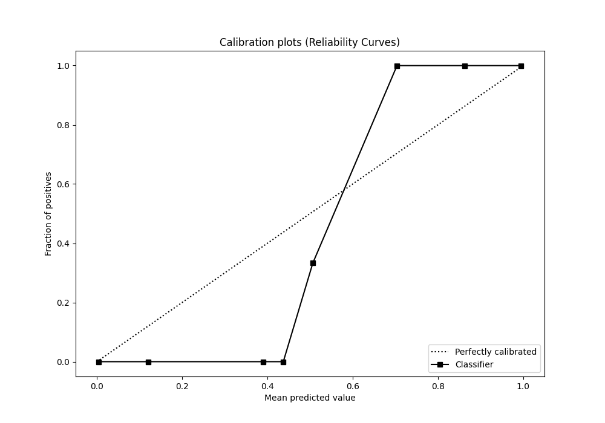
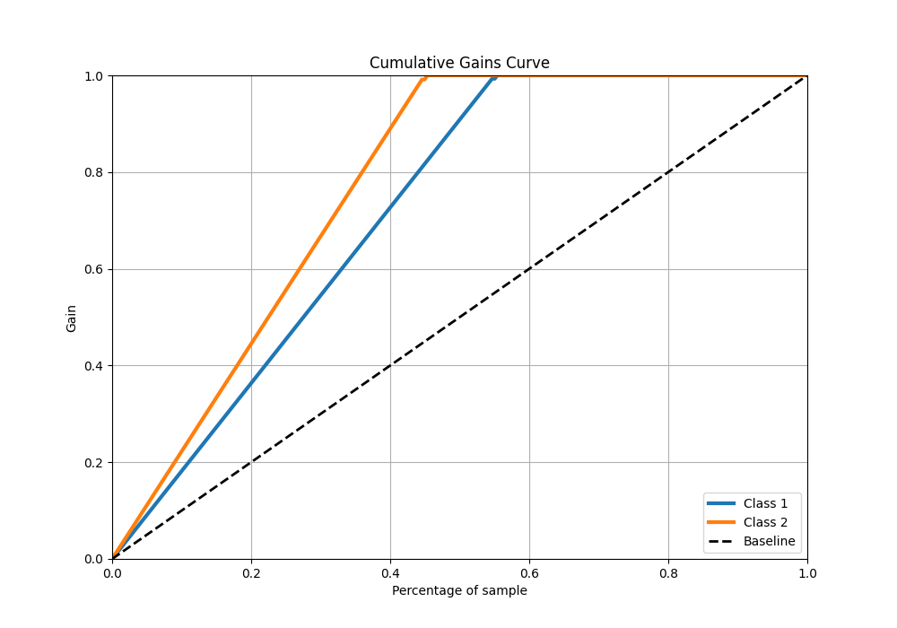
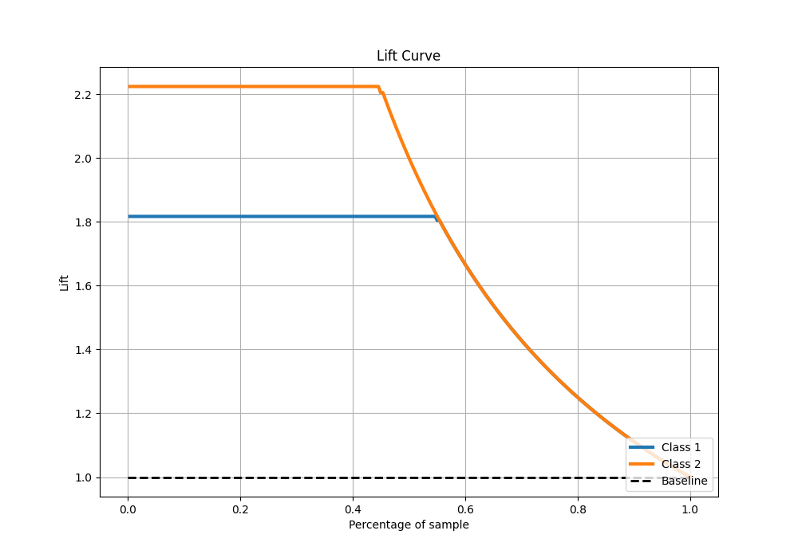

# Summary of Ensemble

[<< Go back](../README.md)

## Ensemble structure
| Model                   |   Weight |
|:------------------------|---------:|
| 1_DecisionTree          |        1 |
| 3_Default_NeuralNetwork |        1 |

## Metric details
|           |     score |     threshold |
|:----------|----------:|--------------:|
| logloss   | 0.0259083 | nan           |
| auc       | 0.999939  | nan           |
| f1        | 0.995708  |   0.503367    |
| accuracy  | 0.996124  |   0.517204    |
| precision | 1         |   0.965103    |
| recall    | 1         |   4.62179e-11 |
| mcc       | 0.992205  |   0.503367    |

## Confusion matrix (at threshold=0.517204)
|              |   Predicted as 1 |   Predicted as 2 |
|:-------------|-----------------:|-----------------:|
| Labeled as 1 |              142 |                0 |
| Labeled as 2 |                1 |              115 |

## Learning curves

## Confusion Matrix

## Normalized Confusion Matrix

## ROC Curve

## Kolmogorov-Smirnov Statistic

## Precision-Recall Curve

## Calibration Curve

## Cumulative Gains Curve

## Lift Curve

[<< Go back](../README.md)
