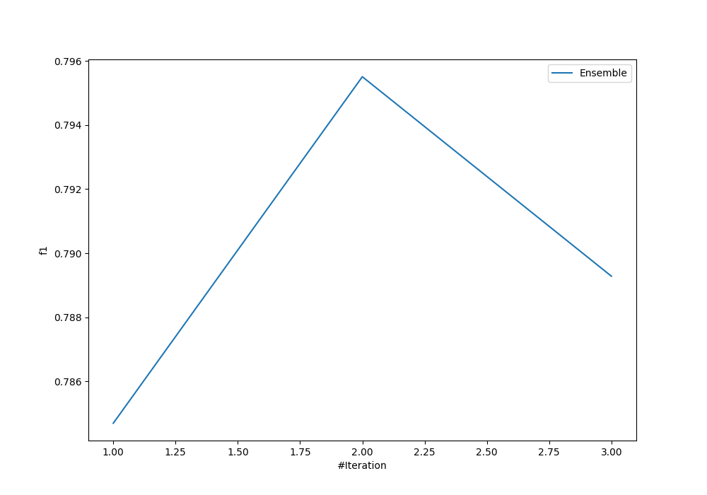
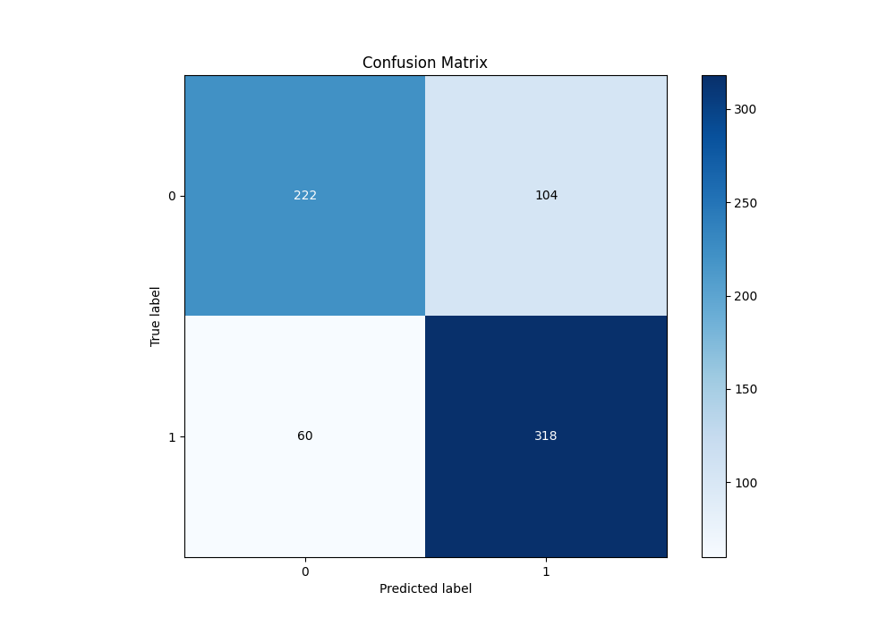
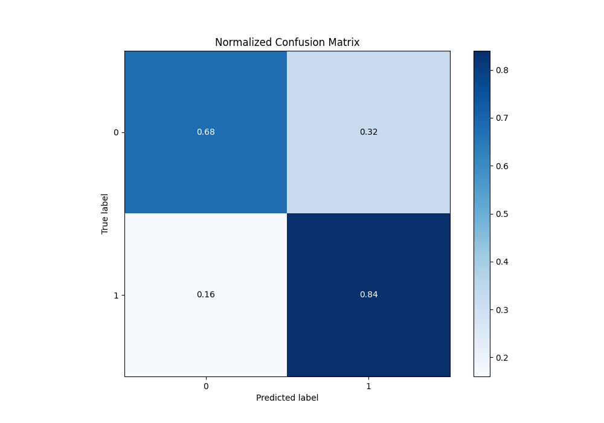
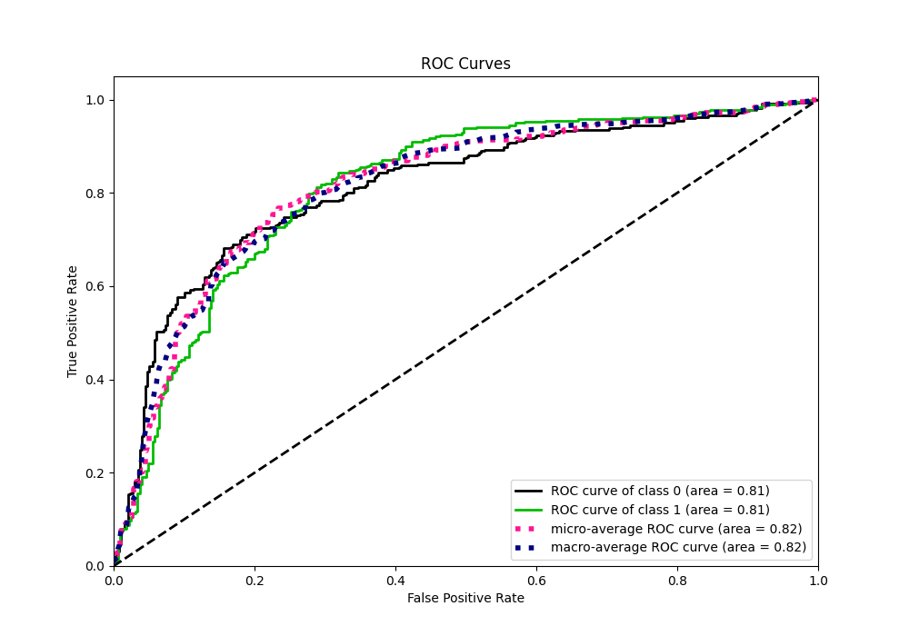
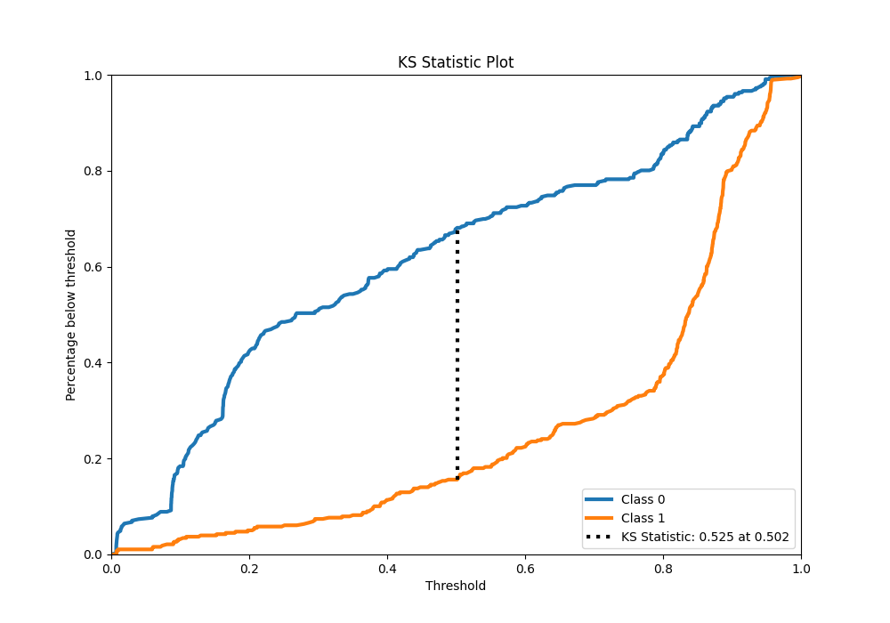
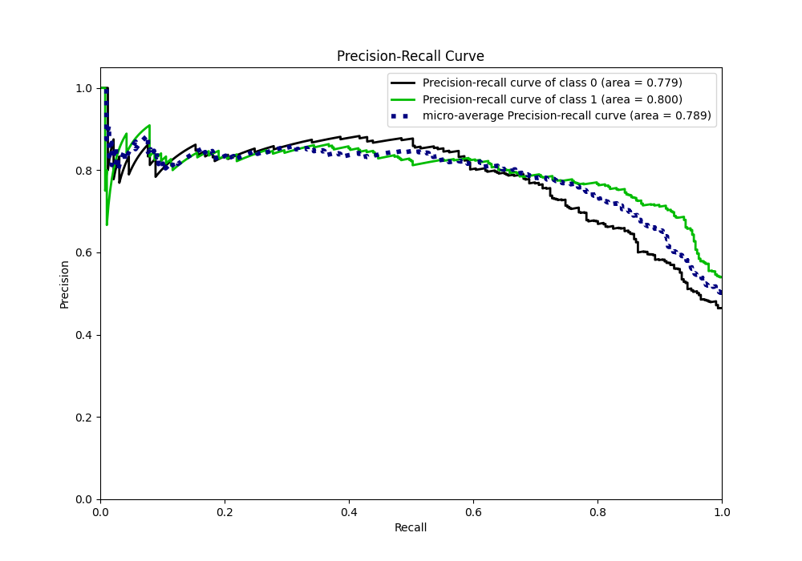
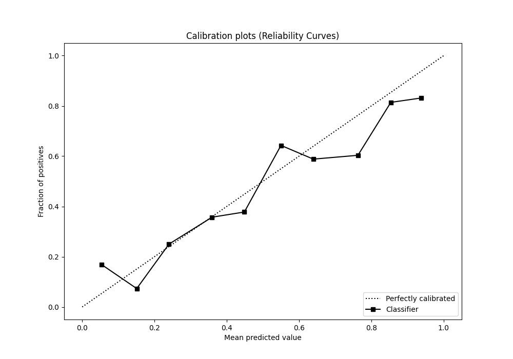
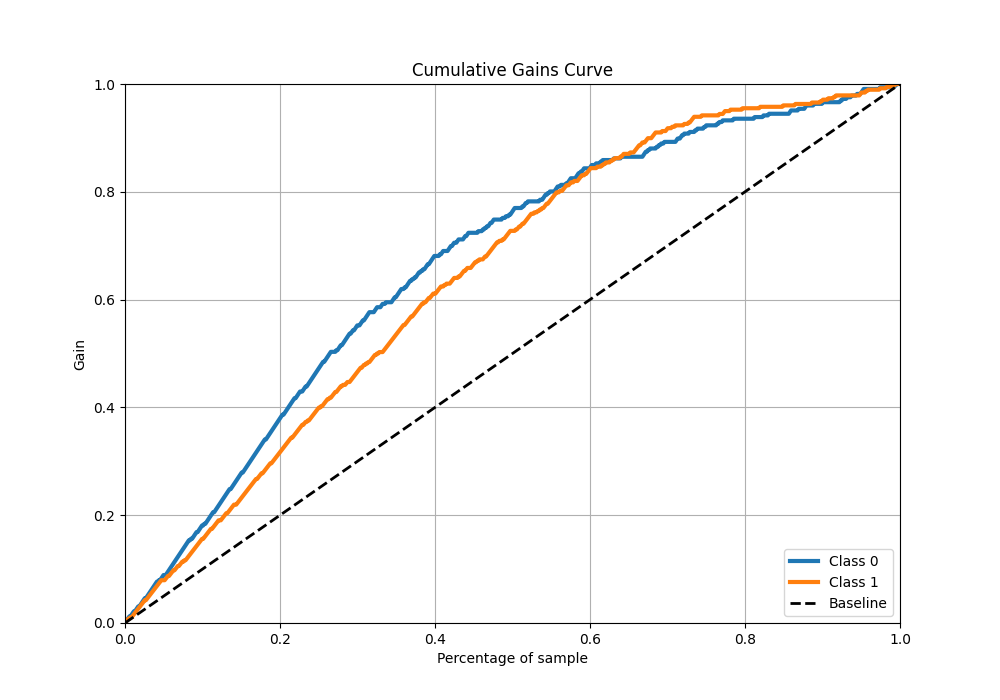
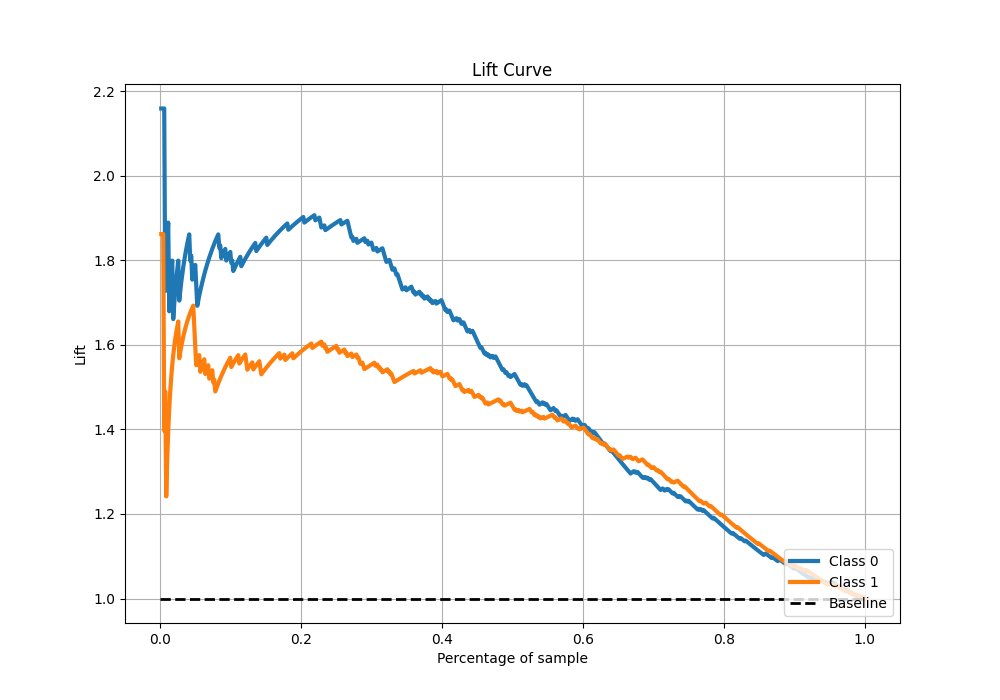

# Summary of Ensemble

[<< Go back](../README.md)

## Ensemble structure
| Model                   |   Weight |
|:------------------------|---------:|
| 1_DecisionTree          |        1 |
| 2_Default_NeuralNetwork |        1 |

## Metric details
|           |    score |    threshold |
|:----------|---------:|-------------:|
| logloss   | 0.547489 | nan          |
| auc       | 0.814547 | nan          |
| f1        | 0.795848 |   0.370041   |
| accuracy  | 0.767045 |   0.50271    |
| precision | 0.860927 |   0.872745   |
| recall    | 1        |   0.00642859 |
| mcc       | 0.531645 |   0.501272   |

## Confusion matrix (at threshold=0.50271)
|              |   Predicted as 0 |   Predicted as 1 |
|:-------------|-----------------:|-----------------:|
| Labeled as 0 |              222 |              104 |
| Labeled as 1 |               60 |              318 |

## Learning curves

## Confusion Matrix

## Normalized Confusion Matrix

## ROC Curve

## Kolmogorov-Smirnov Statistic

## Precision-Recall Curve

## Calibration Curve

## Cumulative Gains Curve

## Lift Curve

[<< Go back](../README.md)
