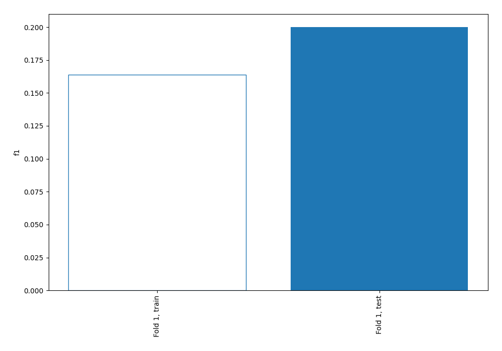
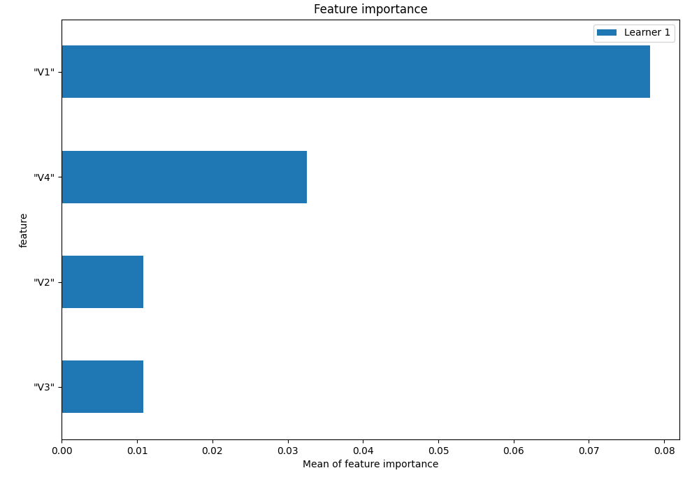
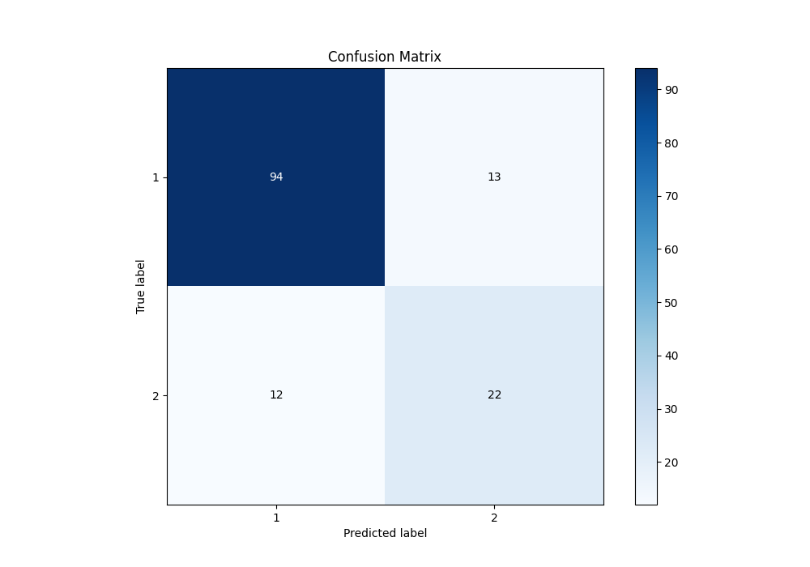
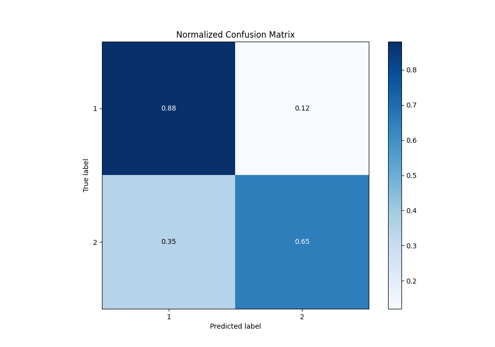
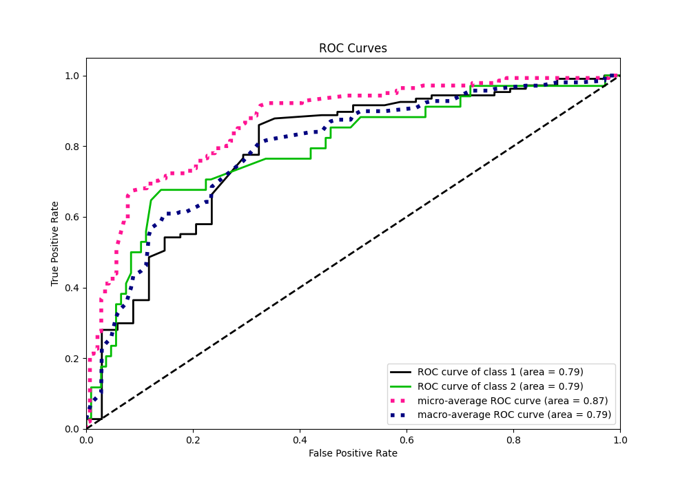
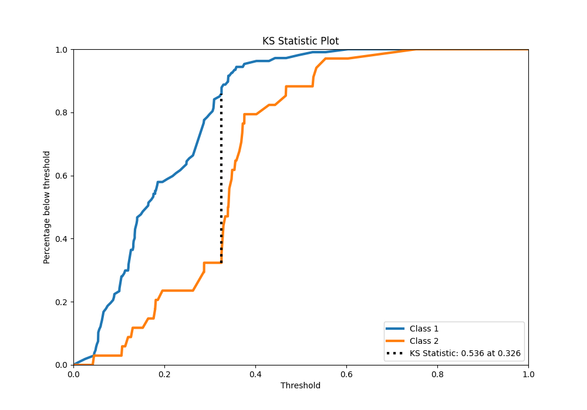
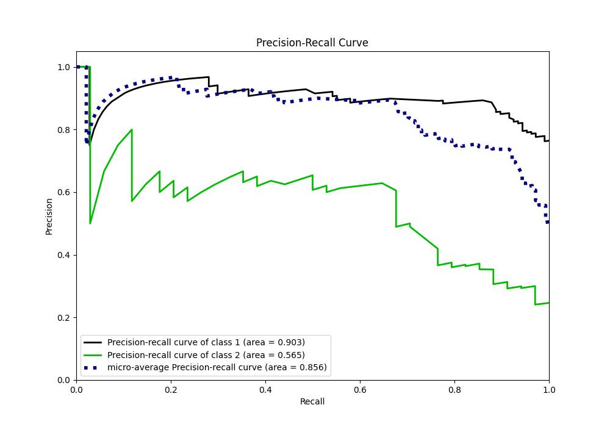
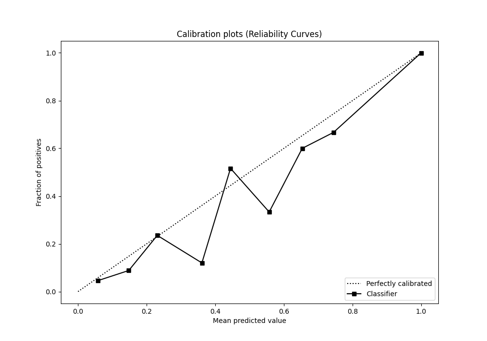
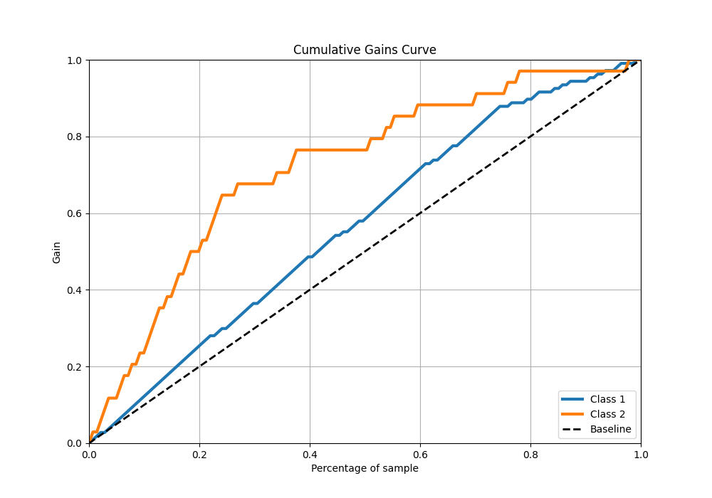
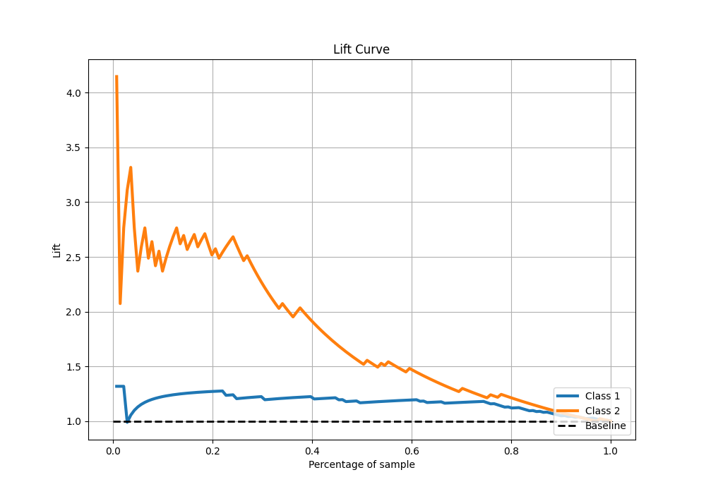

# Summary of 2_Linear

[<< Go back](../README.md)

## Logistic Regression (Linear)
- **n_jobs**: -1
- **explain_level**: 1

## Validation
 - **validation_type**: split
 - **train_ratio**: 0.75
 - **shuffle**: True
 - **stratify**: True

## Optimized metric
f1

## Training time

1.0 seconds

## Metric details
|           |    score |   threshold |
|:----------|---------:|------------:|
| logloss   | 0.468986 |  nan        |
| auc       | 0.790269 |  nan        |
| f1        | 0.637681 |    0.329274 |
| accuracy  | 0.822695 |    0.329274 |
| precision | 0.65     |    0.354606 |
| recall    | 1        |    0.011172 |
| mcc       | 0.520439 |    0.329274 |

## Confusion matrix (at threshold=0.329274)
|              |   Predicted as 1 |   Predicted as 2 |
|:-------------|-----------------:|-----------------:|
| Labeled as 1 |               94 |               13 |
| Labeled as 2 |               12 |               22 |

## Learning curves

## Coefficients
| feature   |   Learner_1 |
|:----------|------------:|
| "V2"      |    0.335591 |
| "V3"      |    0.335591 |
| "V4"      |   -0.339196 |
| "V1"      |   -0.708889 |
| intercept |   -1.32604  |

## Permutation-based Importance

## Confusion Matrix

## Normalized Confusion Matrix

## ROC Curve

## Kolmogorov-Smirnov Statistic

## Precision-Recall Curve

## Calibration Curve

## Cumulative Gains Curve

## Lift Curve

[<< Go back](../README.md)
