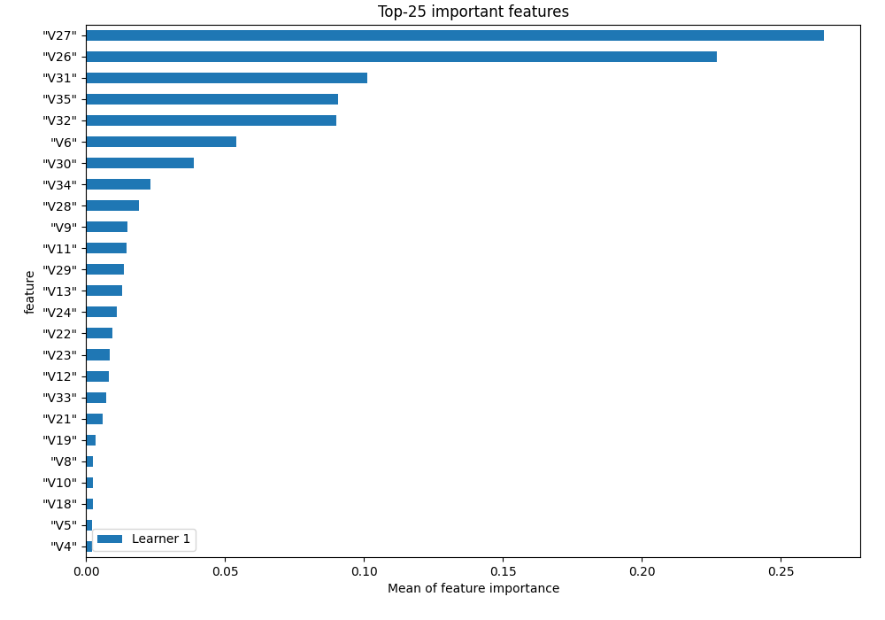
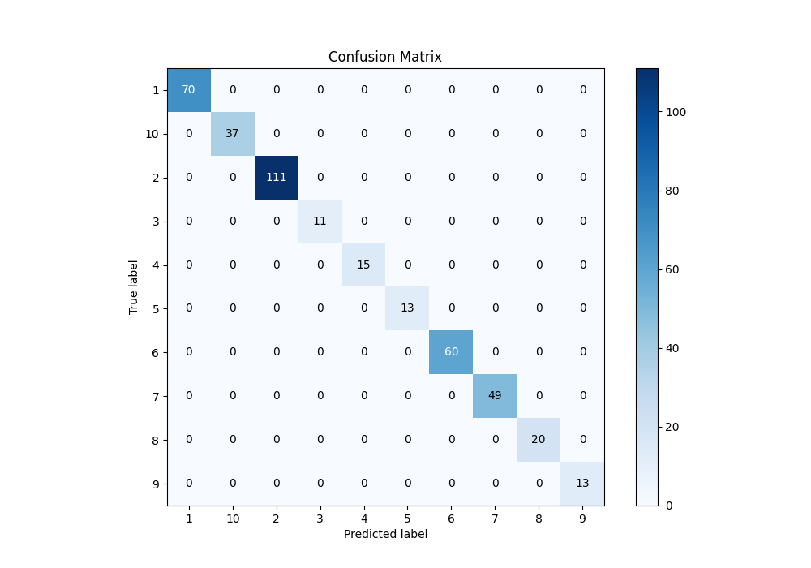
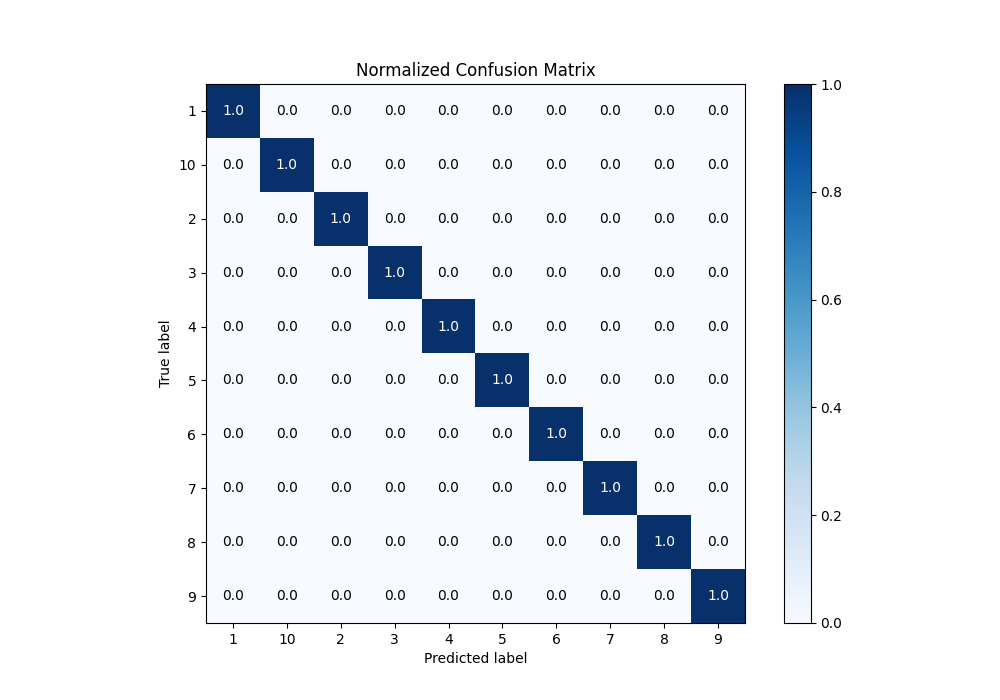
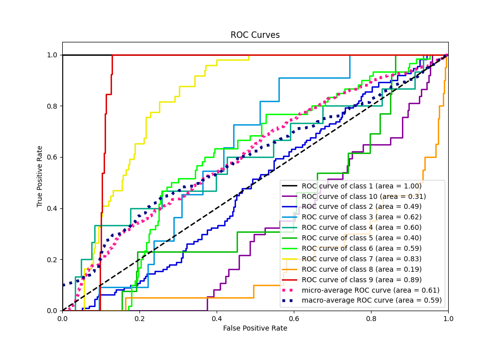
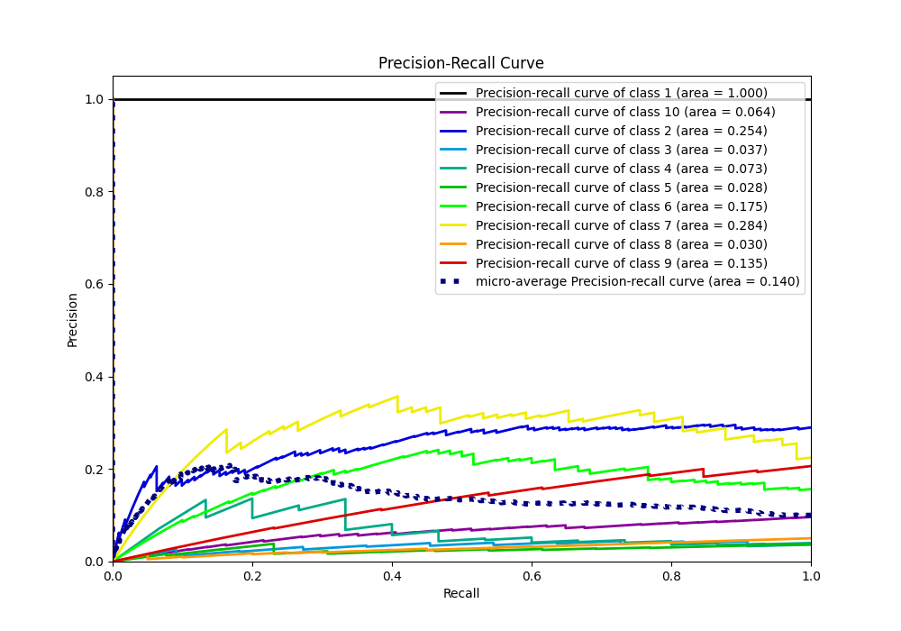

# Summary of 2_Linear

[<< Go back](../README.md)

## Logistic Regression (Linear)
- **n_jobs**: -1
- **num_class**: 10
- **explain_level**: 1

## Validation
 - **validation_type**: split
 - **train_ratio**: 0.75
 - **shuffle**: True
 - **stratify**: True

## Optimized metric
f1

## Training time

0.7 seconds

### Metric details
|           |   1 |   2 |   3 |   4 |   5 |   6 |   7 |   8 |   9 |   10 |   accuracy |   macro avg |   weighted avg |   logloss |
|:----------|----:|----:|----:|----:|----:|----:|----:|----:|----:|-----:|-----------:|------------:|---------------:|----------:|
| precision |   1 |   1 |   1 |   1 |   1 |   1 |   1 |   1 |   1 |    1 |          1 |           1 |              1 | 0.0281735 |
| recall    |   1 |   1 |   1 |   1 |   1 |   1 |   1 |   1 |   1 |    1 |          1 |           1 |              1 | 0.0281735 |
| f1-score  |   1 |   1 |   1 |   1 |   1 |   1 |   1 |   1 |   1 |    1 |          1 |           1 |              1 | 0.0281735 |
| support   |  70 | 111 |  11 |  15 |  13 |  60 |  49 |  20 |  13 |   37 |          1 |         399 |            399 | 0.0281735 |

## Confusion matrix
|               |   Predicted as 1 |   Predicted as 2 |   Predicted as 3 |   Predicted as 4 |   Predicted as 5 |   Predicted as 6 |   Predicted as 7 |   Predicted as 8 |   Predicted as 9 |   Predicted as 10 |
|:--------------|-----------------:|-----------------:|-----------------:|-----------------:|-----------------:|-----------------:|-----------------:|-----------------:|-----------------:|------------------:|
| Labeled as 1  |               70 |                0 |                0 |                0 |                0 |                0 |                0 |                0 |                0 |                 0 |
| Labeled as 2  |                0 |              111 |                0 |                0 |                0 |                0 |                0 |                0 |                0 |                 0 |
| Labeled as 3  |                0 |                0 |               11 |                0 |                0 |                0 |                0 |                0 |                0 |                 0 |
| Labeled as 4  |                0 |                0 |                0 |               15 |                0 |                0 |                0 |                0 |                0 |                 0 |
| Labeled as 5  |                0 |                0 |                0 |                0 |               13 |                0 |                0 |                0 |                0 |                 0 |
| Labeled as 6  |                0 |                0 |                0 |                0 |                0 |               60 |                0 |                0 |                0 |                 0 |
| Labeled as 7  |                0 |                0 |                0 |                0 |                0 |                0 |               49 |                0 |                0 |                 0 |
| Labeled as 8  |                0 |                0 |                0 |                0 |                0 |                0 |                0 |               20 |                0 |                 0 |
| Labeled as 9  |                0 |                0 |                0 |                0 |                0 |                0 |                0 |                0 |               13 |                 0 |
| Labeled as 10 |                0 |                0 |                0 |                0 |                0 |                0 |                0 |                0 |                0 |                37 |

## Learning curves

## Coefficients

### Coefficients learner #1
|           |          1 |           2 |           3 |            4 |            5 |          6 |          7 |           8 |            9 |           10 |
|:----------|-----------:|------------:|------------:|-------------:|-------------:|-----------:|-----------:|------------:|-------------:|-------------:|
| intercept |  0.974436  |  1.92453    | -0.418994   | -0.357468    | -0.0347627   |  1.28254   |  0.59113   | -1.62024    | -1.8688      | -0.47238     |
| "V1"      |  0.0546426 |  0.007341   | -0.348363   |  0.0860142   | -0.0527555   |  0.144301  |  0.130769  | -0.122668   | -0.00333492  |  0.104053    |
| "V2"      | -0.0809877 | -0.140238   |  0.195712   |  0.0893938   | -0.245873    |  0.113523  |  0.162776  |  0.162709   | -0.0479346   | -0.209079    |
| "V3"      |  0.0374203 |  0.249529   | -0.215397   | -0.104923    |  0.127455    |  0.223522  | -0.0800415 |  0.0699092  | -0.205647    | -0.101826    |
| "V4"      |  0.133638  | -0.0224072  |  0.0137912  | -0.58151     | -0.274334    | -0.123548  |  0.0871849 |  0.230021   |  0.243781    |  0.293382    |
| "V5"      |  0.133638  | -0.0224072  |  0.0137912  | -0.58151     | -0.274334    | -0.123548  |  0.0871849 |  0.230021   |  0.243781    |  0.293382    |
| "V6"      | -0.441746  |  1.09139    | -0.511616   |  1.22157     | -0.417002    |  0.796772  | -0.966743  | -0.328453   | -0.135605    | -0.308572    |
| "V7"      | -0.0951478 |  0.00557862 | -0.266119   |  0.104016    |  0.0518098   |  0.0620048 | -0.0755771 |  0.149443   |  0.0540468   |  0.00994383  |
| "V8"      |  0.181162  |  0.0516915  | -0.199356   |  0.111689    | -0.0870977   |  0.343838  |  0.313616  |  0.0869111  | -0.533108    | -0.269345    |
| "V9"      | -0.111689  | -0.0732503  | -0.515696   | -0.508261    |  0.2933      | -0.437917  | -0.548698  |  0.170793   |  1.14649     |  0.584931    |
| "V10"     | -0.0728358 |  0.124448   |  0.258639   |  0.349288    | -0.334686    |  0.208226  |  0.258588  |  0.16515    | -0.396689    | -0.560129    |
| "V11"     |  0.143207  | -0.264011   | -0.381831   | -0.364931    |  0.0402706   | -0.360003  |  0.103618  | -0.151075   |  0.770171    |  0.464584    |
| "V12"     |  0.049464  |  0.0255946  |  0.713071   | -0.446661    |  0.141921    | -0.184353  | -0.251867  | -0.121497   | -0.136553    |  0.21088     |
| "V13"     | -0.243959  | -0.104275   | -0.397239   | -0.616652    | -0.239218    |  0.790704  |  0.79122   |  0.413645   | -0.174252    | -0.219973    |
| "V14"     | -0.004413  | -0.00478396 | -0.00270103 | -0.000118574 | -5.94635e-05 | -0.014267  | -0.0168907 |  0.0436603  | -0.000124498 | -0.000302123 |
| "V15"     | -0.230345  | -0.269092   | -0.163293   | -0.0492385   | -0.0637155   | -0.0308258 |  0.0138353 |  0.823211   |  0.0362559   | -0.0667921   |
| "V16"     | -0.115773  |  0.0379546  | -0.345347   |  0.0649909   | -0.157491    |  0.204067  |  0.286749  |  0.211416   | -0.0817278   | -0.10484     |
| "V17"     |  0.0229333 |  0.116671   |  0.332392   |  0.149863    |  0.345251    | -0.205839  | -0.450723  | -0.355778   | -0.0262576   |  0.0714866   |
| "V18"     | -0.213288  |  0.272949   | -0.204668   |  0.385777    |  0.223275    |  0.105529  | -0.11571   | -0.123676   | -0.219959    | -0.110229    |
| "V19"     | -0.123945  | -0.107829   |  0.419744   | -0.0708811   |  0.298552    | -0.027271  |  0.138121  |  0.0803171  | -0.473861    | -0.132947    |
| "V20"     |  0.0497132 |  0.108935   | -0.13695    | -0.163996    | -0.0256202   | -0.0123477 |  0.169142  |  0.214932   | -0.141401    | -0.0624072   |
| "V21"     | -0.0781801 |  0.00864337 | -0.154103   |  0.497351    |  0.498108    | -0.0210603 |  0.0528119 | -0.636506   | -0.165163    | -0.0019027   |
| "V22"     | -0.0917235 | -0.103147   | -0.0620392  |  0.647208    |  0.50797     | -0.0444607 | -0.0353074 | -0.790471   | -0.0285828   |  0.000553949 |
| "V23"     |  0.0610403 |  0.0300907  | -0.0905987  |  0.665386    |  0.522212    |  0.0691508 | -0.363981  | -0.703683   | -0.145148    | -0.0444698   |
| "V24"     | -0.48805   | -0.0971979  | -0.428233   |  0.237244    | -0.15623     |  0.404595  |  0.166624  |  0.724574   | -0.0199469   | -0.343379    |
| "V25"     | -0.151531  | -0.204736   |  0.00167634 |  0.339252    | -0.177208    |  0.0755893 |  0.119587  | -0.0443476  |  0.0334356   |  0.0082818   |
| "V26"     |  4.27328   | -0.667761   | -0.677484   | -0.120165    | -0.61546     | -0.353139  | -0.504742  | -0.0878457  | -0.461007    | -0.785681    |
| "V27"     | -0.684257  |  4.27886    | -0.479343   | -0.800486    | -0.503147    | -0.808448  | -0.460654  | -0.103979   | -0.0983393   | -0.340208    |
| "V28"     | -0.65749   | -0.455507   |  2.41205    | -0.082214    | -0.237601    | -0.230895  | -0.36281   | -0.0472942  | -0.111678    | -0.226558    |
| "V29"     | -0.0803163 | -0.84241    | -0.0323703  |  1.77907     | -0.176034    | -0.576688  | -0.0479461 | -0.00362737 | -0.00310905  | -0.0165708   |
| "V30"     | -0.646996  | -0.461301   | -0.264699   | -0.196287    |  2.89608     | -0.123612  | -0.150375  | -0.00524421 | -0.395583    | -0.651984    |
| "V31"     | -0.357615  | -0.86946    | -0.281386   | -0.466085    | -0.135363    |  3.45531   | -0.835729  | -0.43317    | -0.0138635   | -0.0626385   |
| "V32"     | -0.462417  | -0.417599   | -0.336058   | -0.0719739   | -0.182557    | -0.875351  |  3.3202    | -0.722433   | -0.0641566   | -0.18765     |
| "V33"     | -0.0933641 | -0.107061   | -0.0641179  | -0.00508236  | -0.0169259   | -0.424654  | -0.739995  |  1.50131    | -0.0235719   | -0.0265387   |
| "V34"     | -0.459676  | -0.111219   | -0.0503495  | -0.00435475  | -0.339078    | -0.013221  | -0.0507153 | -0.070193   |  2.12302     | -1.02422     |
| "V35"     | -0.831532  | -0.34749    | -0.226402   | -0.0326161   | -0.689433    | -0.0497045 | -0.166761  | -0.0267292  | -0.9513      |  3.32197     |

## Permutation-based Importance

## Confusion Matrix

## Normalized Confusion Matrix

## ROC Curve

## Precision Recall Curve

[<< Go back](../README.md)
