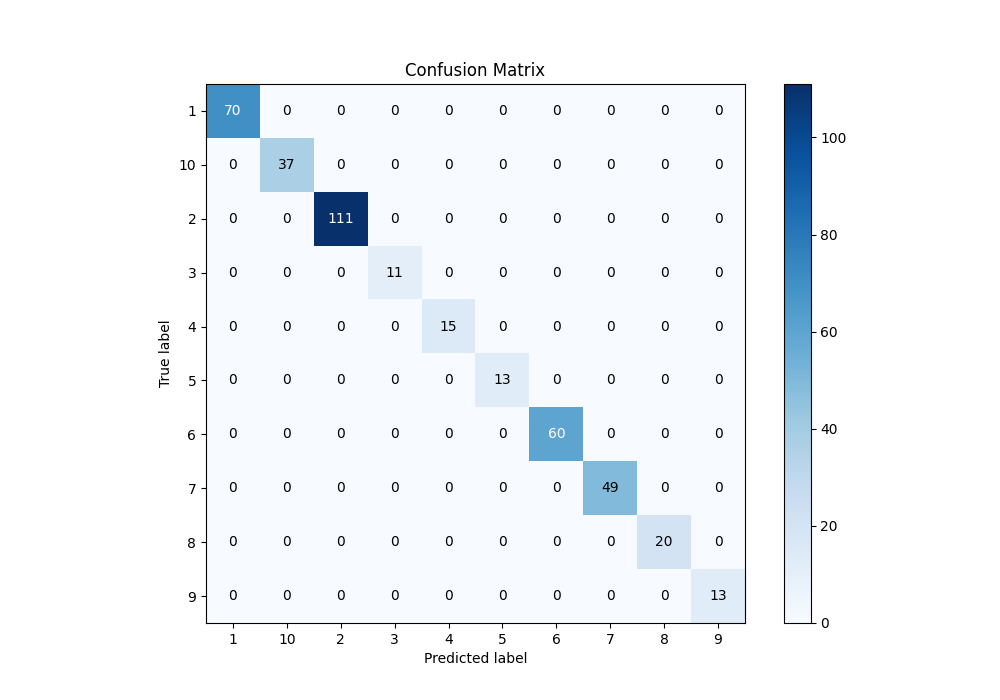
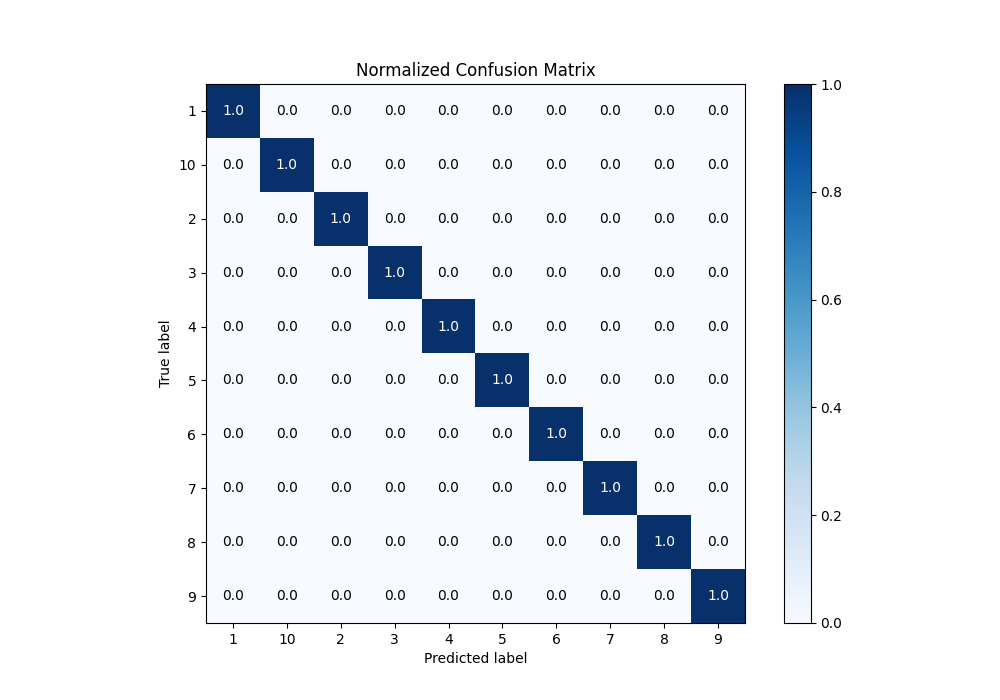
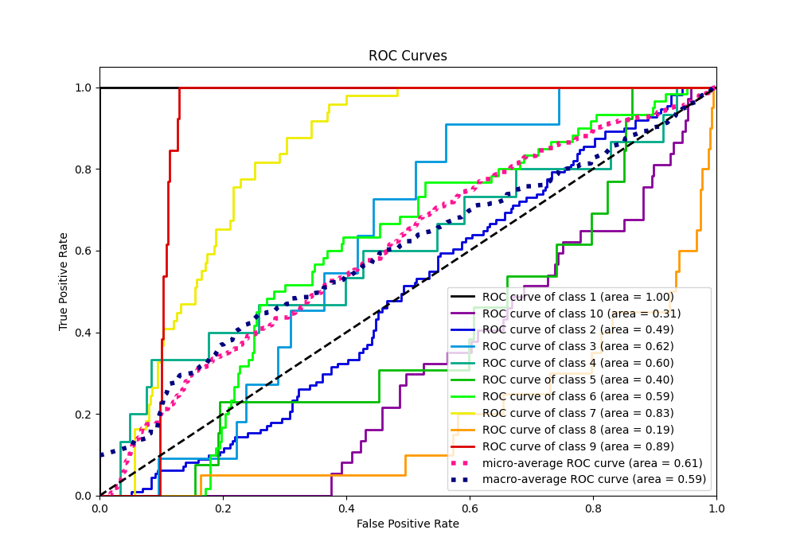
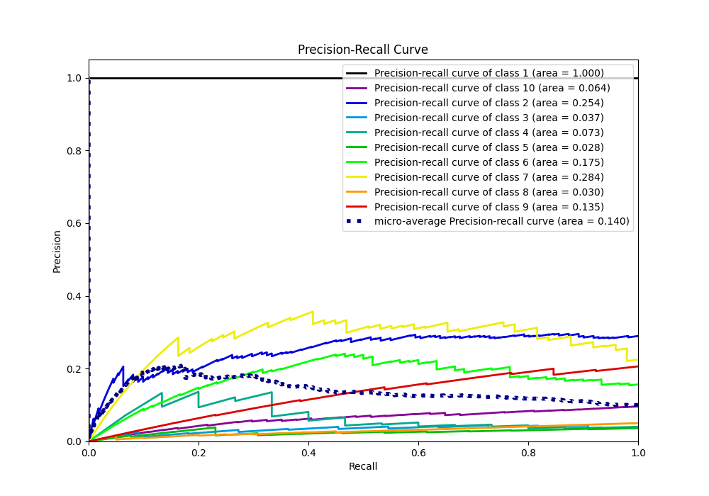

# Summary of Ensemble

[<< Go back](../README.md)

## Ensemble structure
| Model    |   Weight |
|:---------|---------:|
| 2_Linear |        1 |

### Metric details
|           |   1 |   2 |   3 |   4 |   5 |   6 |   7 |   8 |   9 |   10 |   accuracy |   macro avg |   weighted avg |   logloss |
|:----------|----:|----:|----:|----:|----:|----:|----:|----:|----:|-----:|-----------:|------------:|---------------:|----------:|
| precision |   1 |   1 |   1 |   1 |   1 |   1 |   1 |   1 |   1 |    1 |          1 |           1 |              1 | 0.0281735 |
| recall    |   1 |   1 |   1 |   1 |   1 |   1 |   1 |   1 |   1 |    1 |          1 |           1 |              1 | 0.0281735 |
| f1-score  |   1 |   1 |   1 |   1 |   1 |   1 |   1 |   1 |   1 |    1 |          1 |           1 |              1 | 0.0281735 |
| support   |  70 | 111 |  11 |  15 |  13 |  60 |  49 |  20 |  13 |   37 |          1 |         399 |            399 | 0.0281735 |

## Confusion matrix
|               |   Predicted as 1 |   Predicted as 2 |   Predicted as 3 |   Predicted as 4 |   Predicted as 5 |   Predicted as 6 |   Predicted as 7 |   Predicted as 8 |   Predicted as 9 |   Predicted as 10 |
|:--------------|-----------------:|-----------------:|-----------------:|-----------------:|-----------------:|-----------------:|-----------------:|-----------------:|-----------------:|------------------:|
| Labeled as 1  |               70 |                0 |                0 |                0 |                0 |                0 |                0 |                0 |                0 |                 0 |
| Labeled as 2  |                0 |              111 |                0 |                0 |                0 |                0 |                0 |                0 |                0 |                 0 |
| Labeled as 3  |                0 |                0 |               11 |                0 |                0 |                0 |                0 |                0 |                0 |                 0 |
| Labeled as 4  |                0 |                0 |                0 |               15 |                0 |                0 |                0 |                0 |                0 |                 0 |
| Labeled as 5  |                0 |                0 |                0 |                0 |               13 |                0 |                0 |                0 |                0 |                 0 |
| Labeled as 6  |                0 |                0 |                0 |                0 |                0 |               60 |                0 |                0 |                0 |                 0 |
| Labeled as 7  |                0 |                0 |                0 |                0 |                0 |                0 |               49 |                0 |                0 |                 0 |
| Labeled as 8  |                0 |                0 |                0 |                0 |                0 |                0 |                0 |               20 |                0 |                 0 |
| Labeled as 9  |                0 |                0 |                0 |                0 |                0 |                0 |                0 |                0 |               13 |                 0 |
| Labeled as 10 |                0 |                0 |                0 |                0 |                0 |                0 |                0 |                0 |                0 |                37 |

## Learning curves

## Confusion Matrix

## Normalized Confusion Matrix

## ROC Curve

## Precision Recall Curve

[<< Go back](../README.md)
