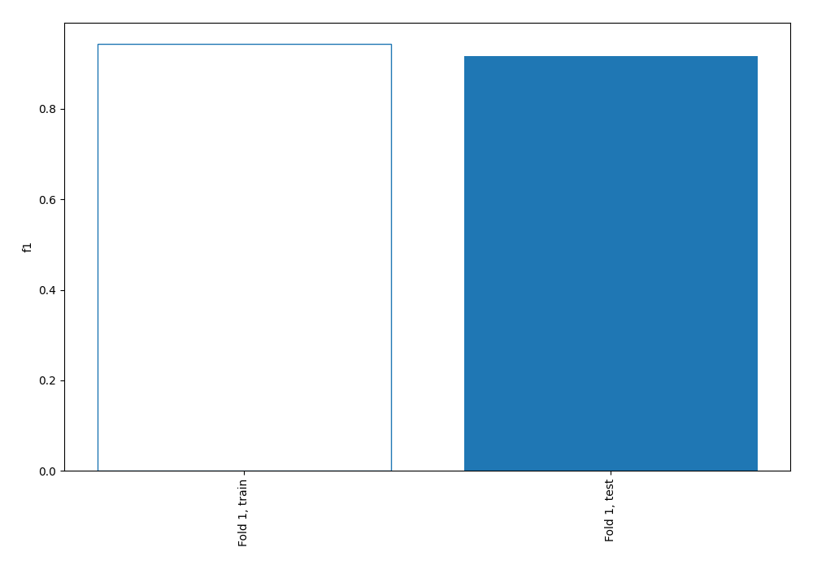
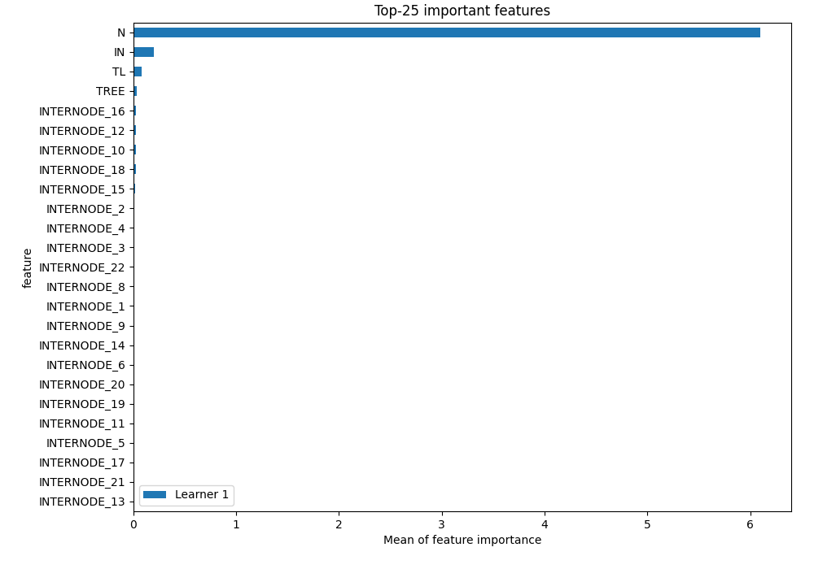
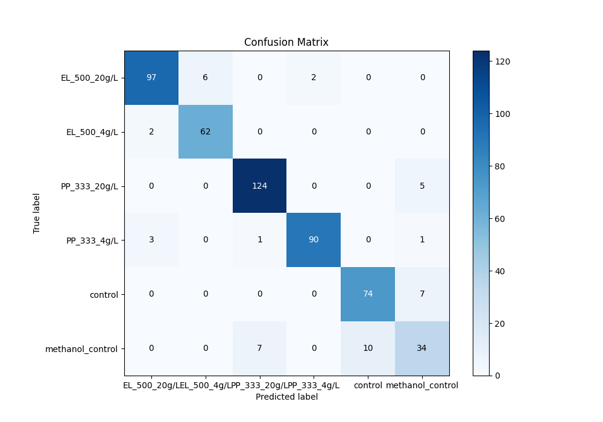
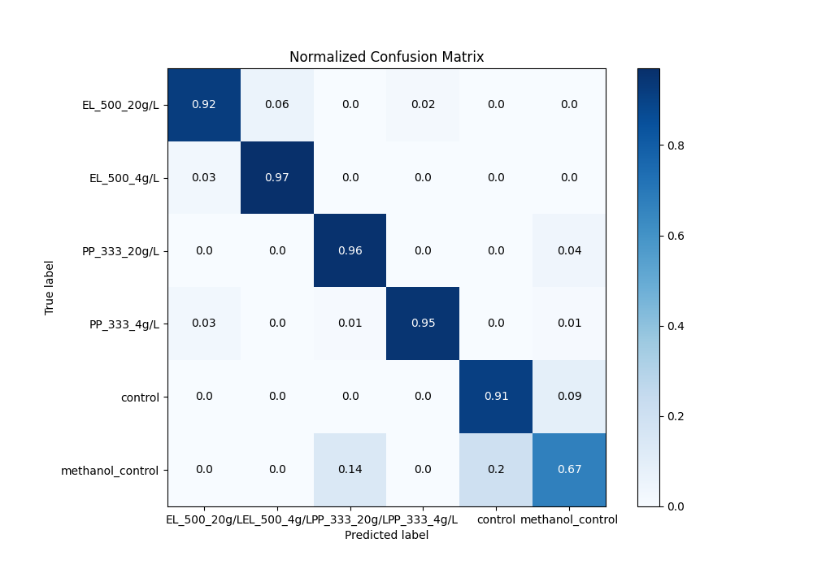
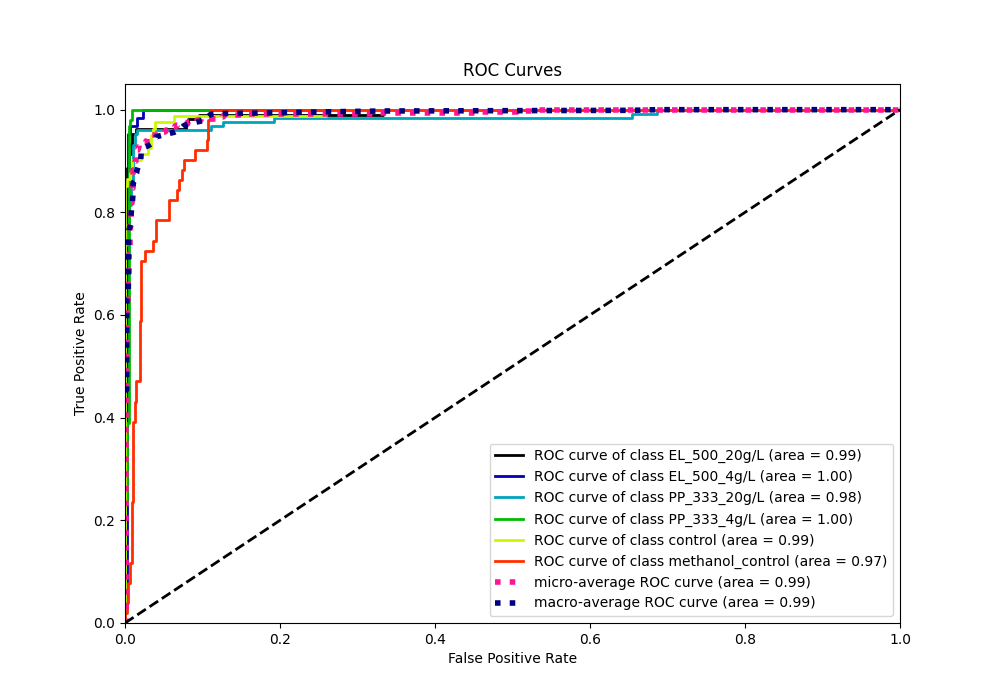
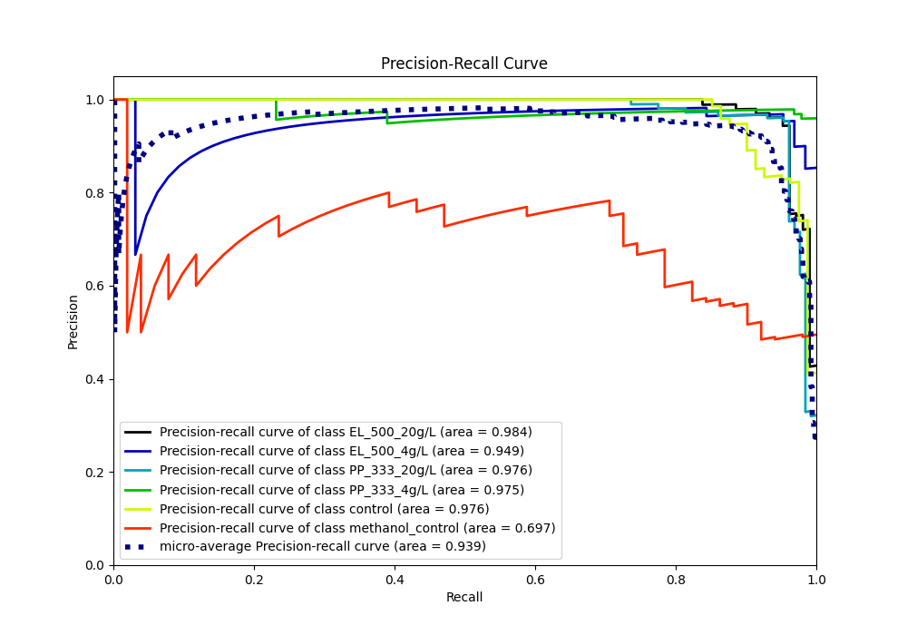

# Summary of 2_Linear

[<< Go back](../README.md)

## Logistic Regression (Linear)
- **n_jobs**: -1
- **num_class**: 6
- **explain_level**: 1

## Validation
 - **validation_type**: split
 - **train_ratio**: 0.75
 - **shuffle**: True
 - **stratify**: True

## Optimized metric
f1

## Training time

1.1 seconds

### Metric details
|           |   EL_500_20g/L |   EL_500_4g/L |   PP_333_20g/L |   PP_333_4g/L |   control |   methanol_control |   accuracy |   macro avg |   weighted avg |   logloss |
|:----------|---------------:|--------------:|---------------:|--------------:|----------:|-------------------:|-----------:|------------:|---------------:|----------:|
| precision |       0.95098  |      0.911765 |       0.939394 |      0.978261 |  0.880952 |           0.723404 |    0.91619 |    0.897459 |       0.915378 |  0.415254 |
| recall    |       0.92381  |      0.96875  |       0.96124  |      0.947368 |  0.91358  |           0.666667 |    0.91619 |    0.896903 |       0.91619  |  0.415254 |
| f1-score  |       0.937198 |      0.939394 |       0.950192 |      0.962567 |  0.89697  |           0.693878 |    0.91619 |    0.8967   |       0.915405 |  0.415254 |
| support   |     105        |     64        |     129        |     95        | 81        |          51        |    0.91619 |  525        |     525        |  0.415254 |

## Confusion matrix
|                             |   Predicted as EL_500_20g/L |   Predicted as EL_500_4g/L |   Predicted as PP_333_20g/L |   Predicted as PP_333_4g/L |   Predicted as control |   Predicted as methanol_control |
|:----------------------------|----------------------------:|---------------------------:|----------------------------:|---------------------------:|-----------------------:|--------------------------------:|
| Labeled as EL_500_20g/L     |                          97 |                          6 |                           0 |                          2 |                      0 |                               0 |
| Labeled as EL_500_4g/L      |                           2 |                         62 |                           0 |                          0 |                      0 |                               0 |
| Labeled as PP_333_20g/L     |                           0 |                          0 |                         124 |                          0 |                      0 |                               5 |
| Labeled as PP_333_4g/L      |                           3 |                          0 |                           1 |                         90 |                      0 |                               1 |
| Labeled as control          |                           0 |                          0 |                           0 |                          0 |                     74 |                               7 |
| Labeled as methanol_control |                           0 |                          0 |                           7 |                          0 |                     10 |                              34 |

## Learning curves

## Coefficients

### Coefficients learner #1
|              |   EL_500_20g/L |   EL_500_4g/L |   PP_333_20g/L |   PP_333_4g/L |       control |   methanol_control |
|:-------------|---------------:|--------------:|---------------:|--------------:|--------------:|-------------------:|
| intercept    |    1.5874      |  -6.3493      |    4.14722     |    5.28474    |  -5.63748     |          0.967429  |
| N            |    7.07198     |  13.4044      |   -3.11793     |    1.8689     | -12.5069      |         -6.72049   |
| INTERNODE_29 |    0.000927803 |  -0.000504344 |    1.01057e-07 |   -0.0372255  |   0.000457941 |          0.036344  |
| TREE         |   -0.150318    |   0.387022    |   -0.0542285   |   -0.0999716  |   0.355886    |         -0.43839   |
| BR           |   -0.0195108   |   0.0933156   |   -0.114245    |    0.0258806  |   0.25583     |         -0.24127   |
| TL           |   -0.463744    |   0.000291298 |   -0.817999    |    0.381317   |   0.318009    |          0.582126  |
| IN           |    0.246236    |  -0.303459    |   -1.12165     |    0.0722482  |  -0.223072    |          1.3297    |
| INTERNODE_1  |    0.0945919   |  -0.642903    |    0.688027    |   -0.775599   |   0.426712    |          0.209171  |
| INTERNODE_2  |   -0.132118    |   0.160556    |   -0.228253    |   -0.00239027 |   0.0993997   |          0.102805  |
| INTERNODE_3  |   -0.0138927   |   0.124318    |   -0.22165     |    0.0477393  |   0.0245822   |          0.0389027 |
| INTERNODE_4  |    0.073386    |  -0.20664     |   -0.226426    |   -0.127563   |   0.262909    |          0.224334  |
| INTERNODE_5  |   -0.167878    |   0.0627642   |    0.0144318   |    0.0470482  |  -0.0783814   |          0.122016  |
| INTERNODE_6  |    0.0390515   |   0.0781836   |   -0.202066    |    0.0147789  |  -0.0025367   |          0.0725885 |
| INTERNODE_7  |    0.055563    |  -0.0180187   |    0.00592432  |   -0.153829   |  -0.045629    |          0.155989  |
| INTERNODE_8  |    0.395366    |  -0.0388494   |   -0.0328554   |    0.0230208  |  -0.329411    |         -0.0172718 |
| INTERNODE_9  |   -0.267766    |   0.283827    |   -0.242956    |    0.0294909  |   0.0580511   |          0.139353  |
| INTERNODE_10 |    0.320887    |  -0.320501    |   -0.0912046   |   -0.191799   |   0.077016    |          0.205601  |
| INTERNODE_11 |    0.113383    |  -0.327712    |    0.229754    |   -0.0987266  |   0.00880709  |          0.0744952 |
| INTERNODE_12 |   -0.417525    |  -0.0134365   |   -0.348301    |    0.160885   |   0.237249    |          0.381129  |
| INTERNODE_13 |    0.0103304   |  -0.0352574   |    0.0408219   |    0.0795215  |  -0.132901    |          0.0374846 |
| INTERNODE_14 |   -0.22974     |   0.197343    |   -0.203634    |    0.0275784  |   0.0558782   |          0.152574  |
| INTERNODE_15 |   -0.221425    |   0.351057    |    0.218153    |   -0.326236   |   0.21113     |         -0.232679  |
| INTERNODE_16 |    0.106311    |  -0.518013    |   -0.561798    |    0.170159   |   0.0745497   |          0.728792  |
| INTERNODE_17 |    0.0029965   |  -0.0388441   |    0.144438    |    0.0829111  |  -0.145791    |         -0.0457109 |
| INTERNODE_18 |   -0.0830195   |  -0.164325    |   -0.277934    |    0.151934   |  -0.0128713   |          0.386216  |
| INTERNODE_19 |    0.102801    |  -0.038928    |   -0.242504    |    0.131084   |  -0.0838347   |          0.131382  |
| INTERNODE_20 |   -0.124198    |   0.100885    |   -0.376159    |   -0.188184   |   0.401441    |          0.186216  |
| INTERNODE_21 |    0.083749    |  -0.218088    |    0.626142    |   -0.120857   |  -0.3324      |         -0.0385468 |
| INTERNODE_22 |   -0.107537    |   0.100102    |   -0.635308    |    0.278415   |   0.155576    |          0.208753  |
| INTERNODE_23 |    0.0485751   |  -0.0985409   |    0.091785    |   -0.0684426  |   0.000770349 |          0.0258531 |
| INTERNODE_24 |    0.0485751   |  -0.0985409   |    0.091785    |   -0.0684426  |   0.000770349 |          0.0258531 |
| INTERNODE_25 |    0.0117108   |  -0.0320357   |   -4.17835e-06 |    0.00338827 |   0.000588559 |          0.0163522 |
| INTERNODE_26 |    0.000927803 |  -0.000504344 |    1.01057e-07 |   -0.0372255  |   0.000457941 |          0.036344  |
| INTERNODE_27 |    0.000927803 |  -0.000504344 |    1.01057e-07 |   -0.0372255  |   0.000457941 |          0.036344  |
| INTERNODE_28 |    0.000927803 |  -0.000504344 |    1.01057e-07 |   -0.0372255  |   0.000457941 |          0.036344  |

## Permutation-based Importance

## Confusion Matrix

## Normalized Confusion Matrix

## ROC Curve

## Precision Recall Curve

[<< Go back](../README.md)
