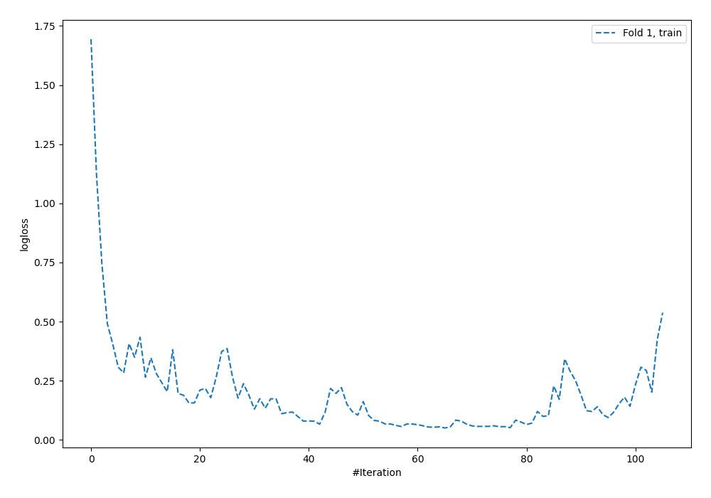
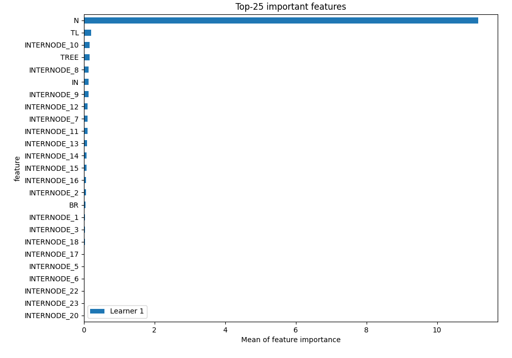
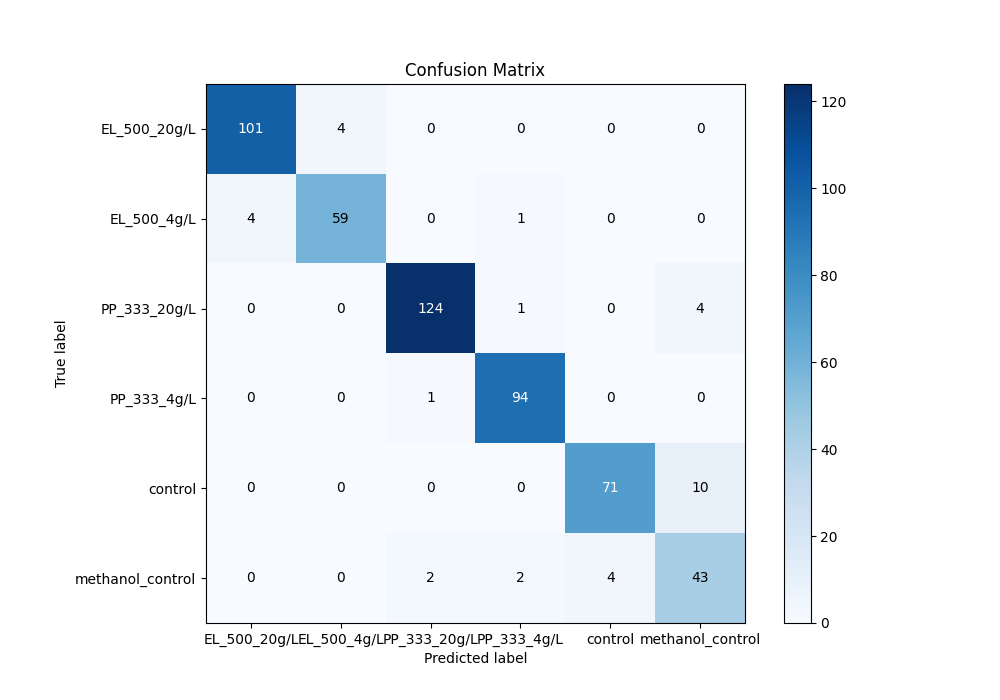
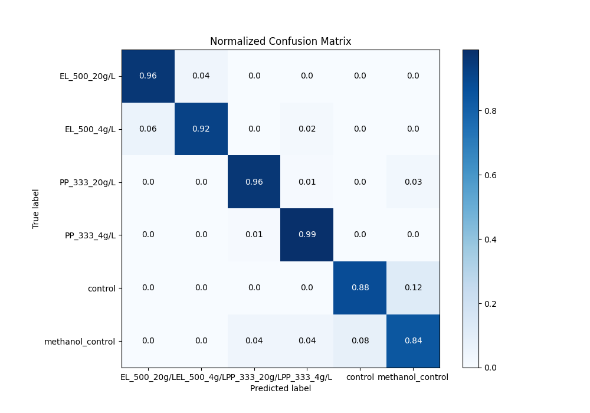
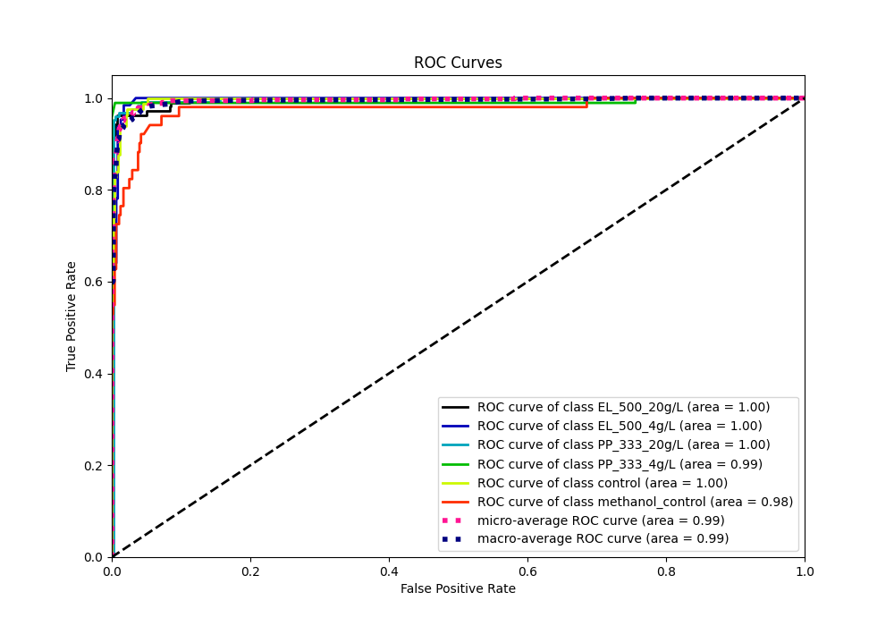

# Summary of 3_Default_NeuralNetwork

[<< Go back](../README.md)

## Neural Network
- **n_jobs**: -1
- **dense_1_size**: 32
- **dense_2_size**: 16
- **learning_rate**: 0.05
- **num_class**: 6
- **explain_level**: 1

## Validation
 - **validation_type**: split
 - **train_ratio**: 0.75
 - **shuffle**: True
 - **stratify**: True

## Optimized metric
f1

## Training time

1.6 seconds

### Metric details
|           |   EL_500_20g/L |   EL_500_4g/L |   PP_333_20g/L |   PP_333_4g/L |   control |   methanol_control |   accuracy |   macro avg |   weighted avg |   logloss |
|:----------|---------------:|--------------:|---------------:|--------------:|----------:|-------------------:|-----------:|------------:|---------------:|----------:|
| precision |       0.961905 |      0.936508 |       0.976378 |      0.959184 |  0.946667 |           0.754386 |   0.937143 |    0.922504 |       0.939363 |  0.239453 |
| recall    |       0.961905 |      0.921875 |       0.96124  |      0.989474 |  0.876543 |           0.843137 |   0.937143 |    0.925696 |       0.937143 |  0.239453 |
| f1-score  |       0.961905 |      0.929134 |       0.96875  |      0.974093 |  0.910256 |           0.796296 |   0.937143 |    0.923406 |       0.937741 |  0.239453 |
| support   |     105        |     64        |     129        |     95        | 81        |          51        |   0.937143 |  525        |     525        |  0.239453 |

## Confusion matrix
|                             |   Predicted as EL_500_20g/L |   Predicted as EL_500_4g/L |   Predicted as PP_333_20g/L |   Predicted as PP_333_4g/L |   Predicted as control |   Predicted as methanol_control |
|:----------------------------|----------------------------:|---------------------------:|----------------------------:|---------------------------:|-----------------------:|--------------------------------:|
| Labeled as EL_500_20g/L     |                         101 |                          4 |                           0 |                          0 |                      0 |                               0 |
| Labeled as EL_500_4g/L      |                           4 |                         59 |                           0 |                          1 |                      0 |                               0 |
| Labeled as PP_333_20g/L     |                           0 |                          0 |                         124 |                          1 |                      0 |                               4 |
| Labeled as PP_333_4g/L      |                           0 |                          0 |                           1 |                         94 |                      0 |                               0 |
| Labeled as control          |                           0 |                          0 |                           0 |                          0 |                     71 |                              10 |
| Labeled as methanol_control |                           0 |                          0 |                           2 |                          2 |                      4 |                              43 |

## Learning curves

## Permutation-based Importance

## Confusion Matrix

## Normalized Confusion Matrix

## ROC Curve

## Precision Recall Curve

[<< Go back](../README.md)
