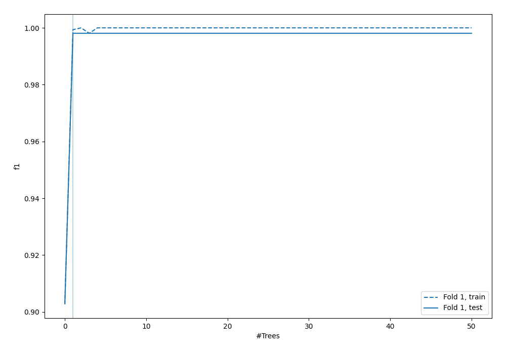
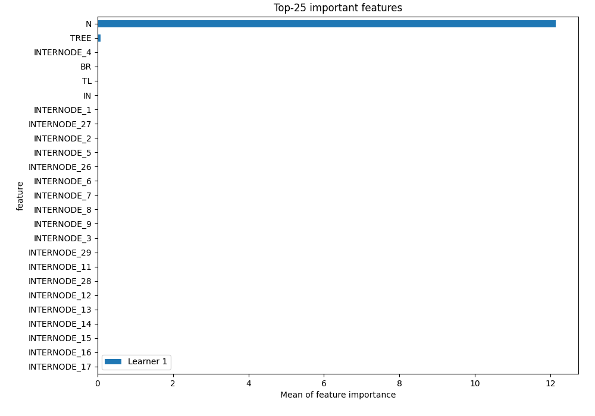
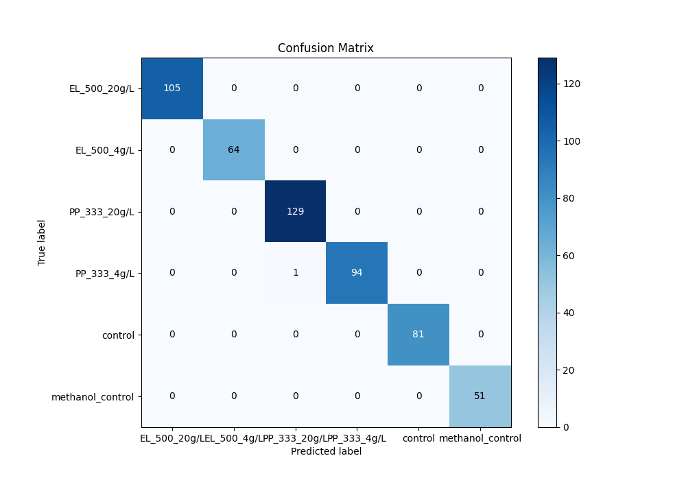
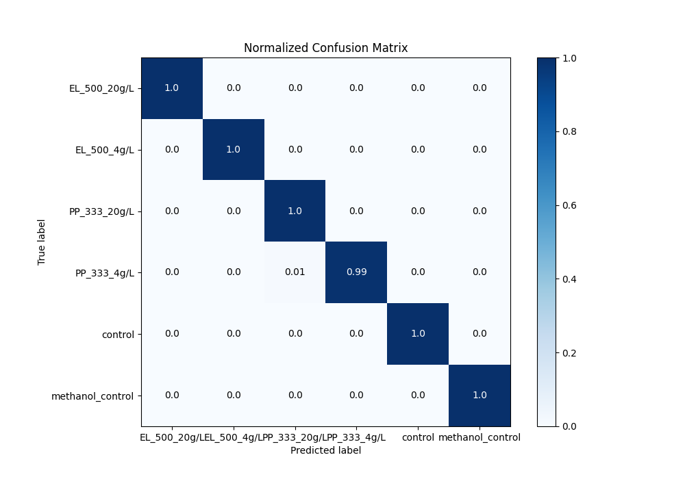
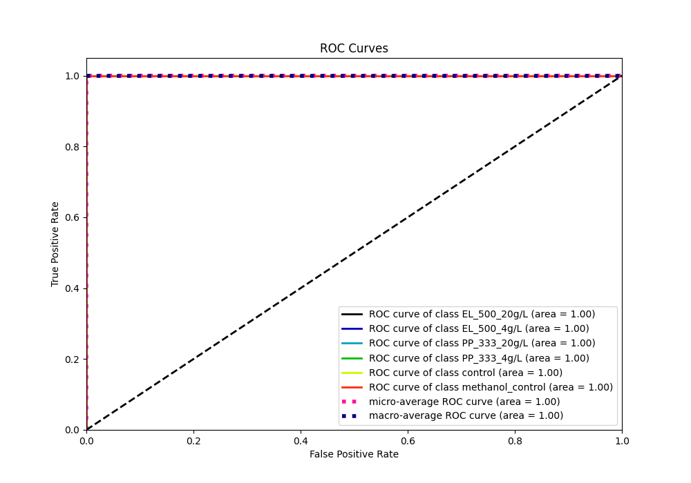
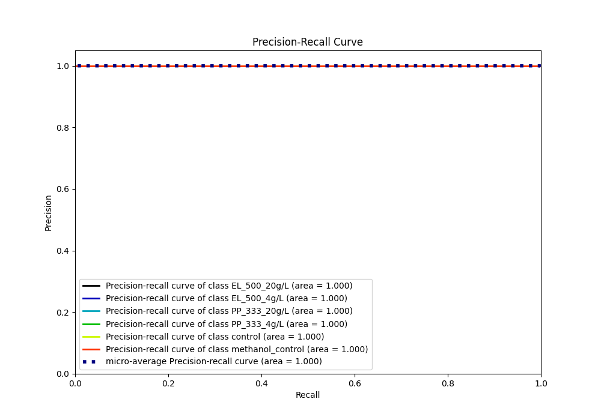

# Summary of 4_Default_RandomForest

[<< Go back](../README.md)

## Random Forest
- **n_jobs**: -1
- **criterion**: gini
- **max_features**: 0.9
- **min_samples_split**: 30
- **max_depth**: 4
- **eval_metric_name**: f1
- **num_class**: 6
- **explain_level**: 1

## Validation
 - **validation_type**: split
 - **train_ratio**: 0.75
 - **shuffle**: True
 - **stratify**: True

## Optimized metric
f1

## Training time

1.5 seconds

### Metric details
|           |   EL_500_20g/L |   EL_500_4g/L |   PP_333_20g/L |   PP_333_4g/L |   control |   methanol_control |   accuracy |   macro avg |   weighted avg |   logloss |
|:----------|---------------:|--------------:|---------------:|--------------:|----------:|-------------------:|-----------:|------------:|---------------:|----------:|
| precision |              1 |             1 |       0.992308 |      1        |         1 |                  1 |   0.998095 |    0.998718 |       0.99811  | 0.0691089 |
| recall    |              1 |             1 |       1        |      0.989474 |         1 |                  1 |   0.998095 |    0.998246 |       0.998095 | 0.0691089 |
| f1-score  |              1 |             1 |       0.996139 |      0.994709 |         1 |                  1 |   0.998095 |    0.998475 |       0.998094 | 0.0691089 |
| support   |            105 |            64 |     129        |     95        |        81 |                 51 |   0.998095 |  525        |     525        | 0.0691089 |

## Confusion matrix
|                             |   Predicted as EL_500_20g/L |   Predicted as EL_500_4g/L |   Predicted as PP_333_20g/L |   Predicted as PP_333_4g/L |   Predicted as control |   Predicted as methanol_control |
|:----------------------------|----------------------------:|---------------------------:|----------------------------:|---------------------------:|-----------------------:|--------------------------------:|
| Labeled as EL_500_20g/L     |                         105 |                          0 |                           0 |                          0 |                      0 |                               0 |
| Labeled as EL_500_4g/L      |                           0 |                         64 |                           0 |                          0 |                      0 |                               0 |
| Labeled as PP_333_20g/L     |                           0 |                          0 |                         129 |                          0 |                      0 |                               0 |
| Labeled as PP_333_4g/L      |                           0 |                          0 |                           1 |                         94 |                      0 |                               0 |
| Labeled as control          |                           0 |                          0 |                           0 |                          0 |                     81 |                               0 |
| Labeled as methanol_control |                           0 |                          0 |                           0 |                          0 |                      0 |                              51 |

## Learning curves

## Permutation-based Importance

## Confusion Matrix

## Normalized Confusion Matrix

## ROC Curve

## Precision Recall Curve

[<< Go back](../README.md)
