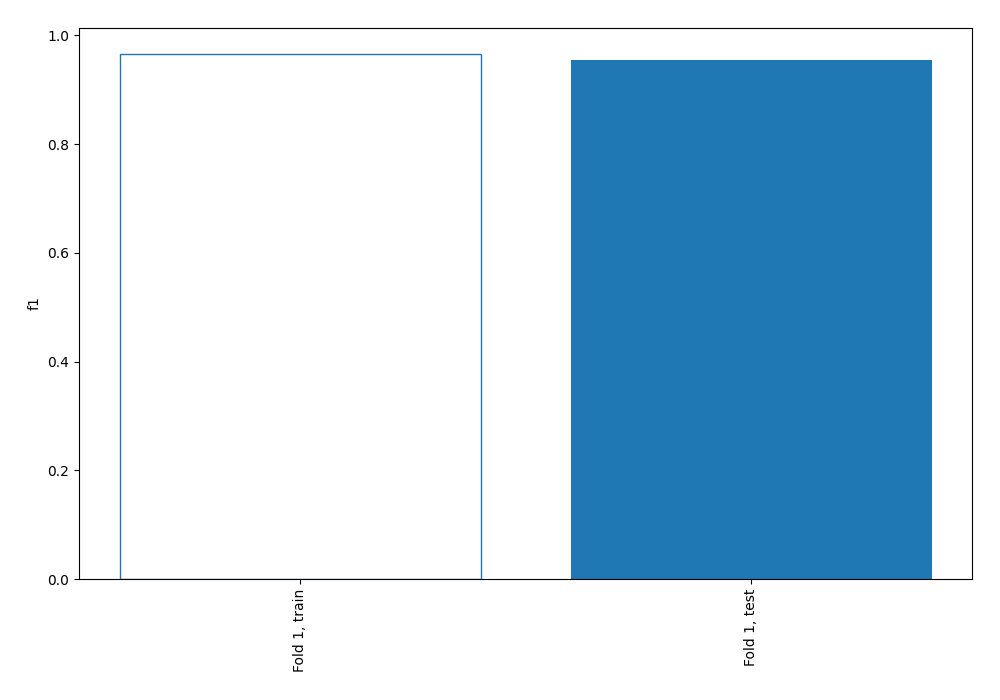
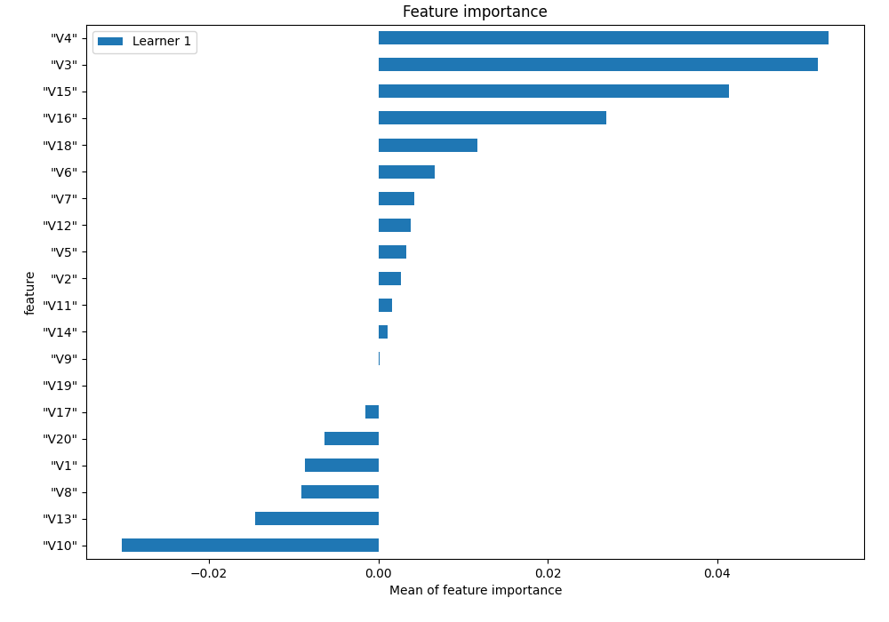
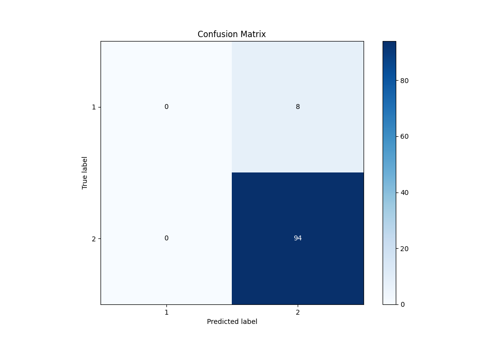
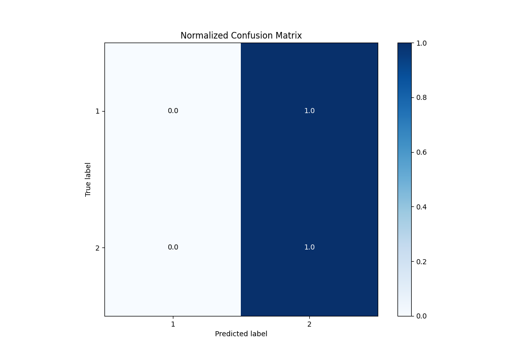
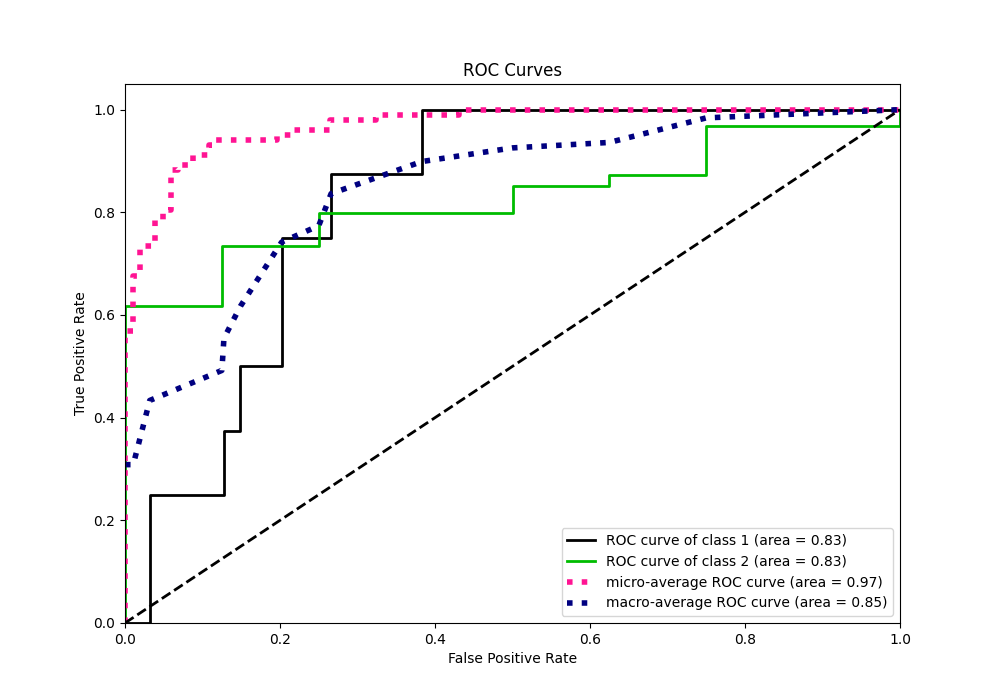
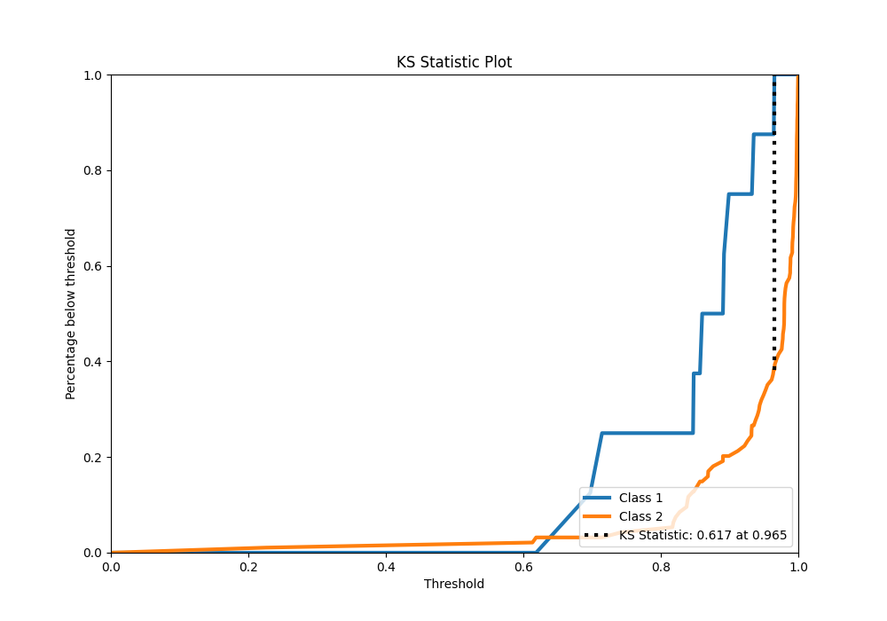
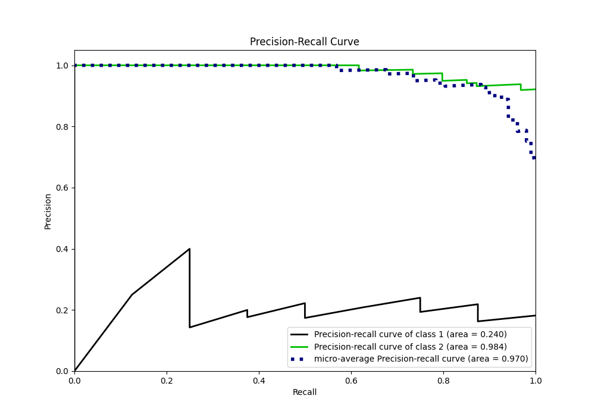
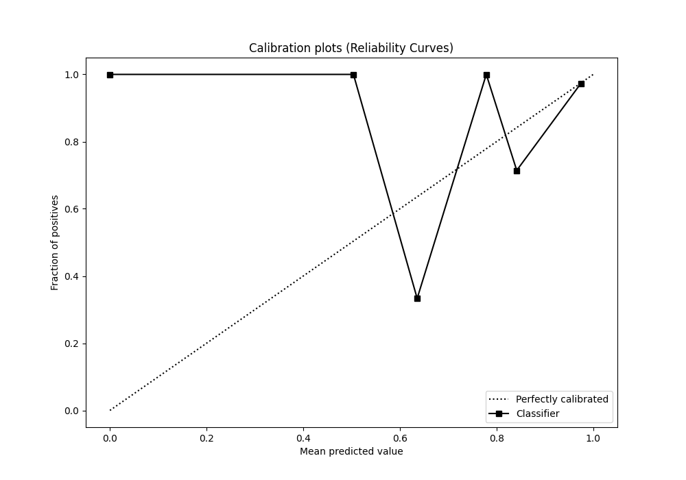
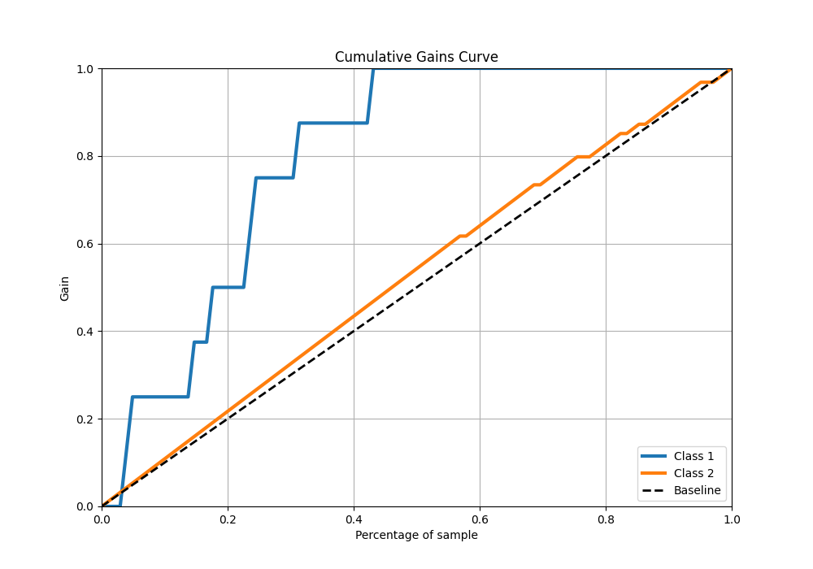
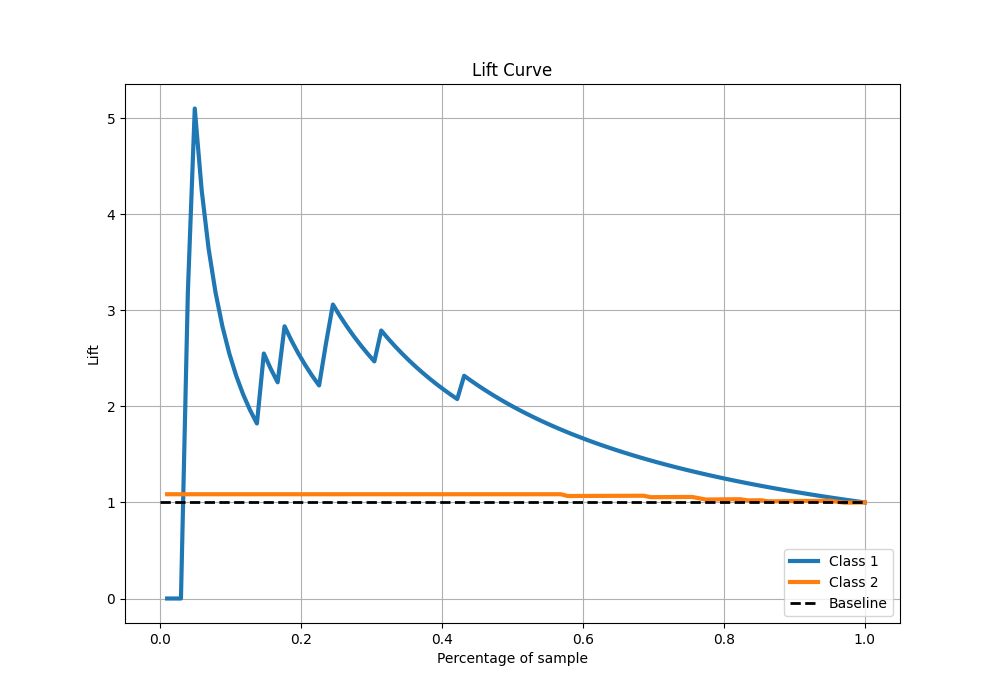

# Summary of 2_Linear

[<< Go back](../README.md)

## Logistic Regression (Linear)
- **n_jobs**: -1
- **explain_level**: 1

## Validation
 - **validation_type**: split
 - **train_ratio**: 0.75
 - **shuffle**: True
 - **stratify**: True

## Optimized metric
f1

## Training time

0.8 seconds

## Metric details
|           |    score |   threshold |
|:----------|---------:|------------:|
| logloss   | 0.23239  |  nan        |
| auc       | 0.825798 |  nan        |
| f1        | 0.959184 |    0.203456 |
| accuracy  | 0.921569 |    0.203456 |
| precision | 1        |    0.968233 |
| recall    | 1        |    0.203456 |
| mcc       | 0.352884 |    0.935709 |

## Confusion matrix (at threshold=0.203456)
|              |   Predicted as 1 |   Predicted as 2 |
|:-------------|-----------------:|-----------------:|
| Labeled as 1 |                0 |                8 |
| Labeled as 2 |                0 |               94 |

## Learning curves

## Coefficients
| feature   |    Learner_1 |
|:----------|-------------:|
| intercept |  4.03373     |
| "V6"      |  1.71769     |
| "V7"      |  0.780162    |
| "V16"     |  0.585168    |
| "V10"     |  0.555266    |
| "V1"      |  0.505724    |
| "V18"     |  0.426852    |
| "V8"      |  0.410297    |
| "V9"      |  0.121767    |
| "V2"      |  0.121067    |
| "V11"     |  0.0277886   |
| "V19"     |  0.000770397 |
| "V5"      | -0.106261    |
| "V12"     | -0.153293    |
| "V14"     | -0.301727    |
| "V13"     | -0.34155     |
| "V20"     | -0.588091    |
| "V17"     | -0.618375    |
| "V3"      | -0.690823    |
| "V4"      | -0.703591    |
| "V15"     | -1.53788     |

## Permutation-based Importance

## Confusion Matrix

## Normalized Confusion Matrix

## ROC Curve

## Kolmogorov-Smirnov Statistic

## Precision-Recall Curve

## Calibration Curve

## Cumulative Gains Curve

## Lift Curve

[<< Go back](../README.md)
