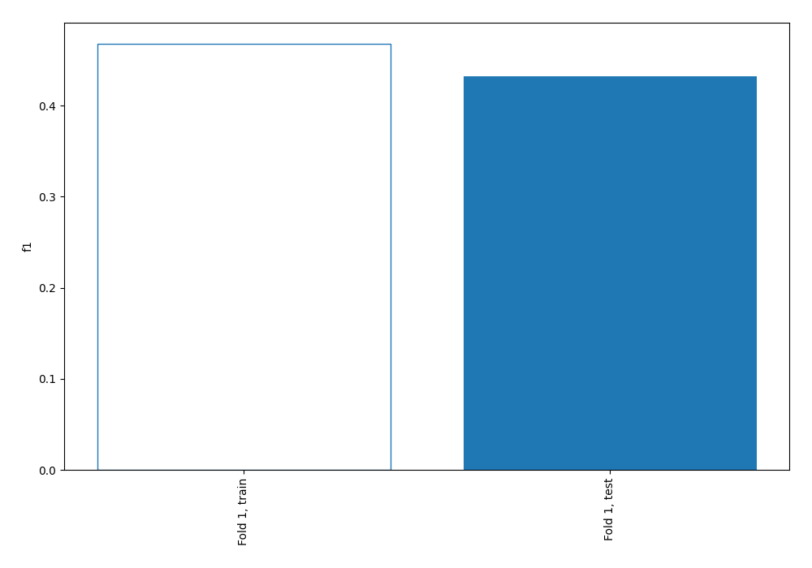
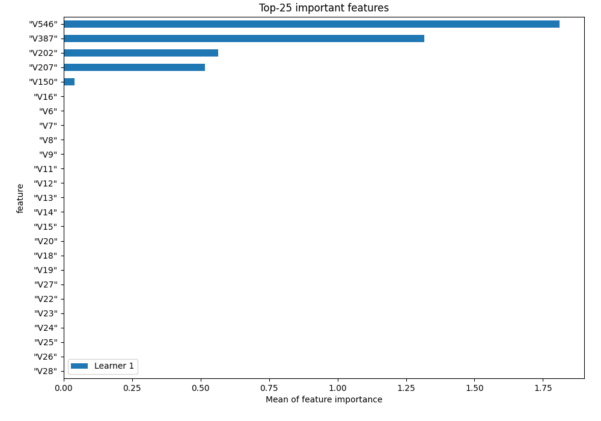
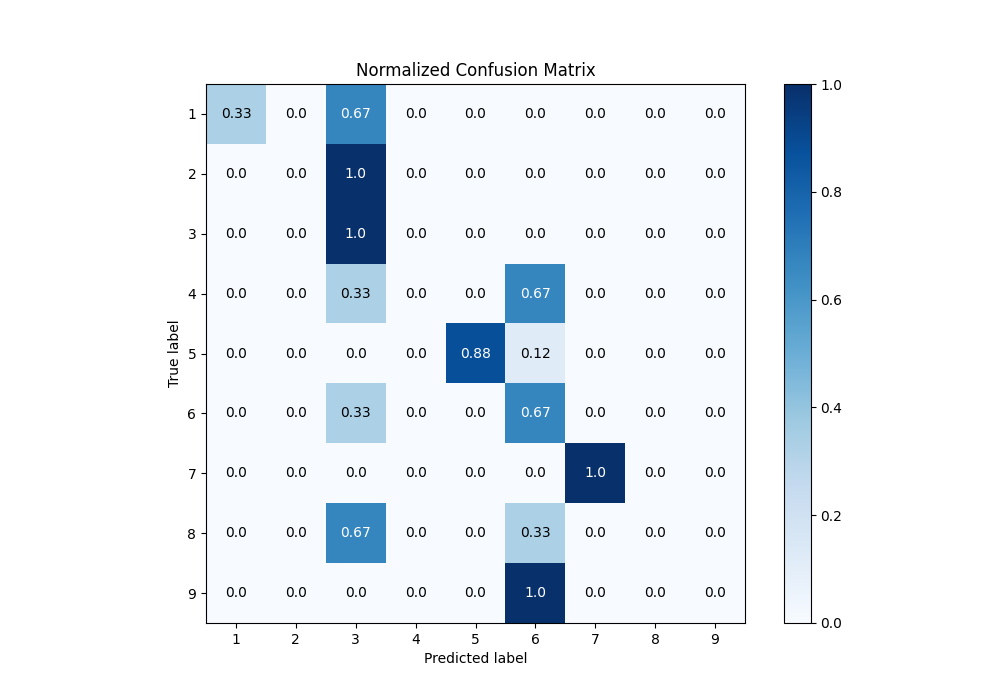
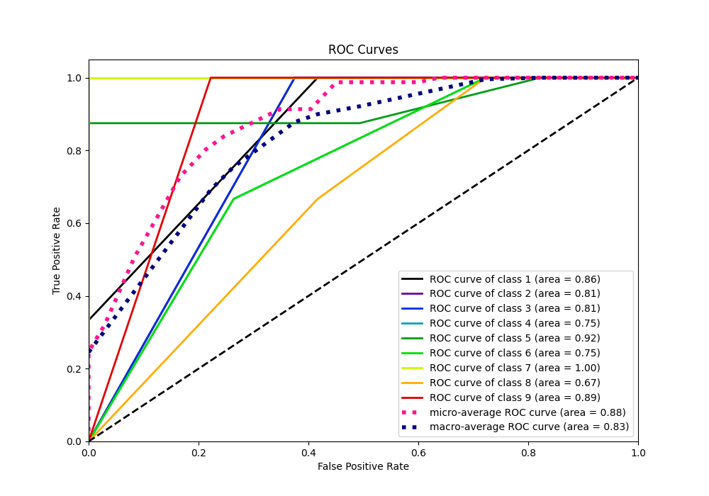
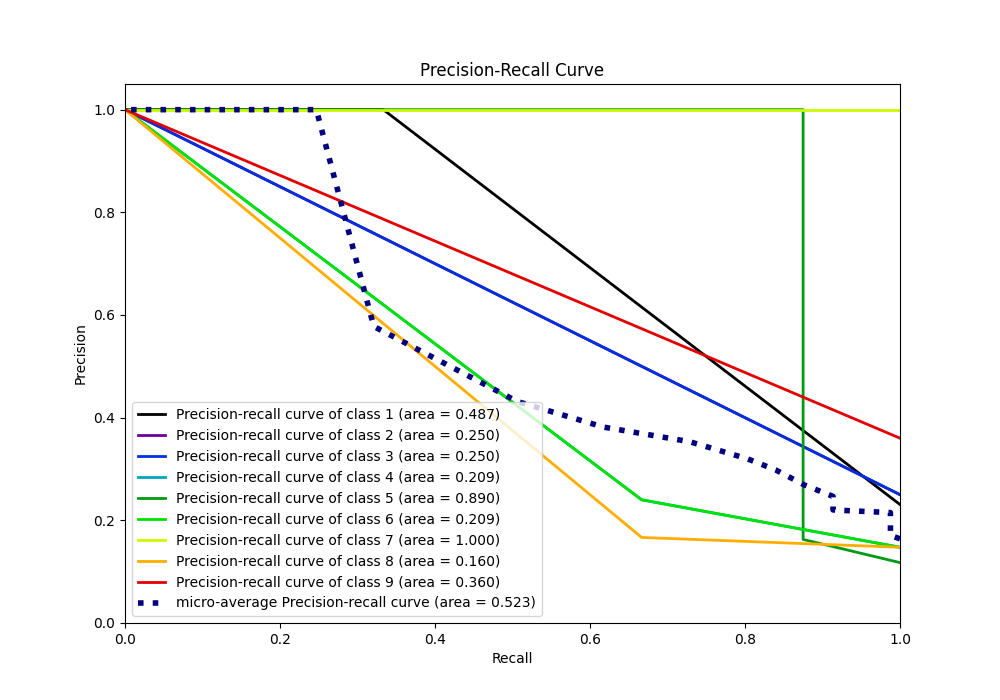

# Summary of 1_DecisionTree

[<< Go back](../README.md)

## Decision Tree
- **n_jobs**: -1
- **criterion**: entropy
- **max_depth**: 4
- **num_class**: 9
- **explain_level**: 1

## Validation
 - **validation_type**: split
 - **train_ratio**: 0.9
 - **shuffle**: True
 - **stratify**: True

## Optimized metric
f1

## Training time

9.7 seconds

### Metric details
|           |        1 |   2 |    3 |   4 |        5 |        6 |   7 |   8 |   9 |   accuracy |   macro avg |   weighted avg |   logloss |
|:----------|---------:|----:|-----:|----:|---------:|---------:|----:|----:|----:|-----------:|------------:|---------------:|----------:|
| precision | 1        |   0 | 0.25 |   0 | 1        | 0.24     |   1 |   0 |   0 |   0.432099 |    0.387778 |       0.387778 |   1.30713 |
| recall    | 0.333333 |   0 | 1    |   0 | 0.875    | 0.666667 |   1 |   0 |   0 |   0.432099 |    0.430556 |       0.432099 |   1.30713 |
| f1-score  | 0.5      |   0 | 0.4  |   0 | 0.933333 | 0.352941 |   1 |   0 |   0 |   0.432099 |    0.354031 |       0.354854 |   1.30713 |
| support   | 9        |   9 | 9    |   9 | 8        | 9        |  10 |   9 |   9 |   0.432099 |   81        |      81        |   1.30713 |

## Confusion matrix
|              |   Predicted as 1 |   Predicted as 2 |   Predicted as 3 |   Predicted as 4 |   Predicted as 5 |   Predicted as 6 |   Predicted as 7 |   Predicted as 8 |   Predicted as 9 |
|:-------------|-----------------:|-----------------:|-----------------:|-----------------:|-----------------:|-----------------:|-----------------:|-----------------:|-----------------:|
| Labeled as 1 |                3 |                0 |                6 |                0 |                0 |                0 |                0 |                0 |                0 |
| Labeled as 2 |                0 |                0 |                9 |                0 |                0 |                0 |                0 |                0 |                0 |
| Labeled as 3 |                0 |                0 |                9 |                0 |                0 |                0 |                0 |                0 |                0 |
| Labeled as 4 |                0 |                0 |                3 |                0 |                0 |                6 |                0 |                0 |                0 |
| Labeled as 5 |                0 |                0 |                0 |                0 |                7 |                1 |                0 |                0 |                0 |
| Labeled as 6 |                0 |                0 |                3 |                0 |                0 |                6 |                0 |                0 |                0 |
| Labeled as 7 |                0 |                0 |                0 |                0 |                0 |                0 |               10 |                0 |                0 |
| Labeled as 8 |                0 |                0 |                6 |                0 |                0 |                3 |                0 |                0 |                0 |
| Labeled as 9 |                0 |                0 |                0 |                0 |                0 |                9 |                0 |                0 |                0 |

## Learning curves

## Permutation-based Importance

## Confusion Matrix

## Normalized Confusion Matrix

## ROC Curve

## Precision Recall Curve

[<< Go back](../README.md)
