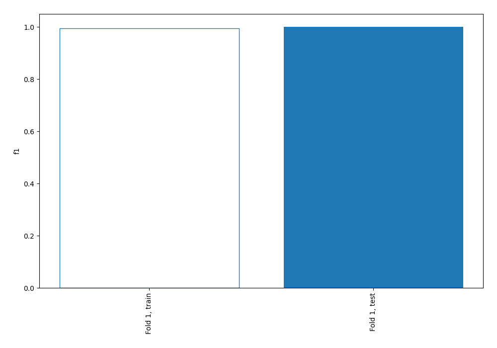
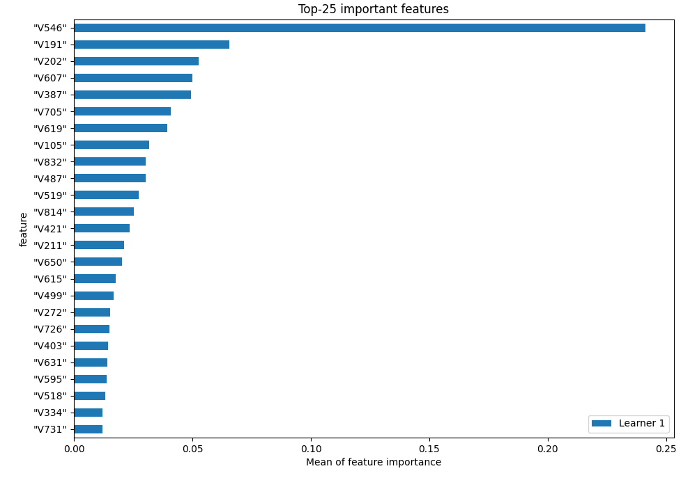
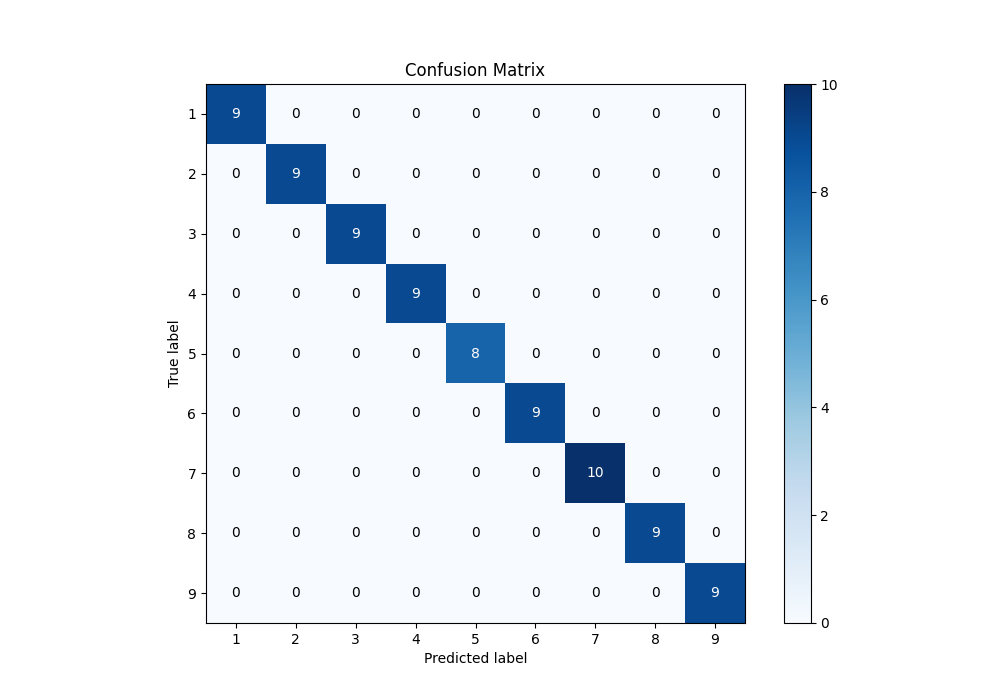
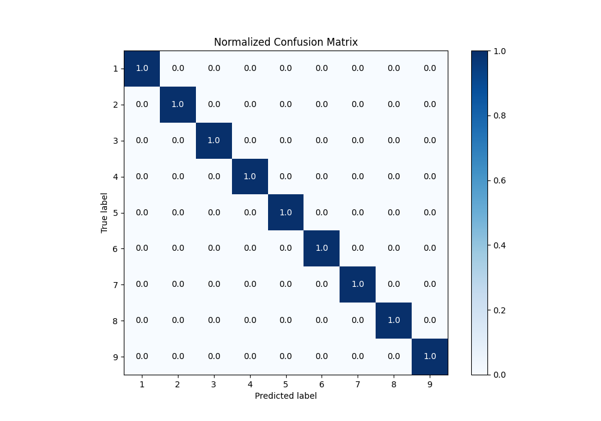
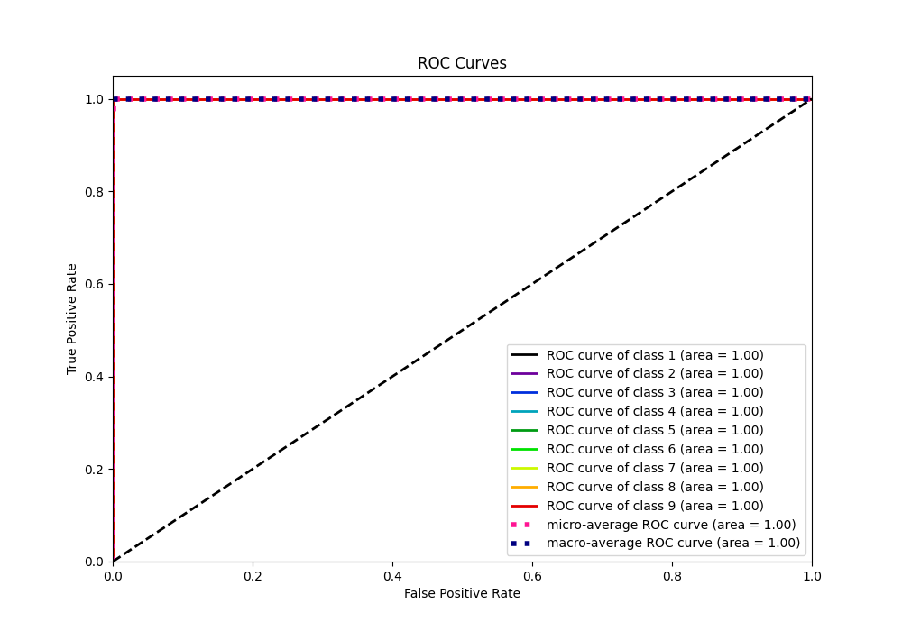
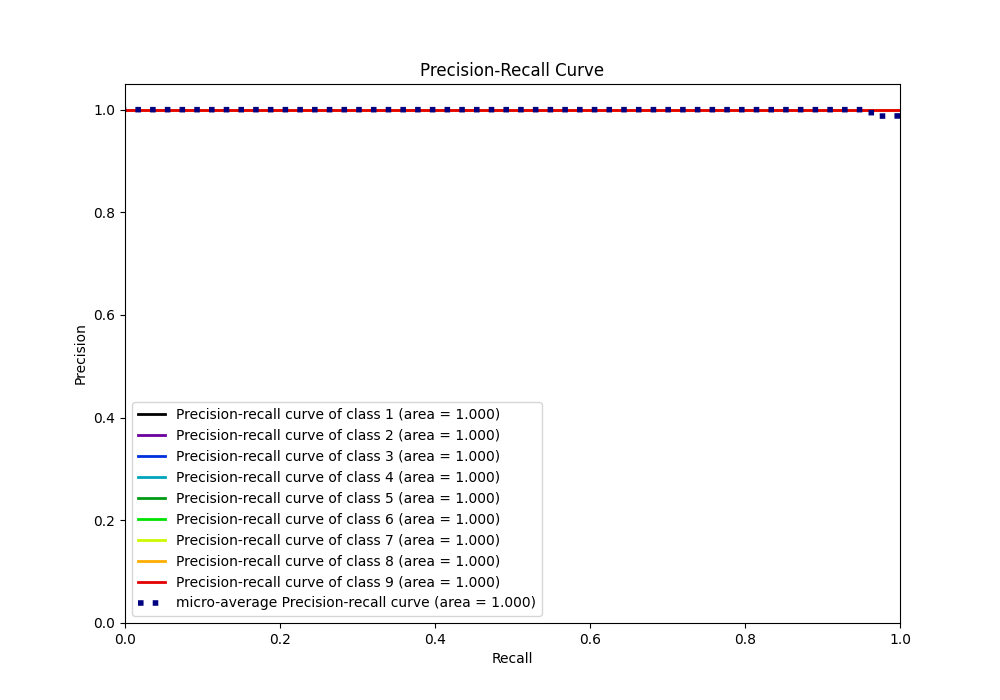

# Summary of 2_Linear

[<< Go back](../README.md)

## Logistic Regression (Linear)
- **n_jobs**: -1
- **num_class**: 9
- **explain_level**: 1

## Validation
 - **validation_type**: split
 - **train_ratio**: 0.9
 - **shuffle**: True
 - **stratify**: True

## Optimized metric
f1

## Training time

8.5 seconds

### Metric details
|           |   1 |   2 |   3 |   4 |   5 |   6 |   7 |   8 |   9 |   accuracy |   macro avg |   weighted avg |   logloss |
|:----------|----:|----:|----:|----:|----:|----:|----:|----:|----:|-----------:|------------:|---------------:|----------:|
| precision |   1 |   1 |   1 |   1 |   1 |   1 |   1 |   1 |   1 |          1 |           1 |              1 |  0.164159 |
| recall    |   1 |   1 |   1 |   1 |   1 |   1 |   1 |   1 |   1 |          1 |           1 |              1 |  0.164159 |
| f1-score  |   1 |   1 |   1 |   1 |   1 |   1 |   1 |   1 |   1 |          1 |           1 |              1 |  0.164159 |
| support   |   9 |   9 |   9 |   9 |   8 |   9 |  10 |   9 |   9 |          1 |          81 |             81 |  0.164159 |

## Confusion matrix
|              |   Predicted as 1 |   Predicted as 2 |   Predicted as 3 |   Predicted as 4 |   Predicted as 5 |   Predicted as 6 |   Predicted as 7 |   Predicted as 8 |   Predicted as 9 |
|:-------------|-----------------:|-----------------:|-----------------:|-----------------:|-----------------:|-----------------:|-----------------:|-----------------:|-----------------:|
| Labeled as 1 |                9 |                0 |                0 |                0 |                0 |                0 |                0 |                0 |                0 |
| Labeled as 2 |                0 |                9 |                0 |                0 |                0 |                0 |                0 |                0 |                0 |
| Labeled as 3 |                0 |                0 |                9 |                0 |                0 |                0 |                0 |                0 |                0 |
| Labeled as 4 |                0 |                0 |                0 |                9 |                0 |                0 |                0 |                0 |                0 |
| Labeled as 5 |                0 |                0 |                0 |                0 |                8 |                0 |                0 |                0 |                0 |
| Labeled as 6 |                0 |                0 |                0 |                0 |                0 |                9 |                0 |                0 |                0 |
| Labeled as 7 |                0 |                0 |                0 |                0 |                0 |                0 |               10 |                0 |                0 |
| Labeled as 8 |                0 |                0 |                0 |                0 |                0 |                0 |                0 |                9 |                0 |
| Labeled as 9 |                0 |                0 |                0 |                0 |                0 |                0 |                0 |                0 |                9 |

## Learning curves

## Permutation-based Importance

## Confusion Matrix

## Normalized Confusion Matrix

## ROC Curve

## Precision Recall Curve

[<< Go back](../README.md)
