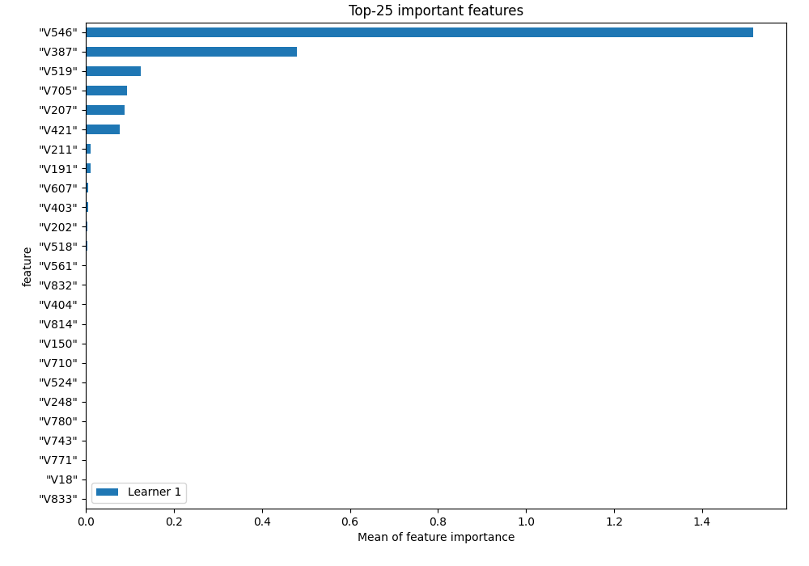
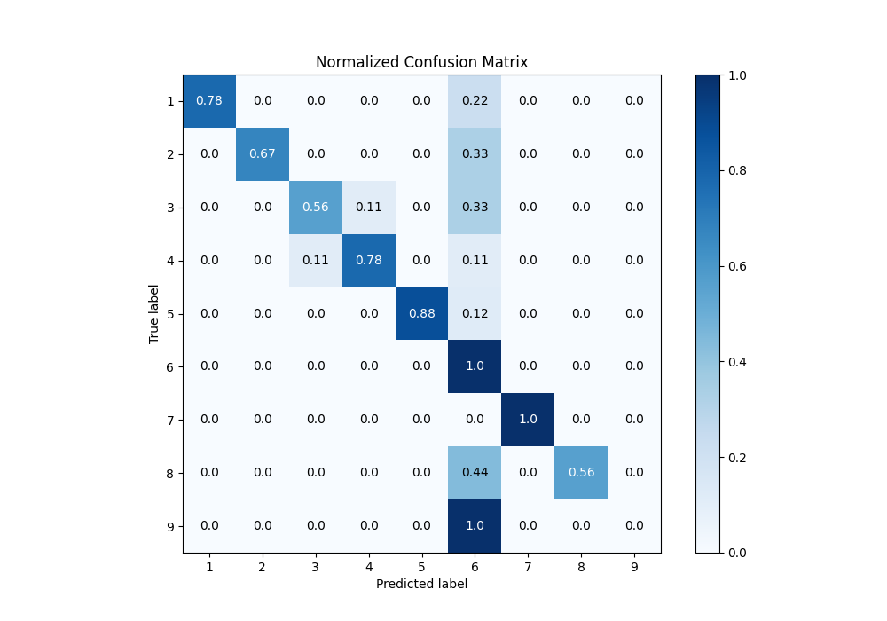
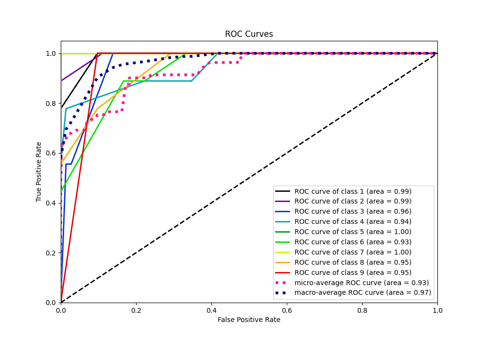
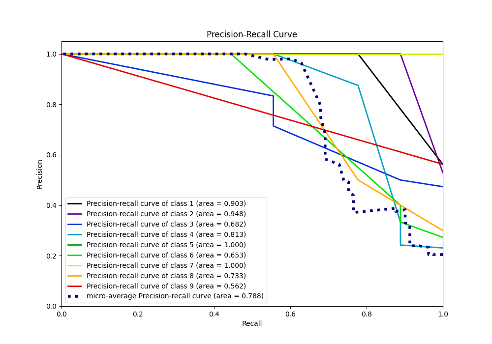

# Summary of 4_Default_RandomForest

[<< Go back](../README.md)

## Random Forest
- **n_jobs**: -1
- **criterion**: gini
- **max_features**: 0.9
- **min_samples_split**: 30
- **max_depth**: 4
- **eval_metric_name**: f1
- **num_class**: 9
- **explain_level**: 1

## Validation
 - **validation_type**: split
 - **train_ratio**: 0.9
 - **shuffle**: True
 - **stratify**: True

## Optimized metric
f1

## Training time

28.5 seconds

### Metric details
|           |        1 |        2 |        3 |        4 |        5 |        6 |   7 |        8 |   9 |   accuracy |   macro avg |   weighted avg |   logloss |
|:----------|---------:|---------:|---------:|---------:|---------:|---------:|----:|---------:|----:|-----------:|------------:|---------------:|----------:|
| precision | 1        | 1        | 0.833333 | 0.875    | 1        | 0.28125  |   1 | 1        |   0 |   0.691358 |    0.77662  |       0.77662  |    1.2402 |
| recall    | 0.777778 | 0.666667 | 0.555556 | 0.777778 | 0.875    | 1        |   1 | 0.555556 |   0 |   0.691358 |    0.689815 |       0.691358 |    1.2402 |
| f1-score  | 0.875    | 0.8      | 0.666667 | 0.823529 | 0.933333 | 0.439024 |   1 | 0.714286 |   0 |   0.691358 |    0.694649 |       0.695472 |    1.2402 |
| support   | 9        | 9        | 9        | 9        | 8        | 9        |  10 | 9        |   9 |   0.691358 |   81        |      81        |    1.2402 |

## Confusion matrix
|              |   Predicted as 1 |   Predicted as 2 |   Predicted as 3 |   Predicted as 4 |   Predicted as 5 |   Predicted as 6 |   Predicted as 7 |   Predicted as 8 |   Predicted as 9 |
|:-------------|-----------------:|-----------------:|-----------------:|-----------------:|-----------------:|-----------------:|-----------------:|-----------------:|-----------------:|
| Labeled as 1 |                7 |                0 |                0 |                0 |                0 |                2 |                0 |                0 |                0 |
| Labeled as 2 |                0 |                6 |                0 |                0 |                0 |                3 |                0 |                0 |                0 |
| Labeled as 3 |                0 |                0 |                5 |                1 |                0 |                3 |                0 |                0 |                0 |
| Labeled as 4 |                0 |                0 |                1 |                7 |                0 |                1 |                0 |                0 |                0 |
| Labeled as 5 |                0 |                0 |                0 |                0 |                7 |                1 |                0 |                0 |                0 |
| Labeled as 6 |                0 |                0 |                0 |                0 |                0 |                9 |                0 |                0 |                0 |
| Labeled as 7 |                0 |                0 |                0 |                0 |                0 |                0 |               10 |                0 |                0 |
| Labeled as 8 |                0 |                0 |                0 |                0 |                0 |                4 |                0 |                5 |                0 |
| Labeled as 9 |                0 |                0 |                0 |                0 |                0 |                9 |                0 |                0 |                0 |

## Learning curves

## Permutation-based Importance

## Confusion Matrix

## Normalized Confusion Matrix

## ROC Curve

## Precision Recall Curve

[<< Go back](../README.md)
