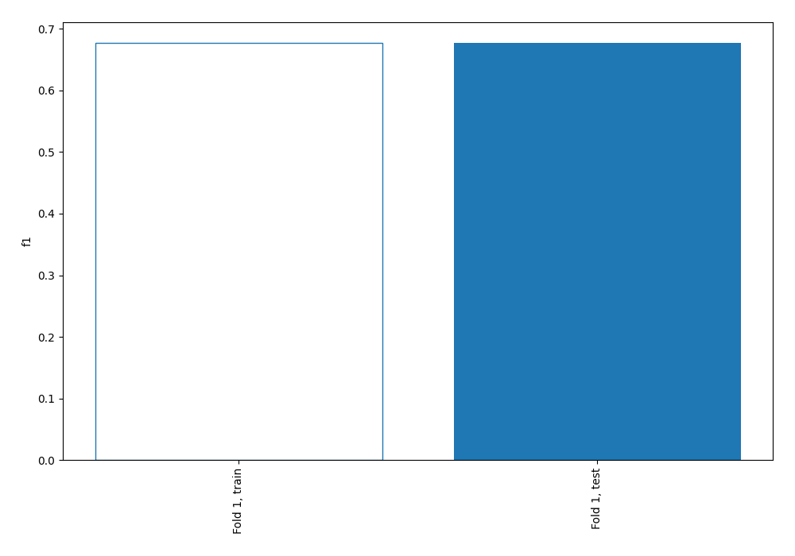
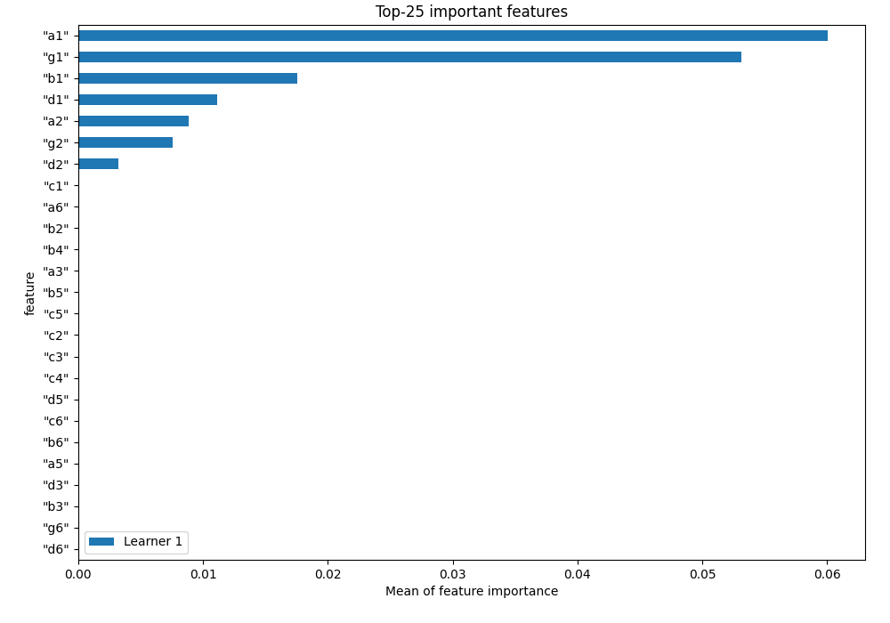
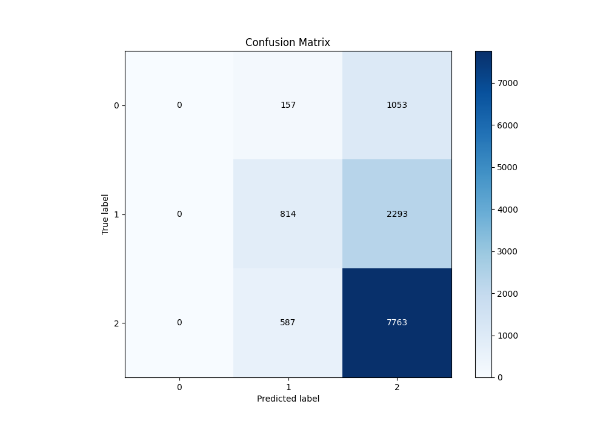
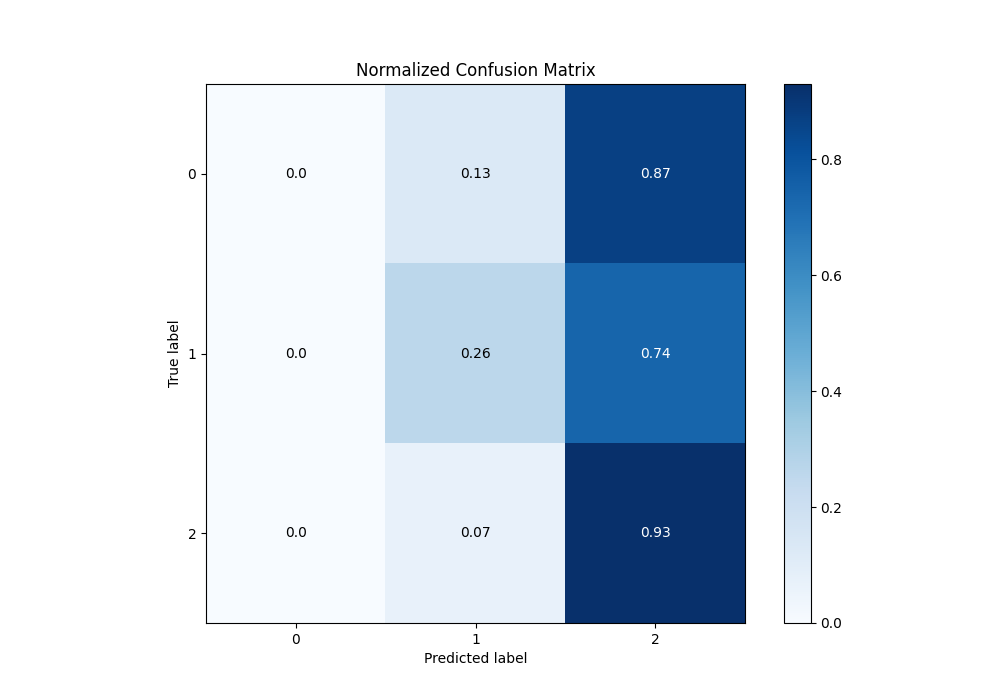
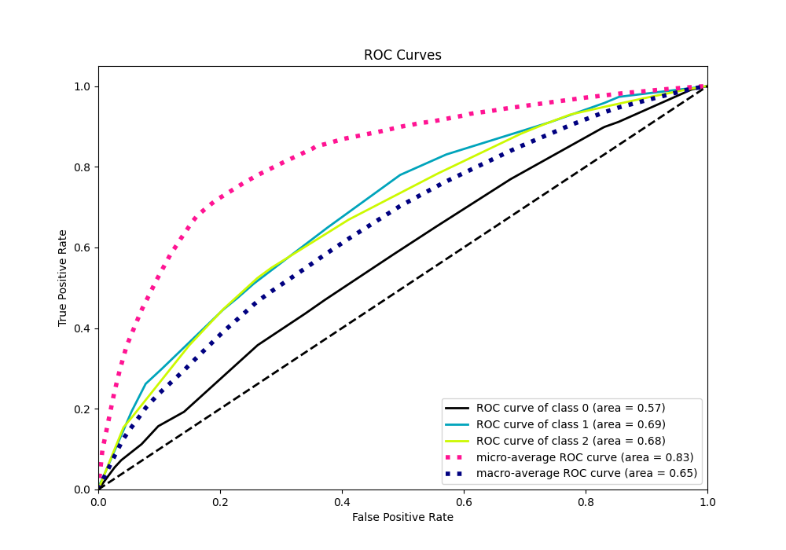
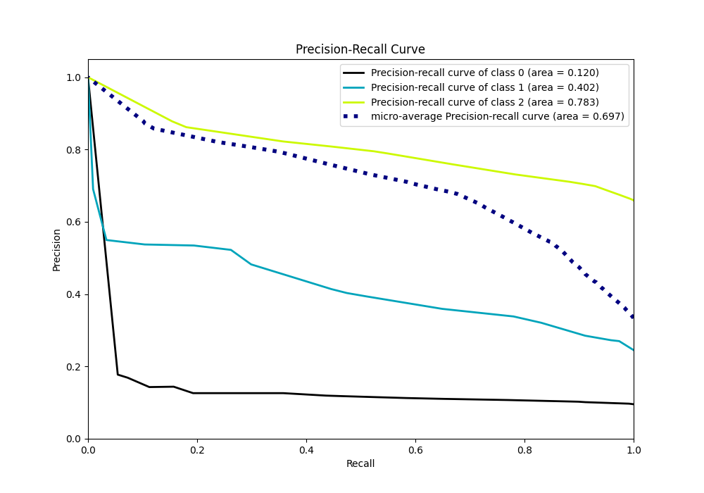

# Summary of 1_DecisionTree

[<< Go back](../README.md)

## Decision Tree
- **n_jobs**: -1
- **criterion**: entropy
- **max_depth**: 4
- **num_class**: 3
- **explain_level**: 1

## Validation
 - **validation_type**: split
 - **train_ratio**: 0.75
 - **shuffle**: True
 - **stratify**: True

## Optimized metric
f1

## Training time

9.9 seconds

### Metric details
|           |    0 |           1 |           2 |   accuracy |    macro avg |   weighted avg |   logloss |
|:----------|-----:|------------:|------------:|-----------:|-------------:|---------------:|----------:|
| precision |    0 |    0.522465 |    0.698803 |   0.677114 |     0.407089 |       0.588798 |  0.788432 |
| recall    |    0 |    0.261989 |    0.929701 |   0.677114 |     0.39723  |       0.677114 |  0.788432 |
| f1-score  |    0 |    0.348982 |    0.797883 |   0.677114 |     0.382288 |       0.611558 |  0.788432 |
| support   | 1210 | 3107        | 8350        |   0.677114 | 12667        |   12667        |  0.788432 |

## Confusion matrix
|              |   Predicted as 0 |   Predicted as 1 |   Predicted as 2 |
|:-------------|-----------------:|-----------------:|-----------------:|
| Labeled as 0 |                0 |              157 |             1053 |
| Labeled as 1 |                0 |              814 |             2293 |
| Labeled as 2 |                0 |              587 |             7763 |

## Learning curves

## Permutation-based Importance

## Confusion Matrix

## Normalized Confusion Matrix

## ROC Curve

## Precision Recall Curve

[<< Go back](../README.md)
