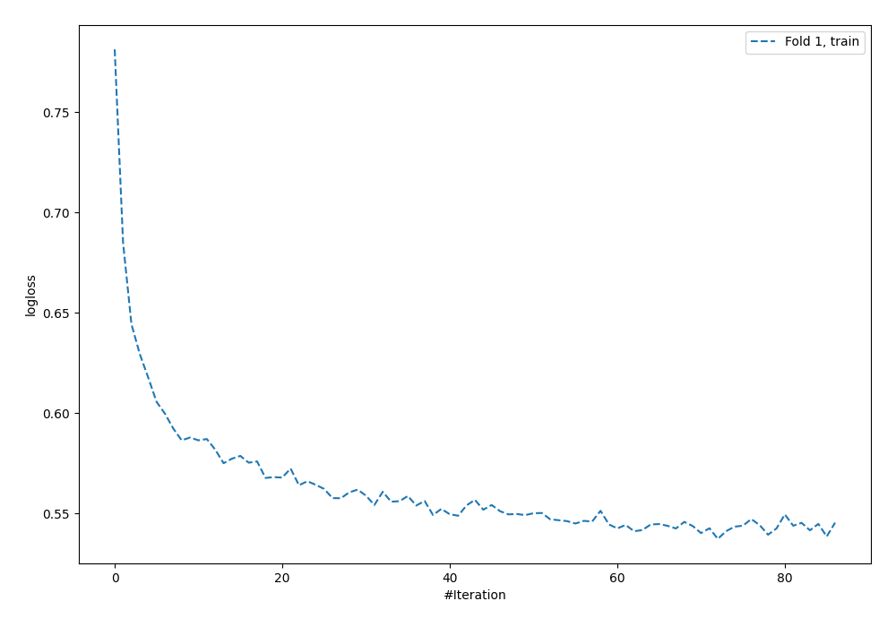
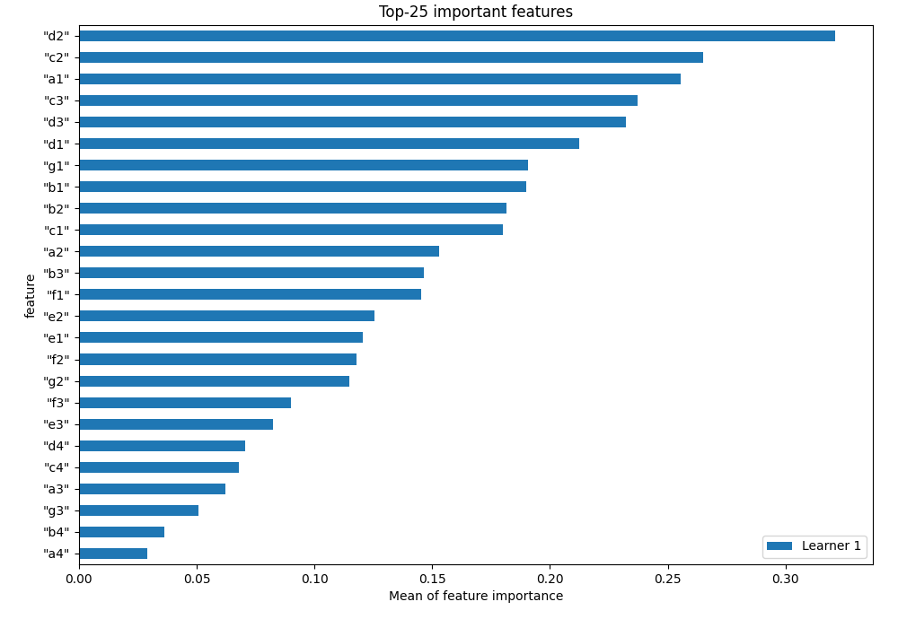
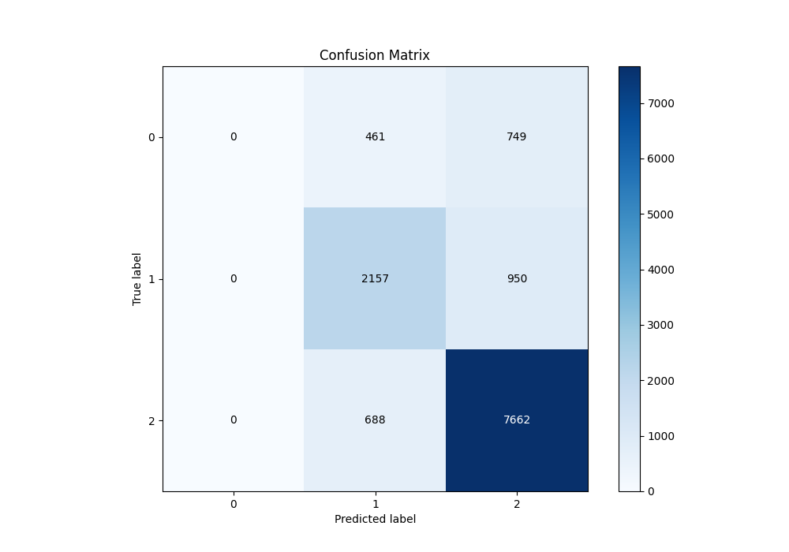
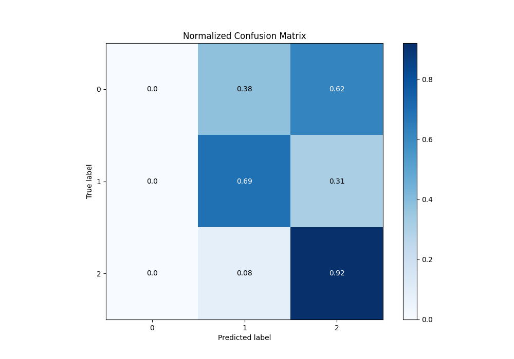
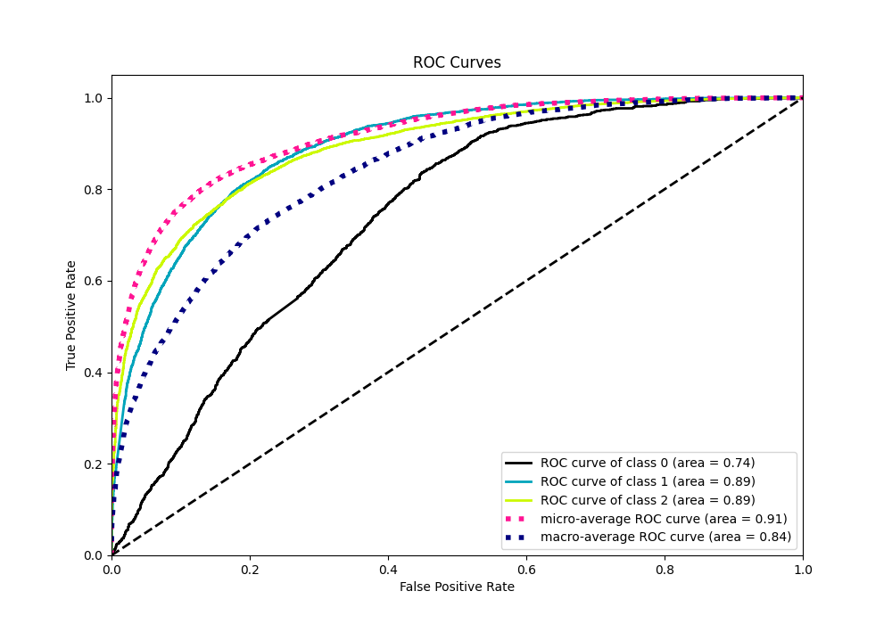
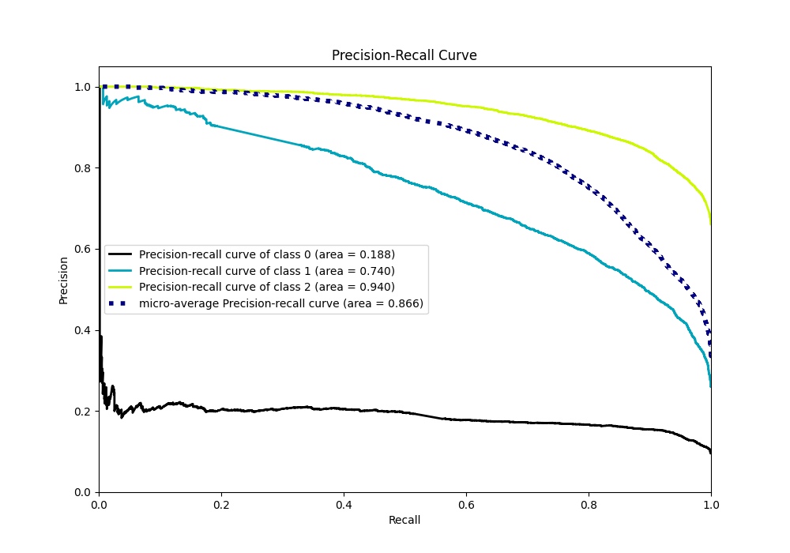

# Summary of 2_Default_NeuralNetwork

[<< Go back](../README.md)

## Neural Network
- **n_jobs**: -1
- **dense_1_size**: 32
- **dense_2_size**: 16
- **learning_rate**: 0.05
- **num_class**: 3
- **explain_level**: 1

## Validation
 - **validation_type**: split
 - **train_ratio**: 0.75
 - **shuffle**: True
 - **stratify**: True

## Optimized metric
f1

## Training time

14.0 seconds

### Metric details
|           |    0 |           1 |           2 |   accuracy |    macro avg |   weighted avg |   logloss |
|:----------|-----:|------------:|------------:|-----------:|-------------:|---------------:|----------:|
| precision |    0 |    0.65245  |    0.818502 |   0.775164 |     0.490317 |       0.699586 |  0.568723 |
| recall    |    0 |    0.694239 |    0.917605 |   0.775164 |     0.537281 |       0.775164 |  0.568723 |
| f1-score  |    0 |    0.672696 |    0.865225 |   0.775164 |     0.51264  |       0.735351 |  0.568723 |
| support   | 1210 | 3107        | 8350        |   0.775164 | 12667        |   12667        |  0.568723 |

## Confusion matrix
|              |   Predicted as 0 |   Predicted as 1 |   Predicted as 2 |
|:-------------|-----------------:|-----------------:|-----------------:|
| Labeled as 0 |                0 |              461 |              749 |
| Labeled as 1 |                0 |             2157 |              950 |
| Labeled as 2 |                0 |              688 |             7662 |

## Learning curves

## Permutation-based Importance

## Confusion Matrix

## Normalized Confusion Matrix

## ROC Curve

## Precision Recall Curve

[<< Go back](../README.md)
