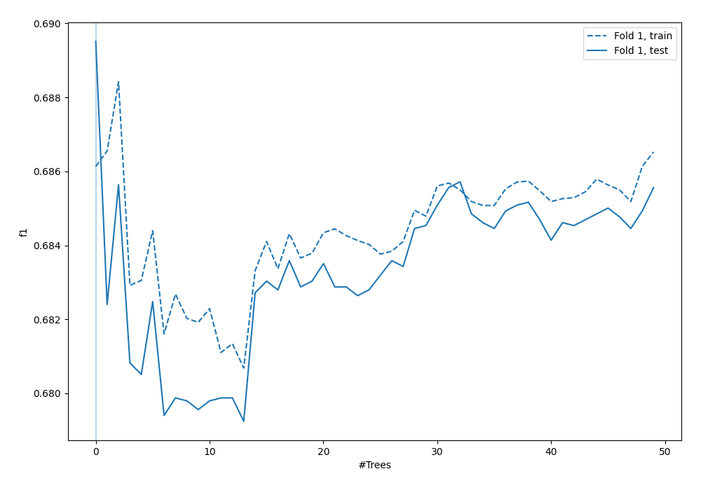
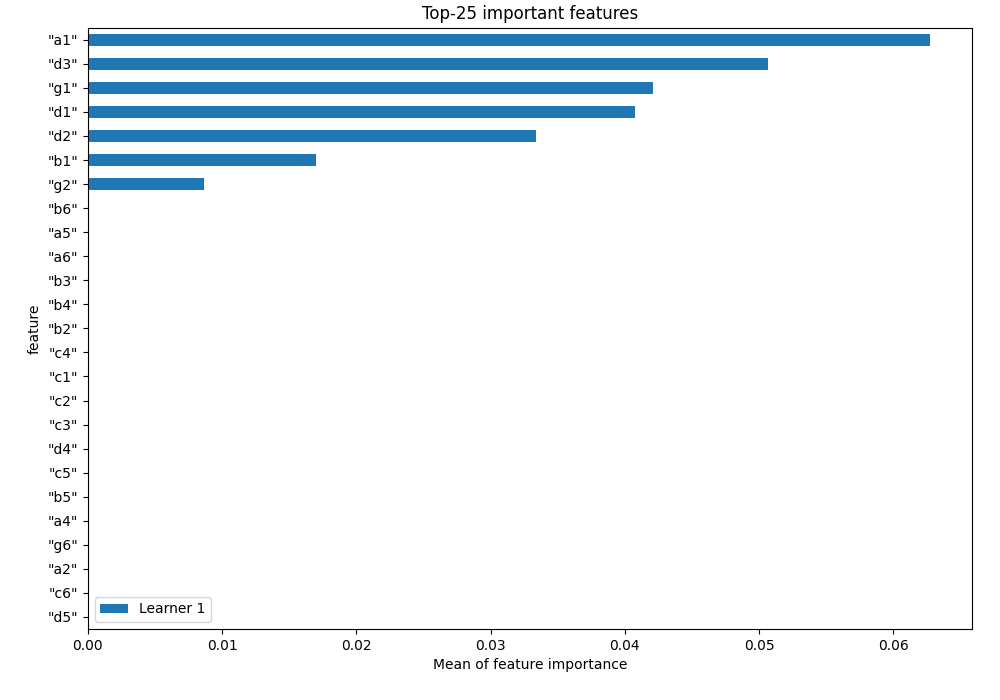
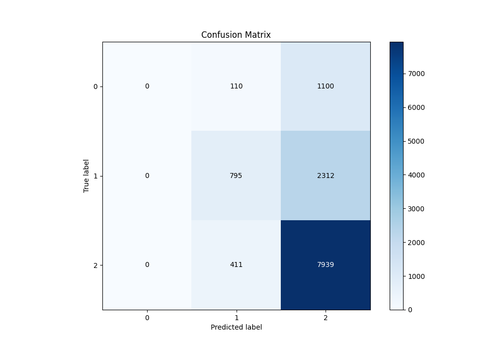
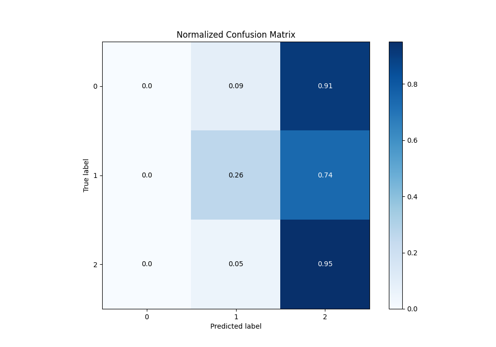
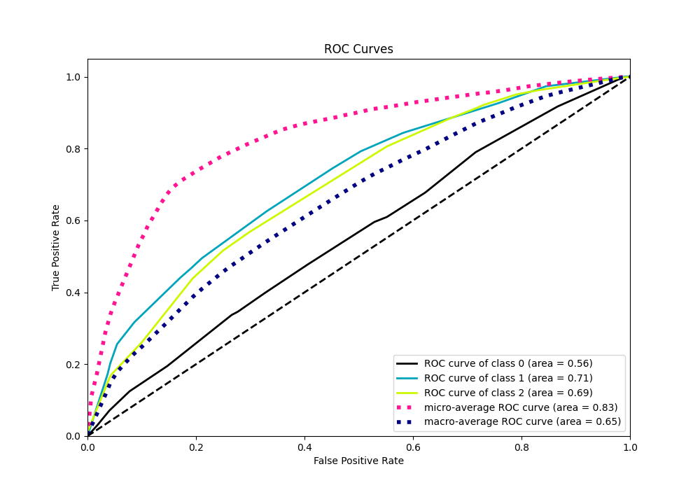
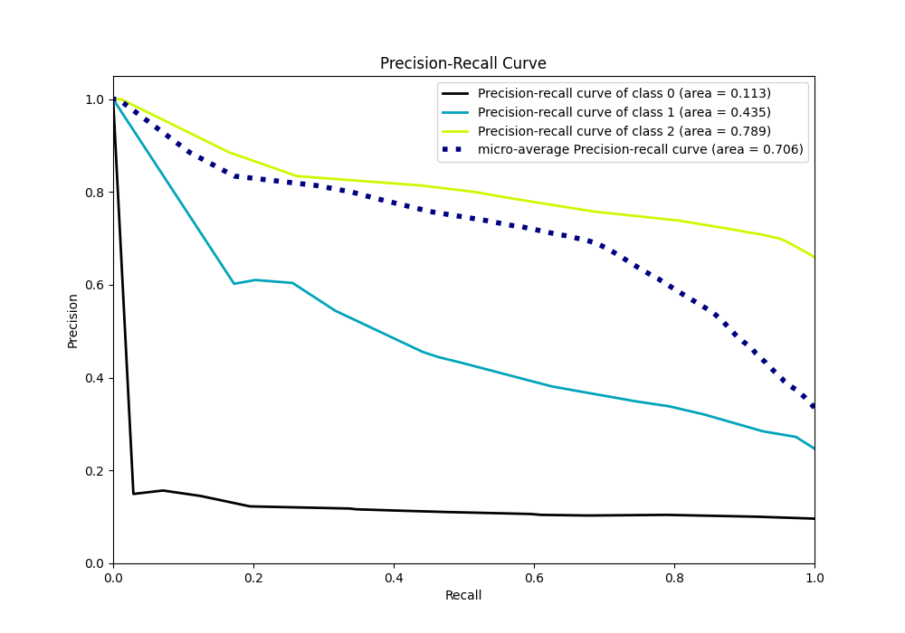

# Summary of 3_Default_RandomForest

[<< Go back](../README.md)

## Random Forest
- **n_jobs**: -1
- **criterion**: gini
- **max_features**: 0.9
- **min_samples_split**: 30
- **max_depth**: 4
- **eval_metric_name**: f1
- **num_class**: 3
- **explain_level**: 1

## Validation
 - **validation_type**: split
 - **train_ratio**: 0.75
 - **shuffle**: True
 - **stratify**: True

## Optimized metric
f1

## Training time

3.8 seconds

### Metric details
|           |    0 |           1 |           2 |   accuracy |    macro avg |   weighted avg |   logloss |
|:----------|-----:|------------:|------------:|-----------:|-------------:|---------------:|----------:|
| precision |    0 |    0.604103 |    0.69941  |   0.689508 |     0.434504 |       0.609222 |  0.778171 |
| recall    |    0 |    0.255874 |    0.950778 |   0.689508 |     0.402217 |       0.689508 |  0.778171 |
| f1-score  |    0 |    0.359485 |    0.805949 |   0.689508 |     0.388478 |       0.619451 |  0.778171 |
| support   | 1210 | 3107        | 8350        |   0.689508 | 12667        |   12667        |  0.778171 |

## Confusion matrix
|              |   Predicted as 0 |   Predicted as 1 |   Predicted as 2 |
|:-------------|-----------------:|-----------------:|-----------------:|
| Labeled as 0 |                0 |              110 |             1100 |
| Labeled as 1 |                0 |              795 |             2312 |
| Labeled as 2 |                0 |              411 |             7939 |

## Learning curves

## Permutation-based Importance

## Confusion Matrix

## Normalized Confusion Matrix

## ROC Curve

## Precision Recall Curve

[<< Go back](../README.md)
