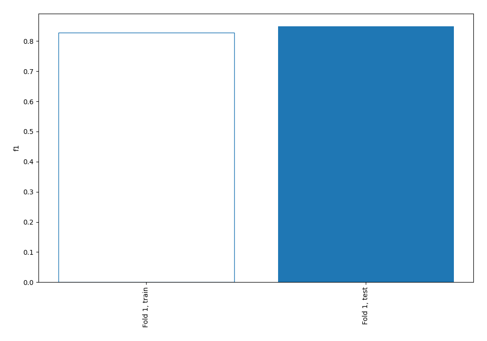
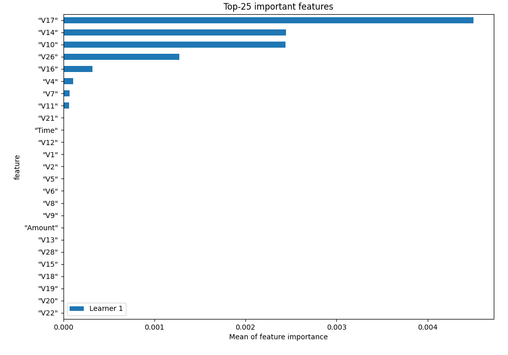
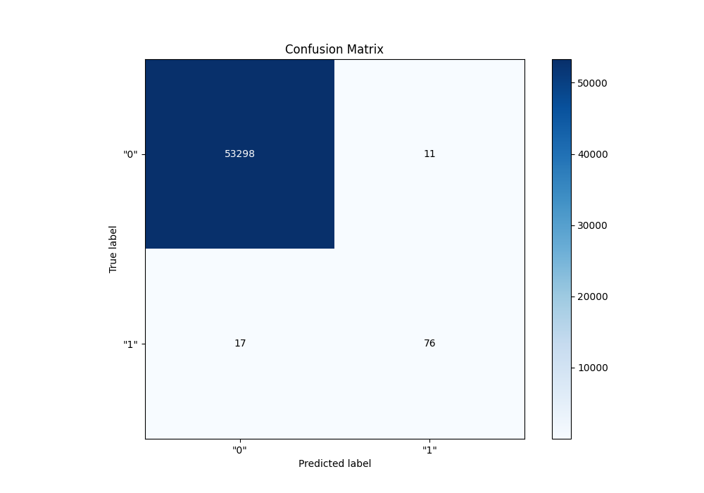
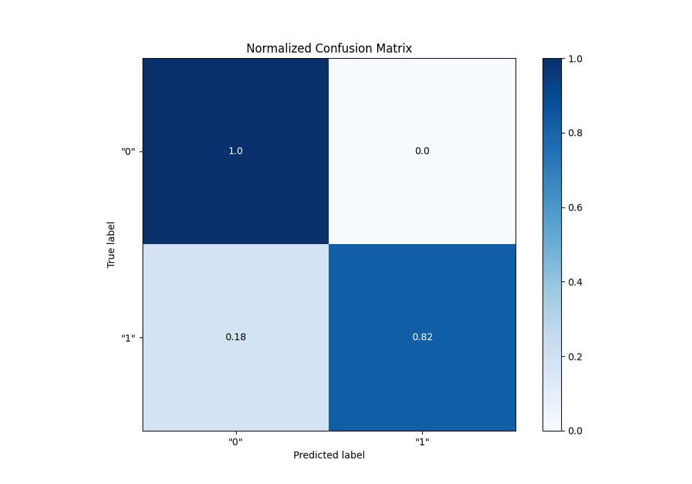
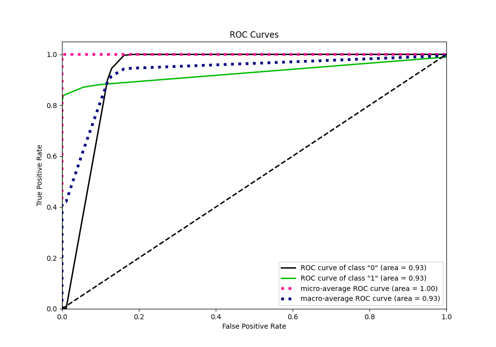
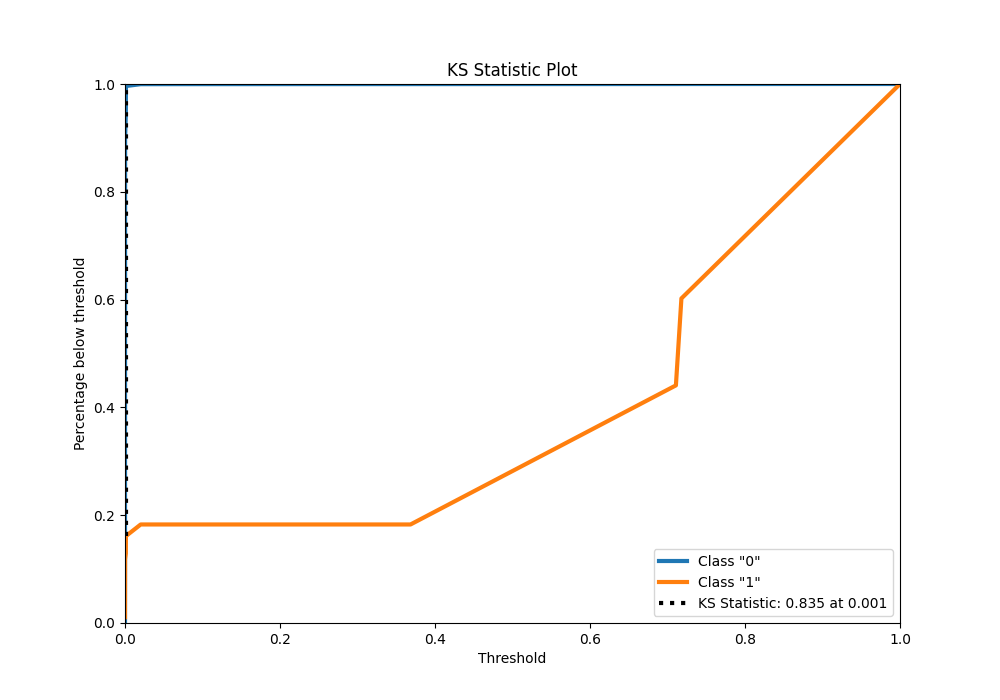
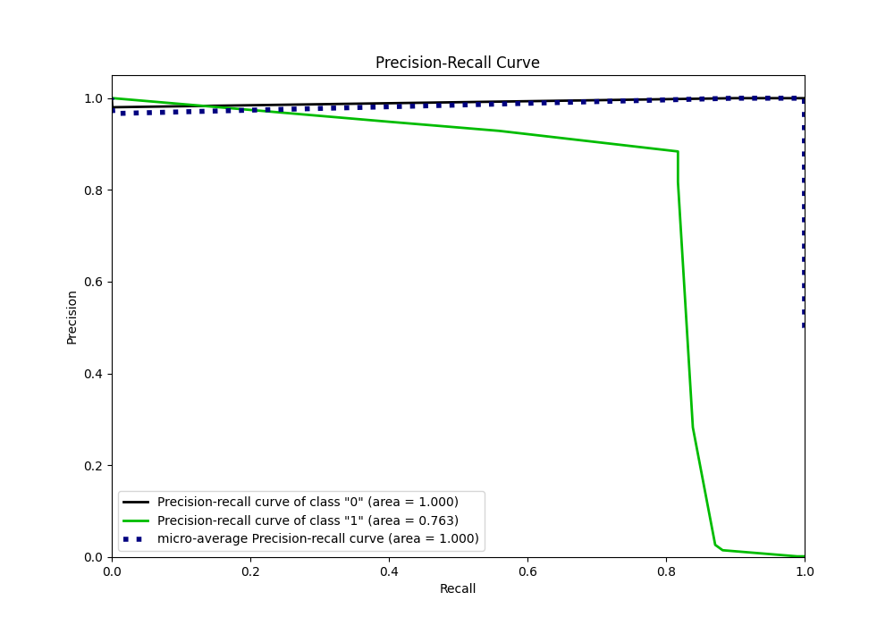
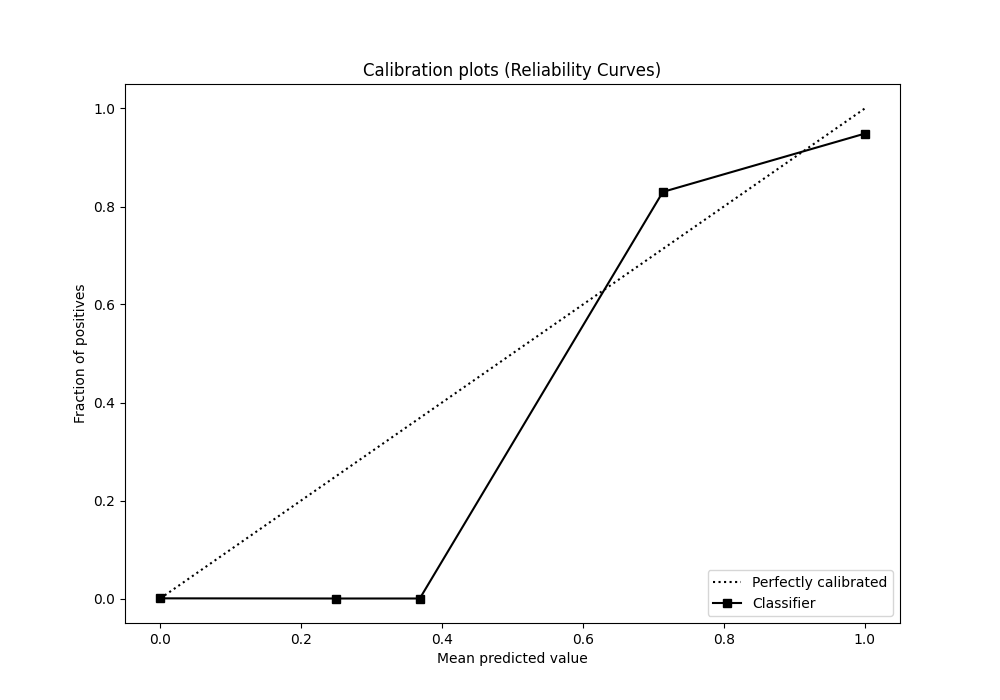
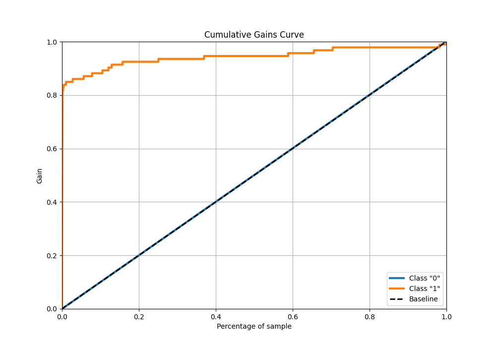
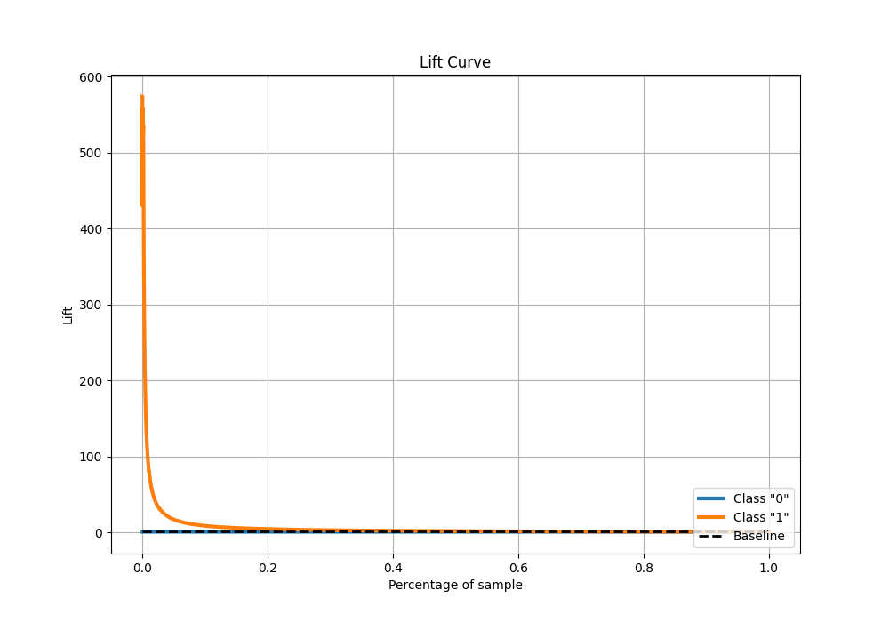

# Summary of 1_DecisionTree

[<< Go back](../README.md)

## Decision Tree
- **n_jobs**: -1
- **criterion**: entropy
- **max_depth**: 4
- **explain_level**: 1

## Validation
 - **validation_type**: split
 - **train_ratio**: 0.75
 - **shuffle**: True
 - **stratify**: True

## Optimized metric
f1

## Training time

38.2 seconds

## Metric details
|           |      score |   threshold |
|:----------|-----------:|------------:|
| logloss   | 0.00386147 |  nan        |
| auc       | 0.928238   |  nan        |
| f1        | 0.844444   |    0.359041 |
| accuracy  | 0.999476   |    0.359041 |
| precision | 0.873563   |    0.359041 |
| recall    | 0.989247   |    0        |
| mcc       | 0.844653   |    0.359041 |

## Confusion matrix (at threshold=0.359041)
|                |   Predicted as "0" |   Predicted as "1" |
|:---------------|-------------------:|-------------------:|
| Labeled as "0" |              53298 |                 11 |
| Labeled as "1" |                 17 |                 76 |

## Learning curves

## Permutation-based Importance

## Confusion Matrix

## Normalized Confusion Matrix

## ROC Curve

## Kolmogorov-Smirnov Statistic

## Precision-Recall Curve

## Calibration Curve

## Cumulative Gains Curve

## Lift Curve

[<< Go back](../README.md)
