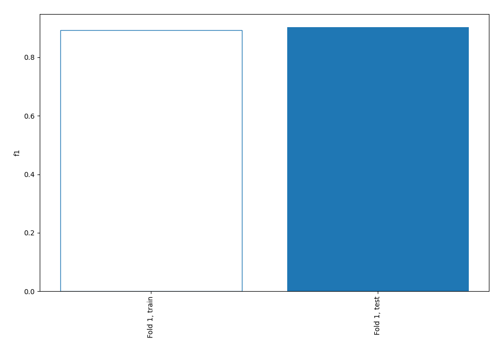
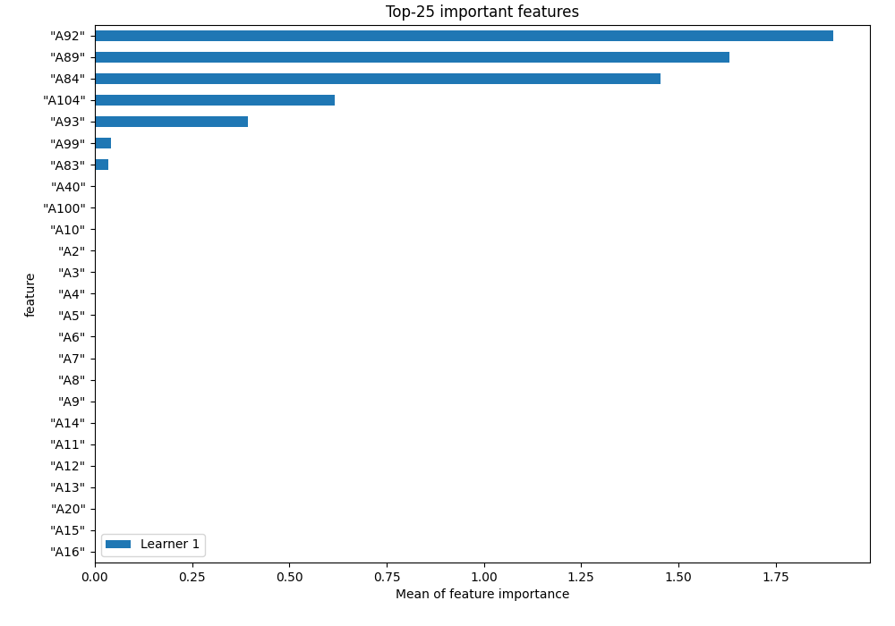
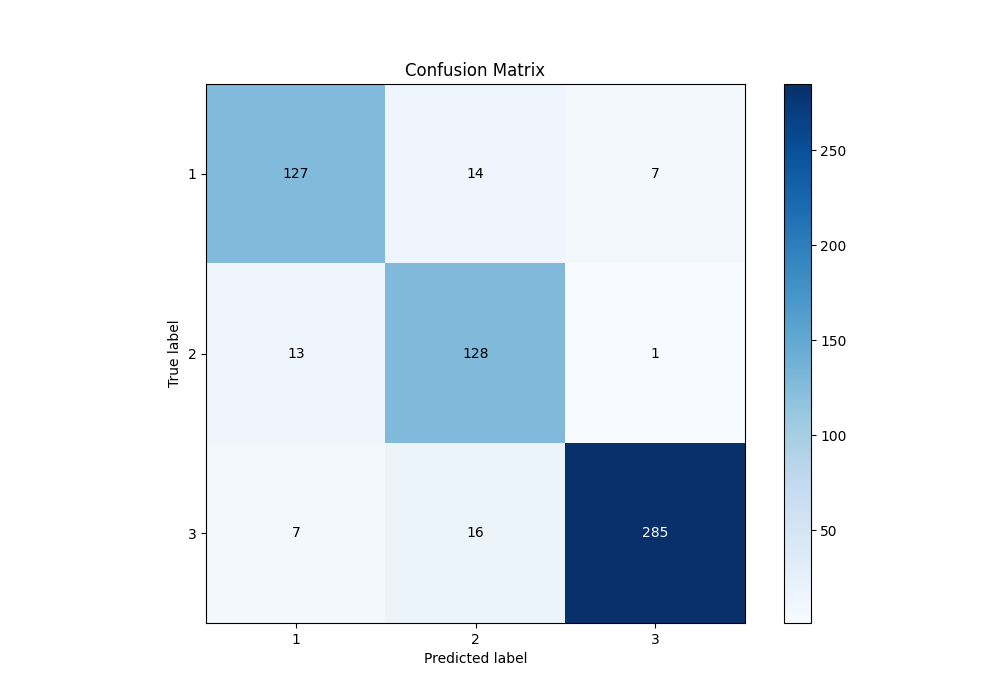
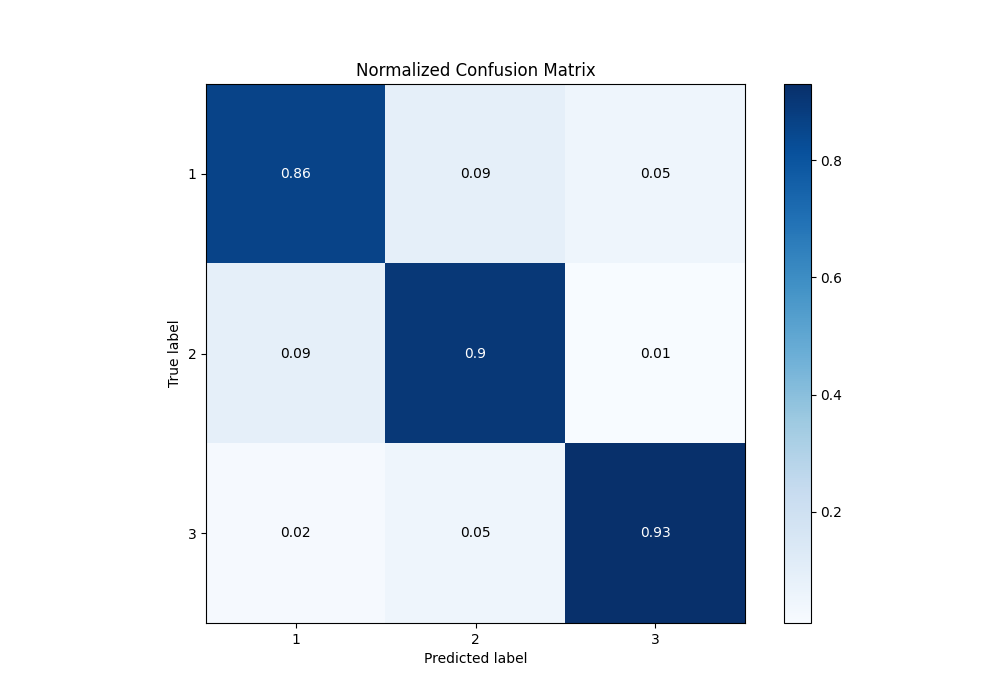
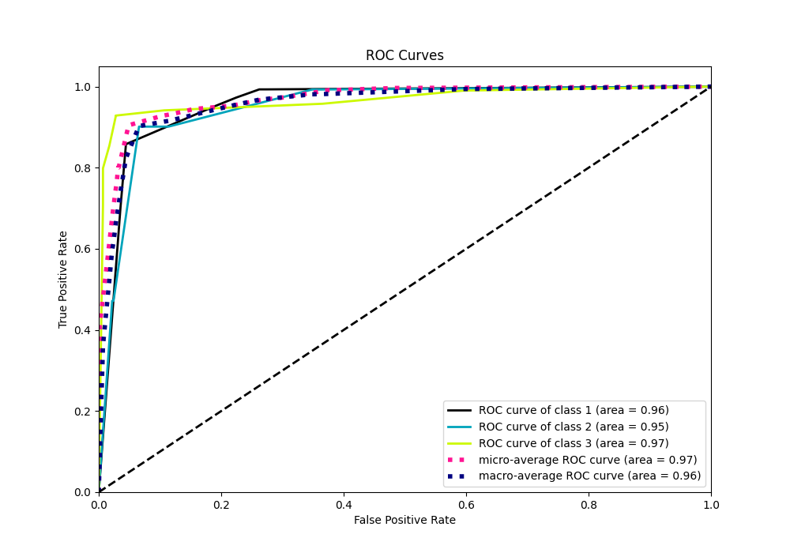
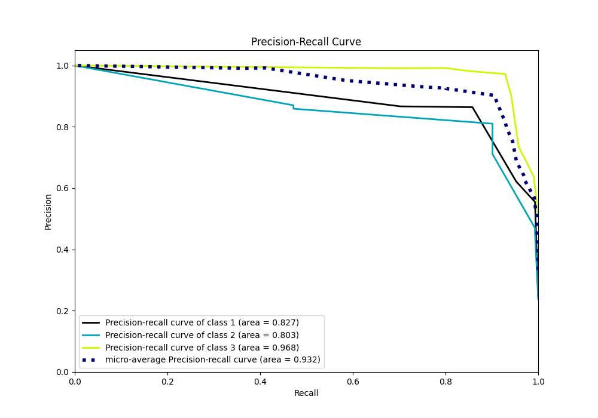

# Summary of 1_DecisionTree

[<< Go back](../README.md)

## Decision Tree
- **n_jobs**: -1
- **criterion**: entropy
- **max_depth**: 4
- **num_class**: 3
- **explain_level**: 1

## Validation
 - **validation_type**: split
 - **train_ratio**: 0.75
 - **shuffle**: True
 - **stratify**: True

## Optimized metric
f1

## Training time

5.2 seconds

### Metric details
|           |          1 |          2 |          3 |   accuracy |   macro avg |   weighted avg |   logloss |
|:----------|-----------:|-----------:|-----------:|-----------:|------------:|---------------:|----------:|
| precision |   0.863946 |   0.810127 |   0.972696 |    0.90301 |    0.882256 |       0.907178 |  0.340916 |
| recall    |   0.858108 |   0.901408 |   0.925325 |    0.90301 |    0.894947 |       0.90301  |  0.340916 |
| f1-score  |   0.861017 |   0.853333 |   0.948419 |    0.90301 |    0.88759  |       0.904209 |  0.340916 |
| support   | 148        | 142        | 308        |    0.90301 |  598        |     598        |  0.340916 |

## Confusion matrix
|              |   Predicted as 1 |   Predicted as 2 |   Predicted as 3 |
|:-------------|-----------------:|-----------------:|-----------------:|
| Labeled as 1 |              127 |               14 |                7 |
| Labeled as 2 |               13 |              128 |                1 |
| Labeled as 3 |                7 |               16 |              285 |

## Learning curves

## Permutation-based Importance

## Confusion Matrix

## Normalized Confusion Matrix

## ROC Curve

## Precision Recall Curve

[<< Go back](../README.md)
