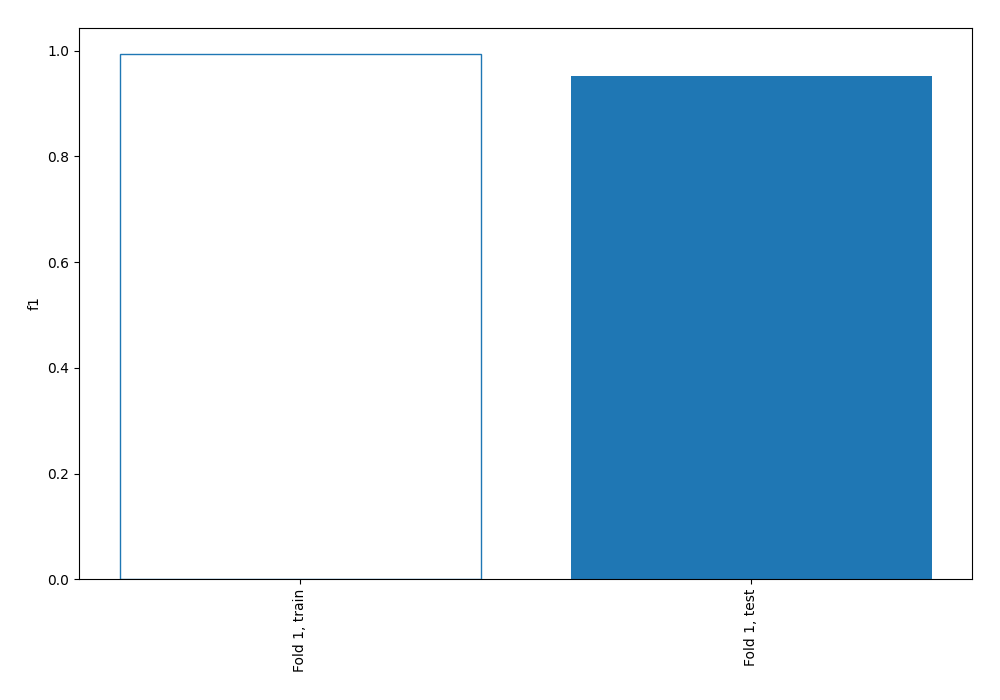
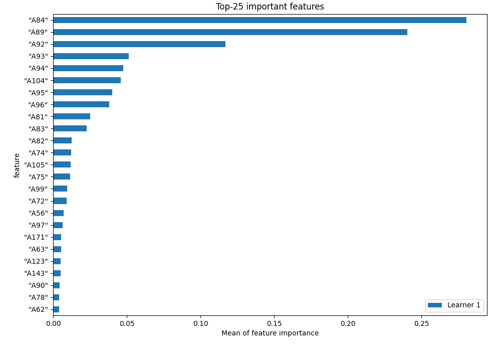
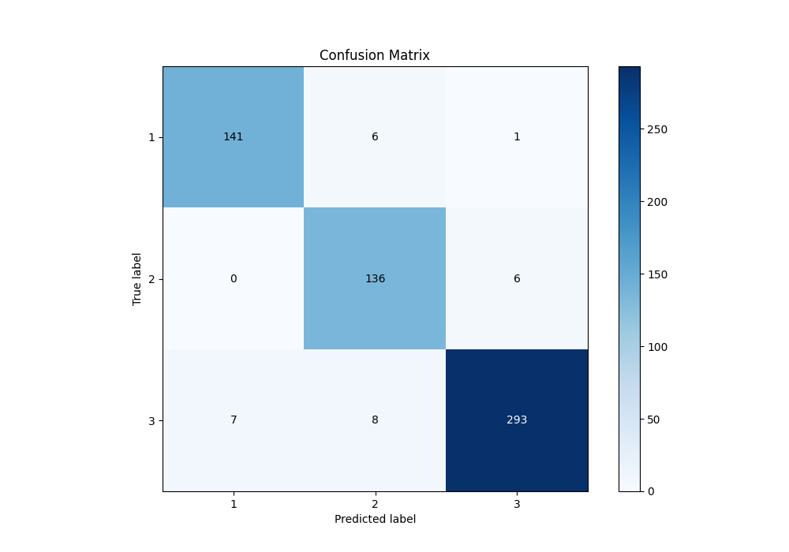
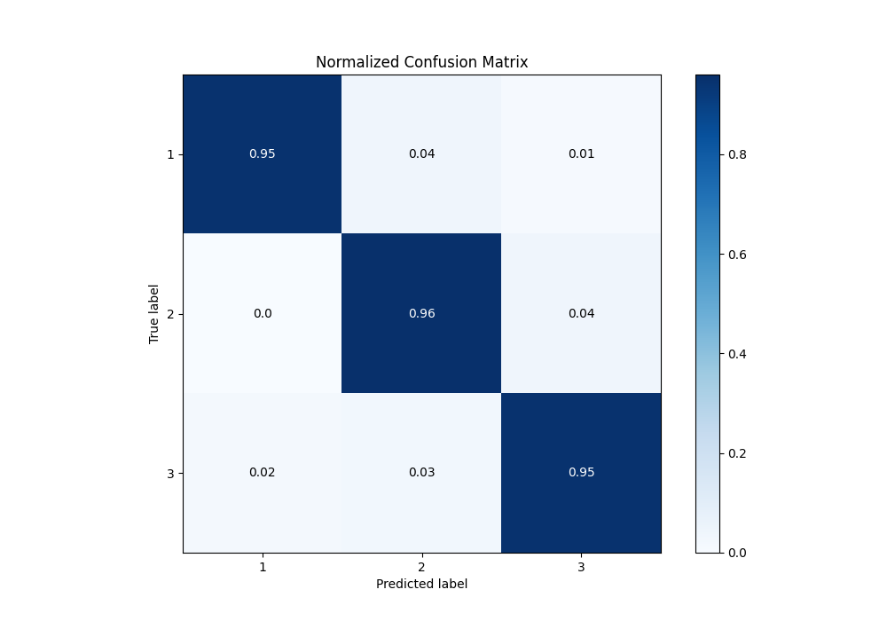
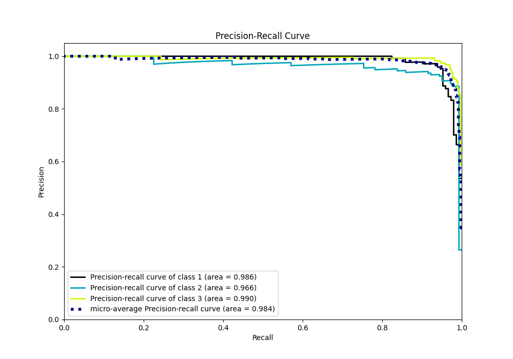

# Summary of 2_Linear

[<< Go back](../README.md)

## Logistic Regression (Linear)
- **n_jobs**: -1
- **num_class**: 3
- **explain_level**: 1

## Validation
 - **validation_type**: split
 - **train_ratio**: 0.75
 - **shuffle**: True
 - **stratify**: True

## Optimized metric
f1

## Training time

2.6 seconds

### Metric details
|           |          1 |          2 |          3 |   accuracy |   macro avg |   weighted avg |   logloss |
|:----------|-----------:|-----------:|-----------:|-----------:|------------:|---------------:|----------:|
| precision |   0.952703 |   0.906667 |   0.976667 |   0.953177 |    0.945345 |       0.954114 |  0.161165 |
| recall    |   0.952703 |   0.957746 |   0.951299 |   0.953177 |    0.953916 |       0.953177 |  0.161165 |
| f1-score  |   0.952703 |   0.931507 |   0.963816 |   0.953177 |    0.949342 |       0.953393 |  0.161165 |
| support   | 148        | 142        | 308        |   0.953177 |  598        |     598        |  0.161165 |

## Confusion matrix
|              |   Predicted as 1 |   Predicted as 2 |   Predicted as 3 |
|:-------------|-----------------:|-----------------:|-----------------:|
| Labeled as 1 |              141 |                6 |                1 |
| Labeled as 2 |                0 |              136 |                6 |
| Labeled as 3 |                7 |                8 |              293 |

## Learning curves

## Permutation-based Importance

## Confusion Matrix

## Normalized Confusion Matrix

## ROC Curve

## Precision Recall Curve

[<< Go back](../README.md)
