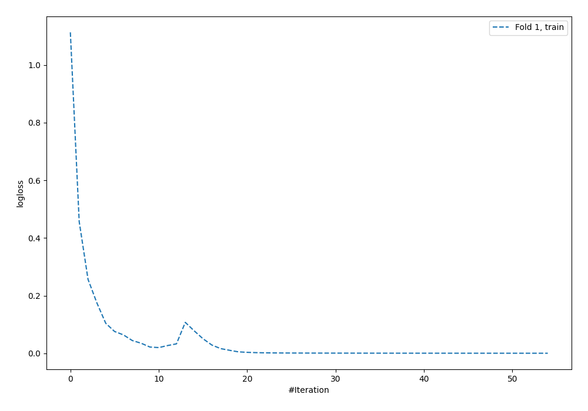
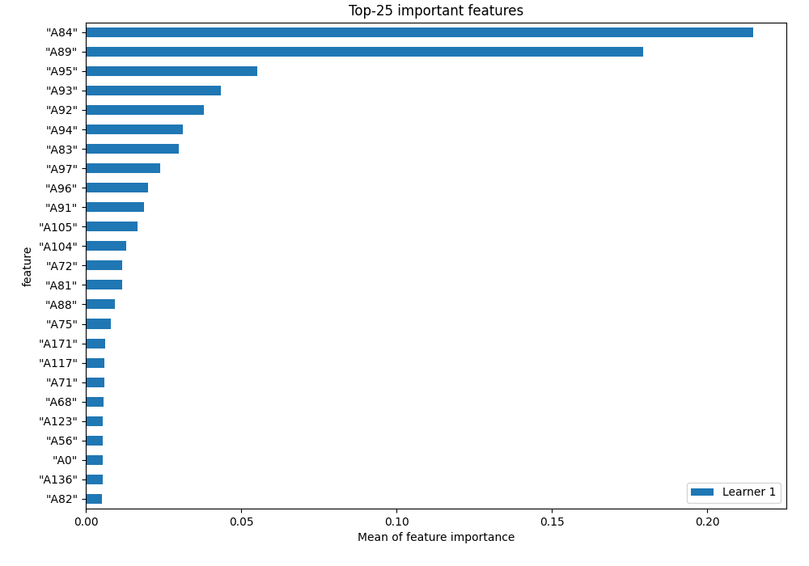
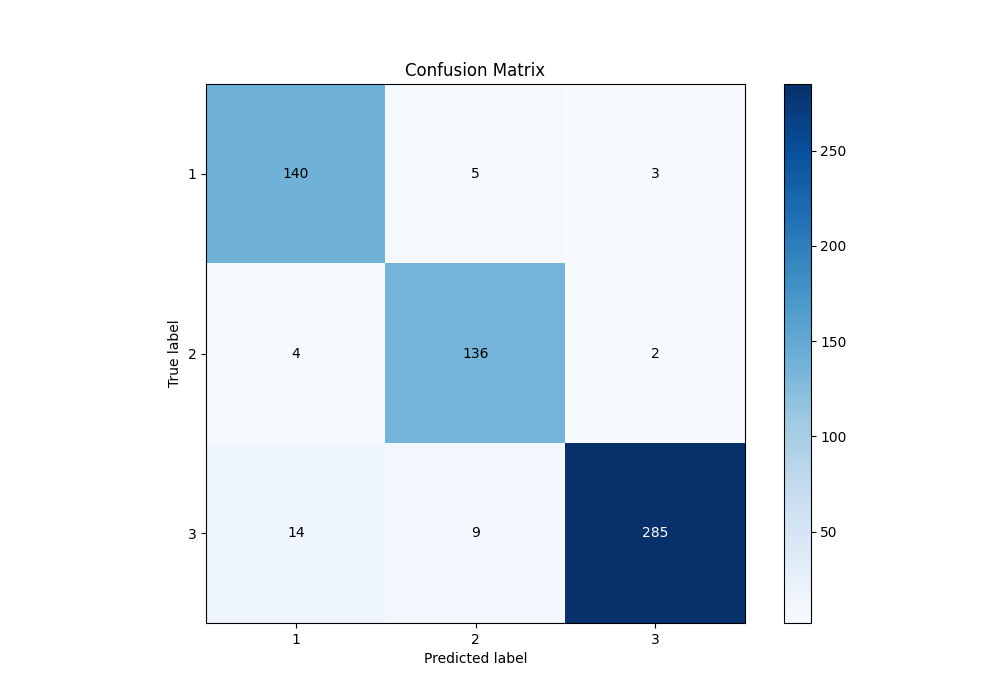
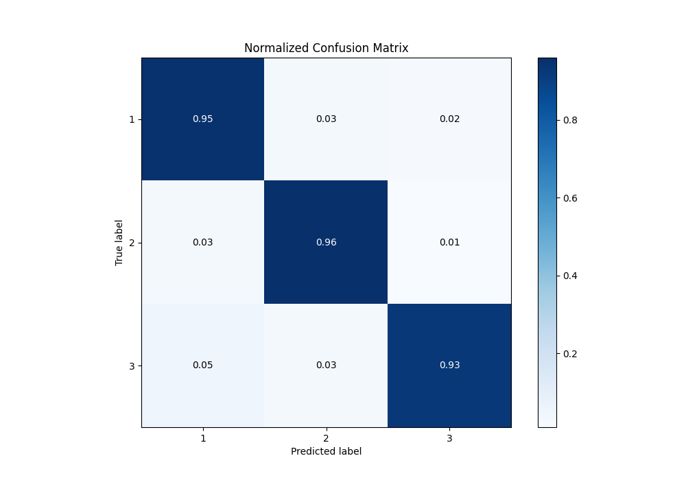
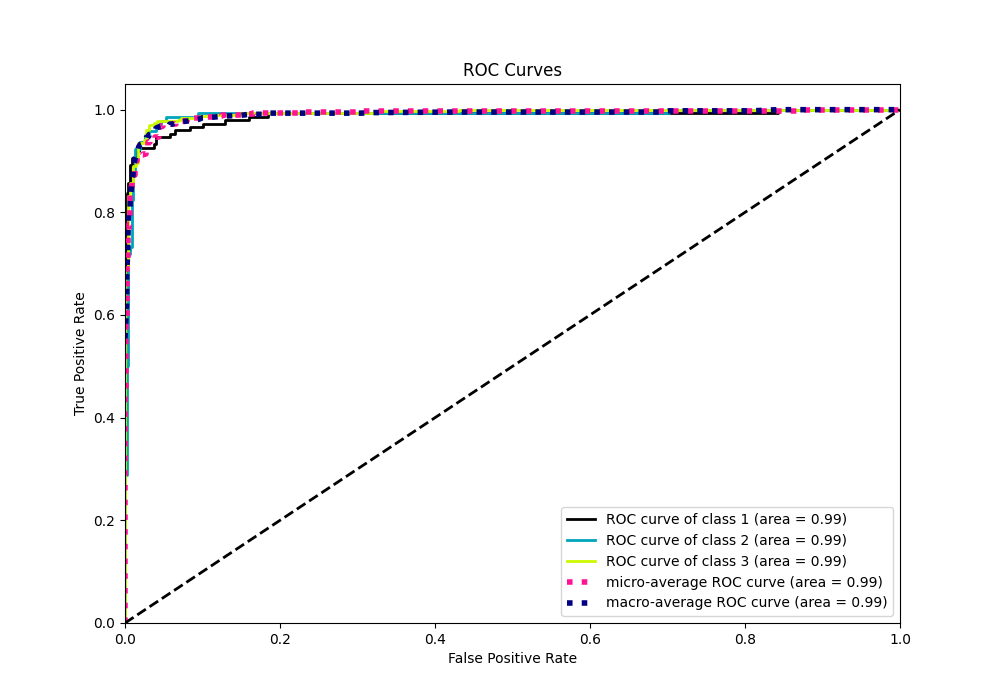
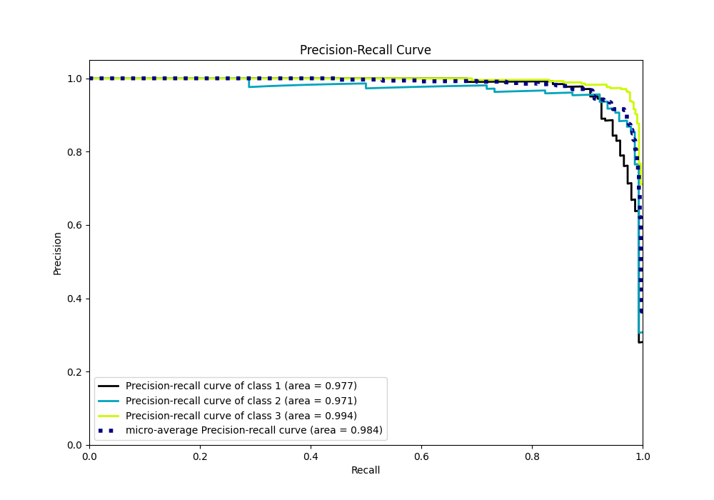

# Summary of 3_Default_NeuralNetwork

[<< Go back](../README.md)

## Neural Network
- **n_jobs**: -1
- **dense_1_size**: 32
- **dense_2_size**: 16
- **learning_rate**: 0.05
- **num_class**: 3
- **explain_level**: 1

## Validation
 - **validation_type**: split
 - **train_ratio**: 0.75
 - **shuffle**: True
 - **stratify**: True

## Optimized metric
f1

## Training time

2.3 seconds

### Metric details
|           |          1 |          2 |          3 |   accuracy |   macro avg |   weighted avg |   logloss |
|:----------|-----------:|-----------:|-----------:|-----------:|------------:|---------------:|----------:|
| precision |   0.886076 |   0.906667 |   0.982759 |   0.938127 |    0.925167 |       0.940762 |  0.199679 |
| recall    |   0.945946 |   0.957746 |   0.925325 |   0.938127 |    0.943006 |       0.938127 |  0.199679 |
| f1-score  |   0.915033 |   0.931507 |   0.953177 |   0.938127 |    0.933239 |       0.938591 |  0.199679 |
| support   | 148        | 142        | 308        |   0.938127 |  598        |     598        |  0.199679 |

## Confusion matrix
|              |   Predicted as 1 |   Predicted as 2 |   Predicted as 3 |
|:-------------|-----------------:|-----------------:|-----------------:|
| Labeled as 1 |              140 |                5 |                3 |
| Labeled as 2 |                4 |              136 |                2 |
| Labeled as 3 |               14 |                9 |              285 |

## Learning curves

## Permutation-based Importance

## Confusion Matrix

## Normalized Confusion Matrix

## ROC Curve

## Precision Recall Curve

[<< Go back](../README.md)
