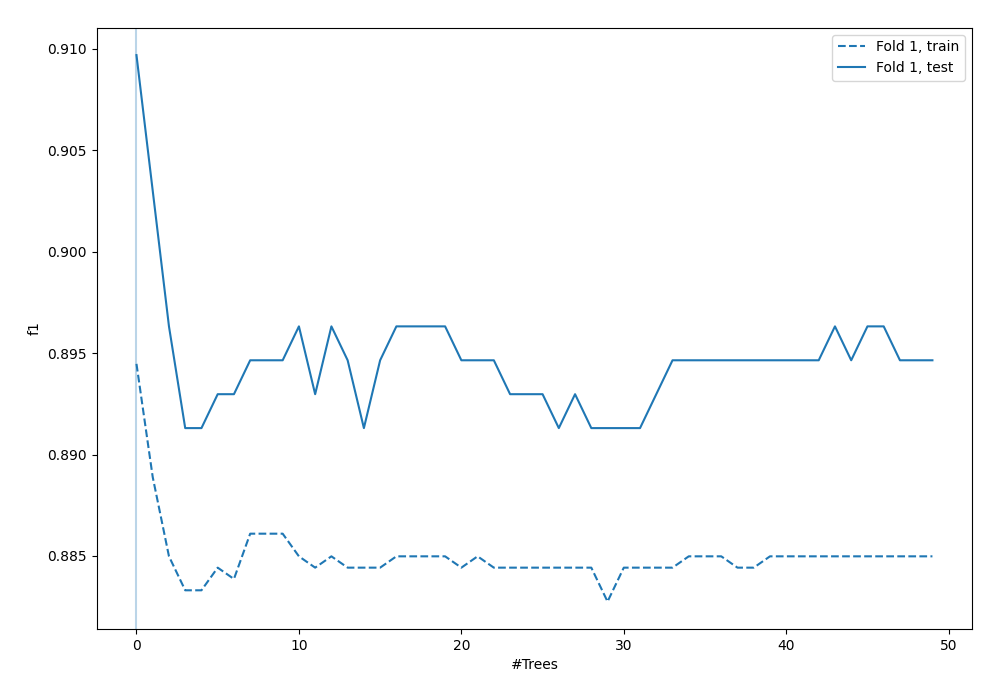
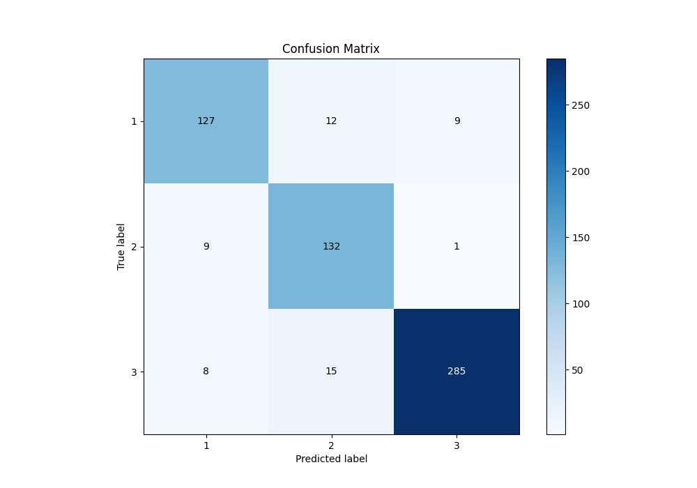
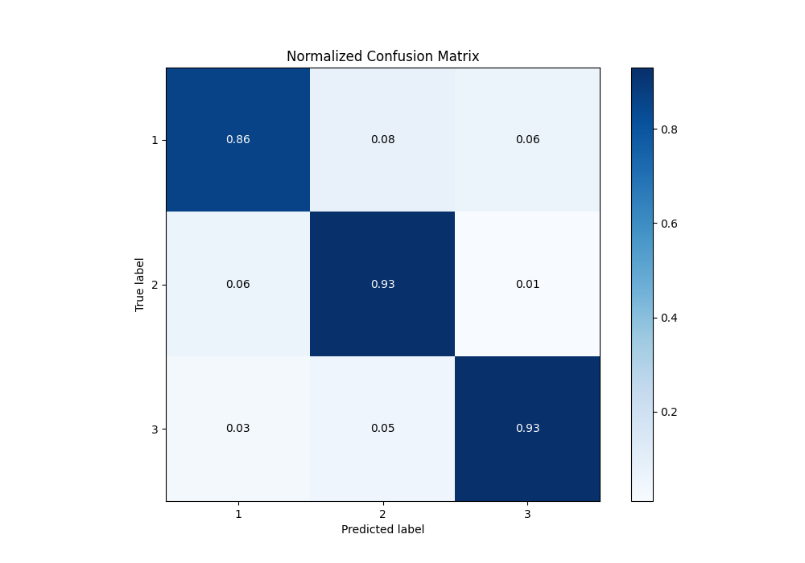
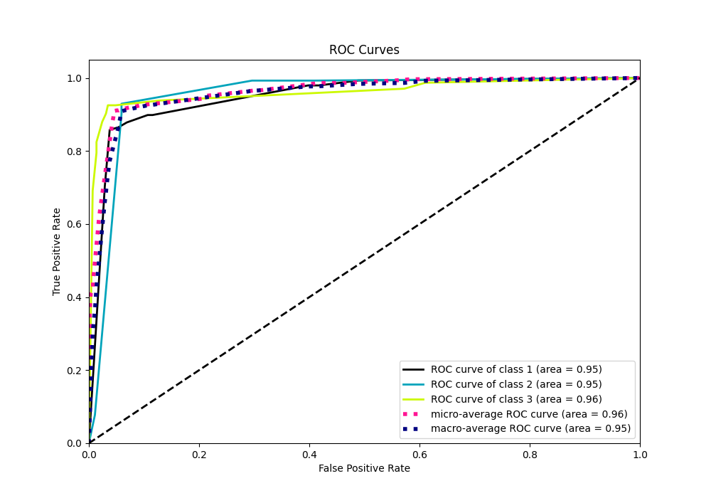
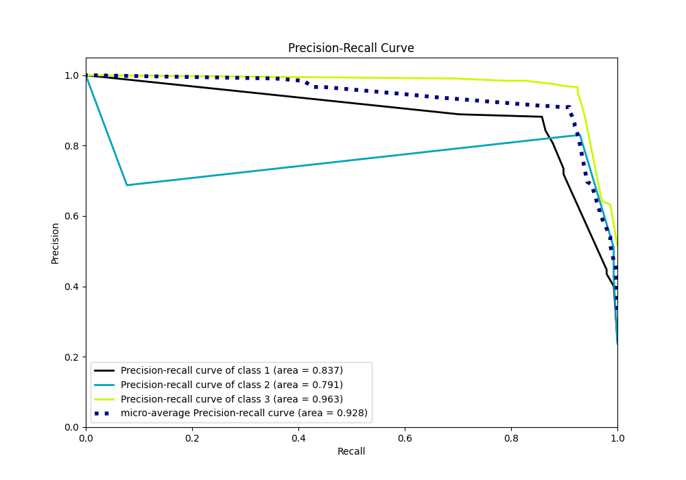

# Summary of 4_Default_RandomForest

[<< Go back](../README.md)

## Random Forest
- **n_jobs**: -1
- **criterion**: gini
- **max_features**: 0.9
- **min_samples_split**: 30
- **max_depth**: 4
- **eval_metric_name**: f1
- **num_class**: 3
- **explain_level**: 1

## Validation
 - **validation_type**: split
 - **train_ratio**: 0.75
 - **shuffle**: True
 - **stratify**: True

## Optimized metric
f1

## Training time

3.6 seconds

### Metric details
|           |          1 |          2 |          3 |   accuracy |   macro avg |   weighted avg |   logloss |
|:----------|-----------:|-----------:|-----------:|-----------:|------------:|---------------:|----------:|
| precision |   0.881944 |   0.830189 |   0.966102 |   0.909699 |    0.892745 |       0.913    |  0.349845 |
| recall    |   0.858108 |   0.929577 |   0.925325 |   0.909699 |    0.904337 |       0.909699 |  0.349845 |
| f1-score  |   0.869863 |   0.877076 |   0.945274 |   0.909699 |    0.897404 |       0.910416 |  0.349845 |
| support   | 148        | 142        | 308        |   0.909699 |  598        |     598        |  0.349845 |

## Confusion matrix
|              |   Predicted as 1 |   Predicted as 2 |   Predicted as 3 |
|:-------------|-----------------:|-----------------:|-----------------:|
| Labeled as 1 |              127 |               12 |                9 |
| Labeled as 2 |                9 |              132 |                1 |
| Labeled as 3 |                8 |               15 |              285 |

## Learning curves

## Permutation-based Importance

## Confusion Matrix

## Normalized Confusion Matrix

## ROC Curve

## Precision Recall Curve

[<< Go back](../README.md)
