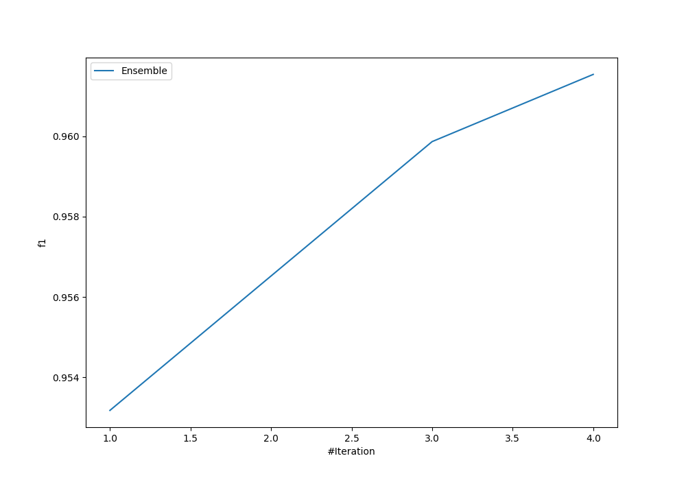
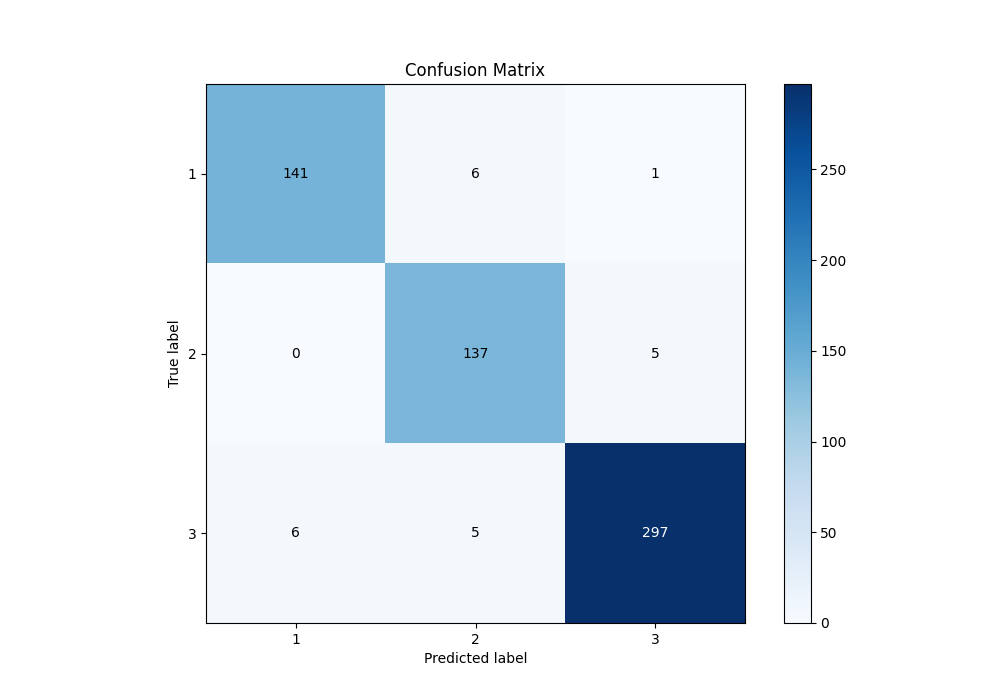
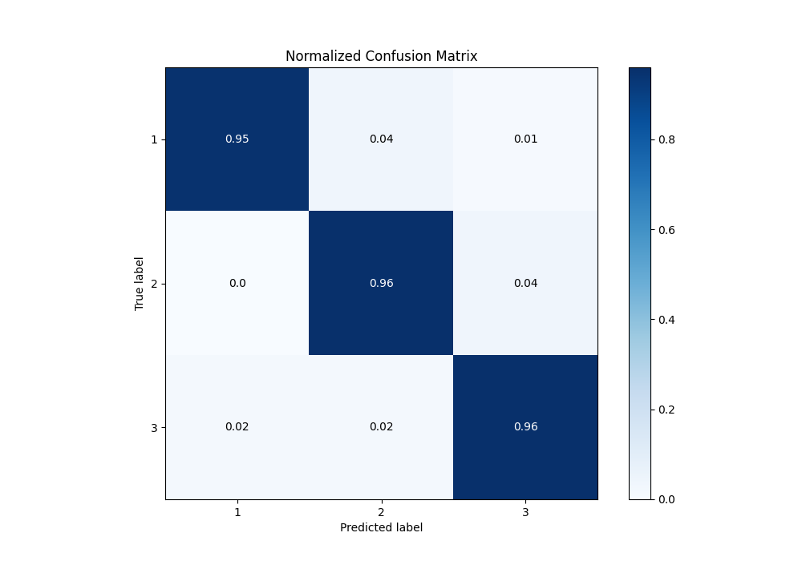
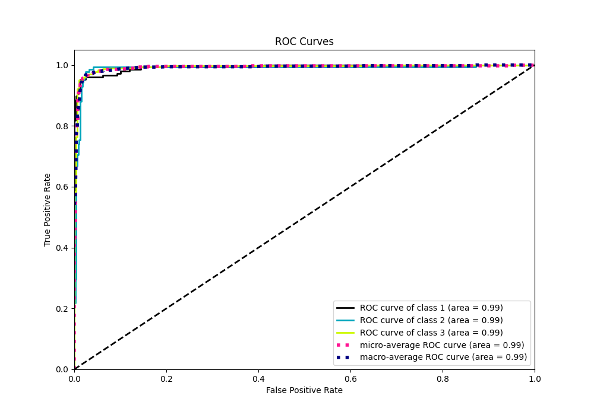

# Summary of Ensemble

[<< Go back](../README.md)

## Ensemble structure
| Model                   |   Weight |
|:------------------------|---------:|
| 2_Linear                |        3 |
| 3_Default_NeuralNetwork |        1 |

### Metric details
|           |          1 |          2 |          3 |   accuracy |   macro avg |   weighted avg |   logloss |
|:----------|-----------:|-----------:|-----------:|-----------:|------------:|---------------:|----------:|
| precision |   0.959184 |   0.925676 |   0.980198 |   0.961538 |    0.955019 |       0.96205  |  0.153471 |
| recall    |   0.952703 |   0.964789 |   0.964286 |   0.961538 |    0.960592 |       0.961538 |  0.153471 |
| f1-score  |   0.955932 |   0.944828 |   0.972177 |   0.961538 |    0.957646 |       0.961662 |  0.153471 |
| support   | 148        | 142        | 308        |   0.961538 |  598        |     598        |  0.153471 |

## Confusion matrix
|              |   Predicted as 1 |   Predicted as 2 |   Predicted as 3 |
|:-------------|-----------------:|-----------------:|-----------------:|
| Labeled as 1 |              141 |                6 |                1 |
| Labeled as 2 |                0 |              137 |                5 |
| Labeled as 3 |                6 |                5 |              297 |

## Learning curves

## Confusion Matrix

## Normalized Confusion Matrix

## ROC Curve

## Precision Recall Curve

[<< Go back](../README.md)
