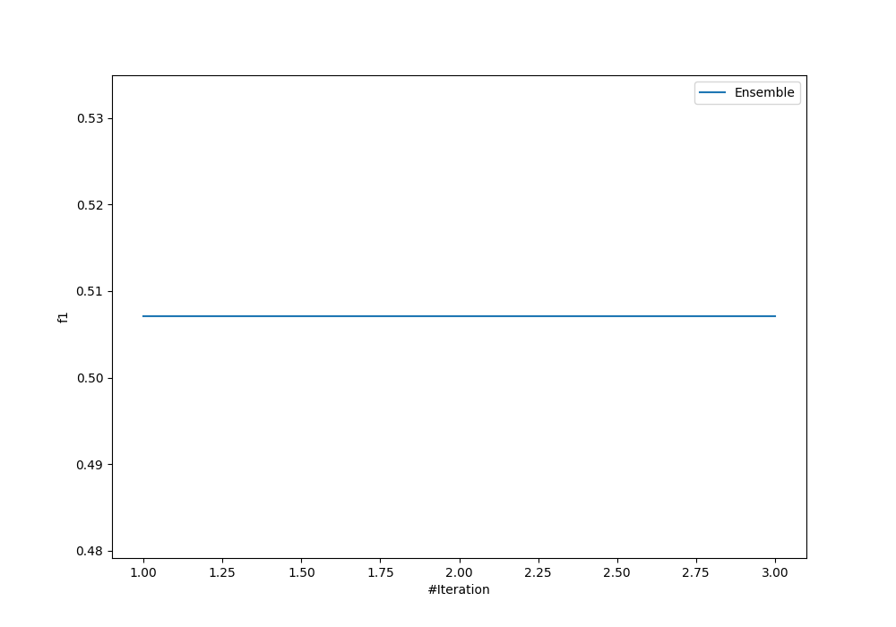
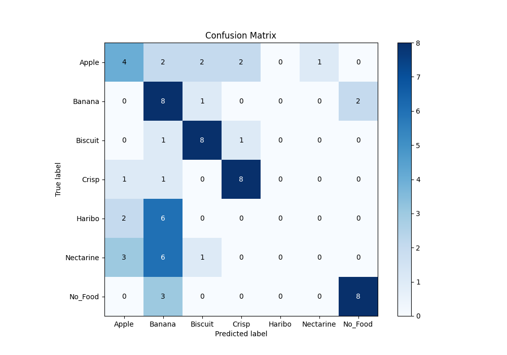
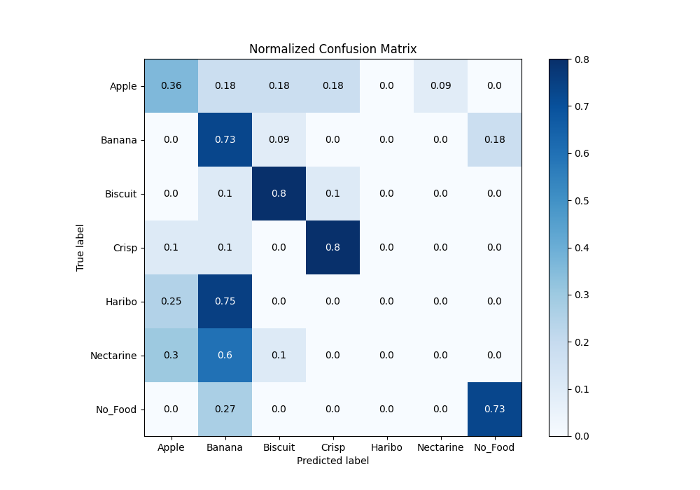
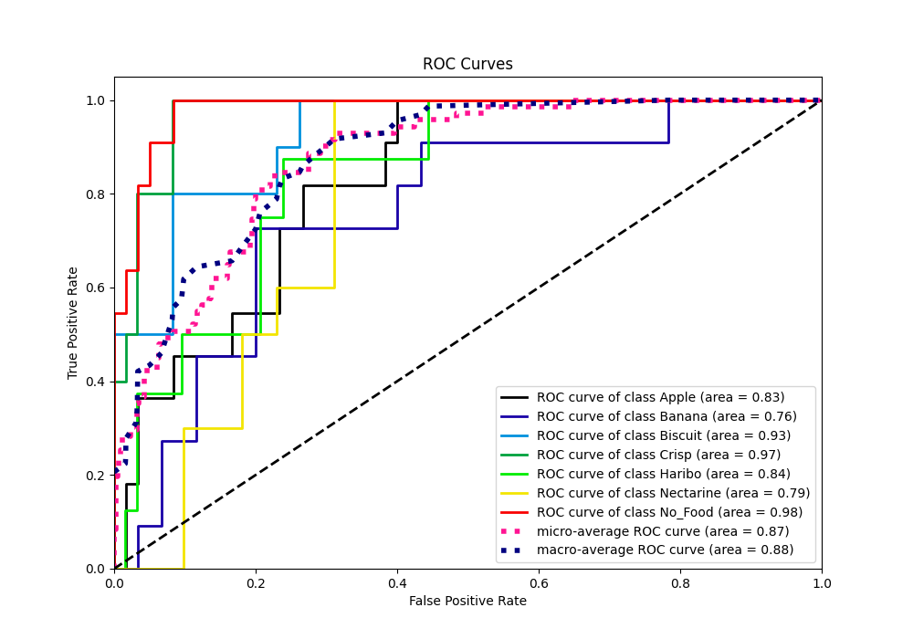
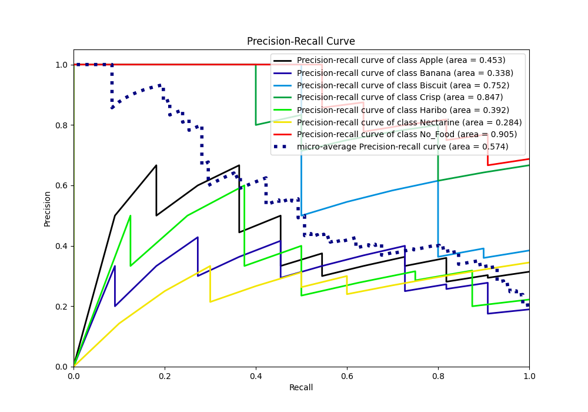

# Summary of Ensemble

[<< Go back](../README.md)

## Ensemble structure
| Model                  |   Weight |
|:-----------------------|---------:|
| 3_Default_RandomForest |        1 |

### Metric details
|           |     Apple |    Banana |   Biscuit |     Crisp |   Haribo |   Nectarine |   No_Food |   accuracy |   macro avg |   weighted avg |   logloss |
|:----------|----------:|----------:|----------:|----------:|---------:|------------:|----------:|-----------:|------------:|---------------:|----------:|
| precision |  0.4      |  0.296296 |  0.666667 |  0.727273 |        0 |           0 |  0.8      |   0.507042 |    0.412891 |       0.42815  |   1.36249 |
| recall    |  0.363636 |  0.727273 |  0.8      |  0.8      |        0 |           0 |  0.727273 |   0.507042 |    0.488312 |       0.507042 |   1.36249 |
| f1-score  |  0.380952 |  0.421053 |  0.727273 |  0.761905 |        0 |           0 |  0.761905 |   0.507042 |    0.436155 |       0.452039 |   1.36249 |
| support   | 11        | 11        | 10        | 10        |        8 |          10 | 11        |   0.507042 |   71        |      71        |   1.36249 |

## Confusion matrix
|                      |   Predicted as Apple |   Predicted as Banana |   Predicted as Biscuit |   Predicted as Crisp |   Predicted as Haribo |   Predicted as Nectarine |   Predicted as No_Food |
|:---------------------|---------------------:|----------------------:|-----------------------:|---------------------:|----------------------:|-------------------------:|-----------------------:|
| Labeled as Apple     |                    4 |                     2 |                      2 |                    2 |                     0 |                        1 |                      0 |
| Labeled as Banana    |                    0 |                     8 |                      1 |                    0 |                     0 |                        0 |                      2 |
| Labeled as Biscuit   |                    0 |                     1 |                      8 |                    1 |                     0 |                        0 |                      0 |
| Labeled as Crisp     |                    1 |                     1 |                      0 |                    8 |                     0 |                        0 |                      0 |
| Labeled as Haribo    |                    2 |                     6 |                      0 |                    0 |                     0 |                        0 |                      0 |
| Labeled as Nectarine |                    3 |                     6 |                      1 |                    0 |                     0 |                        0 |                      0 |
| Labeled as No_Food   |                    0 |                     3 |                      0 |                    0 |                     0 |                        0 |                      8 |

## Learning curves

## Confusion Matrix

## Normalized Confusion Matrix

## ROC Curve

## Precision Recall Curve

[<< Go back](../README.md)
