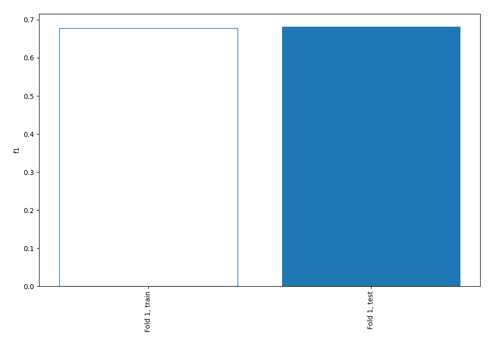
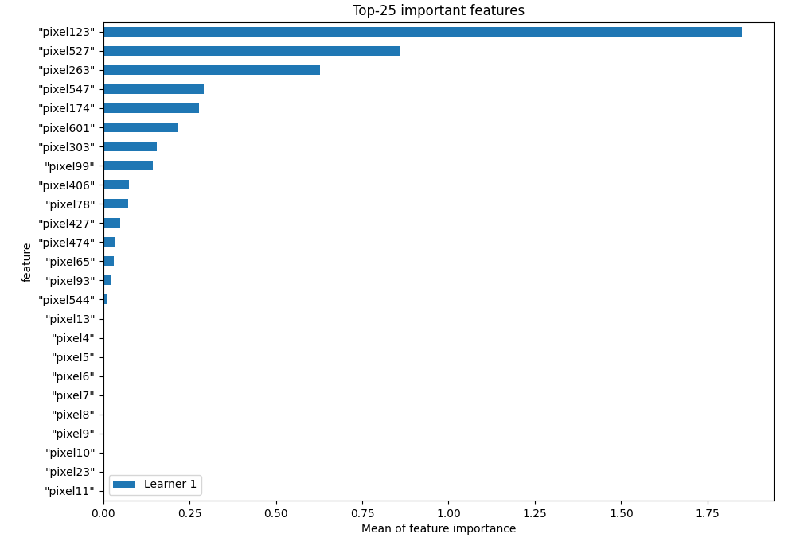
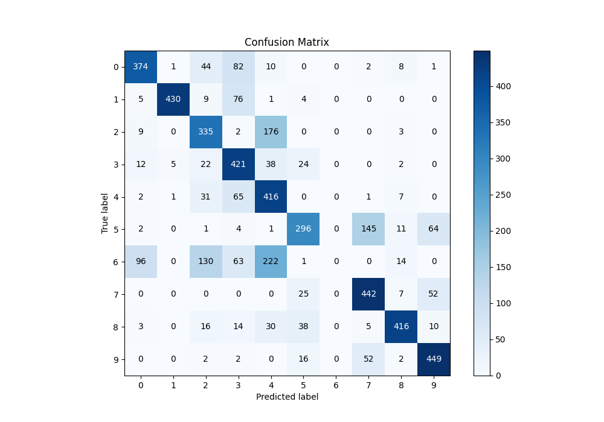
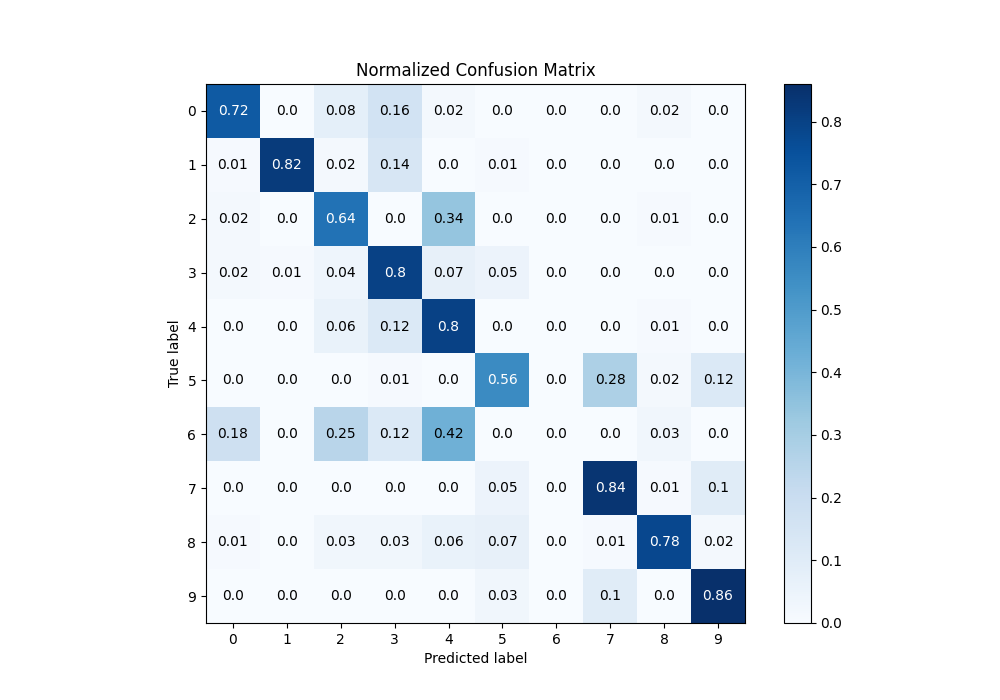
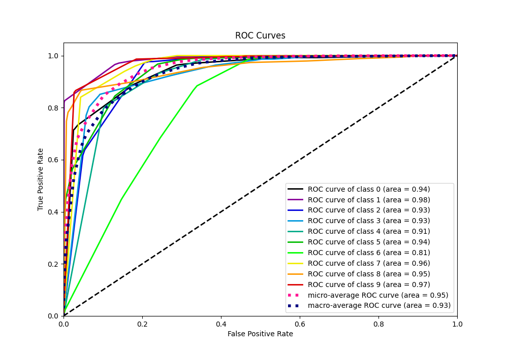
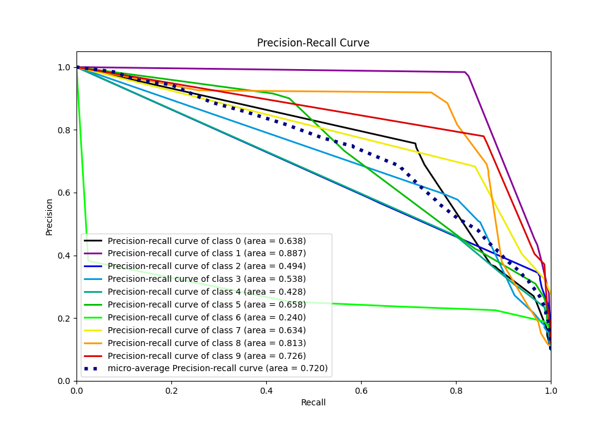

# Summary of 1_DecisionTree

[<< Go back](../README.md)

## Decision Tree
- **n_jobs**: -1
- **criterion**: entropy
- **max_depth**: 4
- **num_class**: 10
- **explain_level**: 1

## Validation
 - **validation_type**: split
 - **train_ratio**: 0.9
 - **shuffle**: True
 - **stratify**: True

## Optimized metric
f1

## Training time

35.3 seconds

### Metric details
|           |          0 |          1 |          2 |          3 |          4 |          5 |   6 |          7 |          8 |          9 |   accuracy |   macro avg |   weighted avg |   logloss |
|:----------|-----------:|-----------:|-----------:|-----------:|-----------:|-----------:|----:|-----------:|-----------:|-----------:|-----------:|------------:|---------------:|----------:|
| precision |   0.743539 |   0.983982 |   0.567797 |   0.577503 |   0.465324 |   0.732673 |   0 |   0.683153 |   0.885106 |   0.779514 |   0.681714 |    0.641859 |       0.642021 |  0.941886 |
| recall    |   0.716475 |   0.819048 |   0.638095 |   0.803435 |   0.795411 |   0.564885 |   0 |   0.840304 |   0.781955 |   0.858509 |   0.681714 |    0.681812 |       0.681714 |  0.941886 |
| f1-score  |   0.729756 |   0.893971 |   0.600897 |   0.671987 |   0.587156 |   0.637931 |   0 |   0.753623 |   0.830339 |   0.817106 |   0.681714 |    0.652277 |       0.652326 |  0.941886 |
| support   | 522        | 525        | 525        | 524        | 523        | 524        | 526 | 526        | 532        | 523        |   0.681714 | 5250        |    5250        |  0.941886 |

## Confusion matrix
|              |   Predicted as 0 |   Predicted as 1 |   Predicted as 2 |   Predicted as 3 |   Predicted as 4 |   Predicted as 5 |   Predicted as 6 |   Predicted as 7 |   Predicted as 8 |   Predicted as 9 |
|:-------------|-----------------:|-----------------:|-----------------:|-----------------:|-----------------:|-----------------:|-----------------:|-----------------:|-----------------:|-----------------:|
| Labeled as 0 |              374 |                1 |               44 |               82 |               10 |                0 |                0 |                2 |                8 |                1 |
| Labeled as 1 |                5 |              430 |                9 |               76 |                1 |                4 |                0 |                0 |                0 |                0 |
| Labeled as 2 |                9 |                0 |              335 |                2 |              176 |                0 |                0 |                0 |                3 |                0 |
| Labeled as 3 |               12 |                5 |               22 |              421 |               38 |               24 |                0 |                0 |                2 |                0 |
| Labeled as 4 |                2 |                1 |               31 |               65 |              416 |                0 |                0 |                1 |                7 |                0 |
| Labeled as 5 |                2 |                0 |                1 |                4 |                1 |              296 |                0 |              145 |               11 |               64 |
| Labeled as 6 |               96 |                0 |              130 |               63 |              222 |                1 |                0 |                0 |               14 |                0 |
| Labeled as 7 |                0 |                0 |                0 |                0 |                0 |               25 |                0 |              442 |                7 |               52 |
| Labeled as 8 |                3 |                0 |               16 |               14 |               30 |               38 |                0 |                5 |              416 |               10 |
| Labeled as 9 |                0 |                0 |                2 |                2 |                0 |               16 |                0 |               52 |                2 |              449 |

## Learning curves

## Permutation-based Importance

## Confusion Matrix

## Normalized Confusion Matrix

## ROC Curve

## Precision Recall Curve

[<< Go back](../README.md)
