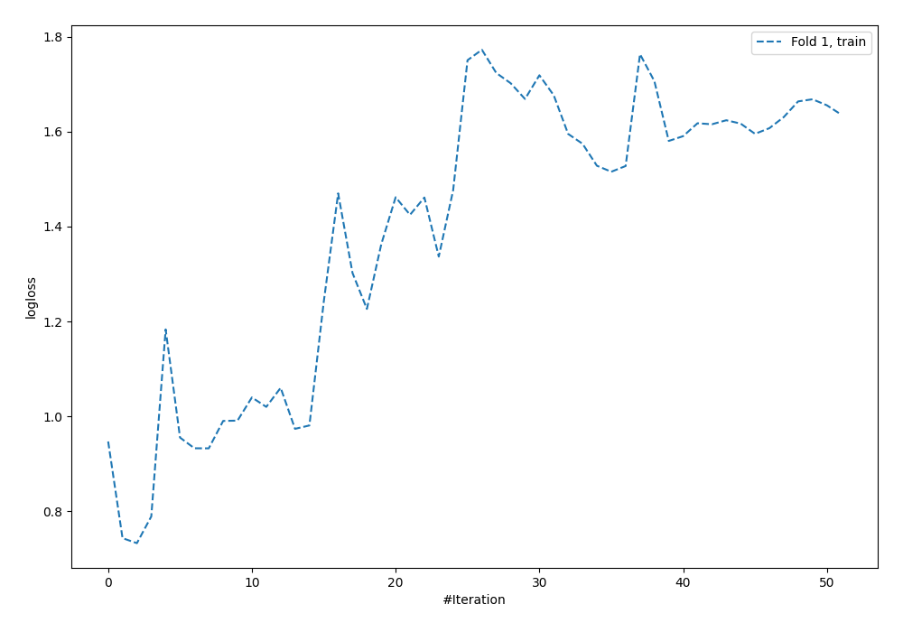
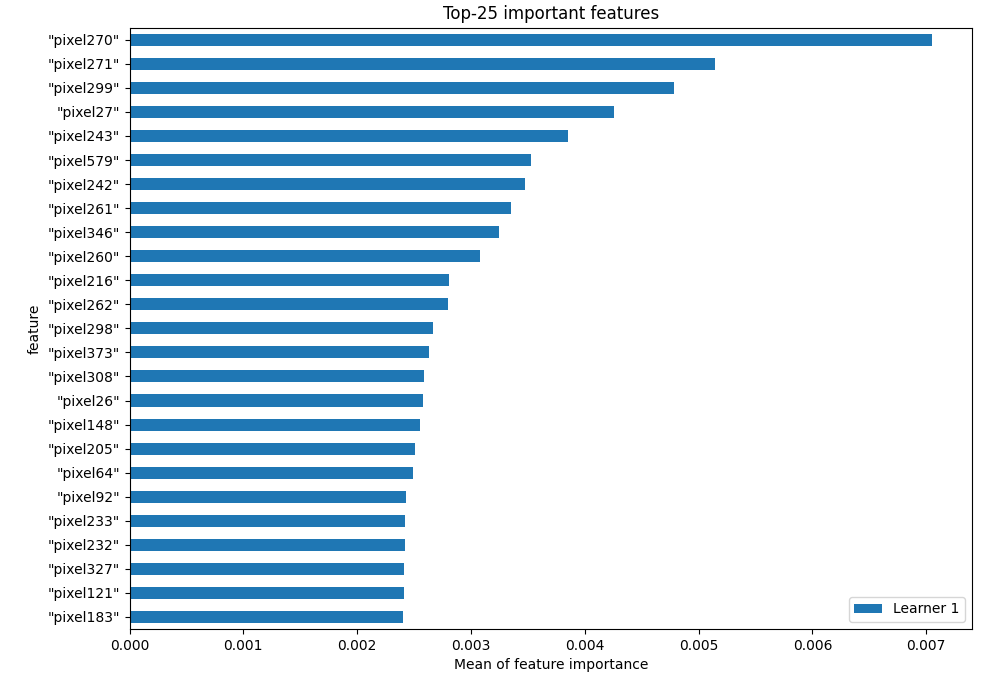
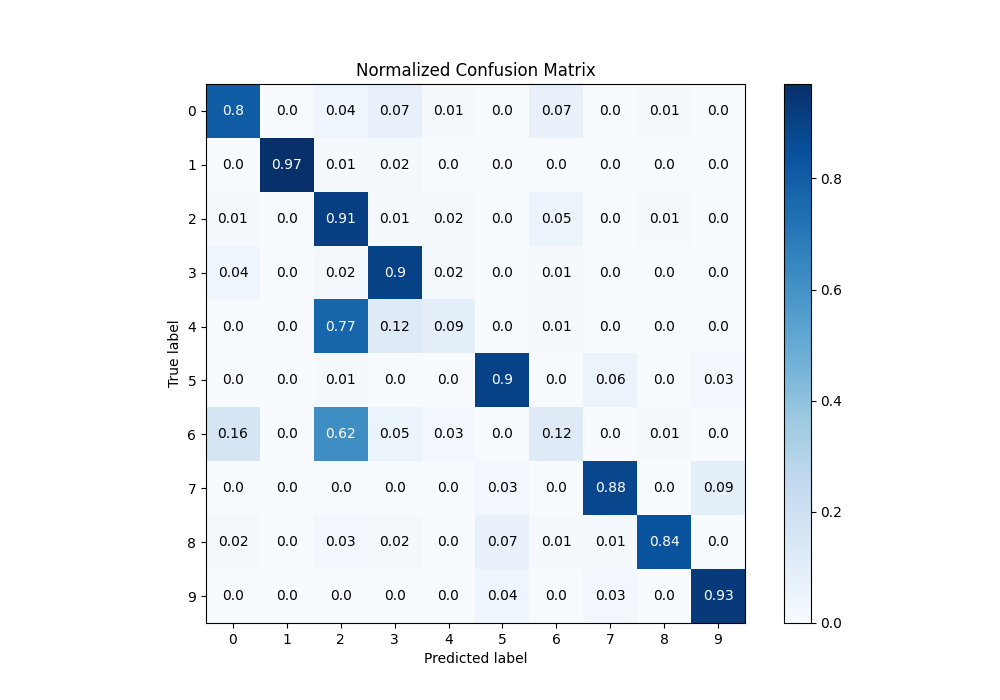
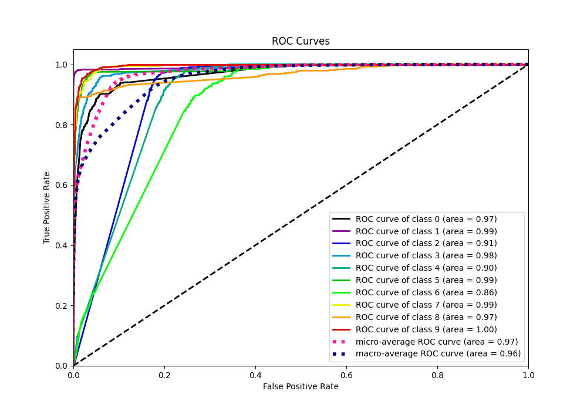
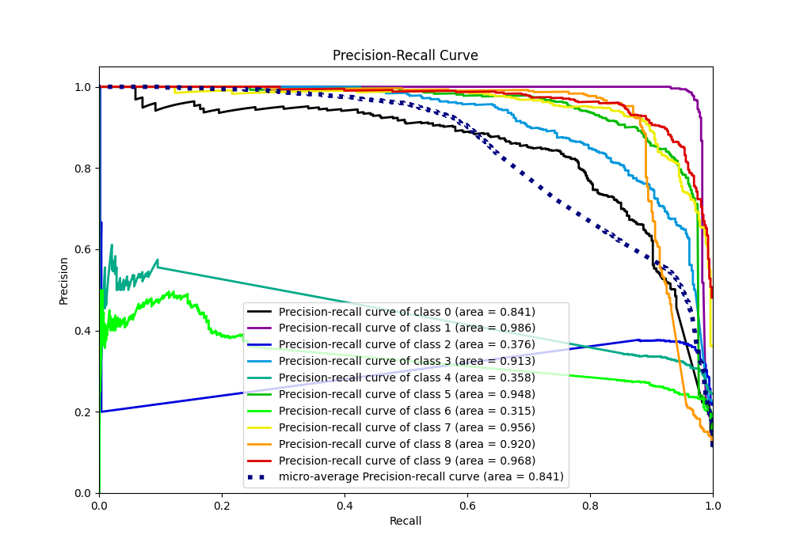

# Summary of 2_Default_NeuralNetwork

[<< Go back](../README.md)

## Neural Network
- **n_jobs**: -1
- **dense_1_size**: 32
- **dense_2_size**: 16
- **learning_rate**: 0.05
- **num_class**: 10
- **explain_level**: 1

## Validation
 - **validation_type**: split
 - **train_ratio**: 0.9
 - **shuffle**: True
 - **stratify**: True

## Optimized metric
f1

## Training time

138.2 seconds

### Metric details
|           |          0 |          1 |          2 |          3 |           4 |          5 |          6 |          7 |          8 |          9 |   accuracy |   macro avg |   weighted avg |   logloss |
|:----------|-----------:|-----------:|-----------:|-----------:|------------:|-----------:|-----------:|-----------:|-----------:|-----------:|-----------:|------------:|---------------:|----------:|
| precision |   0.776536 |   0.978805 |   0.376285 |   0.748808 |   0.534884  |   0.86     |   0.460993 |   0.908023 |   0.959315 |   0.889908 |   0.733905 |    0.749356 |       0.749603 |  0.699467 |
| recall    |   0.798851 |   0.967619 |   0.906667 |   0.898855 |   0.0879541 |   0.902672 |   0.123574 |   0.882129 |   0.842105 |   0.927342 |   0.733905 |    0.733777 |       0.733905 |  0.699467 |
| f1-score  |   0.787535 |   0.97318  |   0.531844 |   0.816999 |   0.151067  |   0.880819 |   0.194903 |   0.894889 |   0.896897 |   0.90824  |   0.733905 |    0.703637 |       0.703864 |  0.699467 |
| support   | 522        | 525        | 525        | 524        | 523         | 524        | 526        | 526        | 532        | 523        |   0.733905 | 5250        |    5250        |  0.699467 |

## Confusion matrix
|              |   Predicted as 0 |   Predicted as 1 |   Predicted as 2 |   Predicted as 3 |   Predicted as 4 |   Predicted as 5 |   Predicted as 6 |   Predicted as 7 |   Predicted as 8 |   Predicted as 9 |
|:-------------|-----------------:|-----------------:|-----------------:|-----------------:|-----------------:|-----------------:|-----------------:|-----------------:|-----------------:|-----------------:|
| Labeled as 0 |              417 |                0 |               23 |               38 |                5 |                0 |               35 |                0 |                4 |                0 |
| Labeled as 1 |                0 |              508 |                3 |               13 |                0 |                0 |                1 |                0 |                0 |                0 |
| Labeled as 2 |                5 |                1 |              476 |                4 |                9 |                1 |               25 |                0 |                4 |                0 |
| Labeled as 3 |               23 |                1 |               13 |              471 |               10 |                0 |                5 |                0 |                1 |                0 |
| Labeled as 4 |                1 |                2 |              403 |               65 |               46 |                0 |                5 |                0 |                1 |                0 |
| Labeled as 5 |                0 |                2 |                3 |                0 |                0 |              473 |                0 |               30 |                2 |               14 |
| Labeled as 6 |               83 |                0 |              328 |               27 |               15 |                1 |               65 |                0 |                7 |                0 |
| Labeled as 7 |                0 |                2 |                0 |                0 |                0 |               15 |                0 |              464 |                0 |               45 |
| Labeled as 8 |                8 |                1 |               16 |               11 |                0 |               39 |                5 |                3 |              448 |                1 |
| Labeled as 9 |                0 |                2 |                0 |                0 |                1 |               21 |                0 |               14 |                0 |              485 |

## Learning curves

## Permutation-based Importance

## Confusion Matrix

## Normalized Confusion Matrix

## ROC Curve

## Precision Recall Curve

[<< Go back](../README.md)
