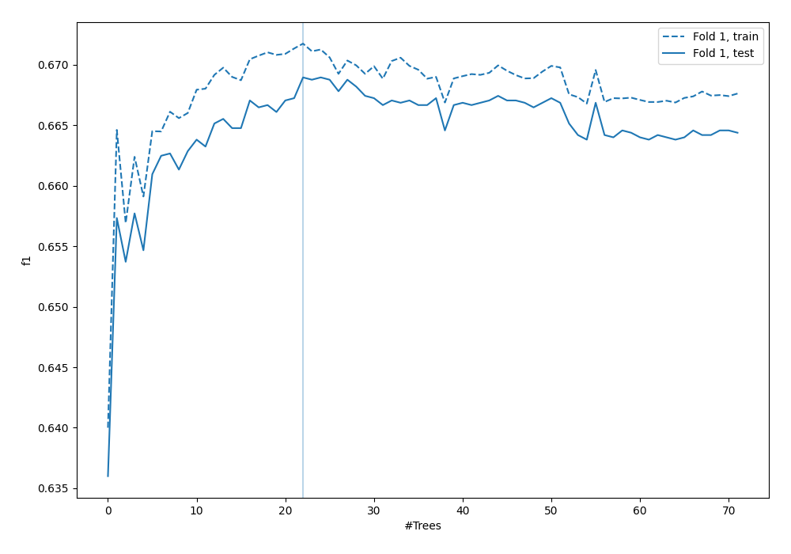
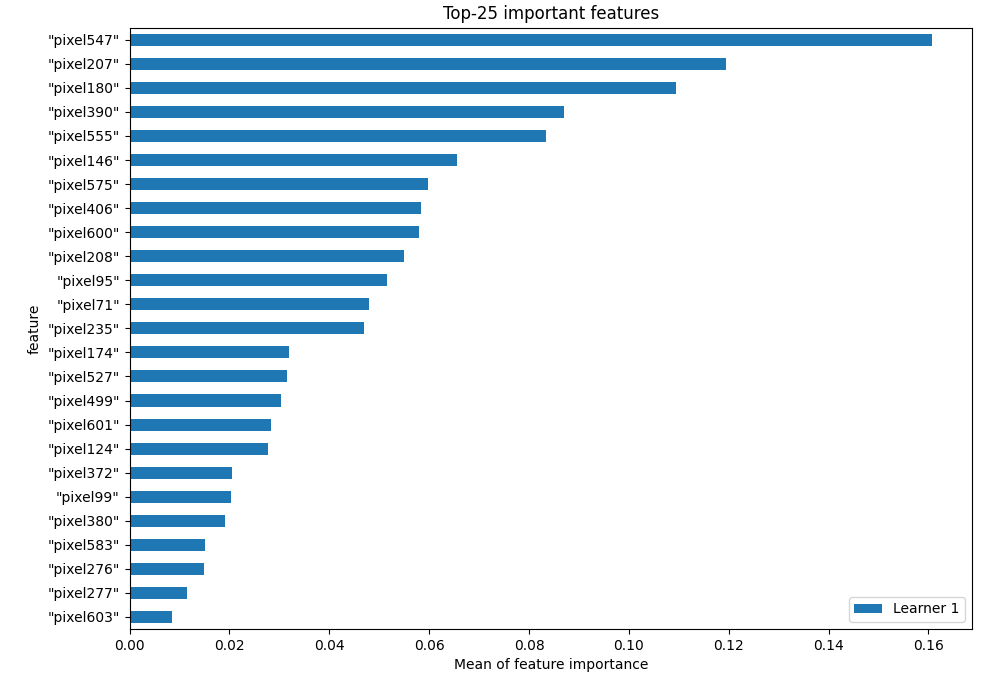
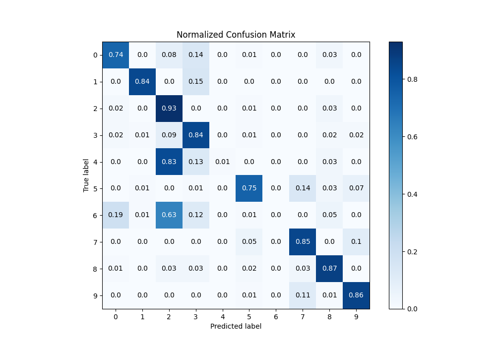
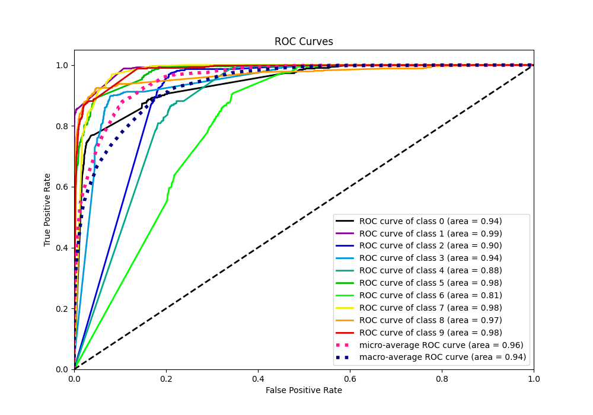
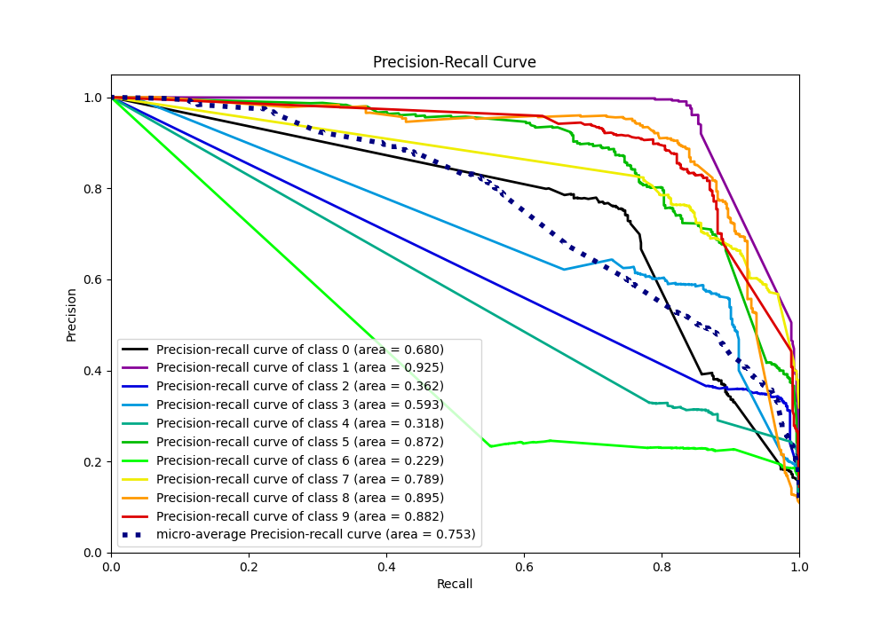

# Summary of 3_Default_RandomForest

[<< Go back](../README.md)

## Random Forest
- **n_jobs**: -1
- **criterion**: gini
- **max_features**: 0.9
- **min_samples_split**: 30
- **max_depth**: 4
- **eval_metric_name**: f1
- **num_class**: 10
- **explain_level**: 1

## Validation
 - **validation_type**: split
 - **train_ratio**: 0.9
 - **shuffle**: True
 - **stratify**: True

## Optimized metric
f1

## Training time

107.0 seconds

### Metric details
|           |          0 |          1 |          2 |          3 |            4 |          5 |   6 |          7 |          8 |          9 |   accuracy |   macro avg |   weighted avg |   logloss |
|:----------|-----------:|-----------:|-----------:|-----------:|-------------:|-----------:|----:|-----------:|-----------:|-----------:|-----------:|------------:|---------------:|----------:|
| precision |   0.75442  |   0.969365 |   0.357771 |   0.594595 |   1          |   0.847312 |   0 |   0.752961 |   0.815466 |   0.817029 |   0.668952 |    0.690892 |       0.690725 |  0.897161 |
| recall    |   0.735632 |   0.84381  |   0.929524 |   0.839695 |   0.00573614 |   0.751908 |   0 |   0.846008 |   0.87218  |   0.862333 |   0.668952 |    0.668683 |       0.668952 |  0.897161 |
| f1-score  |   0.744908 |   0.90224  |   0.516675 |   0.696203 |   0.0114068  |   0.796764 |   0 |   0.796777 |   0.84287  |   0.83907  |   0.668952 |    0.614691 |       0.614933 |  0.897161 |
| support   | 522        | 525        | 525        | 524        | 523          | 524        | 526 | 526        | 532        | 523        |   0.668952 | 5250        |    5250        |  0.897161 |

## Confusion matrix
|              |   Predicted as 0 |   Predicted as 1 |   Predicted as 2 |   Predicted as 3 |   Predicted as 4 |   Predicted as 5 |   Predicted as 6 |   Predicted as 7 |   Predicted as 8 |   Predicted as 9 |
|:-------------|-----------------:|-----------------:|-----------------:|-----------------:|-----------------:|-----------------:|-----------------:|-----------------:|-----------------:|-----------------:|
| Labeled as 0 |              384 |                1 |               43 |               73 |                0 |                7 |                0 |                0 |               14 |                0 |
| Labeled as 1 |                1 |              443 |                1 |               78 |                0 |                1 |                0 |                1 |                0 |                0 |
| Labeled as 2 |               10 |                1 |              488 |                2 |                0 |                4 |                0 |                0 |               18 |                2 |
| Labeled as 3 |                9 |                3 |               49 |              440 |                0 |                6 |                0 |                0 |                8 |                9 |
| Labeled as 4 |                0 |                2 |              432 |               67 |                3 |                1 |                0 |                0 |               18 |                0 |
| Labeled as 5 |                0 |                3 |                0 |                4 |                0 |              394 |                0 |               73 |               14 |               36 |
| Labeled as 6 |              102 |                3 |              331 |               61 |                0 |                4 |                0 |                0 |               25 |                0 |
| Labeled as 7 |                0 |                0 |                0 |                0 |                0 |               28 |                0 |              445 |                1 |               52 |
| Labeled as 8 |                3 |                1 |               18 |               14 |                0 |               13 |                0 |               17 |              464 |                2 |
| Labeled as 9 |                0 |                0 |                2 |                1 |                0 |                7 |                0 |               55 |                7 |              451 |

## Learning curves

## Permutation-based Importance

## Confusion Matrix

## Normalized Confusion Matrix

## ROC Curve

## Precision Recall Curve

[<< Go back](../README.md)
