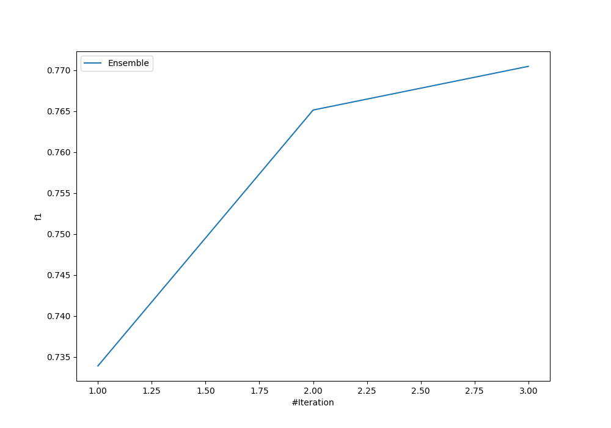
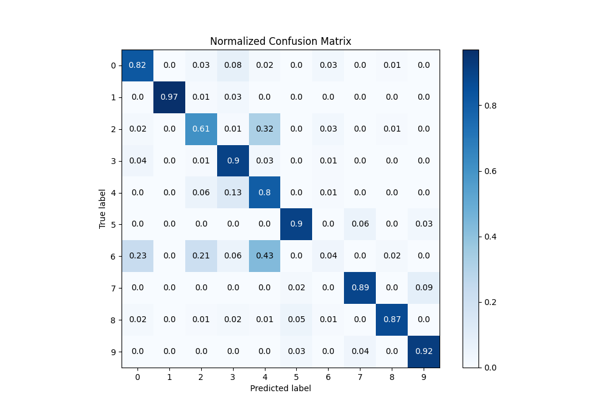
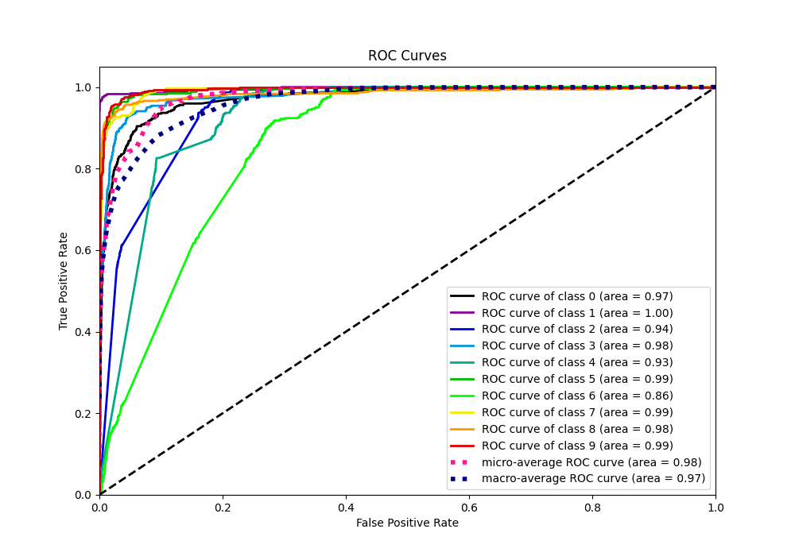
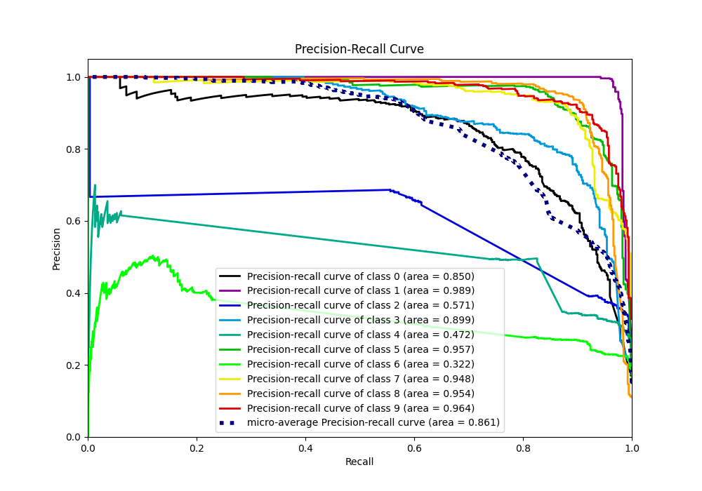

# Summary of Ensemble

[<< Go back](../README.md)

## Ensemble structure
| Model                   |   Weight |
|:------------------------|---------:|
| 1_DecisionTree          |        1 |
| 2_Default_NeuralNetwork |        2 |

### Metric details
|           |          0 |          1 |          2 |          3 |          4 |          5 |           6 |          7 |          8 |          9 |   accuracy |   macro avg |   weighted avg |   logloss |
|:----------|-----------:|-----------:|-----------:|-----------:|-----------:|-----------:|------------:|-----------:|-----------:|-----------:|-----------:|------------:|---------------:|----------:|
| precision |   0.726655 |   0.978764 |   0.650407 |   0.727975 |   0.492908 |   0.885122 |   0.318841  |   0.89272  |   0.944898 |   0.880952 |   0.770476 |    0.749924 |       0.750169 |  0.661252 |
| recall    |   0.819923 |   0.965714 |   0.609524 |   0.898855 |   0.797323 |   0.896947 |   0.0418251 |   0.885932 |   0.870301 |   0.919694 |   0.770476 |    0.770604 |       0.770476 |  0.661252 |
| f1-score  |   0.770477 |   0.972196 |   0.629302 |   0.804441 |   0.609204 |   0.890995 |   0.0739496 |   0.889313 |   0.906067 |   0.899906 |   0.770476 |    0.744585 |       0.744638 |  0.661252 |
| support   | 522        | 525        | 525        | 524        | 523        | 524        | 526         | 526        | 532        | 523        |   0.770476 | 5250        |    5250        |  0.661252 |

## Confusion matrix
|              |   Predicted as 0 |   Predicted as 1 |   Predicted as 2 |   Predicted as 3 |   Predicted as 4 |   Predicted as 5 |   Predicted as 6 |   Predicted as 7 |   Predicted as 8 |   Predicted as 9 |
|:-------------|-----------------:|-----------------:|-----------------:|-----------------:|-----------------:|-----------------:|-----------------:|-----------------:|-----------------:|-----------------:|
| Labeled as 0 |              428 |                1 |               15 |               43 |               11 |                0 |               18 |                0 |                5 |                1 |
| Labeled as 1 |                0 |              507 |                3 |               15 |                0 |                0 |                0 |                0 |                0 |                0 |
| Labeled as 2 |                8 |                1 |              320 |                4 |              170 |                1 |               15 |                0 |                6 |                0 |
| Labeled as 3 |               23 |                1 |                6 |              471 |               16 |                0 |                6 |                0 |                1 |                0 |
| Labeled as 4 |                2 |                2 |               30 |               66 |              417 |                0 |                4 |                0 |                2 |                0 |
| Labeled as 5 |                0 |                2 |                0 |                1 |                1 |              470 |                0 |               32 |                2 |               16 |
| Labeled as 6 |              119 |                0 |              111 |               34 |              227 |                2 |               22 |                0 |               11 |                0 |
| Labeled as 7 |                0 |                1 |                0 |                0 |                0 |               12 |                0 |              466 |                0 |               47 |
| Labeled as 8 |                9 |                1 |                7 |               13 |                3 |               29 |                4 |                2 |              463 |                1 |
| Labeled as 9 |                0 |                2 |                0 |                0 |                1 |               17 |                0 |               22 |                0 |              481 |

## Learning curves

## Confusion Matrix

## Normalized Confusion Matrix

## ROC Curve

## Precision Recall Curve

[<< Go back](../README.md)
