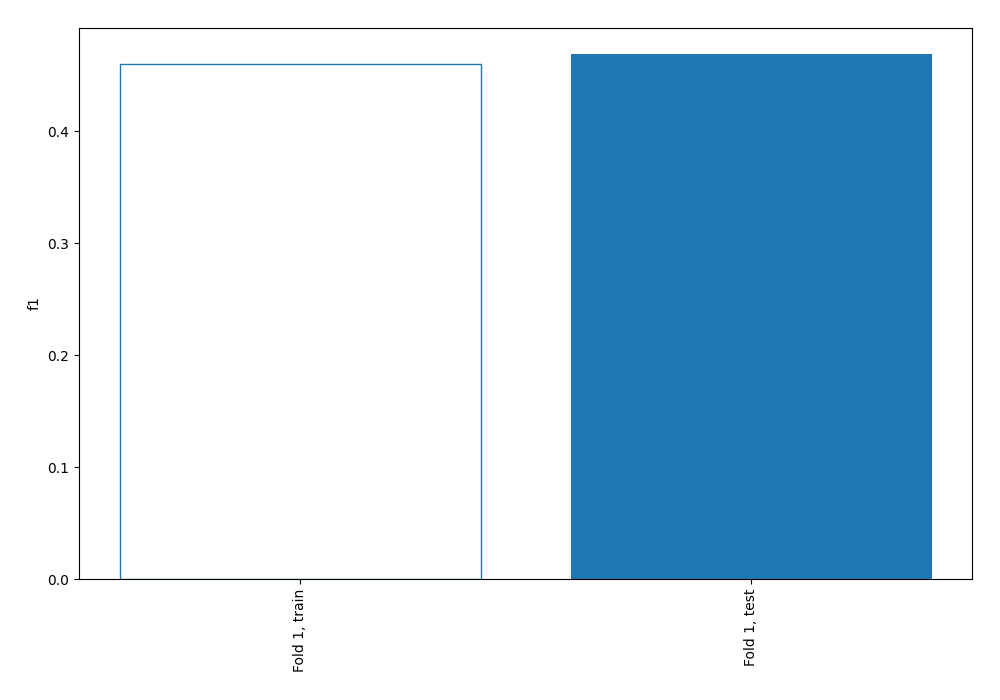
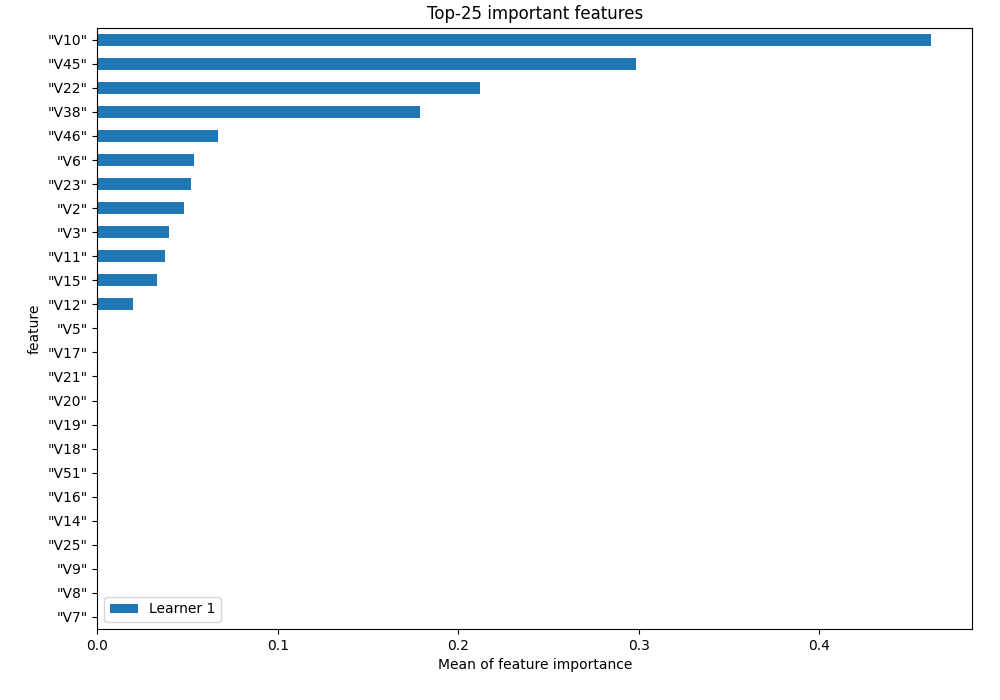
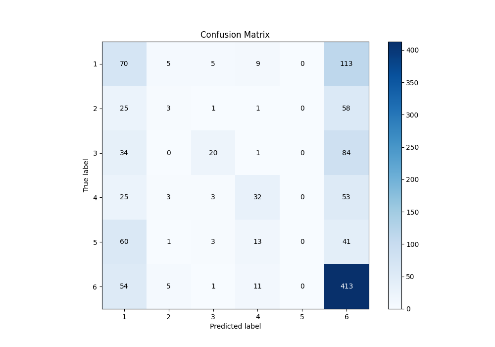
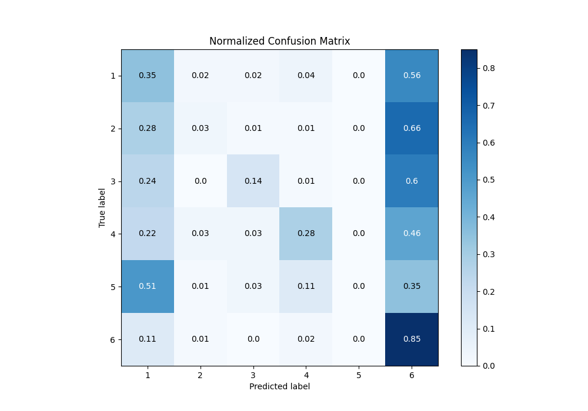
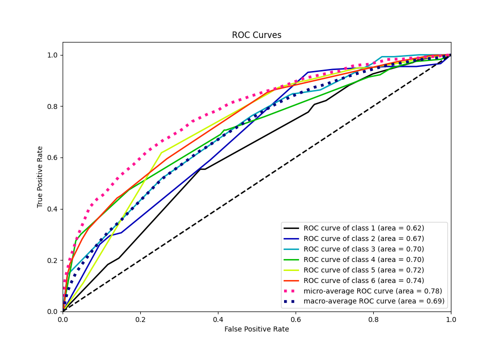
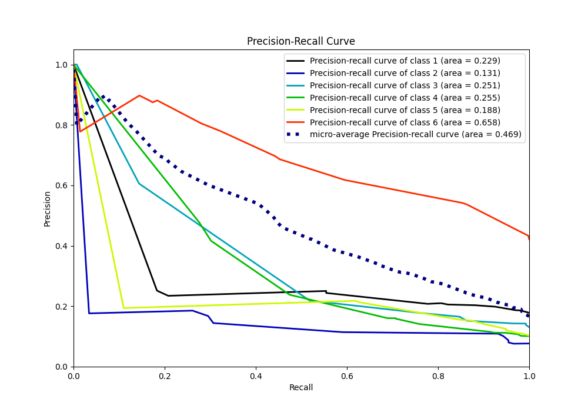

# Summary of 1_DecisionTree

[<< Go back](../README.md)

## Decision Tree
- **n_jobs**: -1
- **criterion**: entropy
- **max_depth**: 4
- **num_class**: 6
- **explain_level**: 1

## Validation
 - **validation_type**: split
 - **train_ratio**: 0.75
 - **shuffle**: True
 - **stratify**: True

## Optimized metric
f1

## Training time

5.1 seconds

### Metric details
|           |          1 |          2 |          3 |          4 |   5 |          6 |   accuracy |   macro avg |   weighted avg |   logloss |
|:----------|-----------:|-----------:|-----------:|-----------:|----:|-----------:|-----------:|------------:|---------------:|----------:|
| precision |   0.261194 |  0.176471  |   0.606061 |   0.477612 |   0 |   0.541995 |    0.46905 |    0.343889 |       0.409993 |   1.48973 |
| recall    |   0.346535 |  0.0340909 |   0.143885 |   0.275862 |   0 |   0.853306 |    0.46905 |    0.275613 |       0.46905  |   1.48973 |
| f1-score  |   0.297872 |  0.0571429 |   0.232558 |   0.349727 |   0 |   0.662921 |    0.46905 |    0.266704 |       0.400128 |   1.48973 |
| support   | 202        | 88         | 139        | 116        | 118 | 484        |    0.46905 | 1147        |    1147        |   1.48973 |

## Confusion matrix
|              |   Predicted as 1 |   Predicted as 2 |   Predicted as 3 |   Predicted as 4 |   Predicted as 5 |   Predicted as 6 |
|:-------------|-----------------:|-----------------:|-----------------:|-----------------:|-----------------:|-----------------:|
| Labeled as 1 |               70 |                5 |                5 |                9 |                0 |              113 |
| Labeled as 2 |               25 |                3 |                1 |                1 |                0 |               58 |
| Labeled as 3 |               34 |                0 |               20 |                1 |                0 |               84 |
| Labeled as 4 |               25 |                3 |                3 |               32 |                0 |               53 |
| Labeled as 5 |               60 |                1 |                3 |               13 |                0 |               41 |
| Labeled as 6 |               54 |                5 |                1 |               11 |                0 |              413 |

## Learning curves

## Permutation-based Importance

## Confusion Matrix

## Normalized Confusion Matrix

## ROC Curve

## Precision Recall Curve

[<< Go back](../README.md)
