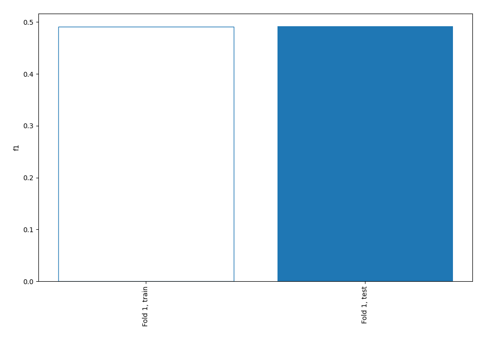
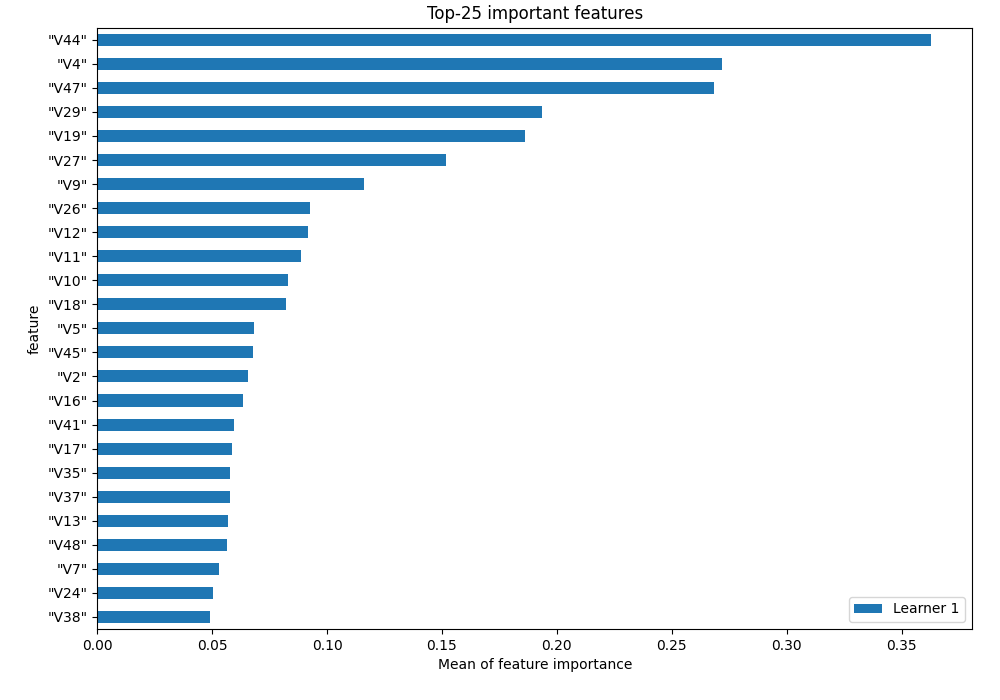
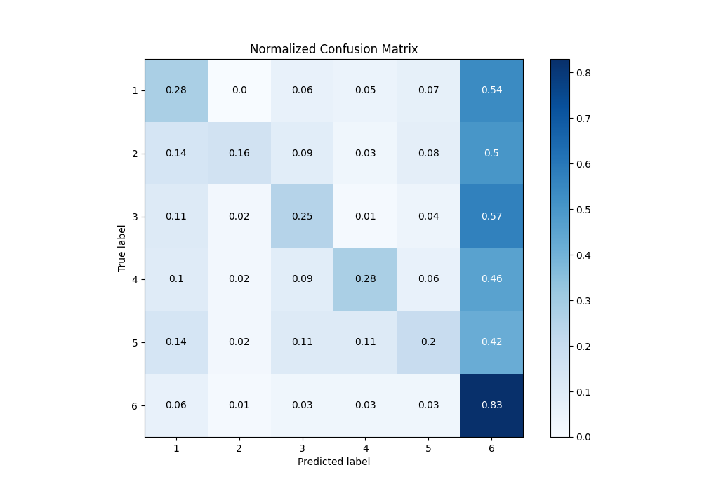
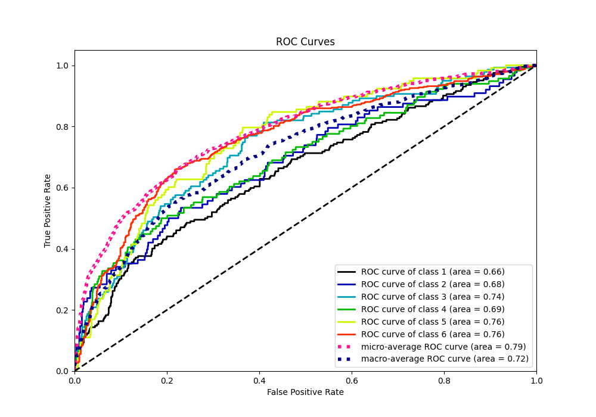
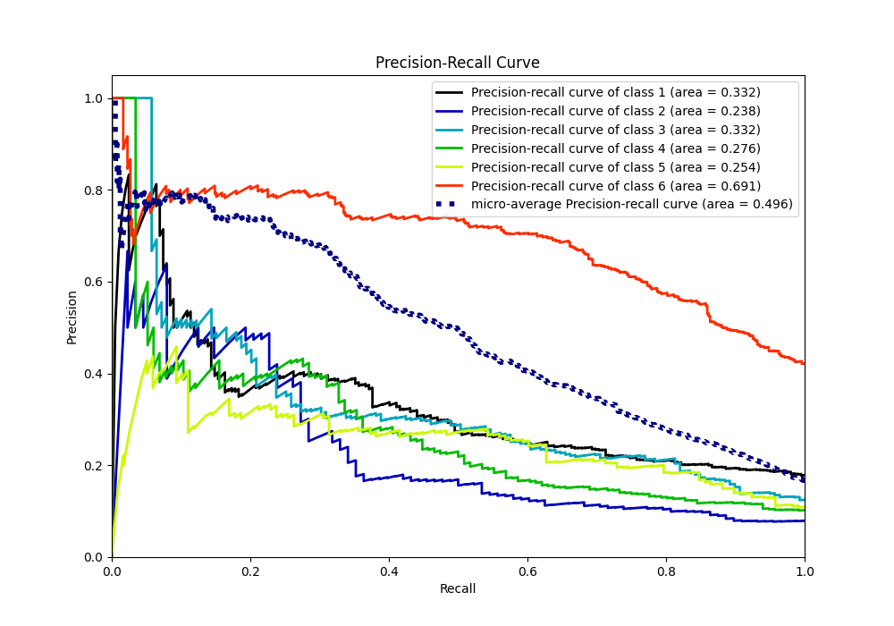

# Summary of 2_Linear

[<< Go back](../README.md)

## Logistic Regression (Linear)
- **n_jobs**: -1
- **num_class**: 6
- **explain_level**: 1

## Validation
 - **validation_type**: split
 - **train_ratio**: 0.75
 - **shuffle**: True
 - **stratify**: True

## Optimized metric
f1

## Training time

1.6 seconds

### Metric details
|           |          1 |         2 |          3 |          4 |          5 |          6 |   accuracy |   macro avg |   weighted avg |   logloss |
|:----------|-----------:|----------:|-----------:|-----------:|-----------:|-----------:|-----------:|------------:|---------------:|----------:|
| precision |   0.394366 |  0.5      |   0.376344 |   0.432432 |   0.333333 |   0.54607  |   0.491718 |    0.430424 |       0.461872 |   1.42615 |
| recall    |   0.277228 |  0.159091 |   0.251799 |   0.275862 |   0.20339  |   0.832645 |   0.491718 |    0.333336 |       0.491718 |   1.42615 |
| f1-score  |   0.325581 |  0.241379 |   0.301724 |   0.336842 |   0.252632 |   0.659574 |   0.491718 |    0.352955 |       0.450799 |   1.42615 |
| support   | 202        | 88        | 139        | 116        | 118        | 484        |   0.491718 | 1147        |    1147        |   1.42615 |

## Confusion matrix
|              |   Predicted as 1 |   Predicted as 2 |   Predicted as 3 |   Predicted as 4 |   Predicted as 5 |   Predicted as 6 |
|:-------------|-----------------:|-----------------:|-----------------:|-----------------:|-----------------:|-----------------:|
| Labeled as 1 |               56 |                1 |               12 |               10 |               14 |              109 |
| Labeled as 2 |               12 |               14 |                8 |                3 |                7 |               44 |
| Labeled as 3 |               15 |                3 |               35 |                2 |                5 |               79 |
| Labeled as 4 |               12 |                2 |               10 |               32 |                7 |               53 |
| Labeled as 5 |               16 |                2 |               13 |               13 |               24 |               50 |
| Labeled as 6 |               31 |                6 |               15 |               14 |               15 |              403 |

## Learning curves

## Coefficients

### Coefficients learner #1
|           |           1 |            2 |           3 |           4 |          5 |          6 |
|:----------|------------:|-------------:|------------:|------------:|-----------:|-----------:|
| intercept |  0.354148   | -0.636294    | -0.178097   | -0.427458   | -0.417662  |  1.30536   |
| "V1"      |  0.118005   | -0.288756    | -0.0905434  |  0.123376   |  0.250682  | -0.112764  |
| "V2"      |  0.347156   |  0.293677    | -0.355482   |  0.251424   | -0.436539  | -0.100237  |
| "V3"      | -0.180648   | -0.0306801   |  0.0710807  |  0.238528   | -0.270863  |  0.172582  |
| "V4"      | -0.436195   | -0.418131    | -0.0799     | -0.524632   |  0.634329  |  0.824529  |
| "V5"      |  0.205128   |  0.0547578   |  0.266107   |  0.0605293  | -0.0912429 | -0.495279  |
| "V6"      | -0.233951   |  0.00324762  |  0.0868961  | -0.192275   |  0.394171  | -0.0580884 |
| "V7"      | -0.0925591  | -0.0495826   | -0.270431   |  0.0219725  | -0.072563  |  0.463163  |
| "V8"      | -0.0319966  | -0.55509     |  0.106739   |  0.132718   |  0.259897  |  0.087734  |
| "V9"      |  0.0897441  |  0.826302    | -0.0692077  | -0.0533939  | -0.922168  |  0.128724  |
| "V10"     | -0.743527   |  0.0468448   |  0.0702512  |  0.620796   |  0.194875  | -0.18924   |
| "V11"     |  0.438649   | -0.0329252   |  0.00395942 | -0.286755   | -0.534855  |  0.411926  |
| "V12"     |  0.627551   |  0.668589    | -0.6138     | -0.528464   | -0.704967  |  0.551092  |
| "V13"     | -0.116797   | -0.676796    | -0.0103166  |  0.248733   |  0.815606  | -0.26043   |
| "V14"     | -0.0383606  | -0.0608135   | -0.0370537  |  0.0681348  |  0.0368501 |  0.0312429 |
| "V15"     |  0.0187069  | -0.0742761   |  0.217775   | -0.127398   |  0.0354067 | -0.0702149 |
| "V16"     |  0.215991   |  0.179924    |  0.306331   | -0.485213   |  0.0574341 | -0.274468  |
| "V17"     | -0.339943   |  0.173423    | -0.429314   |  0.390872   |  0.569373  | -0.364411  |
| "V18"     | -0.0911382  | -0.0260333   |  0.364625   | -0.343169   | -0.283695  |  0.379411  |
| "V19"     | -0.0229154  | -0.19012     | -0.599187   |  0.304777   | -0.246775  |  0.75422   |
| "V20"     | -0.213439   |  0.277755    | -0.136524   | -0.0836693  |  0.342169  | -0.186292  |
| "V21"     |  0.342201   |  0.188617    | -0.181306   |  0.330827   | -0.473387  | -0.206953  |
| "V22"     |  0.290847   |  0.0445217   | -0.190695   | -0.143982   | -0.124987  |  0.124296  |
| "V23"     | -0.0529729  | -0.0186354   | -0.0049757  | -0.137863   | -0.097405  |  0.311852  |
| "V24"     | -0.356846   |  0.340494    |  0.246166   |  0.155165   | -0.185762  | -0.199217  |
| "V25"     |  0.26663    | -0.26198     | -0.427525   |  0.0184063  |  0.436694  | -0.0322258 |
| "V26"     |  0.0891673  | -0.214841    |  0.024224   |  0.65283    | -0.0175773 | -0.533803  |
| "V27"     |  0.00785492 |  0.198303    |  0.552997   | -0.234842   |  0.294955  | -0.819268  |
| "V28"     |  0.071692   |  0.188557    | -0.0599963  | -0.577731   |  0.325671  |  0.0518072 |
| "V29"     | -0.168664   | -0.119169    | -0.0885468  | -0.769837   | -0.516686  |  1.6629    |
| "V30"     |  0.0849016  |  0.119067    |  0.11663    | -0.324333   | -0.0908712 |  0.0946066 |
| "V31"     | -0.00600944 |  0.00105004  | -0.0265081  |  0.120606   |  0.011314  | -0.100453  |
| "V32"     | -0.0383606  | -0.0608135   | -0.0370537  |  0.0681348  |  0.0368501 |  0.0312429 |
| "V33"     |  0.730035   | -0.413109    | -0.0103608  |  0.00486344 |  0.339426  | -0.650854  |
| "V34"     |  0.0597919  |  0.0991674   |  0.0680696  |  0.142993   | -0.057045  | -0.312976  |
| "V35"     |  0.0460379  |  0.509075    | -0.122699   |  0.161649   | -0.103282  | -0.490781  |
| "V36"     |  0.0503036  | -0.46011     |  0.0771392  | -0.0214008  |  0.101417  |  0.252651  |
| "V37"     |  0.334137   | -0.353896    |  0.246451   | -0.674493   |  0.0801467 |  0.367655  |
| "V38"     | -0.550364   |  0.215568    |  0.384658   |  0.0480855  | -0.0724768 | -0.0254704 |
| "V39"     |  0.0809167  |  0.440113    | -0.0534098  |  0.284896   | -0.582049  | -0.170466  |
| "V40"     |  0.117669   |  0.0356988   | -0.0433562  | -0.0427435  |  0.0101134 | -0.0773816 |
| "V41"     |  0.359198   | -0.352834    |  0.284618   | -0.712672   |  0.0609978 |  0.360693  |
| "V42"     | -0.152275   | -0.0876957   |  0.0768491  | -0.0260882  |  0.049128  |  0.140082  |
| "V43"     | -0.128068   | -0.772977    | -0.299175   |  0.181635   |  0.0291987 |  0.989386  |
| "V44"     | -0.864013   |  0.620211    | -0.422572   |  0.218427   | -0.39918   |  0.847127  |
| "V45"     | -0.140751   | -0.0970136   |  0.554946   |  0.0501724  |  0.0328616 | -0.400215  |
| "V46"     |  0.340515   | -0.000773013 |  0.0393658  | -0.363347   |  0.0405944 | -0.0563554 |
| "V47"     |  1.15161    | -0.741717    |  0.244464   | -0.146857   | -0.149154  | -0.358343  |
| "V48"     | -0.215016   |  0.00437726  | -0.15863    |  0.664129   | -0.0174097 | -0.27745   |
| "V49"     | -0.115851   |  0.417263    |  0.0103752  | -0.0853024  | -0.144141  | -0.0823438 |
| "V50"     |  0.174636   | -0.127854    | -0.264935   |  0.33667    | -0.247892  |  0.129374  |
| "V51"     |  0.0631517  | -0.381133    |  0.0702117  | -0.0168804  |  0.220828  |  0.0438223 |

## Permutation-based Importance

## Confusion Matrix

## Normalized Confusion Matrix

## ROC Curve

## Precision Recall Curve

[<< Go back](../README.md)
