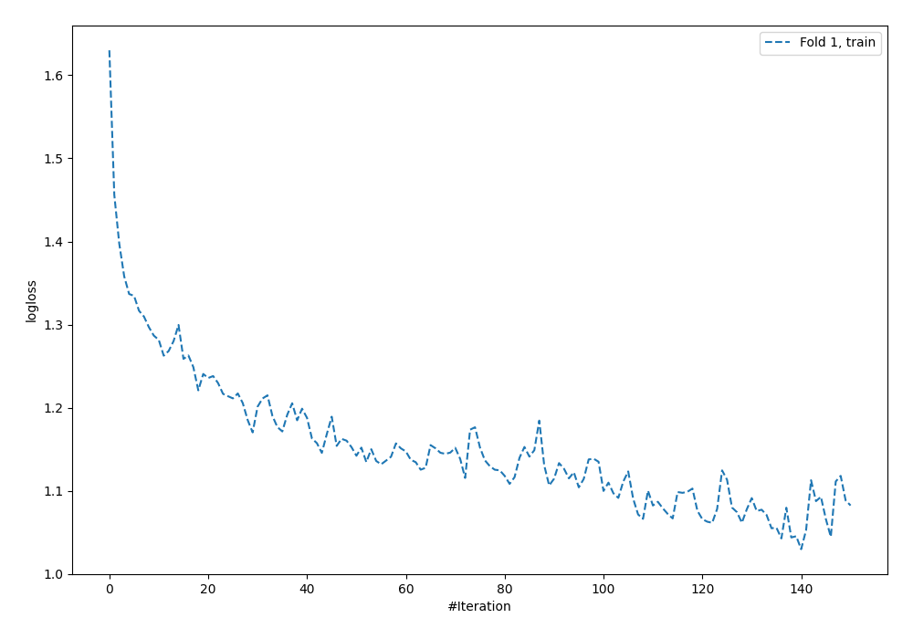
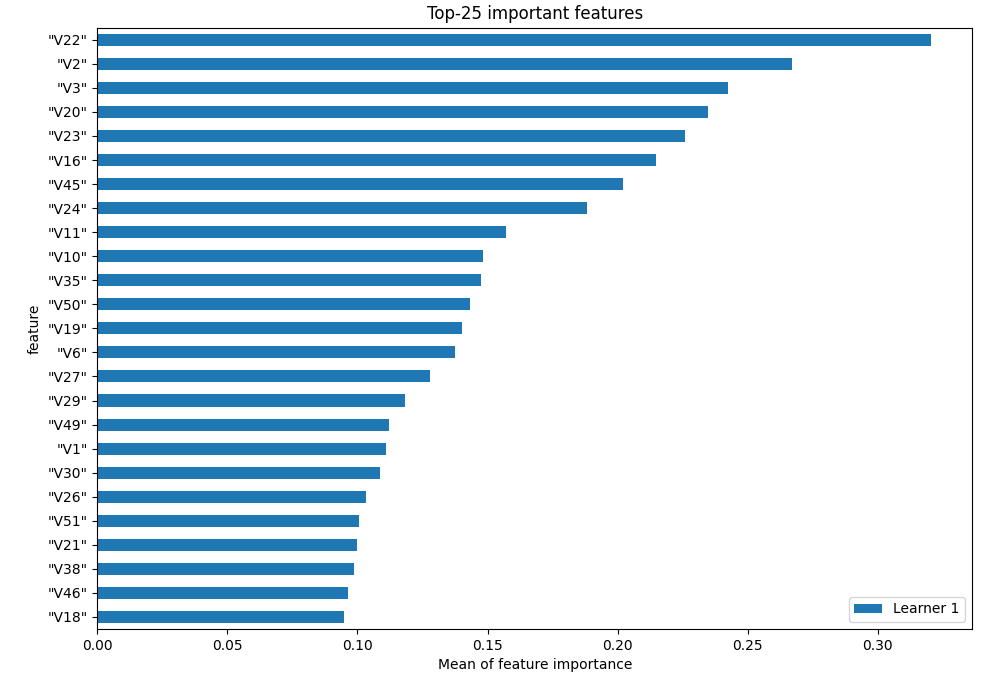
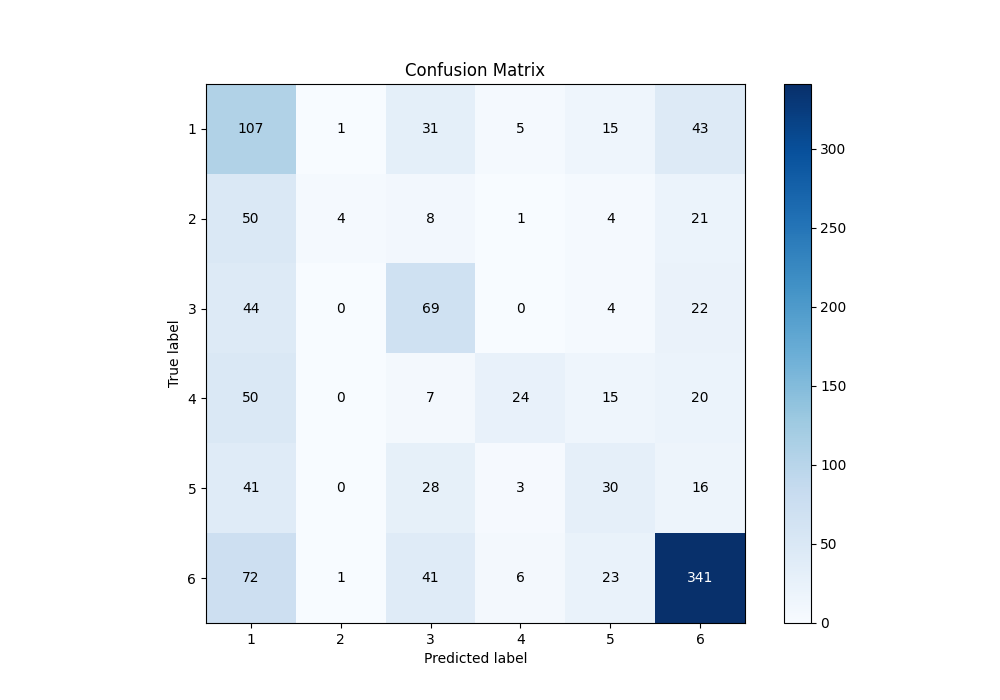
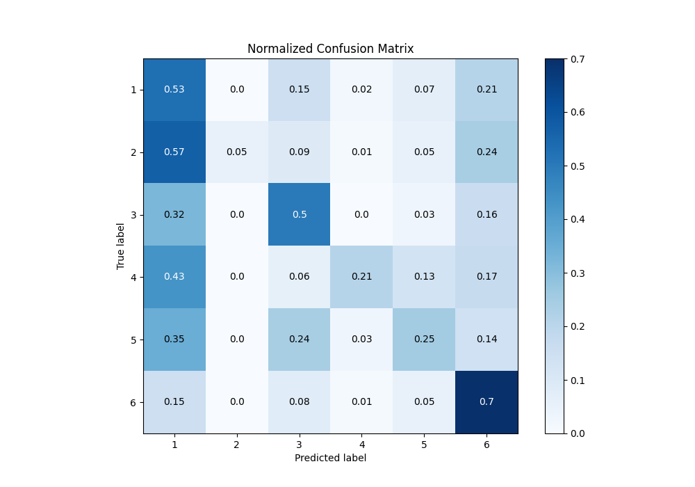
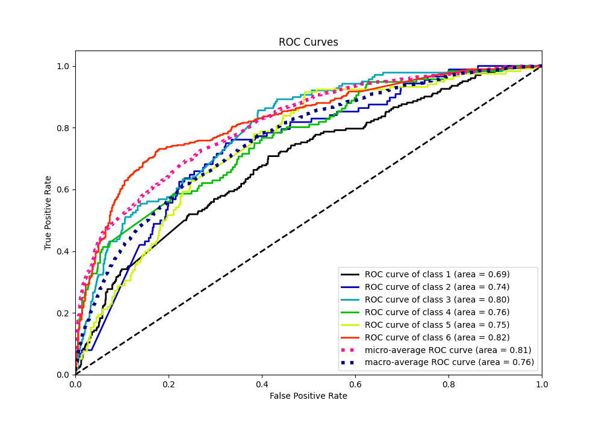
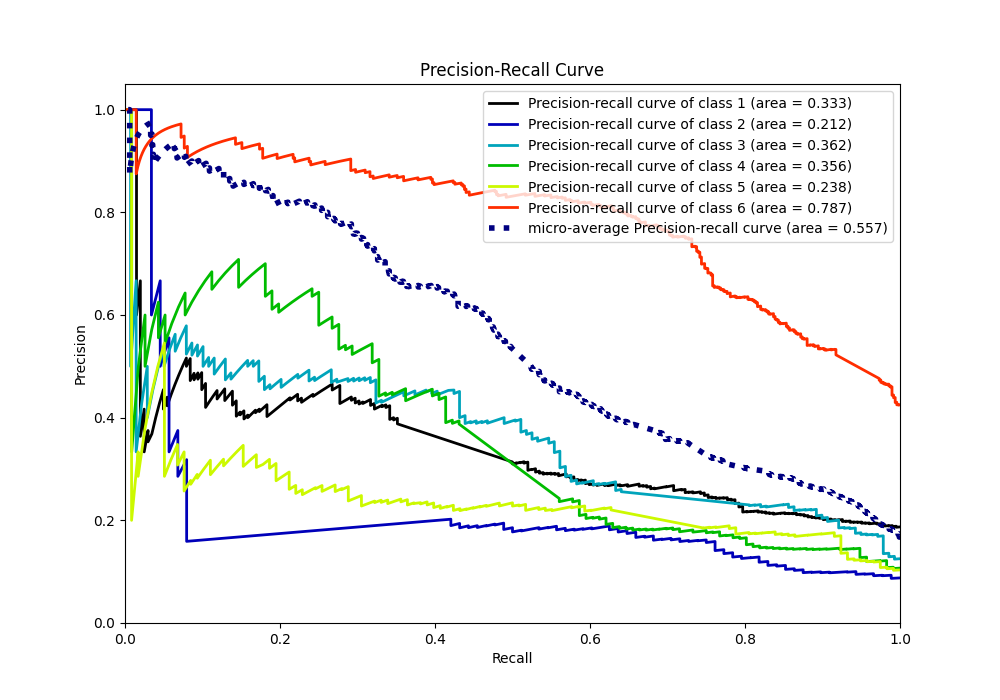

# Summary of 3_Default_NeuralNetwork

[<< Go back](../README.md)

## Neural Network
- **n_jobs**: -1
- **dense_1_size**: 32
- **dense_2_size**: 16
- **learning_rate**: 0.05
- **num_class**: 6
- **explain_level**: 1

## Validation
 - **validation_type**: split
 - **train_ratio**: 0.75
 - **shuffle**: True
 - **stratify**: True

## Optimized metric
f1

## Training time

2.8 seconds

### Metric details
|           |          1 |          2 |          3 |          4 |          5 |          6 |   accuracy |   macro avg |   weighted avg |   logloss |
|:----------|-----------:|-----------:|-----------:|-----------:|-----------:|-----------:|-----------:|------------:|---------------:|----------:|
| precision |   0.293956 |  0.666667  |   0.375    |   0.615385 |   0.32967  |   0.736501 |   0.501308 |    0.502863 |       0.555295 |   1.45189 |
| recall    |   0.529703 |  0.0454545 |   0.496403 |   0.206897 |   0.254237 |   0.704545 |   0.501308 |    0.372873 |       0.501308 |   1.45189 |
| f1-score  |   0.378092 |  0.0851064 |   0.427245 |   0.309677 |   0.287081 |   0.720169 |   0.501308 |    0.367895 |       0.489635 |   1.45189 |
| support   | 202        | 88         | 139        | 116        | 118        | 484        |   0.501308 | 1147        |    1147        |   1.45189 |

## Confusion matrix
|              |   Predicted as 1 |   Predicted as 2 |   Predicted as 3 |   Predicted as 4 |   Predicted as 5 |   Predicted as 6 |
|:-------------|-----------------:|-----------------:|-----------------:|-----------------:|-----------------:|-----------------:|
| Labeled as 1 |              107 |                1 |               31 |                5 |               15 |               43 |
| Labeled as 2 |               50 |                4 |                8 |                1 |                4 |               21 |
| Labeled as 3 |               44 |                0 |               69 |                0 |                4 |               22 |
| Labeled as 4 |               50 |                0 |                7 |               24 |               15 |               20 |
| Labeled as 5 |               41 |                0 |               28 |                3 |               30 |               16 |
| Labeled as 6 |               72 |                1 |               41 |                6 |               23 |              341 |

## Learning curves

## Permutation-based Importance

## Confusion Matrix

## Normalized Confusion Matrix

## ROC Curve

## Precision Recall Curve

[<< Go back](../README.md)
