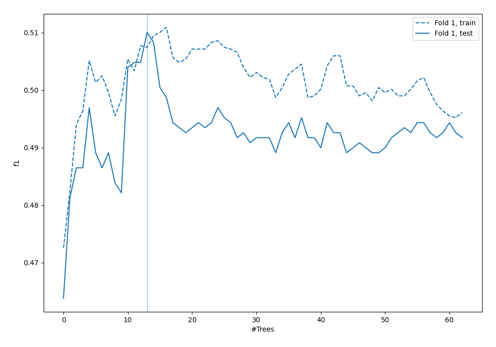
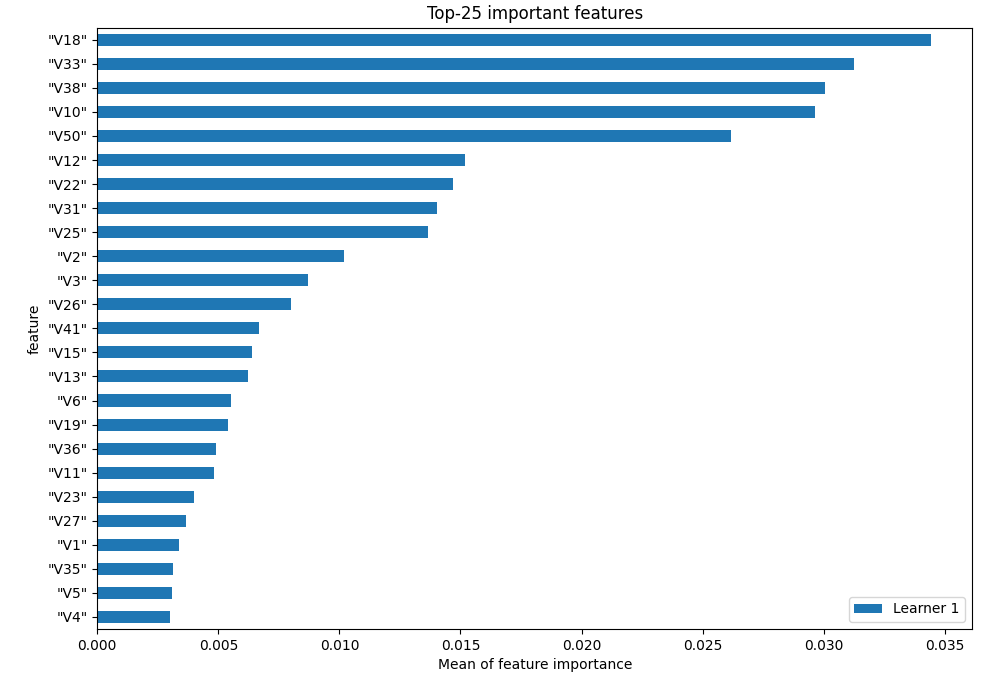
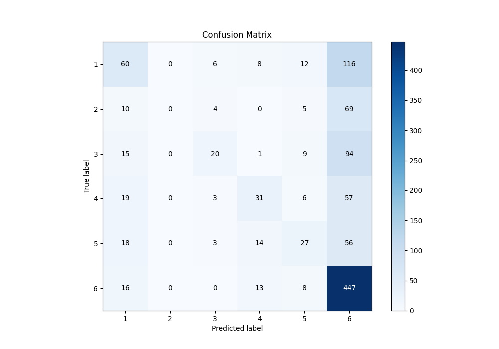
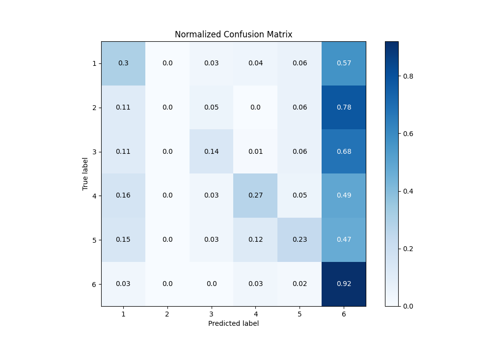
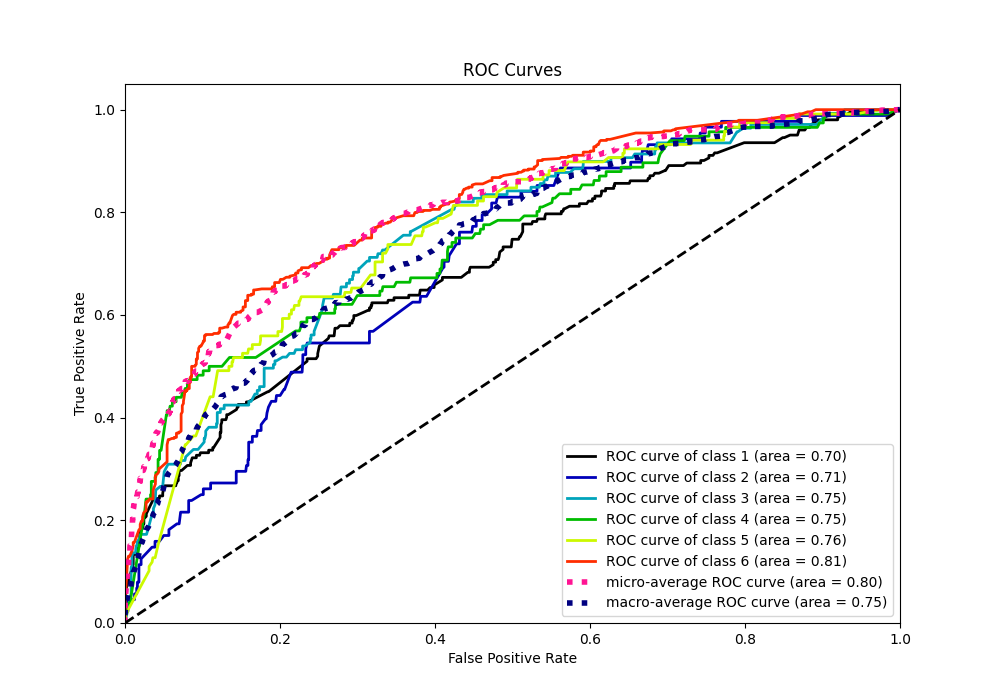
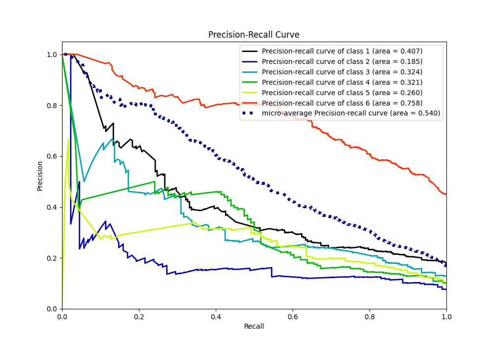

# Summary of 4_Default_RandomForest

[<< Go back](../README.md)

## Random Forest
- **n_jobs**: -1
- **criterion**: gini
- **max_features**: 0.9
- **min_samples_split**: 30
- **max_depth**: 4
- **eval_metric_name**: f1
- **num_class**: 6
- **explain_level**: 1

## Validation
 - **validation_type**: split
 - **train_ratio**: 0.75
 - **shuffle**: True
 - **stratify**: True

## Optimized metric
f1

## Training time

2.4 seconds

### Metric details
|           |          1 |   2 |          3 |          4 |          5 |          6 |   accuracy |   macro avg |   weighted avg |   logloss |
|:----------|-----------:|----:|-----------:|-----------:|-----------:|-----------:|-----------:|------------:|---------------:|----------:|
| precision |   0.434783 |   0 |   0.555556 |   0.462687 |   0.402985 |   0.532777 |   0.510026 |    0.398131 |       0.456963 |   1.36138 |
| recall    |   0.29703  |   0 |   0.143885 |   0.267241 |   0.228814 |   0.923554 |   0.510026 |    0.310087 |       0.510026 |   1.36138 |
| f1-score  |   0.352941 |   0 |   0.228571 |   0.338798 |   0.291892 |   0.675737 |   0.510026 |    0.314657 |       0.43929  |   1.36138 |
| support   | 202        |  88 | 139        | 116        | 118        | 484        |   0.510026 | 1147        |    1147        |   1.36138 |

## Confusion matrix
|              |   Predicted as 1 |   Predicted as 2 |   Predicted as 3 |   Predicted as 4 |   Predicted as 5 |   Predicted as 6 |
|:-------------|-----------------:|-----------------:|-----------------:|-----------------:|-----------------:|-----------------:|
| Labeled as 1 |               60 |                0 |                6 |                8 |               12 |              116 |
| Labeled as 2 |               10 |                0 |                4 |                0 |                5 |               69 |
| Labeled as 3 |               15 |                0 |               20 |                1 |                9 |               94 |
| Labeled as 4 |               19 |                0 |                3 |               31 |                6 |               57 |
| Labeled as 5 |               18 |                0 |                3 |               14 |               27 |               56 |
| Labeled as 6 |               16 |                0 |                0 |               13 |                8 |              447 |

## Learning curves

## Permutation-based Importance

## Confusion Matrix

## Normalized Confusion Matrix

## ROC Curve

## Precision Recall Curve

[<< Go back](../README.md)
