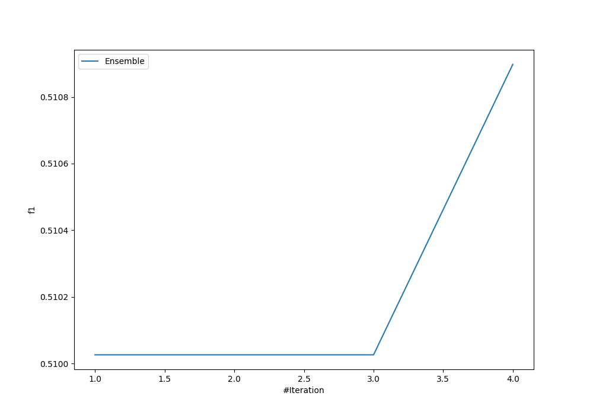
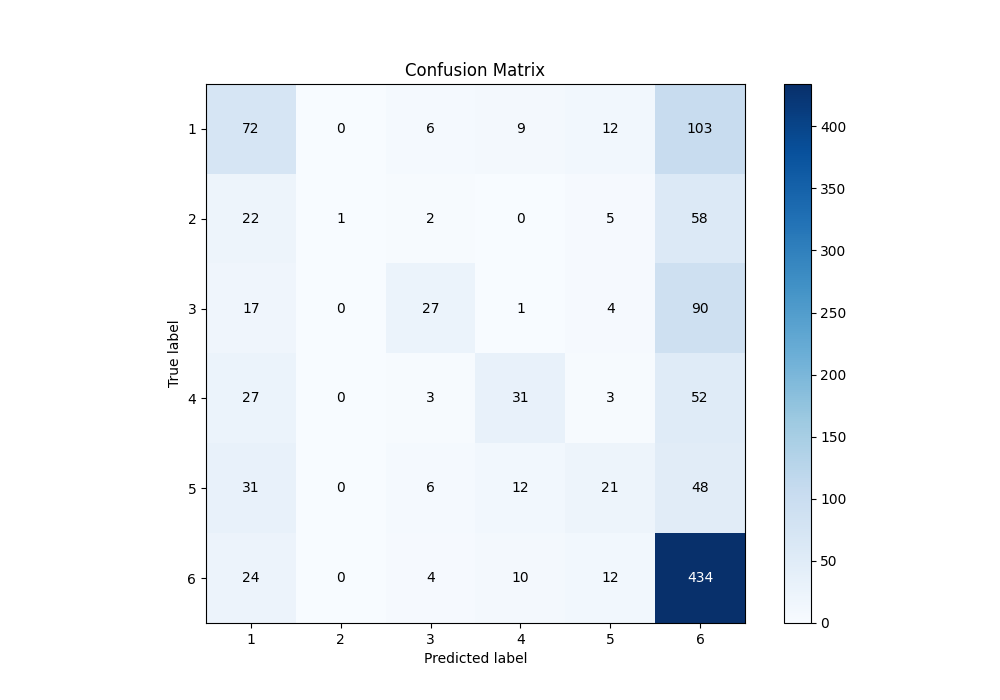
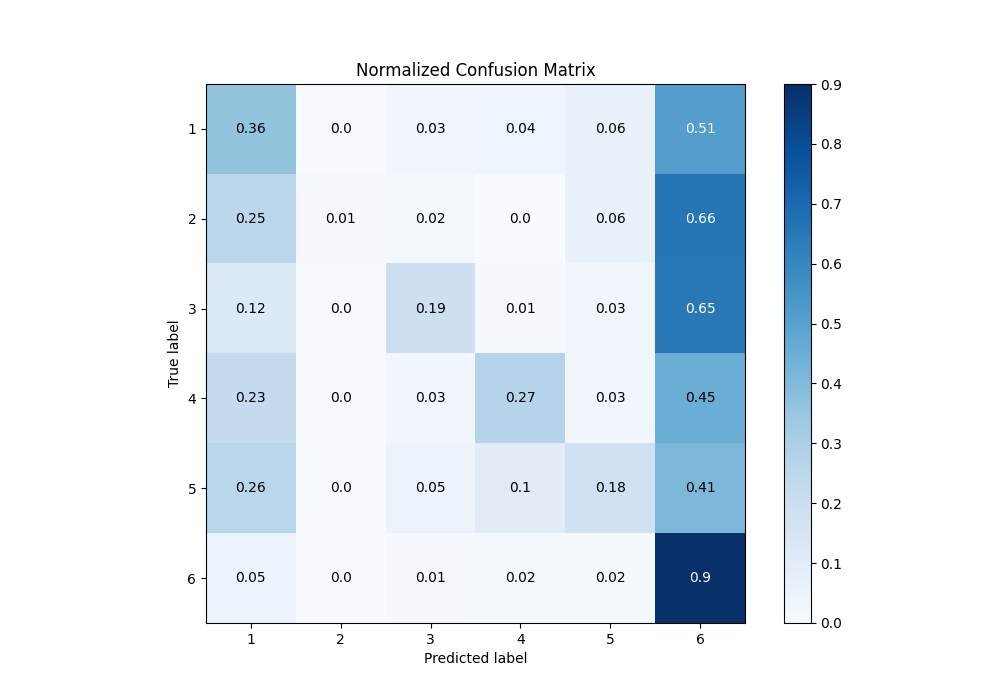
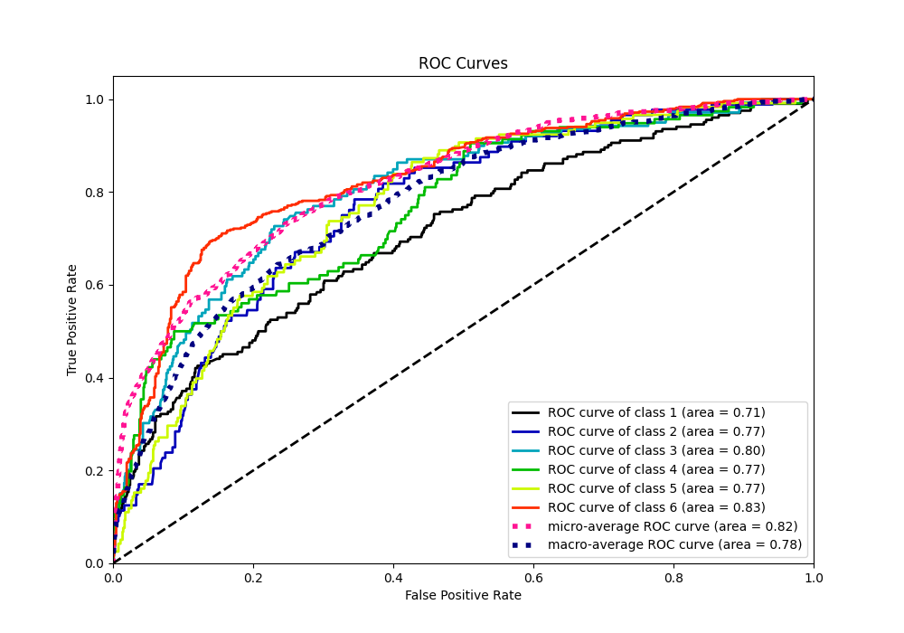
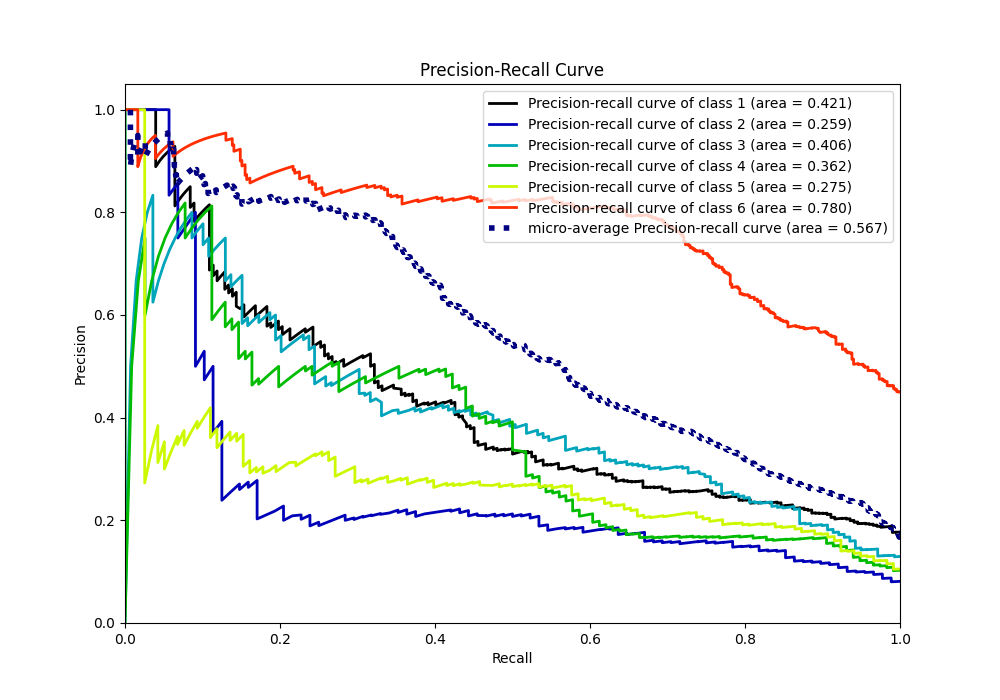

# Summary of Ensemble

[<< Go back](../README.md)

## Ensemble structure
| Model                   |   Weight |
|:------------------------|---------:|
| 3_Default_NeuralNetwork |        1 |
| 4_Default_RandomForest  |        3 |

### Metric details
|           |          1 |          2 |          3 |          4 |          5 |          6 |   accuracy |   macro avg |   weighted avg |   logloss |
|:----------|-----------:|-----------:|-----------:|-----------:|-----------:|-----------:|-----------:|------------:|---------------:|----------:|
| precision |   0.373057 |  1         |   0.5625   |   0.492063 |   0.368421 |   0.552866 |   0.510898 |    0.558151 |       0.531548 |   1.30529 |
| recall    |   0.356436 |  0.0113636 |   0.194245 |   0.267241 |   0.177966 |   0.896694 |   0.510898 |    0.317324 |       0.510898 |   1.30529 |
| f1-score  |   0.364557 |  0.0224719 |   0.28877  |   0.346369 |   0.24     |   0.684003 |   0.510898 |    0.324362 |       0.449271 |   1.30529 |
| support   | 202        | 88         | 139        | 116        | 118        | 484        |   0.510898 | 1147        |    1147        |   1.30529 |

## Confusion matrix
|              |   Predicted as 1 |   Predicted as 2 |   Predicted as 3 |   Predicted as 4 |   Predicted as 5 |   Predicted as 6 |
|:-------------|-----------------:|-----------------:|-----------------:|-----------------:|-----------------:|-----------------:|
| Labeled as 1 |               72 |                0 |                6 |                9 |               12 |              103 |
| Labeled as 2 |               22 |                1 |                2 |                0 |                5 |               58 |
| Labeled as 3 |               17 |                0 |               27 |                1 |                4 |               90 |
| Labeled as 4 |               27 |                0 |                3 |               31 |                3 |               52 |
| Labeled as 5 |               31 |                0 |                6 |               12 |               21 |               48 |
| Labeled as 6 |               24 |                0 |                4 |               10 |               12 |              434 |

## Learning curves

## Confusion Matrix

## Normalized Confusion Matrix

## ROC Curve

## Precision Recall Curve

[<< Go back](../README.md)
