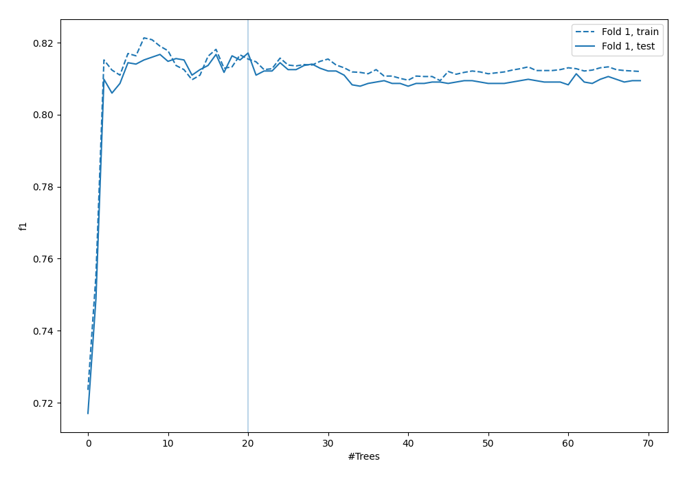
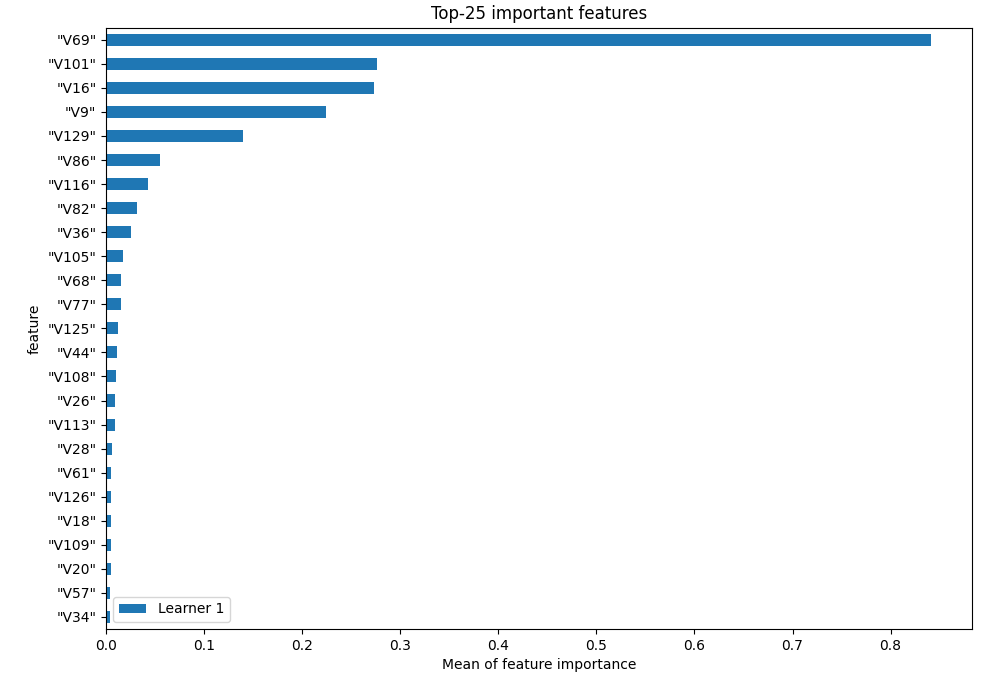
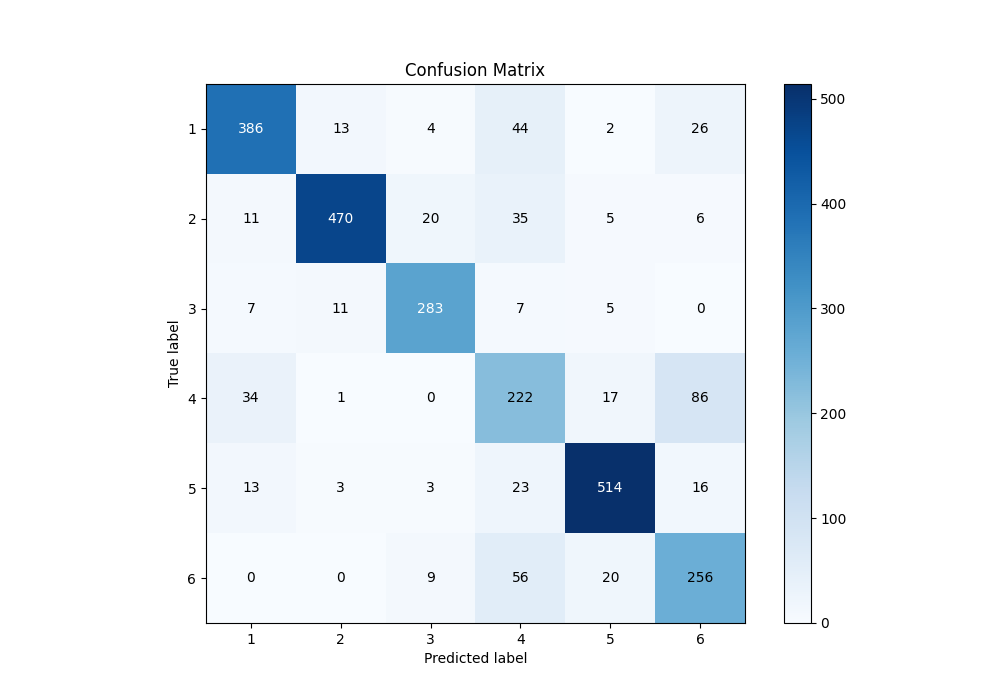
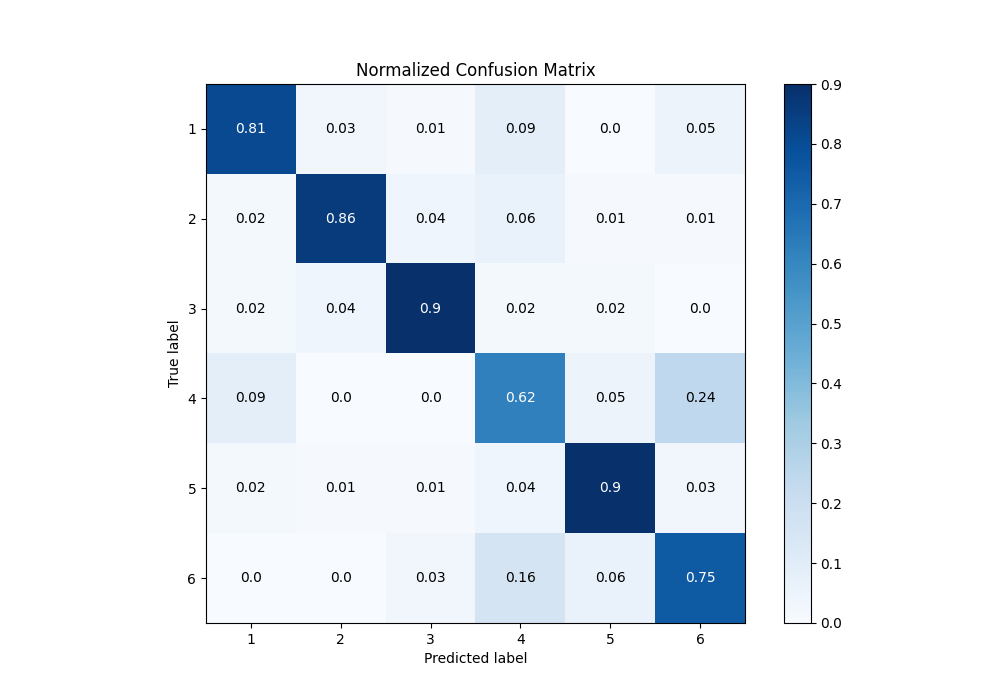
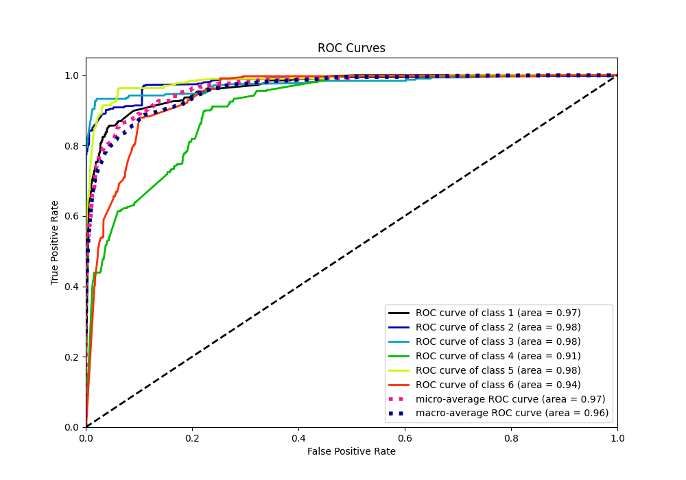
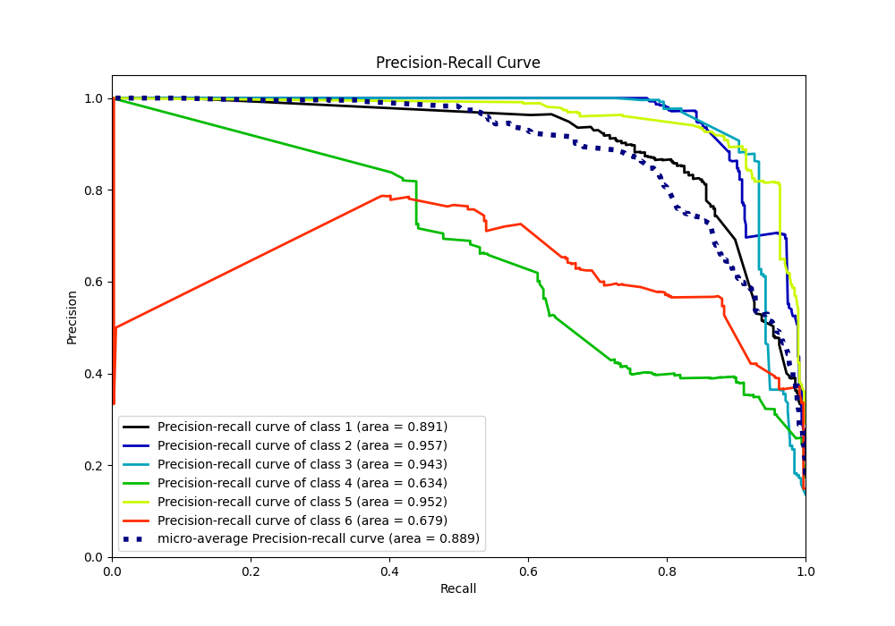

# Summary of 3_Default_RandomForest

[<< Go back](../README.md)

## Random Forest
- **n_jobs**: -1
- **criterion**: gini
- **max_features**: 0.9
- **min_samples_split**: 30
- **max_depth**: 4
- **eval_metric_name**: f1
- **num_class**: 6
- **explain_level**: 1

## Validation
 - **validation_type**: split
 - **train_ratio**: 0.75
 - **shuffle**: True
 - **stratify**: True

## Optimized metric
f1

## Training time

10.0 seconds

### Metric details
|           |          1 |          2 |          3 |          4 |          5 |          6 |   accuracy |   macro avg |   weighted avg |   logloss |
|:----------|-----------:|-----------:|-----------:|-----------:|-----------:|-----------:|-----------:|------------:|---------------:|----------:|
| precision |   0.855876 |   0.943775 |   0.887147 |   0.573643 |   0.912966 |   0.65641  |   0.817101 |    0.80497  |       0.825547 |  0.617688 |
| recall    |   0.812632 |   0.859232 |   0.904153 |   0.616667 |   0.898601 |   0.750733 |   0.817101 |    0.807003 |       0.817101 |  0.617688 |
| f1-score  |   0.833693 |   0.899522 |   0.89557  |   0.594378 |   0.905727 |   0.70041  |   0.817101 |    0.804883 |       0.820264 |  0.617688 |
| support   | 475        | 547        | 313        | 360        | 572        | 341        |   0.817101 | 2608        |    2608        |  0.617688 |

## Confusion matrix
|              |   Predicted as 1 |   Predicted as 2 |   Predicted as 3 |   Predicted as 4 |   Predicted as 5 |   Predicted as 6 |
|:-------------|-----------------:|-----------------:|-----------------:|-----------------:|-----------------:|-----------------:|
| Labeled as 1 |              386 |               13 |                4 |               44 |                2 |               26 |
| Labeled as 2 |               11 |              470 |               20 |               35 |                5 |                6 |
| Labeled as 3 |                7 |               11 |              283 |                7 |                5 |                0 |
| Labeled as 4 |               34 |                1 |                0 |              222 |               17 |               86 |
| Labeled as 5 |               13 |                3 |                3 |               23 |              514 |               16 |
| Labeled as 6 |                0 |                0 |                9 |               56 |               20 |              256 |

## Learning curves

## Permutation-based Importance

## Confusion Matrix

## Normalized Confusion Matrix

## ROC Curve

## Precision Recall Curve

[<< Go back](../README.md)
