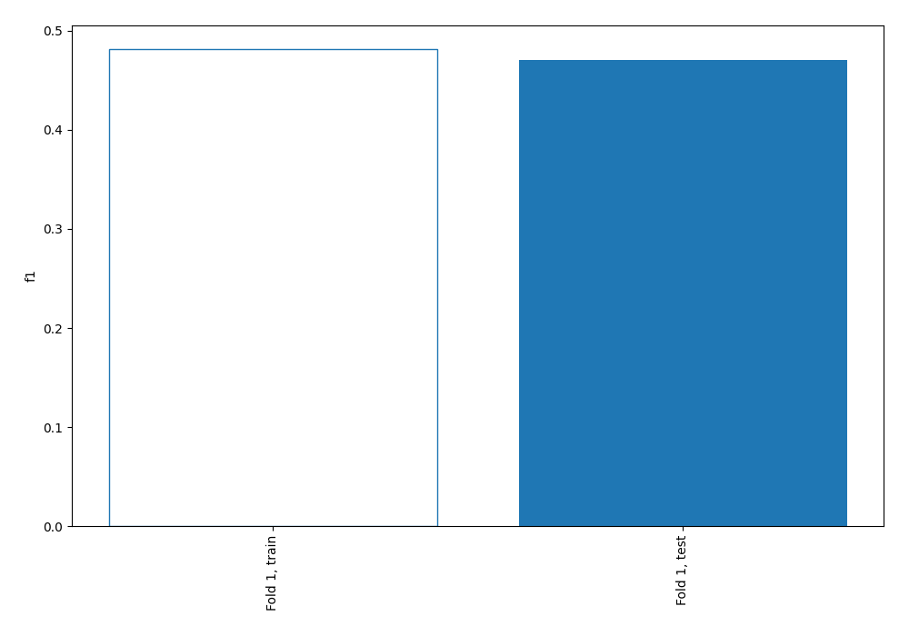
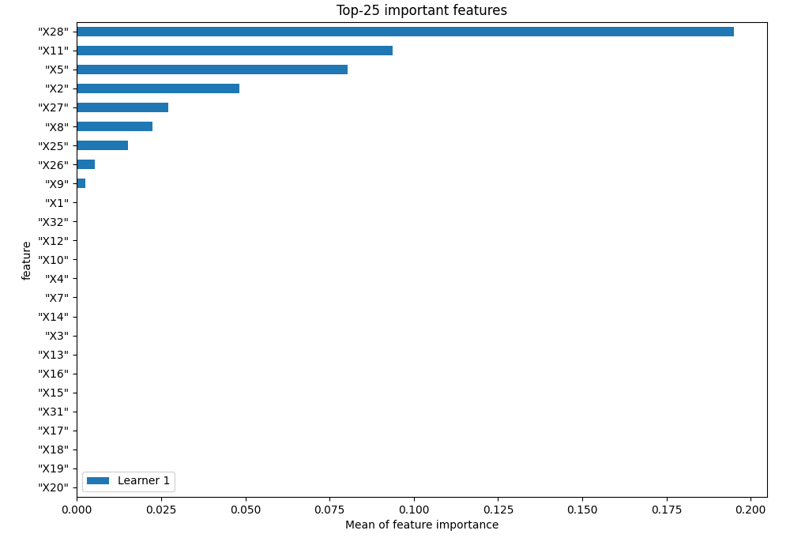
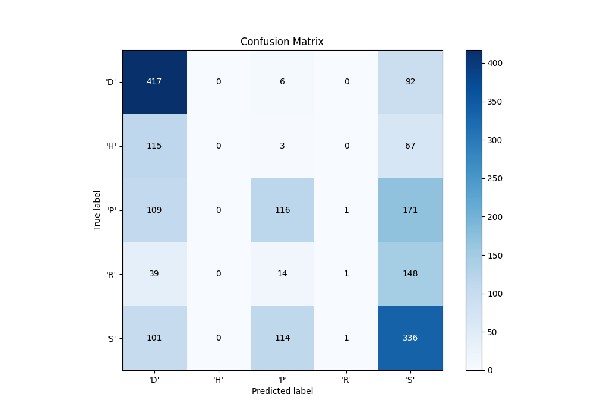
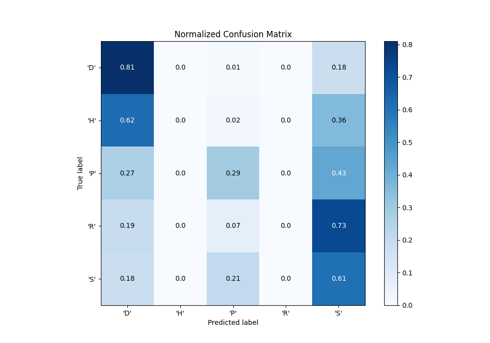
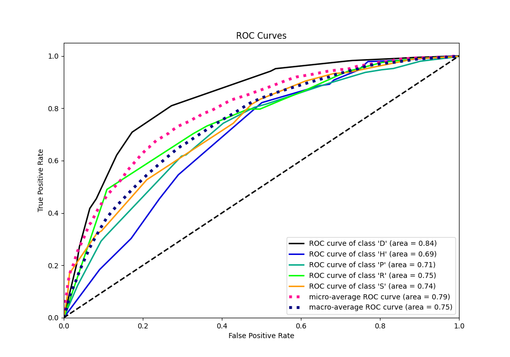
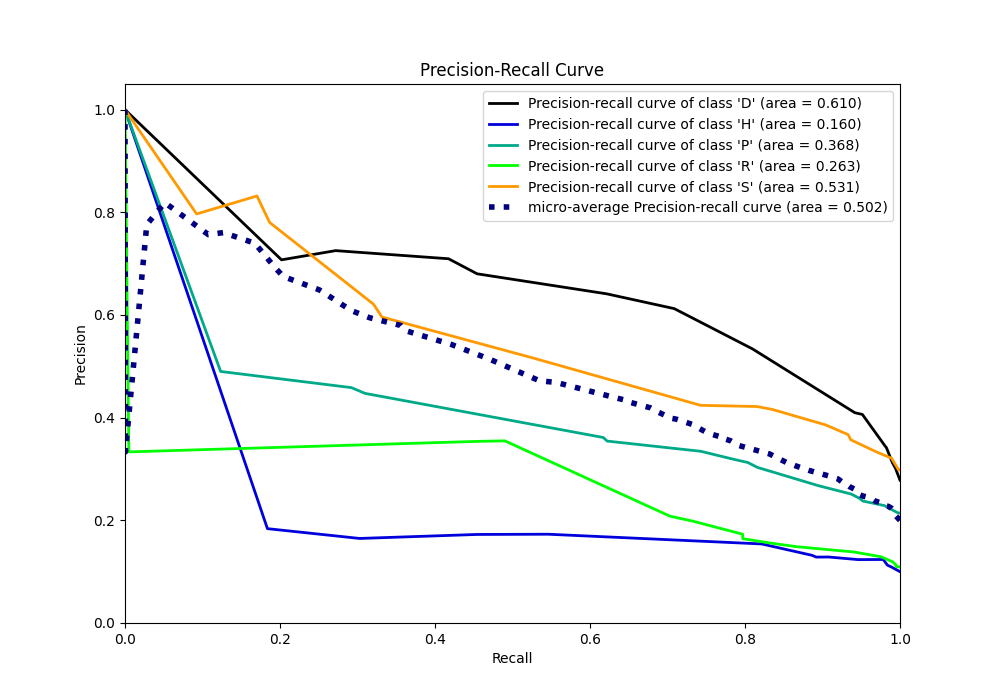

# Summary of 1_DecisionTree

[<< Go back](../README.md)

## Decision Tree
- **n_jobs**: -1
- **criterion**: entropy
- **max_depth**: 4
- **num_class**: 5
- **explain_level**: 1

## Validation
 - **validation_type**: split
 - **train_ratio**: 0.75
 - **shuffle**: True
 - **stratify**: True

## Optimized metric
f1

## Training time

5.3 seconds

### Metric details
|           |        'D' |   'H' |        'P' |         'R' |        'S' |   accuracy |   macro avg |   weighted avg |   logloss |
|:----------|-----------:|------:|-----------:|------------:|-----------:|-----------:|------------:|---------------:|----------:|
| precision |   0.533931 |     0 |   0.458498 |   0.333333  |   0.412776 |   0.470016 |    0.347708 |       0.406366 |   1.29613 |
| recall    |   0.809709 |     0 |   0.292191 |   0.0049505 |   0.608696 |   0.470016 |    0.343109 |       0.470016 |   1.29613 |
| f1-score  |   0.643519 |     0 |   0.356923 |   0.0097561 |   0.491947 |   0.470016 |    0.300429 |       0.403369 |   1.29613 |
| support   | 515        |   185 | 397        | 202         | 552        |   0.470016 | 1851        |    1851        |   1.29613 |

## Confusion matrix
|                |   Predicted as 'D' |   Predicted as 'H' |   Predicted as 'P' |   Predicted as 'R' |   Predicted as 'S' |
|:---------------|-------------------:|-------------------:|-------------------:|-------------------:|-------------------:|
| Labeled as 'D' |                417 |                  0 |                  6 |                  0 |                 92 |
| Labeled as 'H' |                115 |                  0 |                  3 |                  0 |                 67 |
| Labeled as 'P' |                109 |                  0 |                116 |                  1 |                171 |
| Labeled as 'R' |                 39 |                  0 |                 14 |                  1 |                148 |
| Labeled as 'S' |                101 |                  0 |                114 |                  1 |                336 |

## Learning curves

## Permutation-based Importance

## Confusion Matrix

## Normalized Confusion Matrix

## ROC Curve

## Precision Recall Curve

[<< Go back](../README.md)
