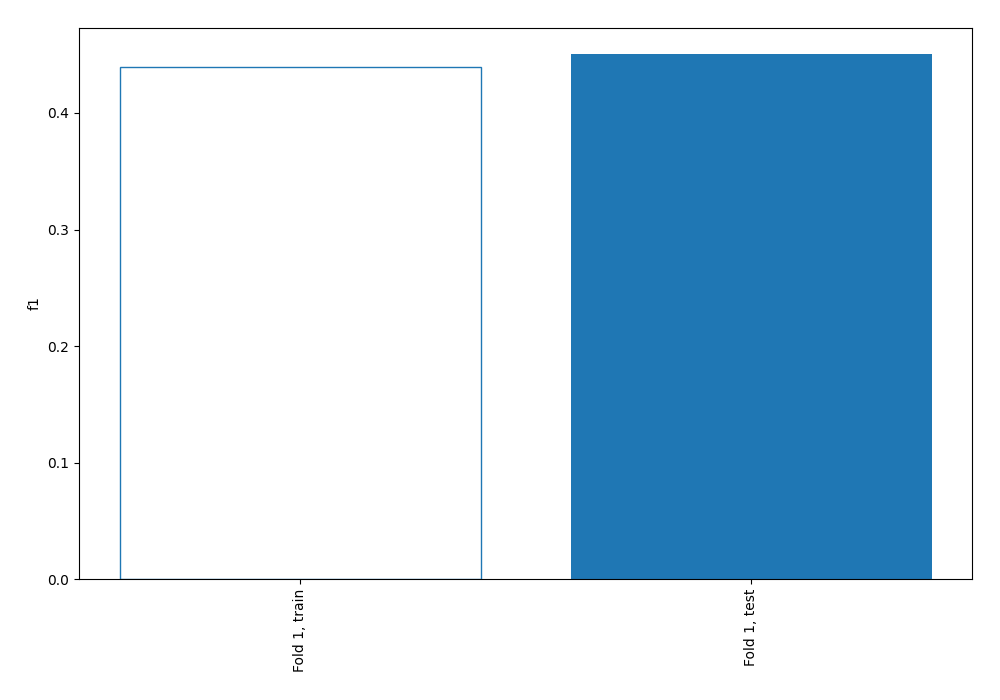
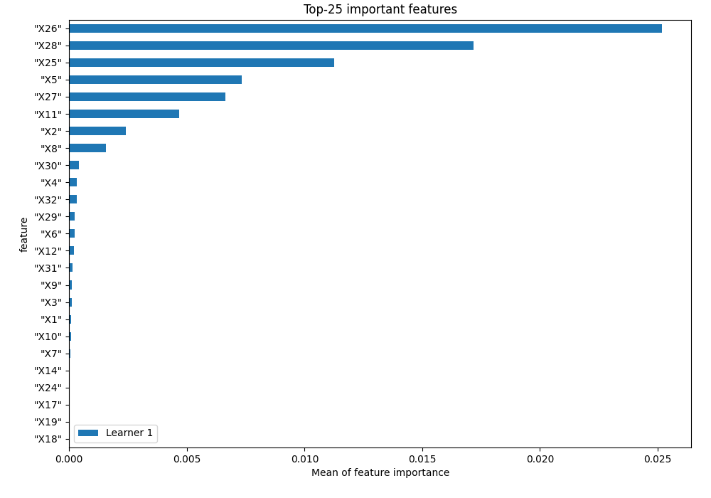
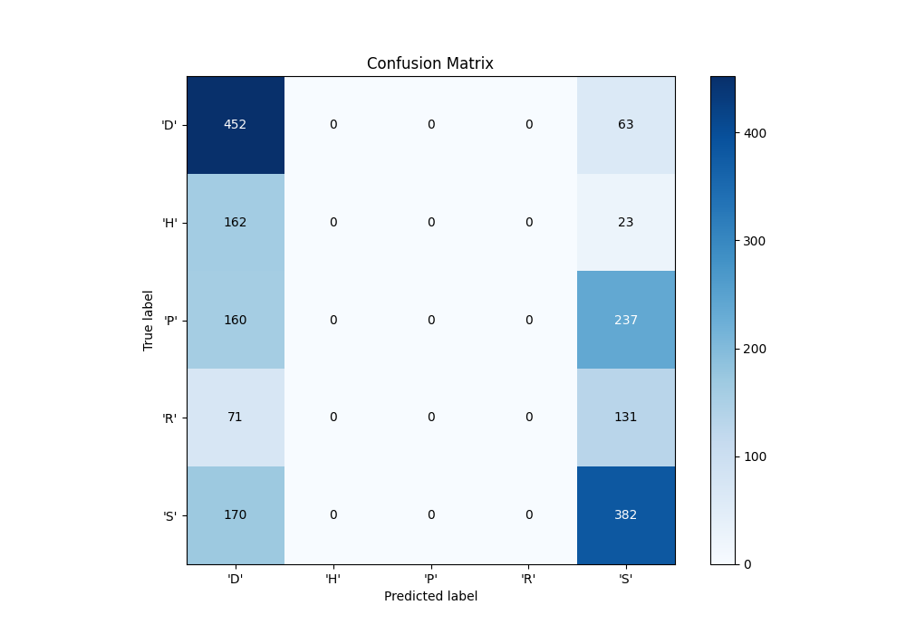
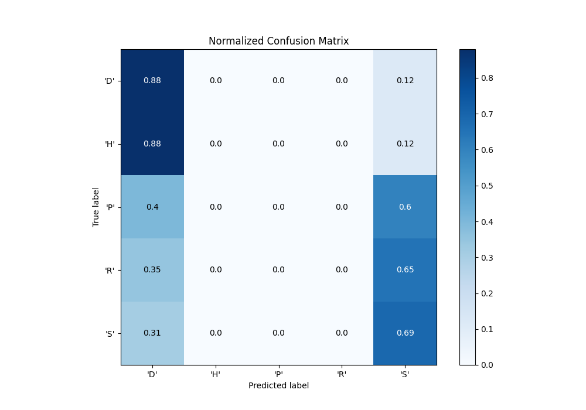
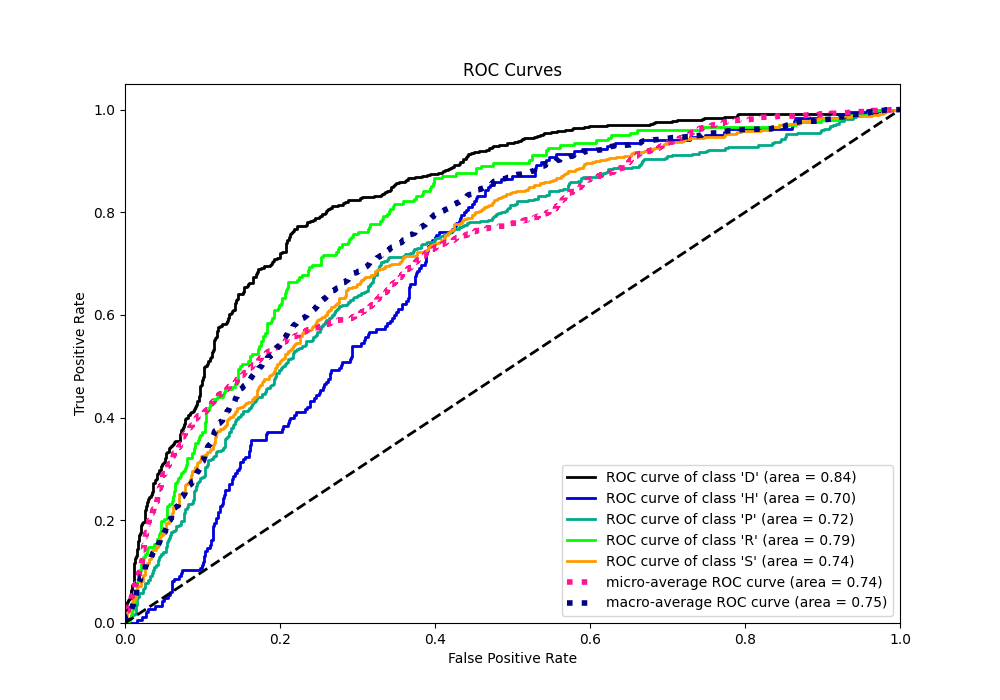
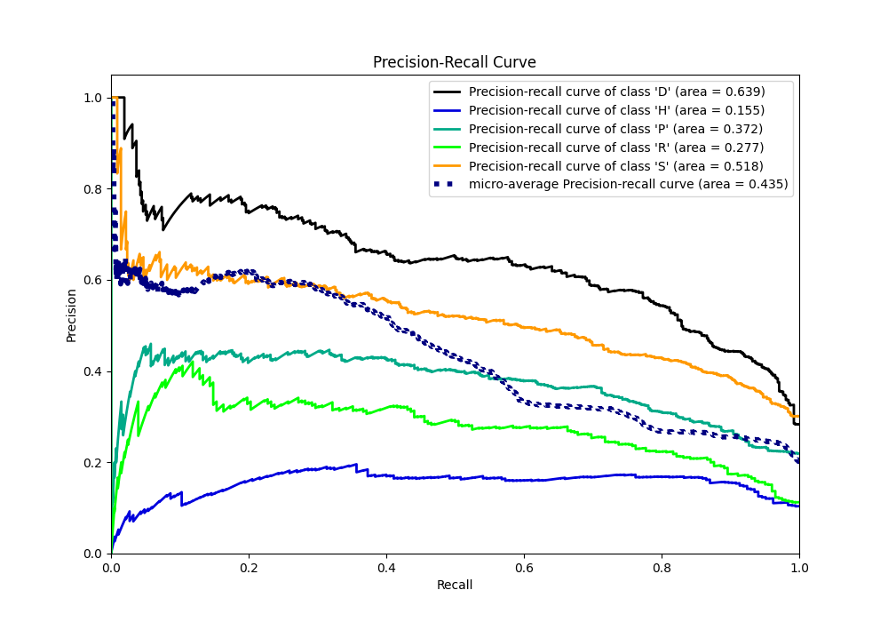

# Summary of 2_Linear

[<< Go back](../README.md)

## Logistic Regression (Linear)
- **n_jobs**: -1
- **num_class**: 5
- **explain_level**: 1

## Validation
 - **validation_type**: split
 - **train_ratio**: 0.75
 - **shuffle**: True
 - **stratify**: True

## Optimized metric
f1

## Training time

1.3 seconds

### Metric details
|           |       'D' |   'H' |   'P' |   'R' |        'S' |   accuracy |   macro avg |   weighted avg |   logloss |
|:----------|----------:|------:|------:|------:|-----------:|-----------:|------------:|---------------:|----------:|
| precision |   0.44532 |     0 |     0 |     0 |   0.456938 |   0.450567 |    0.180452 |       0.260167 |   1.43878 |
| recall    |   0.87767 |     0 |     0 |     0 |   0.692029 |   0.450567 |    0.31394  |       0.450567 |   1.43878 |
| f1-score  |   0.59085 |     0 |     0 |     0 |   0.550432 |   0.450567 |    0.228256 |       0.328539 |   1.43878 |
| support   | 515       |   185 |   397 |   202 | 552        |   0.450567 | 1851        |    1851        |   1.43878 |

## Confusion matrix
|                |   Predicted as 'D' |   Predicted as 'H' |   Predicted as 'P' |   Predicted as 'R' |   Predicted as 'S' |
|:---------------|-------------------:|-------------------:|-------------------:|-------------------:|-------------------:|
| Labeled as 'D' |                452 |                  0 |                  0 |                  0 |                 63 |
| Labeled as 'H' |                162 |                  0 |                  0 |                  0 |                 23 |
| Labeled as 'P' |                160 |                  0 |                  0 |                  0 |                237 |
| Labeled as 'R' |                 71 |                  0 |                  0 |                  0 |                131 |
| Labeled as 'S' |                170 |                  0 |                  0 |                  0 |                382 |

## Learning curves

## Coefficients

### Coefficients learner #1
|           |         'D' |         'H' |         'P' |        'R' |         'S' |
|:----------|------------:|------------:|------------:|-----------:|------------:|
| intercept |  0.629069   | -0.51292    |  0.107725   | -0.575344  |  0.35147    |
| "X1"      | -0.128595   | -0.0636242  |  0.614884   | -0.40084   | -0.0218247  |
| "X2"      | -0.522551   | -0.239793   |  2.39943    | -2.00815   |  0.371062   |
| "X3"      |  0.402091   | -0.193363   |  0.405276   | -0.435085  | -0.178918   |
| "X4"      | -0.33739    |  0.0870302  | -0.468465   |  1.23007   | -0.511249   |
| "X5"      | -0.436053   | -0.478148   |  4.64965    | -3.60419   | -0.131259   |
| "X6"      | -0.331005   | -0.368087   |  0.883967   | -0.781161  |  0.596287   |
| "X7"      | -0.144572   |  0.0521414  |  0.381351   | -0.253966  | -0.0349548  |
| "X8"      | -0.481391   | -0.173229   |  2.02294    | -1.6134    |  0.245078   |
| "X9"      |  0.337445   | -0.198048   |  0.445368   | -0.432398  | -0.152367   |
| "X10"     |  0.0462203  |  0.111849   | -0.644174   |  0.719652  | -0.233549   |
| "X11"     | -0.34386    | -0.37557    |  3.81422    | -3.06417   | -0.0306272  |
| "X12"     | -0.247186   | -0.24463    |  0.620819   | -0.628572  |  0.499569   |
| "X13"     | -0.00130469 |  0.0199859  |  0.033073   |  0.0178965 | -0.0696508  |
| "X14"     |  0.0104892  |  0.0122867  |  0.117465   | -0.0504387 | -0.0898021  |
| "X15"     |  0.00529928 | -0.0152928  |  0.0246084  |  0.0155646 | -0.0301795  |
| "X16"     | -0.0649519  |  0.0200662  |  0.0186138  |  0.115333  | -0.0890608  |
| "X17"     |  0.0468095  |  0.0313702  | -0.00455187 | -0.0690785 | -0.00454932 |
| "X18"     |  0.0243941  | -0.00163151 |  0.0126676  | -0.0524188 |  0.0169886  |
| "X19"     |  0.0120205  |  0.0188587  |  0.0303568  | -0.019203  | -0.0420329  |
| "X20"     |  0.00487076 |  0.0208999  |  0.103888   | -0.0329915 | -0.0966674  |
| "X21"     |  0.00430664 | -0.00547734 |  0.0200456  |  0.014056  | -0.0329309  |
| "X22"     | -0.0206831  | -0.00140361 | -0.054695   |  0.106709  | -0.0299273  |
| "X23"     |  0.0279302  |  0.0200818  | -0.0297309  | -0.0293256 |  0.0110445  |
| "X24"     |  0.0462657  |  0.00339261 | -0.0180495  | -0.0241582 | -0.00745062 |
| "X25"     | -5.05075    | -1.76853    |  1.83053    |  1.79477   |  3.19397    |
| "X26"     | -7.22322    | -2.96112    |  2.28921    |  2.68981   |  5.20531    |
| "X27"     | -4.06849    | -1.25505    |  1.38131    |  1.25738   |  2.68485    |
| "X28"     | -6.4837     | -2.05273    |  1.74055    |  2.27698   |  4.51889    |
| "X29"     | -0.671237   | -0.301107   | -0.00213177 |  0.170345  |  0.804132   |
| "X30"     | -0.762088   | -0.431792   | -0.0176887  |  0.115423  |  1.09615    |
| "X31"     | -0.511399   | -0.187764   | -0.0424435  |  0.030091  |  0.711516   |
| "X32"     | -0.869709   | -0.233851   |  0.00768359 |  0.19122   |  0.904657   |

## Permutation-based Importance

## Confusion Matrix

## Normalized Confusion Matrix

## ROC Curve

## Precision Recall Curve

[<< Go back](../README.md)
