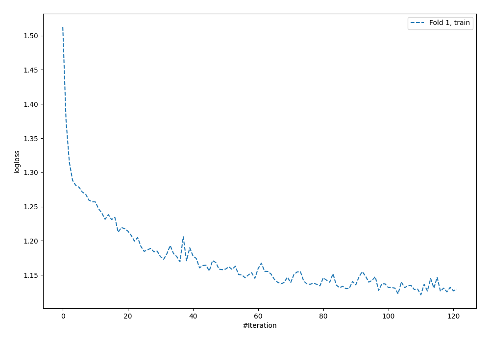
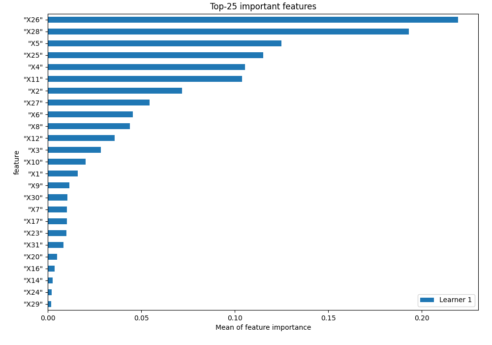
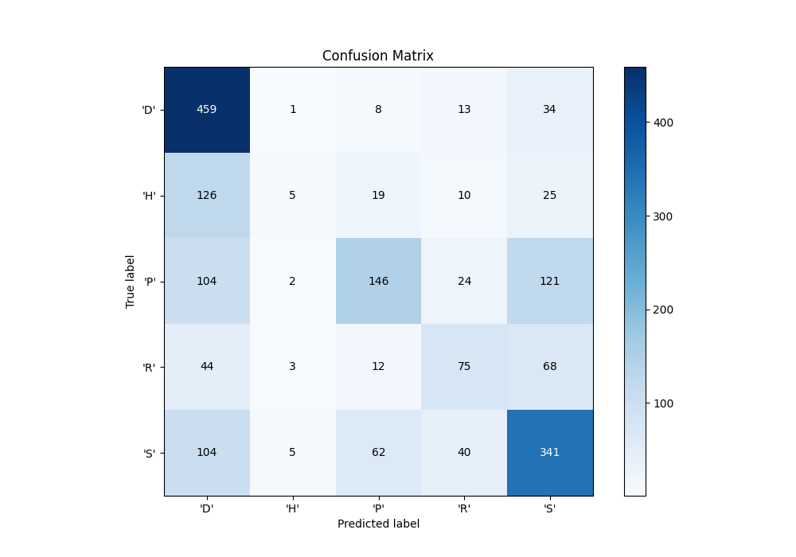
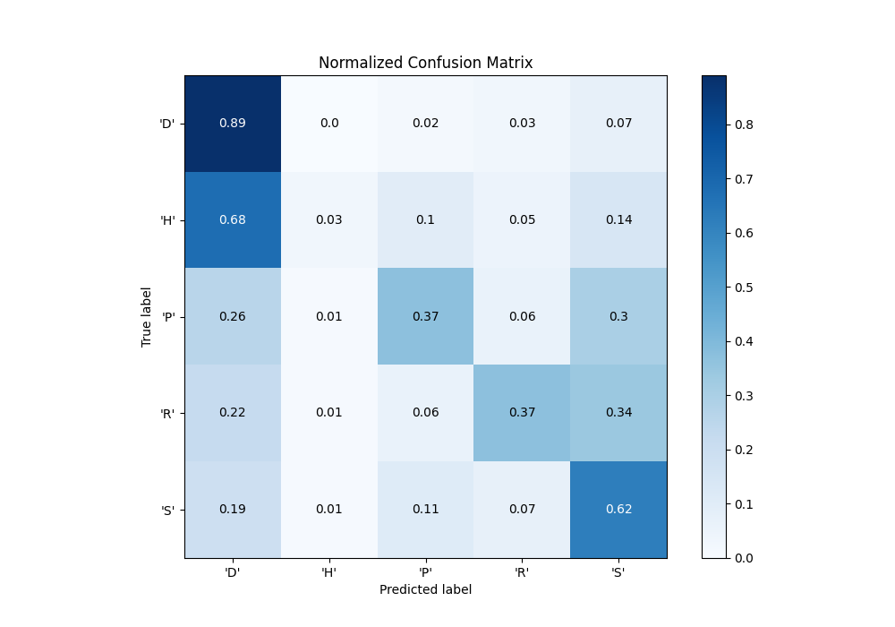
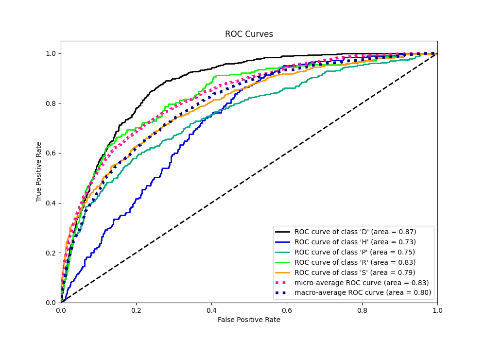
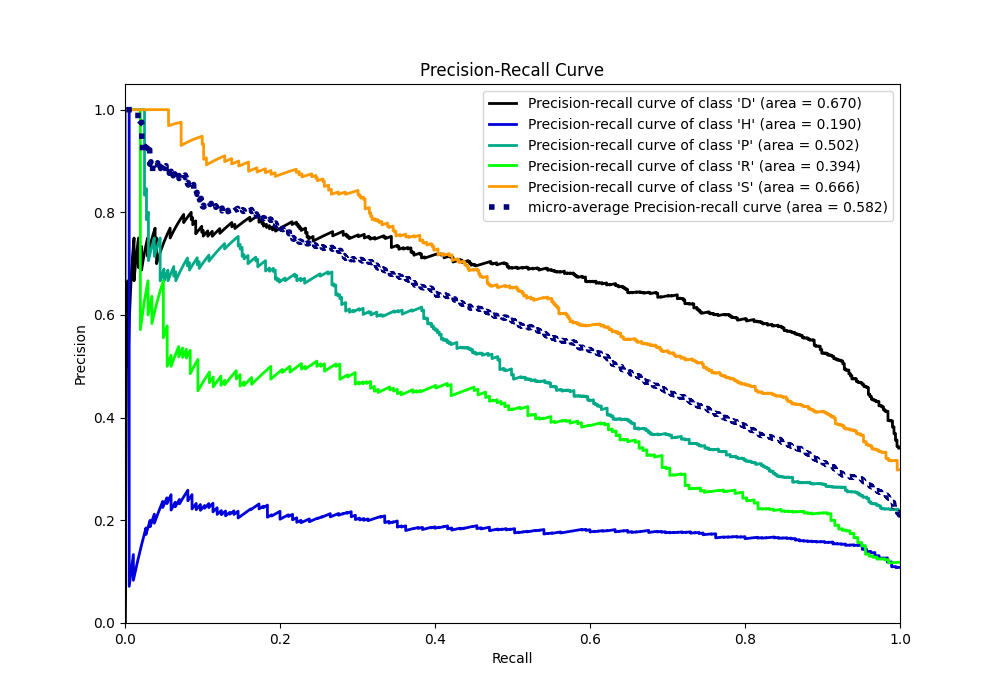

# Summary of 3_Default_NeuralNetwork

[<< Go back](../README.md)

## Neural Network
- **n_jobs**: -1
- **dense_1_size**: 32
- **dense_2_size**: 16
- **learning_rate**: 0.05
- **num_class**: 5
- **explain_level**: 1

## Validation
 - **validation_type**: split
 - **train_ratio**: 0.75
 - **shuffle**: True
 - **stratify**: True

## Optimized metric
f1

## Training time

2.8 seconds

### Metric details
|           |        'D' |         'H' |        'P' |        'R' |        'S' |   accuracy |   macro avg |   weighted avg |   logloss |
|:----------|-----------:|------------:|-----------:|-----------:|-----------:|-----------:|------------:|---------------:|----------:|
| precision |   0.548387 |   0.3125    |   0.591093 |   0.462963 |   0.578947 |   0.554295 |    0.498778 |       0.533762 |    1.1552 |
| recall    |   0.891262 |   0.027027  |   0.367758 |   0.371287 |   0.617754 |   0.554295 |    0.455018 |       0.554295 |    1.1552 |
| f1-score  |   0.678994 |   0.0497512 |   0.453416 |   0.412088 |   0.597721 |   0.554295 |    0.438394 |       0.514358 |    1.1552 |
| support   | 515        | 185         | 397        | 202        | 552        |   0.554295 | 1851        |    1851        |    1.1552 |

## Confusion matrix
|                |   Predicted as 'D' |   Predicted as 'H' |   Predicted as 'P' |   Predicted as 'R' |   Predicted as 'S' |
|:---------------|-------------------:|-------------------:|-------------------:|-------------------:|-------------------:|
| Labeled as 'D' |                459 |                  1 |                  8 |                 13 |                 34 |
| Labeled as 'H' |                126 |                  5 |                 19 |                 10 |                 25 |
| Labeled as 'P' |                104 |                  2 |                146 |                 24 |                121 |
| Labeled as 'R' |                 44 |                  3 |                 12 |                 75 |                 68 |
| Labeled as 'S' |                104 |                  5 |                 62 |                 40 |                341 |

## Learning curves

## Permutation-based Importance

## Confusion Matrix

## Normalized Confusion Matrix

## ROC Curve

## Precision Recall Curve

[<< Go back](../README.md)
