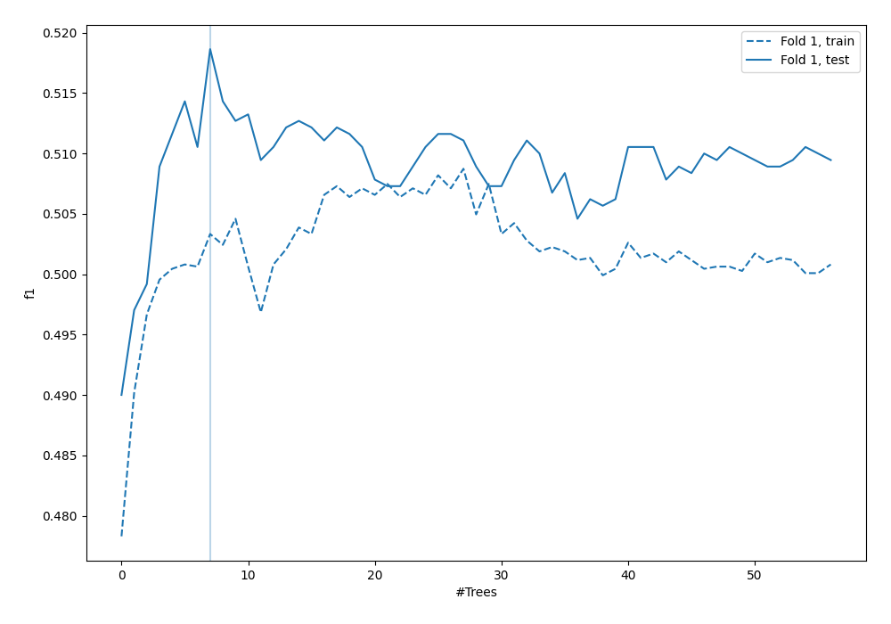
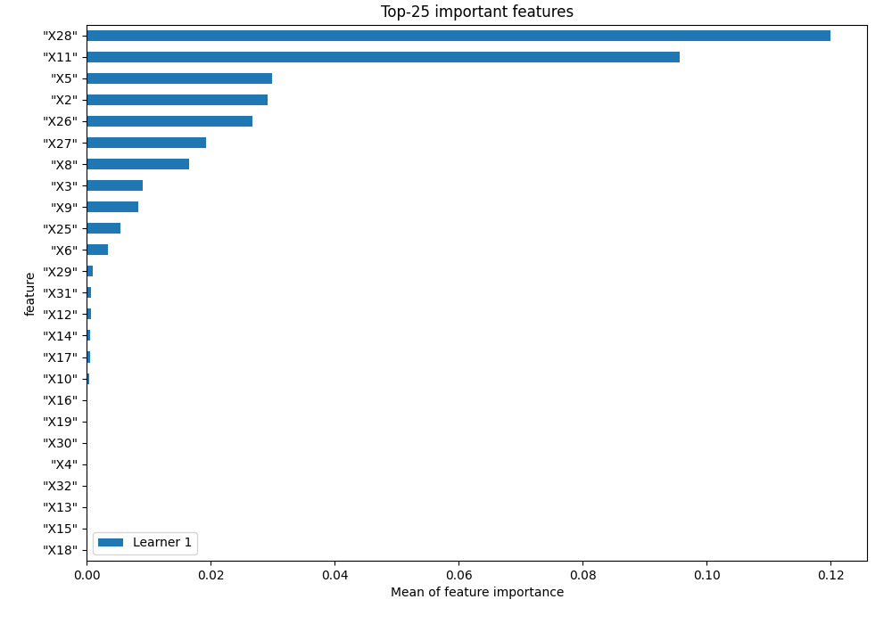
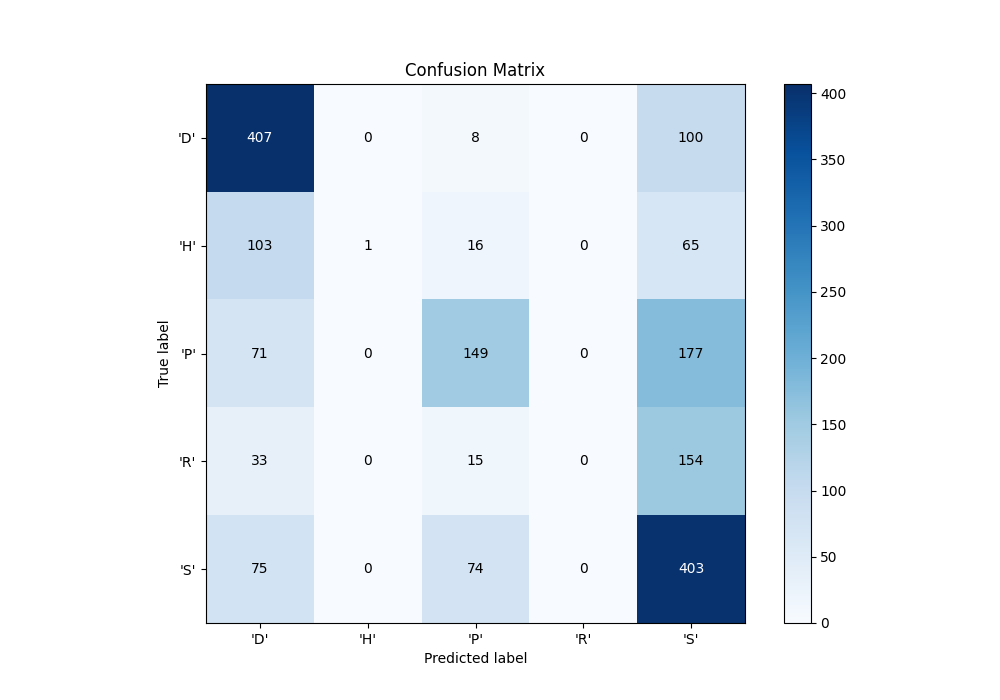
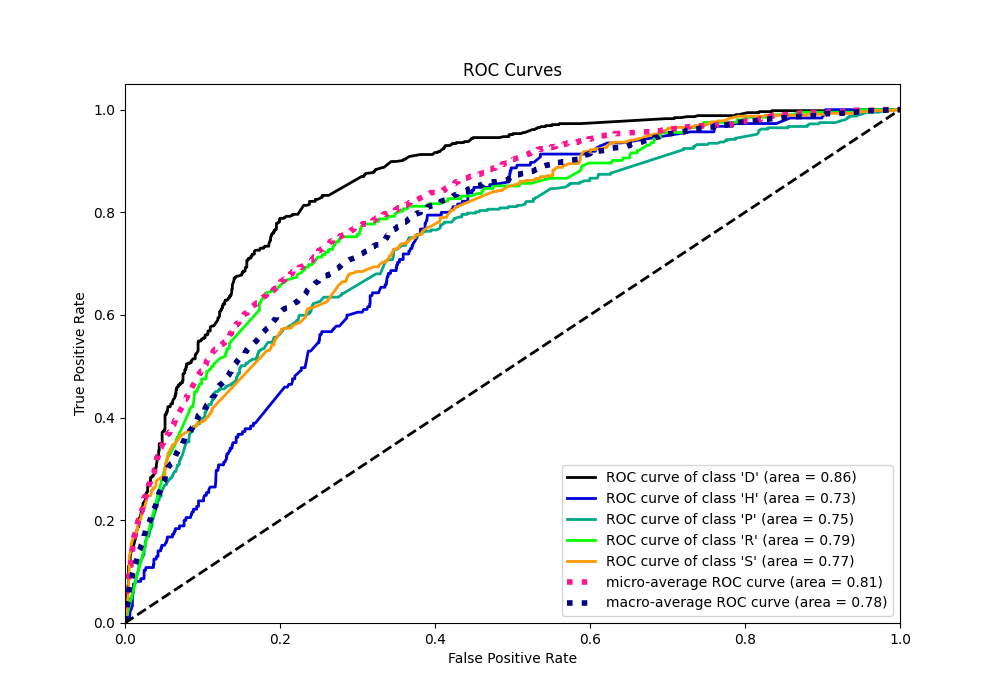
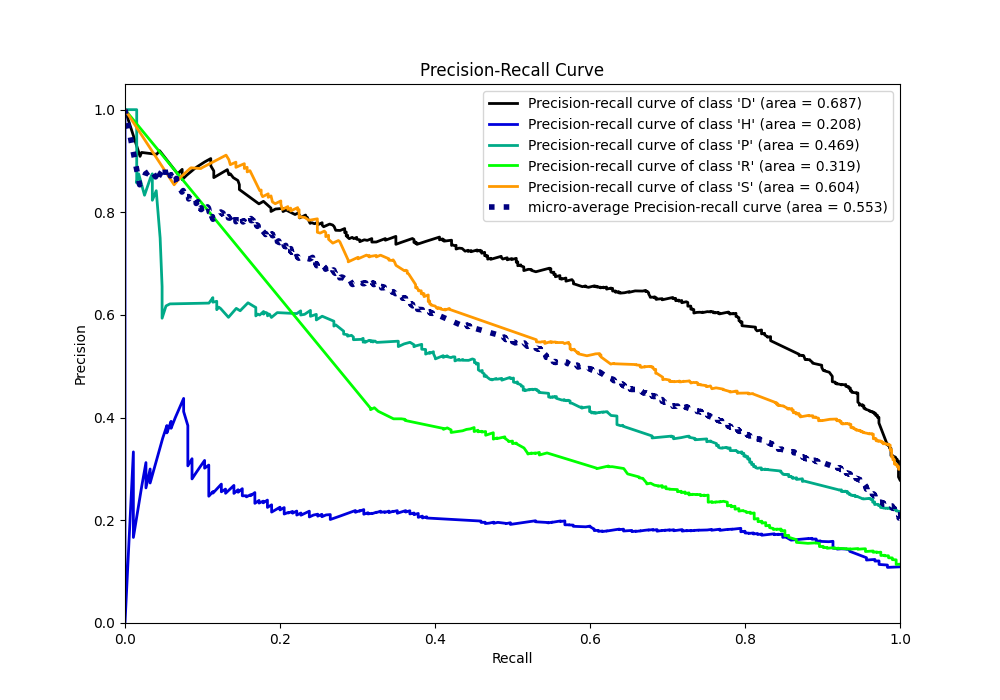

# Summary of 4_Default_RandomForest

[<< Go back](../README.md)

## Random Forest
- **n_jobs**: -1
- **criterion**: gini
- **max_features**: 0.9
- **min_samples_split**: 30
- **max_depth**: 4
- **eval_metric_name**: f1
- **num_class**: 5
- **explain_level**: 1

## Validation
 - **validation_type**: split
 - **train_ratio**: 0.75
 - **shuffle**: True
 - **stratify**: True

## Optimized metric
f1

## Training time

2.3 seconds

### Metric details
|           |        'D' |          'H' |        'P' |   'R' |        'S' |   accuracy |   macro avg |   weighted avg |   logloss |
|:----------|-----------:|-------------:|-----------:|------:|-----------:|-----------:|------------:|---------------:|----------:|
| precision |   0.590711 |   1          |   0.568702 |     0 |   0.448276 |   0.518639 |    0.521538 |       0.519956 |   1.19692 |
| recall    |   0.790291 |   0.00540541 |   0.375315 |     0 |   0.730072 |   0.518639 |    0.380217 |       0.518639 |   1.19692 |
| f1-score  |   0.67608  |   0.0107527  |   0.4522   |     0 |   0.555479 |   0.518639 |    0.338902 |       0.45182  |   1.19692 |
| support   | 515        | 185          | 397        |   202 | 552        |   0.518639 | 1851        |    1851        |   1.19692 |

## Confusion matrix
|                |   Predicted as 'D' |   Predicted as 'H' |   Predicted as 'P' |   Predicted as 'R' |   Predicted as 'S' |
|:---------------|-------------------:|-------------------:|-------------------:|-------------------:|-------------------:|
| Labeled as 'D' |                407 |                  0 |                  8 |                  0 |                100 |
| Labeled as 'H' |                103 |                  1 |                 16 |                  0 |                 65 |
| Labeled as 'P' |                 71 |                  0 |                149 |                  0 |                177 |
| Labeled as 'R' |                 33 |                  0 |                 15 |                  0 |                154 |
| Labeled as 'S' |                 75 |                  0 |                 74 |                  0 |                403 |

## Learning curves

## Permutation-based Importance

## Confusion Matrix

## Normalized Confusion Matrix

## ROC Curve

## Precision Recall Curve

[<< Go back](../README.md)
