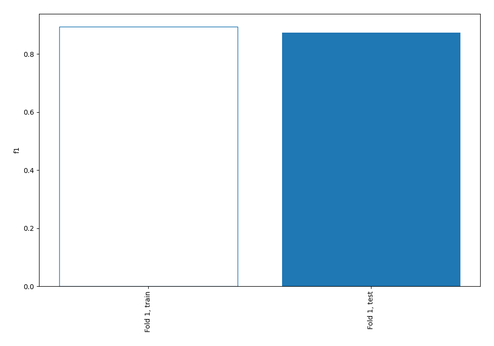
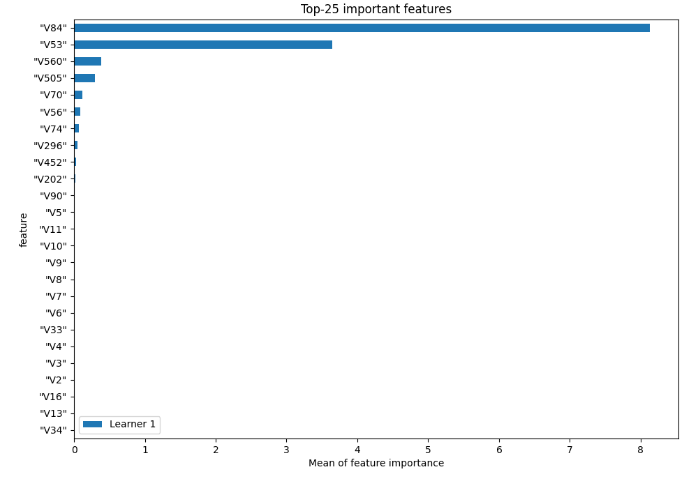
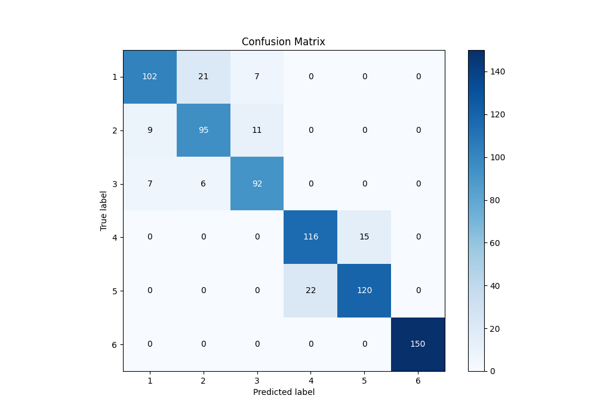
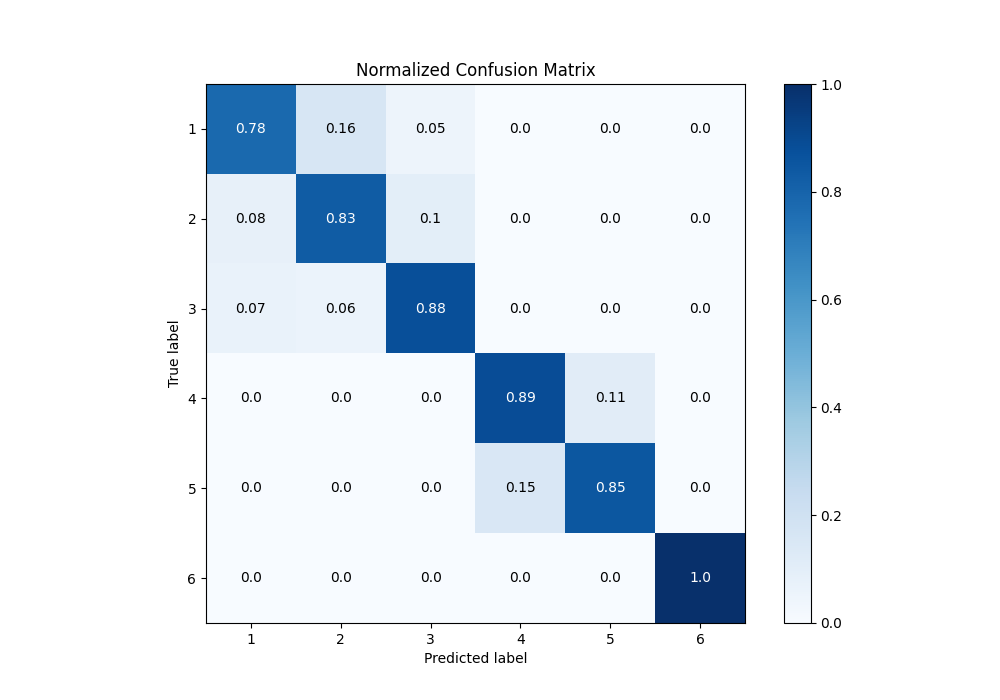
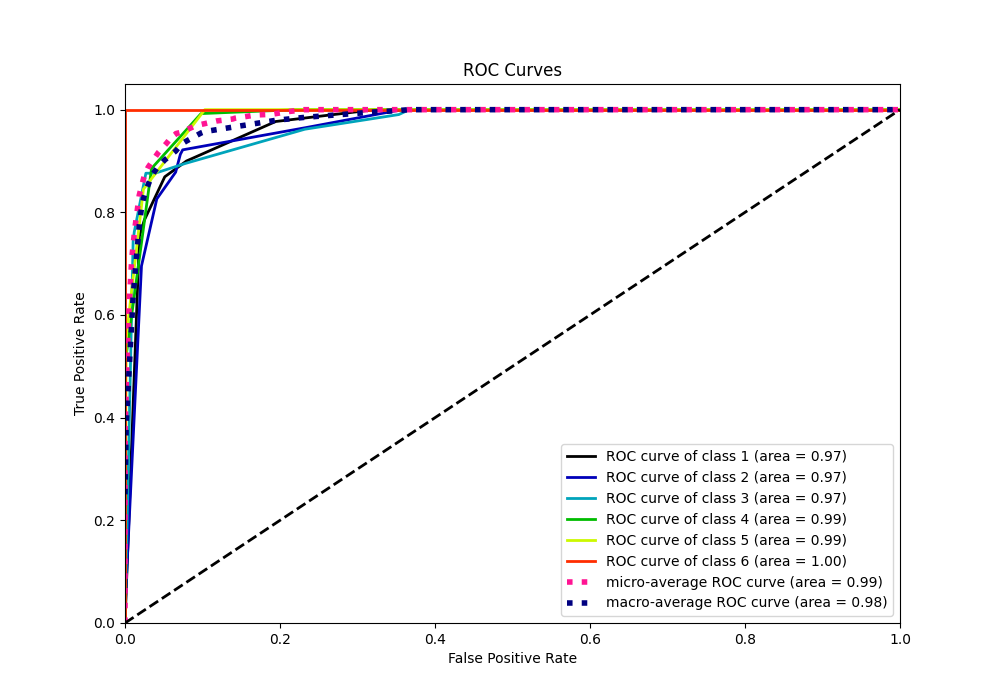

# Summary of 1_DecisionTree

[<< Go back](../README.md)

## Decision Tree
- **n_jobs**: -1
- **criterion**: entropy
- **max_depth**: 4
- **num_class**: 6
- **explain_level**: 1

## Validation
 - **validation_type**: split
 - **train_ratio**: 0.9
 - **shuffle**: True
 - **stratify**: True

## Optimized metric
f1

## Training time

13.4 seconds

### Metric details
|           |          1 |          2 |          3 |          4 |          5 |   6 |   accuracy |   macro avg |   weighted avg |   logloss |
|:----------|-----------:|-----------:|-----------:|-----------:|-----------:|----:|-----------:|------------:|---------------:|----------:|
| precision |   0.864407 |   0.778689 |   0.836364 |   0.84058  |   0.888889 |   1 |   0.873221 |    0.868155 |       0.874616 |  0.346796 |
| recall    |   0.784615 |   0.826087 |   0.87619  |   0.885496 |   0.84507  |   1 |   0.873221 |    0.869577 |       0.873221 |  0.346796 |
| f1-score  |   0.822581 |   0.801688 |   0.855814 |   0.862454 |   0.866426 |   1 |   0.873221 |    0.86816  |       0.873226 |  0.346796 |
| support   | 130        | 115        | 105        | 131        | 142        | 150 |   0.873221 |  773        |     773        |  0.346796 |

## Confusion matrix
|              |   Predicted as 1 |   Predicted as 2 |   Predicted as 3 |   Predicted as 4 |   Predicted as 5 |   Predicted as 6 |
|:-------------|-----------------:|-----------------:|-----------------:|-----------------:|-----------------:|-----------------:|
| Labeled as 1 |              102 |               21 |                7 |                0 |                0 |                0 |
| Labeled as 2 |                9 |               95 |               11 |                0 |                0 |                0 |
| Labeled as 3 |                7 |                6 |               92 |                0 |                0 |                0 |
| Labeled as 4 |                0 |                0 |                0 |              116 |               15 |                0 |
| Labeled as 5 |                0 |                0 |                0 |               22 |              120 |                0 |
| Labeled as 6 |                0 |                0 |                0 |                0 |                0 |              150 |

## Learning curves

## Permutation-based Importance

## Confusion Matrix

## Normalized Confusion Matrix

## ROC Curve

## Precision Recall Curve

[<< Go back](../README.md)
