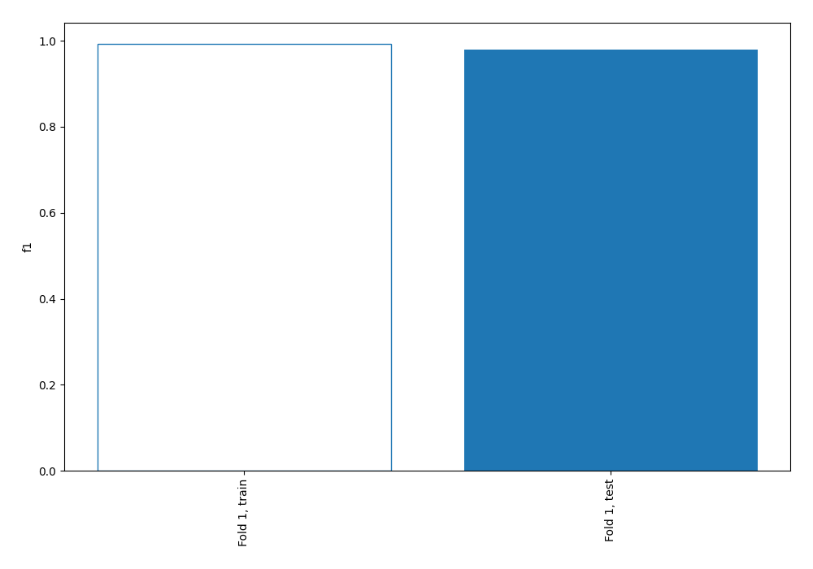
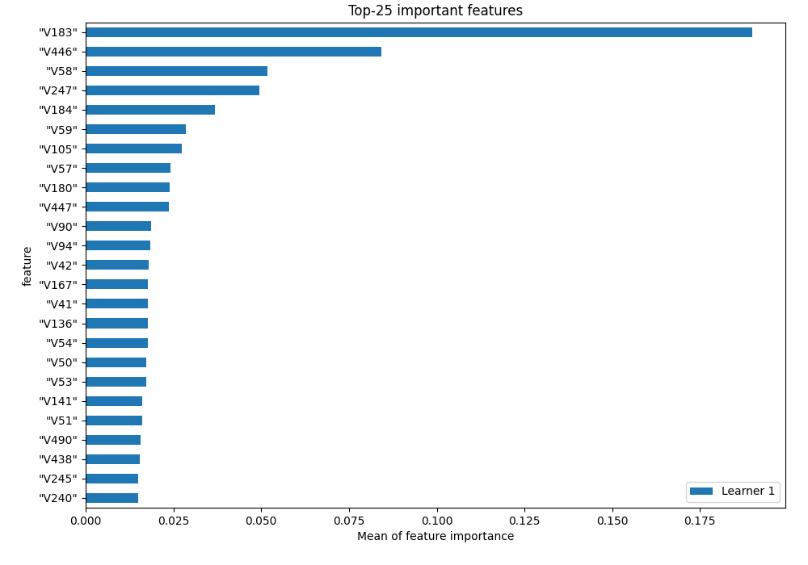
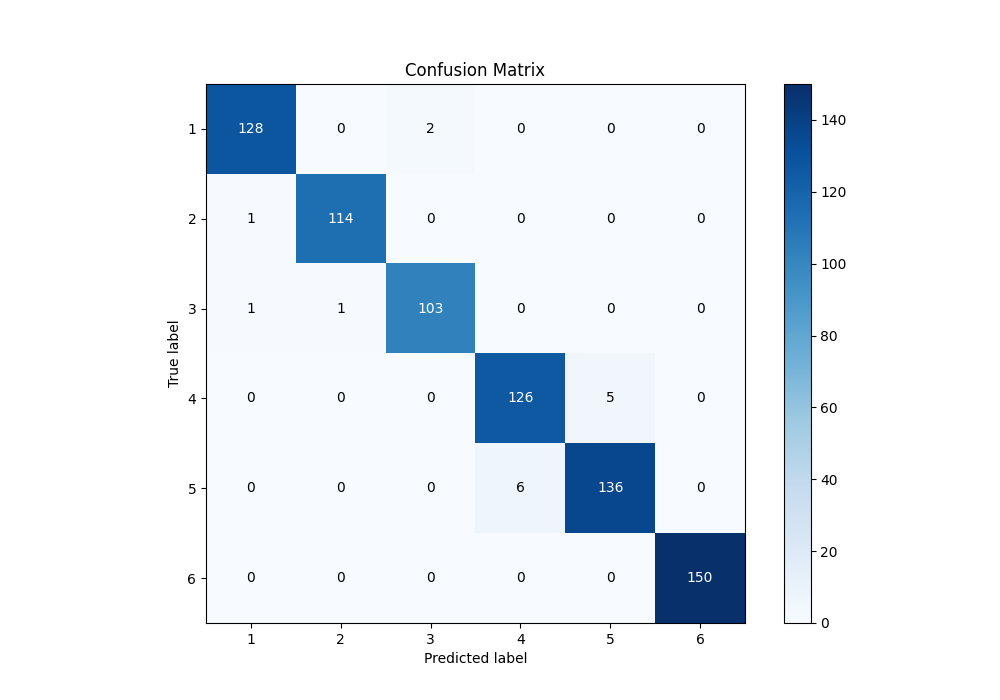
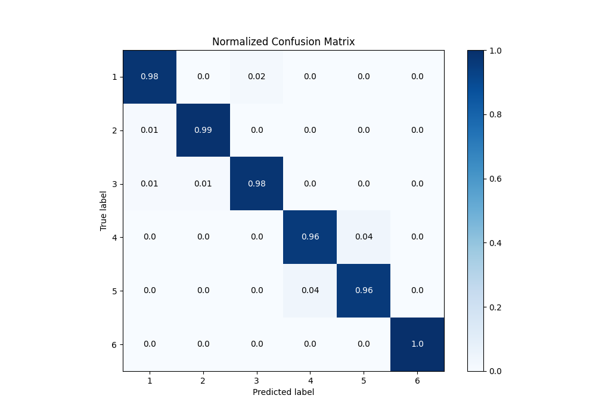
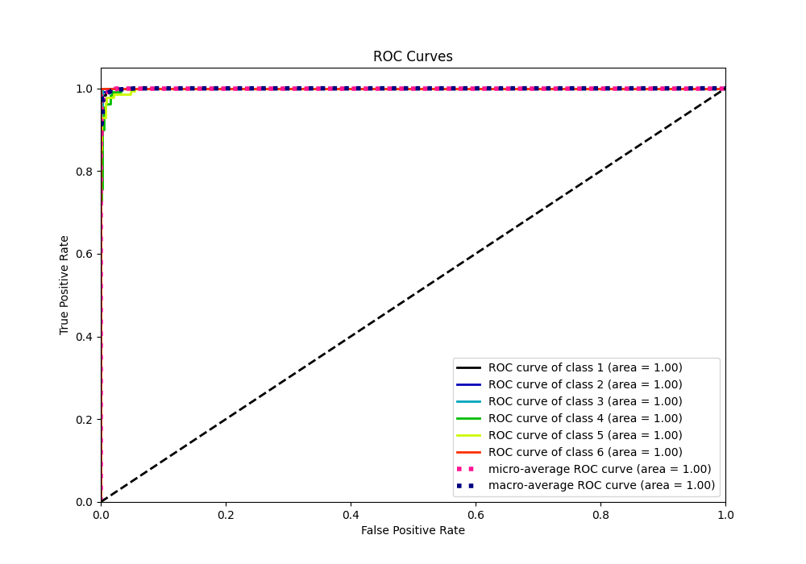
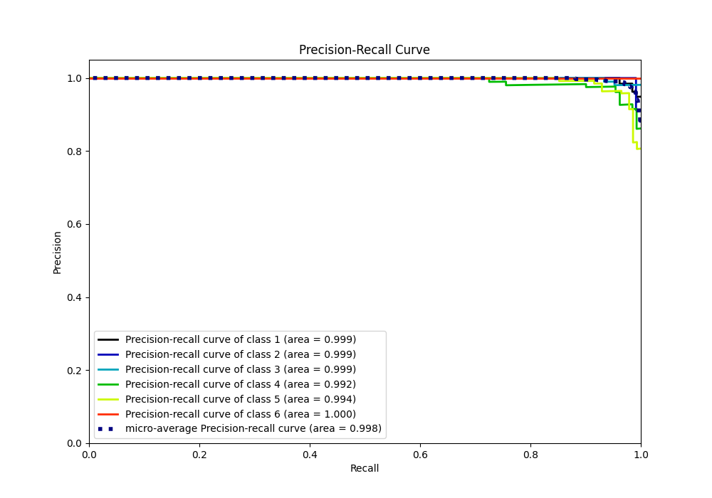

# Summary of 2_Linear

[<< Go back](../README.md)

## Logistic Regression (Linear)
- **n_jobs**: -1
- **num_class**: 6
- **explain_level**: 1

## Validation
 - **validation_type**: split
 - **train_ratio**: 0.9
 - **shuffle**: True
 - **stratify**: True

## Optimized metric
f1

## Training time

29.5 seconds

### Metric details
|           |          1 |          2 |          3 |          4 |          5 |   6 |   accuracy |   macro avg |   weighted avg |   logloss |
|:----------|-----------:|-----------:|-----------:|-----------:|-----------:|----:|-----------:|------------:|---------------:|----------:|
| precision |   0.984615 |   0.991304 |   0.980952 |   0.954545 |   0.964539 |   1 |   0.979301 |    0.979326 |       0.979314 | 0.0568088 |
| recall    |   0.984615 |   0.991304 |   0.980952 |   0.961832 |   0.957746 |   1 |   0.979301 |    0.979408 |       0.979301 | 0.0568088 |
| f1-score  |   0.984615 |   0.991304 |   0.980952 |   0.958175 |   0.961131 |   1 |   0.979301 |    0.979363 |       0.979303 | 0.0568088 |
| support   | 130        | 115        | 105        | 131        | 142        | 150 |   0.979301 |  773        |     773        | 0.0568088 |

## Confusion matrix
|              |   Predicted as 1 |   Predicted as 2 |   Predicted as 3 |   Predicted as 4 |   Predicted as 5 |   Predicted as 6 |
|:-------------|-----------------:|-----------------:|-----------------:|-----------------:|-----------------:|-----------------:|
| Labeled as 1 |              128 |                0 |                2 |                0 |                0 |                0 |
| Labeled as 2 |                1 |              114 |                0 |                0 |                0 |                0 |
| Labeled as 3 |                1 |                1 |              103 |                0 |                0 |                0 |
| Labeled as 4 |                0 |                0 |                0 |              126 |                5 |                0 |
| Labeled as 5 |                0 |                0 |                0 |                6 |              136 |                0 |
| Labeled as 6 |                0 |                0 |                0 |                0 |                0 |              150 |

## Learning curves

## Permutation-based Importance

## Confusion Matrix

## Normalized Confusion Matrix

## ROC Curve

## Precision Recall Curve

[<< Go back](../README.md)
