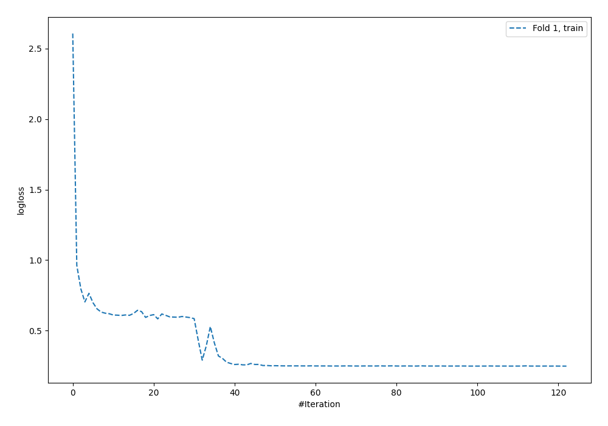
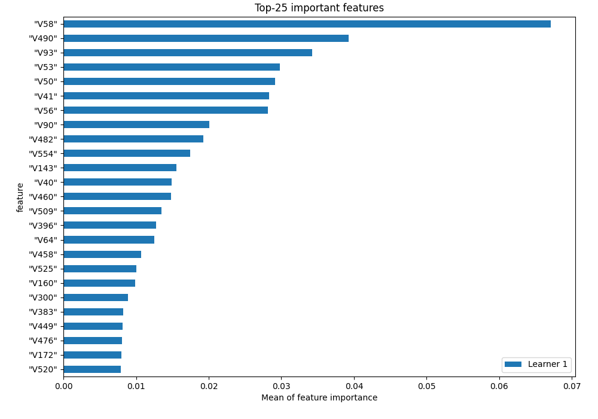
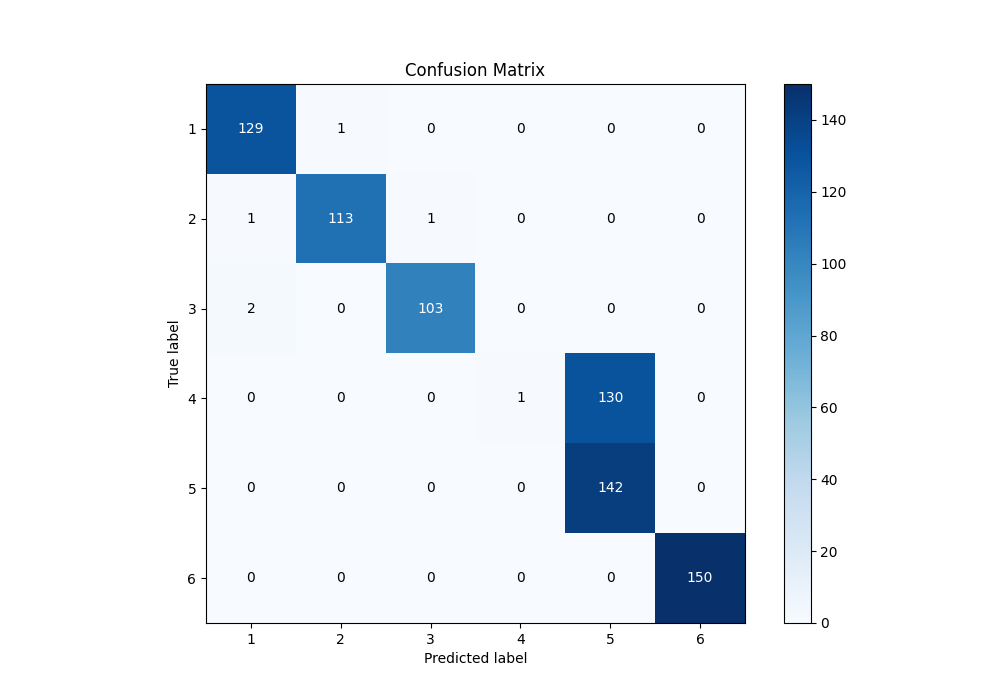
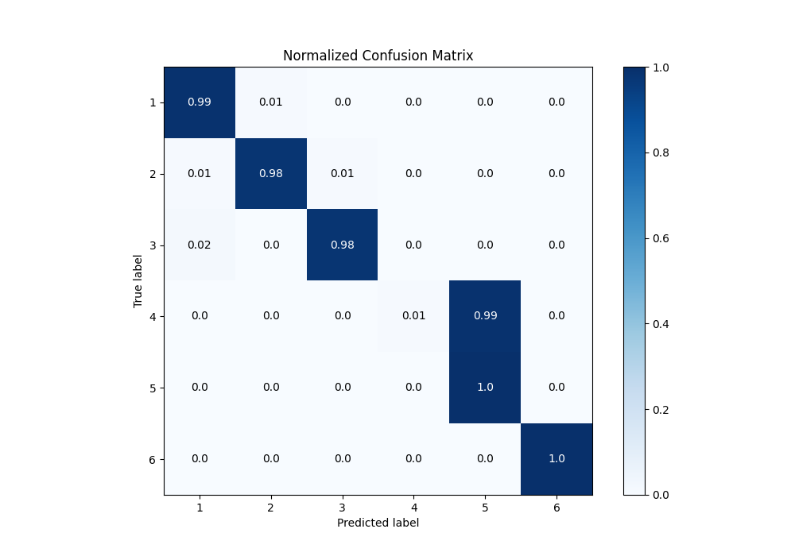
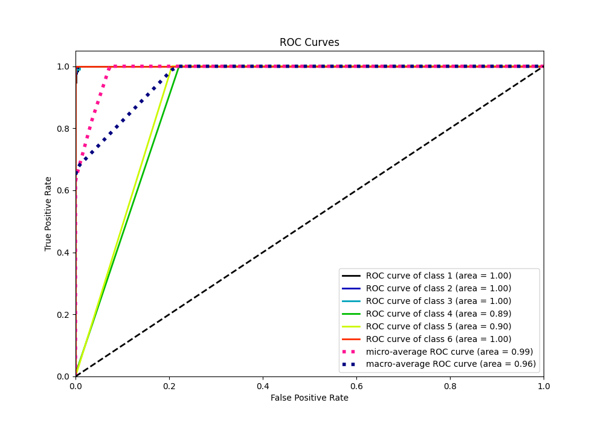
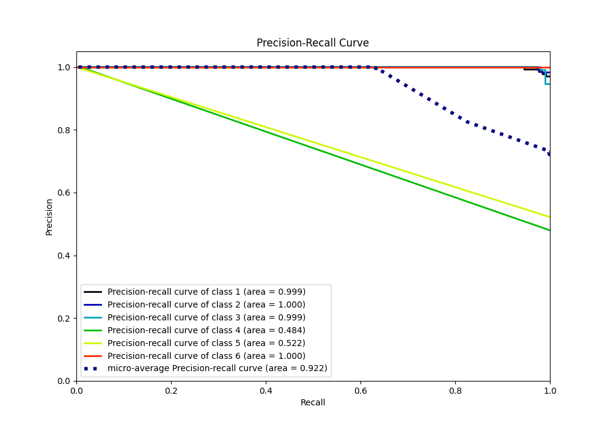

# Summary of 3_Default_NeuralNetwork

[<< Go back](../README.md)

## Neural Network
- **n_jobs**: -1
- **dense_1_size**: 32
- **dense_2_size**: 16
- **learning_rate**: 0.05
- **num_class**: 6
- **explain_level**: 1

## Validation
 - **validation_type**: split
 - **train_ratio**: 0.9
 - **shuffle**: True
 - **stratify**: True

## Optimized metric
f1

## Training time

16.1 seconds

### Metric details
|           |          1 |          2 |          3 |            4 |          5 |   6 |   accuracy |   macro avg |   weighted avg |   logloss |
|:----------|-----------:|-----------:|-----------:|-------------:|-----------:|----:|-----------:|------------:|---------------:|----------:|
| precision |   0.977273 |   0.991228 |   0.990385 |   1          |   0.522059 |   1 |   0.825356 |    0.913491 |       0.905769 |  0.270553 |
| recall    |   0.992308 |   0.982609 |   0.980952 |   0.00763359 |   1        |   1 |   0.825356 |    0.82725  |       0.825356 |  0.270553 |
| f1-score  |   0.984733 |   0.9869   |   0.985646 |   0.0151515  |   0.68599  |   1 |   0.825356 |    0.776403 |       0.768948 |  0.270553 |
| support   | 130        | 115        | 105        | 131          | 142        | 150 |   0.825356 |  773        |     773        |  0.270553 |

## Confusion matrix
|              |   Predicted as 1 |   Predicted as 2 |   Predicted as 3 |   Predicted as 4 |   Predicted as 5 |   Predicted as 6 |
|:-------------|-----------------:|-----------------:|-----------------:|-----------------:|-----------------:|-----------------:|
| Labeled as 1 |              129 |                1 |                0 |                0 |                0 |                0 |
| Labeled as 2 |                1 |              113 |                1 |                0 |                0 |                0 |
| Labeled as 3 |                2 |                0 |              103 |                0 |                0 |                0 |
| Labeled as 4 |                0 |                0 |                0 |                1 |              130 |                0 |
| Labeled as 5 |                0 |                0 |                0 |                0 |              142 |                0 |
| Labeled as 6 |                0 |                0 |                0 |                0 |                0 |              150 |

## Learning curves

## Permutation-based Importance

## Confusion Matrix

## Normalized Confusion Matrix

## ROC Curve

## Precision Recall Curve

[<< Go back](../README.md)
