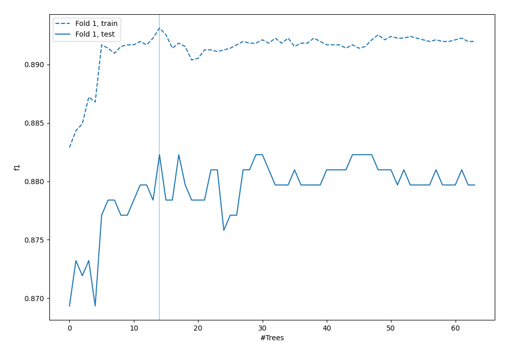
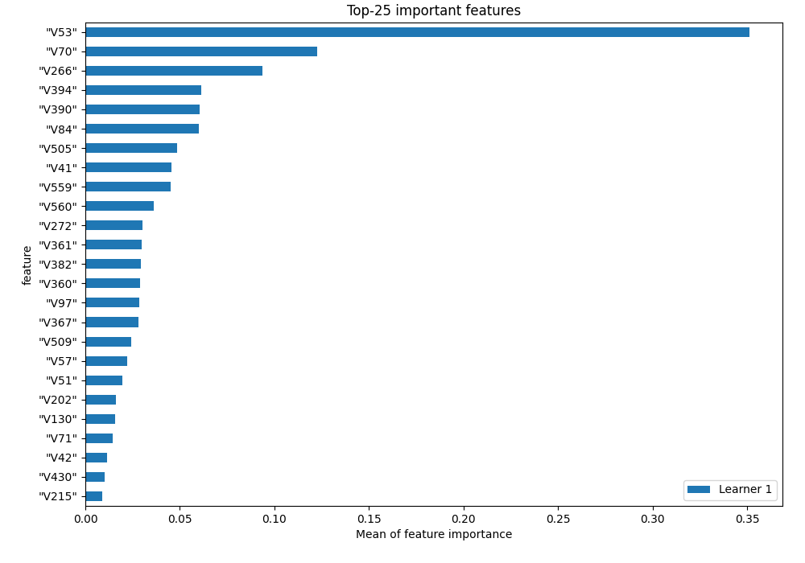
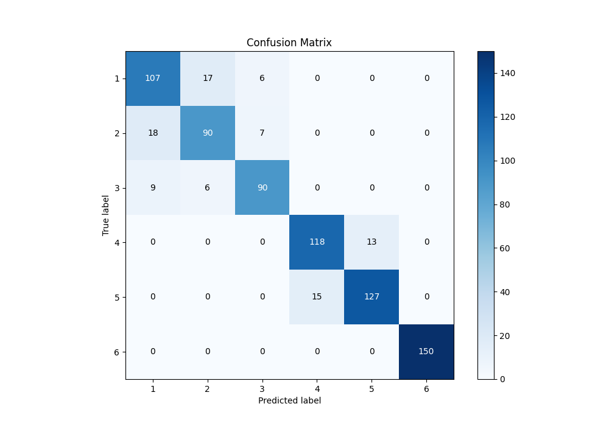
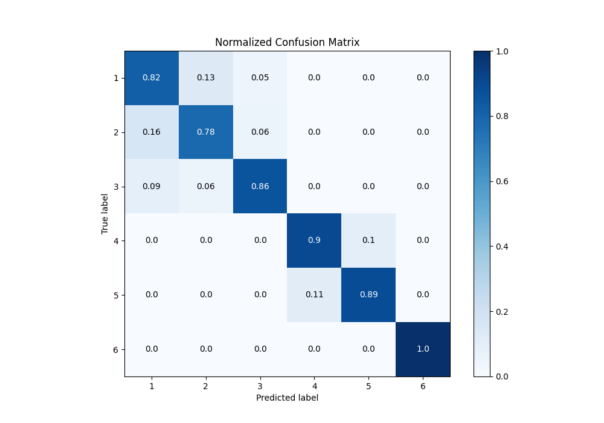
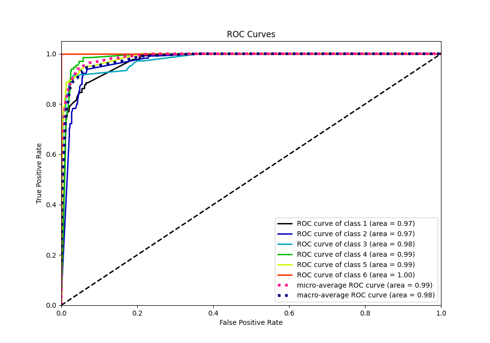
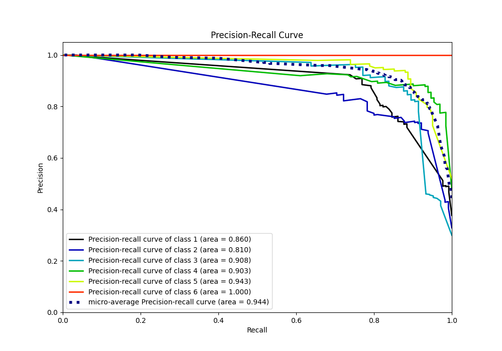

# Summary of 4_Default_RandomForest

[<< Go back](../README.md)

## Random Forest
- **n_jobs**: -1
- **criterion**: gini
- **max_features**: 0.9
- **min_samples_split**: 30
- **max_depth**: 4
- **eval_metric_name**: f1
- **num_class**: 6
- **explain_level**: 1

## Validation
 - **validation_type**: split
 - **train_ratio**: 0.9
 - **shuffle**: True
 - **stratify**: True

## Optimized metric
f1

## Training time

39.6 seconds

### Metric details
|           |          1 |          2 |          3 |          4 |          5 |   6 |   accuracy |   macro avg |   weighted avg |   logloss |
|:----------|-----------:|-----------:|-----------:|-----------:|-----------:|----:|-----------:|------------:|---------------:|----------:|
| precision |   0.798507 |   0.79646  |   0.873786 |   0.887218 |   0.907143 |   1 |   0.882277 |    0.877186 |       0.882518 |   0.32942 |
| recall    |   0.823077 |   0.782609 |   0.857143 |   0.900763 |   0.894366 |   1 |   0.882277 |    0.876326 |       0.882277 |   0.32942 |
| f1-score  |   0.810606 |   0.789474 |   0.865385 |   0.893939 |   0.900709 |   1 |   0.882277 |    0.876685 |       0.882329 |   0.32942 |
| support   | 130        | 115        | 105        | 131        | 142        | 150 |   0.882277 |  773        |     773        |   0.32942 |

## Confusion matrix
|              |   Predicted as 1 |   Predicted as 2 |   Predicted as 3 |   Predicted as 4 |   Predicted as 5 |   Predicted as 6 |
|:-------------|-----------------:|-----------------:|-----------------:|-----------------:|-----------------:|-----------------:|
| Labeled as 1 |              107 |               17 |                6 |                0 |                0 |                0 |
| Labeled as 2 |               18 |               90 |                7 |                0 |                0 |                0 |
| Labeled as 3 |                9 |                6 |               90 |                0 |                0 |                0 |
| Labeled as 4 |                0 |                0 |                0 |              118 |               13 |                0 |
| Labeled as 5 |                0 |                0 |                0 |               15 |              127 |                0 |
| Labeled as 6 |                0 |                0 |                0 |                0 |                0 |              150 |

## Learning curves

## Permutation-based Importance

## Confusion Matrix

## Normalized Confusion Matrix

## ROC Curve

## Precision Recall Curve

[<< Go back](../README.md)
